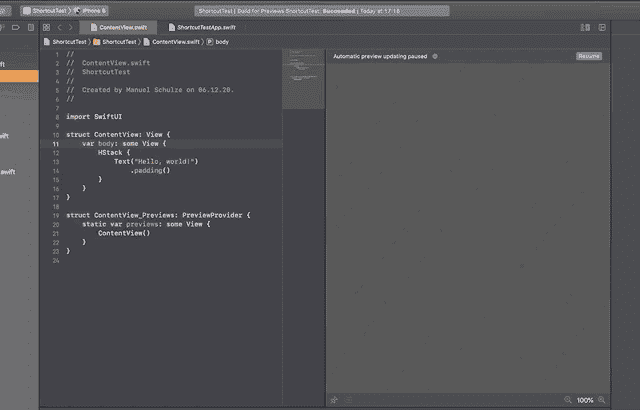
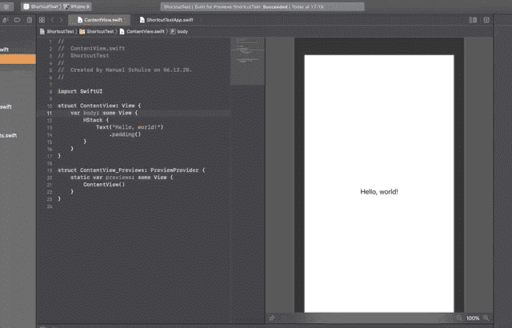
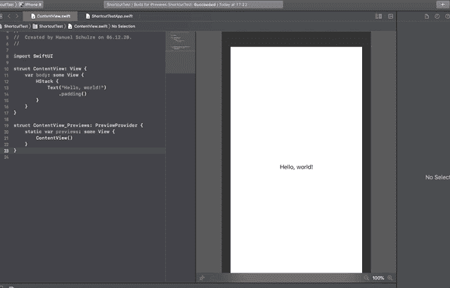
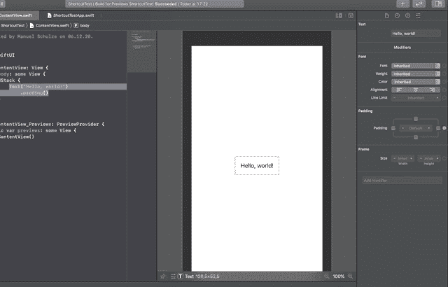
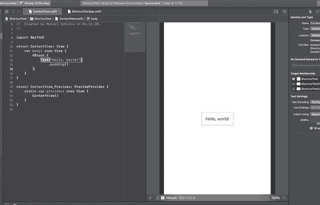
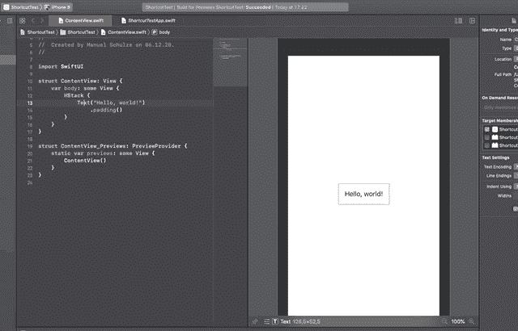
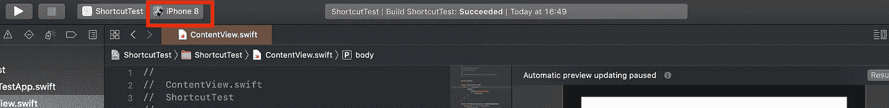
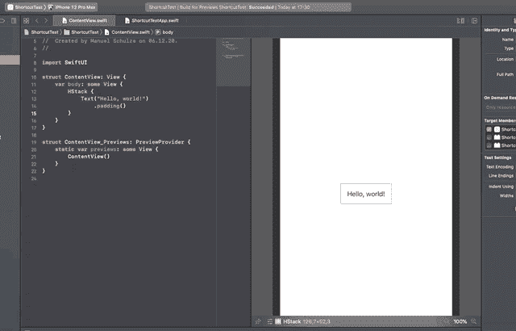

# Xcode: 8 SwiftUI 键盘快捷键，让你更快

> 原文：<https://betterprogramming.pub/xcode-8-swiftui-keyboard-shortcuts-that-will-make-you-even-faster-bc3967b75224>

## 掌握 Xcode 并更快地构建应用程序


雅利安·迪曼在 [Unsplash](https://unsplash.com?utm_source=medium&utm_medium=referral) 上拍摄的照片。

作为软件开发人员，我们不仅喜欢构建应用程序，还喜欢找到并使用最好的工具来实现这一目标。

作为 iOS 开发者，我们很幸运。有了 Swift，我们的工具箱中就有了一种现代编程语言。此外，苹果在 2018 年发布了一个全新的现代声明式 UI 框架，名为 SwiftUI。

这意味着我们用现有的工具为未来做好了充分的准备。

然而，我们也喜欢利用现有技术高效工作。提高我们的生产率和编写更多代码的一个简单方法是使用键盘快捷键。

遗憾的是，SwiftUI 没有太多可用的键盘快捷键(或者它们没有被清楚地记录)。然而，了解那些已经可用的是为未来做准备的好方法，同时有更多的时间做真正重要的事情。

您可以使用键盘快捷键完成以下任务:

1.  恢复 SwiftUI 的预览功能。
2.  显示/隐藏预览窗格。
3.  打开控件、修改器等的库。
4.  打开快速操作菜单。
5.  显示 SwiftUI 视图的检查器。
6.  快速访问视图的属性检查器。
7.  选择预览目的地(设备)。
8.  切换到上一个或下一个预览目的地。

在创建 UIKit 和 SwiftUI 视图时，可以使用大量有用的 Xcode 快捷方式。然而，本文将涵盖 SwiftUI 特有的问题。

# 1.恢复 SwiftUI 的预览功能



作者创作的 GIF。

SwiftUI 视图的预览非常强大。它允许您对某个视图进行更改，并在预览窗格中查看更改的影响。您不仅可以省略模拟器中的屏幕导航，而且也不需要运行模拟器！最初构建它只需要很短的时间，之后，所有的更改几乎都是即时可见的。

仅这一点就帮助我们在创建 SwiftUI 视图时变得非常快。这也很有意义，因为对于应用于 SwiftUI 视图的修饰符，顺序通常很重要。这可能是模拟器中多次重建和测试运行的原因。

然而，通常你必须启动或恢复预览功能。例如，打开一个视图时，Xcode 不会立即构建它。相反，它会等待，直到你明确地告诉它这样做。此外，当我们的 SwiftUI 代码中出现一些错误时，预览可能会中断。当然，你可以点击按钮恢复预览，但这需要时间，因此苹果增加了以下快捷键:

```
Option + Command + P (⌥ + ⌘ + P)
```

## **关联性**

在我看来，这是你需要学习的最重要的键盘快捷键。您将经常需要这个特性，因此如果您今天就开始使用它，就可以省去一些麻烦。

# 2.显示/隐藏预览窗格



作者创作的 GIF。

我已经告诉过你 SwiftUI 视图简洁的预览特性。然而，有时，我们真的想专注于代码。对我来说，当我让助理编辑器打开其他代码时，这种情况经常发生，三个编辑器有点太多了。

对你来说，这也可能发生在你在旅途中，而你只有一个小的 MacBook 屏幕的时候。稍后，当您拥有更大的显示器时，您可以再次显示预览窗格。幸运的是，这两种情况下的快捷键是一样的:

```
Option + Command + return (⌥ + ⌘ + ↩)
```

额外的好处:如果仅仅隐藏预览面板需要一次击键，你也可以使用下面的快捷键。但是请注意，这只会隐藏窗格，如果隐藏了，就不会再显示。

```
Command + return (⌘ + ↩)
```

## **关联性**

这更像是一个情境键盘快捷键，但绝对是一个很好的提示。

# 3.打开控件、修改器等的库。



作者创作的 GIF。

我已经简要介绍了修饰语。他们对您的 SwiftUI 视图进行修改。你需要记住大量的修饰语。如果你像我一样，经常忘记某些修饰词或颜色的名称，苹果已经为你提供了这个库。您可以打开该库，然后搜索该库以找到您正在寻找的修改器。

它不仅适用于修改器，也适用于控件、代码片段、媒体，甚至是您定义的颜色！再也不需要记住`smaragdineLight`或者`darkMikado`了！

您可能已经在 UIKit 开发中使用了这个库，向故事板添加了一个视图控制器，或者向它添加了一个按钮。

方便的是，苹果在这里使用了相同的快捷键:

```
Shift + Command + L (⇧ + ⌘ + L)
```

有了它，你就可以进入所有不同的图书馆区域。

额外收获:你可以用快捷方式打开库，但是你会发现自己在标签(修改器，控件等)之间切换。)又用鼠标了。但实际上并不需要。

使用以下键盘快捷键将选项卡切换到左侧:

```
Shift + Command + [ (⇧ + ⌘ + [)
```

这个可以将标签切换到右边:

```
Shift + Command + ] (⇧ + ⌘ + ])
```

你会一遍又一遍地发现这两个额外的捷径。这是在选项卡之间切换的常见解决方案，您可能已经使用过了。

## **关联性**

总的来说，在 Xcode 中打开库的快捷键被大量使用，我认为花时间去习惯它是值得的。选择颜色的选项使它特别有价值。

# 4.打开快速操作菜单


作者创作的 GIF。

SwiftUI 最酷的一点是它允许不同风格的工作。

如果你是一个视觉型的人(也许你有设计背景)，你将使用预览面板，并使用库来构建你的 UI，将视图拖放到画布上。

另一方面，如果你是一个技术人员，你可能只使用代码来精确地制作用户界面。

或者你两者都用，有自己的工作风格。

现在最精彩的部分来了。即使当你是一个团队，一个成员喜欢用代码创建 SwiftUI 视图，而另一个成员使用可视化工具，它也会产生两个视图！你的画布和你的代码将永远保持同步！

至此，我想介绍一个适用于所有类型开发人员的键盘快捷键。您可以使用以下快捷方式打开快速操作:

```
Command + Click (⌘ + Click)
```

“快速操作”菜单让您可以访问所有您想做的事情。您可以将当前视图嵌入到一个堆栈(`HStack`、`VStack`、`ZStack`)、一个列表中，甚至创建一个条件或循环。

## **相关性**

快速操作菜单给了你如此多的选项，从增加功能到重构，以至于我们可以忽略这样一个事实:当使用这个键盘快捷键时，我们必须触摸鼠标。它仍然非常好——特别是当我们的代码变大时，将一些代码提取到它自己的方法中。绝对是一种必备的捷径。

# 5.显示 SwiftUI 视图的检查器



作者创作的 GIF。

这是另一个我们应该已经从 UIKit 知道的快捷方式。每个 SwiftUI 视图都有以下检查器:文件检查器、历史检查器、快速帮助检查器和属性检查器。所有这些都为我们当前的观点提供了几个方便的特征。

例如，快速帮助检查器使我们能够访问关于我们当前正在使用的视图的部分文档。这在使用像`Text`、`Color`等内置视图时很有帮助。

打开某个检查员是我们需要经常做的事情。所以，我们一个一个来看捷径。

文件检查器:

```
Option + Command + 1 (⌥ + ⌘ + 1)
```

历史检查器:

```
Option + Command + 2 (⌥ + ⌘ + 2)
```

快速帮助检查器:

```
Option + Command + 3 (⌥ + ⌘ + 3)
```

属性检查器:

```
Option + Command + 4 (⌥ + ⌘ + 4)
```

额外收获:如果你想完全隐藏检查员，还有另一个捷径:

```
Option + Command + 0(⌥ + ⌘ + 0)
```

## **相关性**

在使用 UIKit 时，我们习惯于经常改变视图的属性。在 SwiftUI 中，我们可以更容易地直接在代码中更改属性。尽管如此，了解方便获取信息的捷径是值得的。如果你还在维护一些 UIKit 项目，它可能会变得更有价值。

# 6.快速访问视图的属性检查器



作者创作的 GIF。

我已经告诉过你，在我看来，SwiftUI 中的属性检查器比以前在 UIKit 中用得少。

然而，它仍然让我们可以轻松地更改属性，而不需要很好地了解它们(您不必记住您需要编写的代码的语法)。也就是说，我想介绍一种打开属性检查器的替代方法，而不是我之前提到的快捷方式:

```
Control + Option + Click (⌃ + ⌥ + Click)
```

## **相关性**

同样，该键盘快捷键适用于 SwiftUI 预览窗格和代码。这是访问视图最常见属性的好方法。我需要更多的项目来告诉你我需要这个快捷方式的频率，但总的来说，它就像以前所有的检查器快捷方式一样——也就是说，与我向你展示的其他快捷方式相比，它的价值更低。

# 7.选择预览目的地(设备)



作者创作的 GIF。

这是一个非常酷的捷径。不幸的是，Xcode 缺乏一些性能来真正让它发光(至少在我的 MacBook Pro 上)。

当我们设计 SwiftUI 视图时，我们通常会在旁边显示预览窗格。我已经向您展示了如何使用第一个快捷方式开始/恢复预览。但是，这将仅预览当前所选目的地的 SwiftUI 视图(目的地在 Xcode 顶部的目标旁边可见。见下图)。



作者截图。

有时，你可能不仅想在最大的 iPhone 12 Pro Max 上看到自己的视图，还想看看它在其他较小设备上的外观。要切换目的地，您可以使用这个简洁的快捷键打开目的地选择:

```
Control + Shift + 0 (⌃ + ⇧ + 0)
```

遗憾的是，为新目的地构建视图预览需要一段时间。但至少它避免了使用鼠标，而是一直移动到屏幕的顶部，从而节省了我们一些时间。

## **关联性**

我认为，当我们的机器在几年内变得更强大时，我们将真正欣赏这种快速改变目的地的功能。目前，它很酷，因为如果我们想在不同的模拟器或设备上运行应用程序，我们也需要它。

# 8.切换到上一个或下一个预览目的地



作者创作的 GIF。

这类似于我之前展示的另一个键盘快捷键。但这一次，你不必打开目的地菜单，选择你想看的设备。相反，当您只想查看下一个目的地或上一个目的地时，此快捷方式非常有用。

这些快捷键与目标菜单具有相同的限制。为新设备重建预览需要一些时间。

这些操作有两个快捷方式。

以前的目的地:

```
Control + Shift + Command + [ (⌃ + ⇧ + ⌘  +[)
```

下一目的地:

```
Control + Shift + Command + ] (⌃ + ⇧ + ⌘ +])
```

## **关联性**

你也需要一些时间，但那不是因为捷径本身。相反，这是由于 Xcode 需要时间来重建预览。然而，我认为当你有两个屏幕尺寸想看，并希望在列表中相应地安排你的模拟器时，这是非常有用的。最后，这并不是必需的，因为您不会在经常但主要用于一种尺寸的目的地之间切换，然后改进另一种尺寸的 UI。

# 结论

键盘快捷键是提高我们性能的一个很好的方式，即使它更多的是在微观层面上的生产力。

SwiftUI 是一个令人惊叹的框架，让开发人员和设计人员快速创建用户界面。SwiftUI 只有两年的历史，它需要更多的时间来为我们提供我们需要的所有功能。

可悲的是，捷径也是如此。然而，那些已经可用的工具可能会有所帮助，了解它们并真正习惯它们是件好事。在接下来的几年里，当苹果发布越来越多的功能和快捷方式时，你会很高兴你已经知道了一些。

如果我能再要一个快捷方式，我肯定会喜欢一个用于现场预览。这是一个让你甚至可以在画布上点击并执行操作而无需启动模拟器的功能。

你能从这篇文章中学到什么？好吧，我希望你已经学会了一些你不知道的快捷方式，这将使你的 SwiftUI 体验更好。

我是不是忘记了你知道的一个简洁的键盘快捷键？让我知道！感谢您的参与，祝您在 SwiftUI 上玩得愉快。