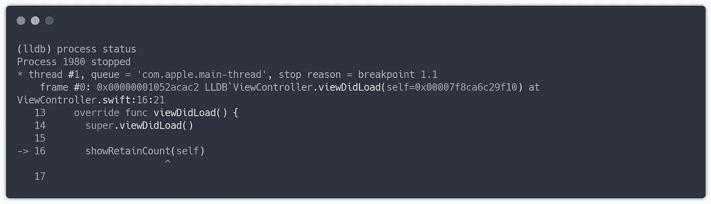
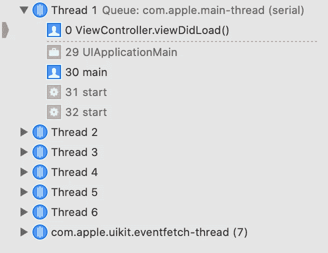
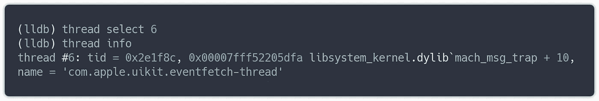
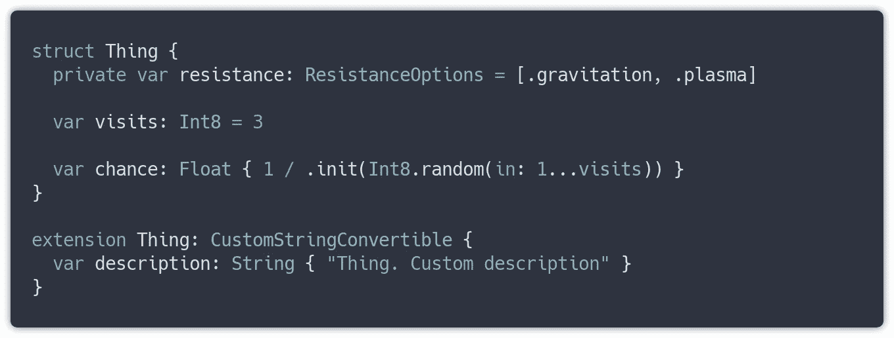
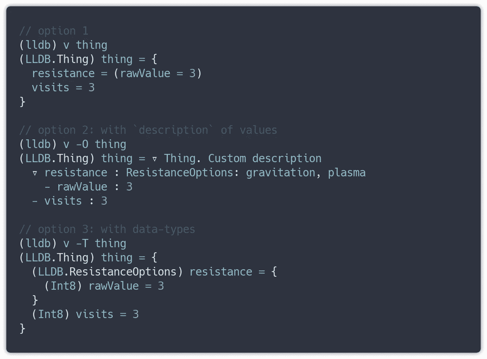
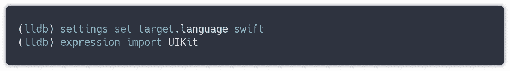
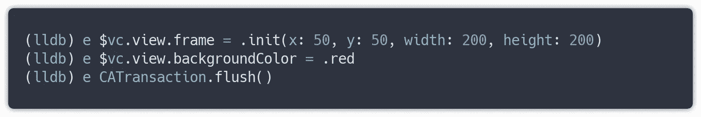

# Xcode 和 LLDB 的威力:实时应用程序管理

> 原文：<https://betterprogramming.pub/xcode-and-the-power-of-lldb-real-time-application-management-642875529fce>

## 类固醇上的 iOS 调试

照片由 [asoggetti](https://unsplash.com/@asoggetti?utm_source=medium&utm_medium=referral) 在 [Unsplash](https://unsplash.com?utm_source=medium&utm_medium=referral) 上拍摄

# LLDB

LLDB 是一个高性能调试器，是下一代 GNU 调试器。
包含一套库，比如 Clang 表达式解析器，LLVM 反汇编器。

LLDB 是 macOS、iPadOS、iOS、tvOS 和 watchOS 上的系统调试器。它还可以用于 Objective-C 和架构的 Swift 开发:x86_64。i386，ARM 和 AArch64，以及 macOS 上 Xcode 中的默认调试器。它支持在桌面、模拟器和设备上进行调试。LLDB 可以通过模块`lldb`从 Python 中导入，并且可以用于与您的环境连接的脚本。

因此，使用 LLDB，您可以通过命令行或脚本运行特殊的命令和表达式，使用应用程序的实时模式获取信息或设置值。以正确的方式使用这个工具，您可以提高您的开发知识和速度，了解内存使用情况，找出您的值的字节大小，等等。

因此，让我们突出一些我认为有用的基本命令。

# 命令

> 如果我在 Xcode 中已经有了一个很好的 GUI，为什么还要通过终端使用任何命令并了解 LLDB API？

*了解 API 的主要原因是——有了这些知识，你将知道它提供了什么功能，你可以在其上构建什么，你将能够更快地做出反应，不依赖于 UI 中未实现的功能，并了解应用程序的内部部分、内存、寄存器等。*

## 过程

`process status` —显示所选线程和调用堆栈中当前帧中应用程序的当前调试状态。对于报告自动化，通过 Python 脚本发送会很有用。

# 调用栈

在执行代码期间，调用栈被创建，并包含栈帧:函数参数、函数的局部变量以及调用结束时返回的地址。

在调用堆栈中导航以检查您可以使用的应用程序流，并在以下位置找到更多详细信息:

## 线

在 XCode 中，您可以在调试导航器的左侧面板中找到 GUI，CMD+7。

Xcode 调试导航器线程

`thread backtrace` —给出当前线程的堆栈帧列表。
如果你想从所有线程中获取列表——分别运行`thread backtrace all`和`thread backtrace unique`来查看按唯一调用栈分组的列表。

要在线程间导航，使用`thread select`命令，命令中包含到达堆栈帧所需的线程数。

`thread list` —获取包含信息的所有线程列表，并查看星号(*)内的选定线程

`thread return` —在框架中存根函数的返回值。编写命令:`thread return false`，用于模拟需要的行为。但是只能用标量类型返回。命令的执行需要一些时间。

## 基本框架

该命令提供了选择和检查当前线程堆栈帧的可能性。

`frame variable`，简称`frame var`，或简称`v`，使用它从当前堆栈帧中检索一个值的描述信息，如果提供的话，使用调试信息和内存。否则，它会给出关于该帧的详细信息。

命令接受有用的标志，这些标志提供了关于值的有用信息。因此，如果您需要检查该值，请确保您将它放置在适当的框架中，其中存在 access 变量。您可以使用`frame info`查看当前帧的信息。

因此，如果我们想检查已经初始化并存在于内存中的值`thing`:

使用特定的标志，您可以获得关于该值的适当输出信息:

您可能已经注意到，输出中没有`chance`变量。这是因为`chance`是计算变量，只能通过表达式— *进行计算，下一段*将详细介绍。

## **导航**

如果您需要在堆栈帧之间移动，`lldb`有命令`up`和`down`，它们可以接受偏移量的参数，因此，如果您在最顶端，并且想要移动到实际的层—编写`down 10000`(它将到达计算偏移量或层的边缘)

基于这些命令，我们在 Xcode 中已经有了图形用户界面(GUI ),比如在线程、帧之间切换、评估值、查看 CPU/内存/磁盘/网络报告等。

好了，关于调试环境的通用信息已经描述完毕，让我们看看实际上我们能做些什么。

## 表示

`expression`类似于`print` —通过编译器评估表达式，因此如果你想要改变值、释放对象、执行函数或计算属性，这是正确的工具。值得注意的是，编写没有值的`expression`——打开一个 shell 来逐行编写表达式，完成后立即执行。

除了`expression/print`，您还可以使用`po`——如果您的值实现了`CustomStringConvertible`协议，它将评估对象并调用`description`计算属性。`po` —与`e -O --`相同。如果在调试过程中更改值是清楚的，那么让我们来看看更实际的东西，以获得更快的开发体验，比如动态更改应用程序。

# 实时更新视图

默认情况下，LLDB 评估 Objective-C 中的表达式，因此为了方便起见，通过:`settings set target.language swift`为其设置默认语言。

对于使用`UIKit`的视图，首先导入框架，我们可以创建一个对值的引用并进行所需的操作。

在代码中，它看起来像这样:

这里我们使用一级函数`unsafeBitCast`，它返回给定实例的位，解释为具有指定的类型。我们需要内存地址和类型来解释。在我的例子中，这是一个“视图控制器”，我的框架当前在它上面:

所以我们换一下`frame`和`backgroundColor`。

*记住，你的视图必须出现在渲染树中，所以把断点放在* `*viewDidAppear*` *或之后，其他情况。*

重画渲染树，你在模拟器中的屏幕被更新！

值得注意的是，调试器在 Xcode 12 中得到了改进，更多信息，您可以在这里阅读:

 [## Xcode 12.0 有什么新功能？

### Swift 5.3、适用于 iOS/iPadOS/tvOS 14、watchOS 7 和 macOS Big Sur 的 SDK

medium.com](https://medium.com/better-programming/whats-new-in-xcode-12-0-6202528b8f9b) 

使用所描述的技术，您可以极大地提高开发速度，并模拟不同情况下所需的应用程序流，而无需重新编译。

如果您有任何建议或问题，请留下回复。感谢阅读！