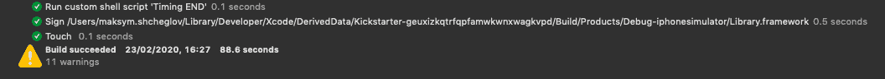
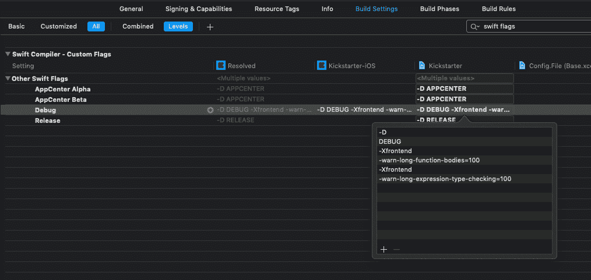

# Xcode 构建时优化(第 1 部分)

> 原文：<https://betterprogramming.pub/xcode-build-time-optimization-part-1-9adb5073994b>

## 了解如何测量 Xcode 构建时间


由 [Unsplash](https://unsplash.com?utm_source=medium&utm_medium=referral) 上的[谷仓图片](https://unsplash.com/@barnimages?utm_source=medium&utm_medium=referral)拍摄

偶尔，每个开发人员都会遭遇 Xcode 构建时间过长的问题。这导致了生产力的降低和整个团队开发过程的减缓。缩短构建时间至关重要——它直接影响新功能的上市时间。

在第 1 部分中，我们将学习如何分析 Xcode 构建并获取它的指标。在下一部分中，我将介绍解决瓶颈和加速构建的技术。还应该提到的是，我们将使用 Kickstarter iOS 项目，该项目可以在 [Github](https://github.com/kickstarter/ios-oss) 上找到。

我们开始吧！

# 衡量什么

首先，我们需要定义我们试图测量和优化什么。有两种选择:

*   **清理构建**:从零开始清理和重建项目。通常，一个干净的构建是在 CI 上完成的，以验证 pull 请求的正确性并运行单元测试。
*   **增量构建:**在一些源代码变更后重新构建一个项目。该版本由开发人员在开发新功能时创建。

在大多数情况下，干净的构建时间改进也应该加速增量构建。最好的选择是为两种构建类型生成度量标准，并跟踪它们。我们将测量用`Debug`配置创建的构建，只是因为它是最常用的，并且对开发有更大的影响。

# 测量您的构建时间

缩短构建时间的最有效方法是采用数据驱动的方法，根据构建度量标准引入并验证变更。让我们深入研究一下，看看我们可以用来洞察项目构建时间的工具。

## Xcode 构建报告

我们可以通过 Xcode 轻松获得构建时间。默认情况下，Xcode 会跟踪您的所有构建，您可以从报告导航器中检查时间和日志。



在 Xcode 活动查看器中有一个显示类似信息的选项。您可以从命令行启用它:

```
defaults write com.apple.dt.Xcode ShowBuildOperationDuration YES
```

构建持续时间出现在构建之后，旁边是“成功”消息。


这只是两个基本选项，应该可以让您大致了解干净的和增量的构建时间。

## Xcode 构建时序摘要

Xcode 构建时间摘要是您获得构建时间洞察力和发现瓶颈的第一个朋友。你可以通过`Product->Perform Action->Build With Timing Summary`运行一个，它会给你一个在不同任务上花费时间的详细分类:


这是找出构建过程中最耗时的任务的良好起点。

从上面的截图可以看出，`CompileStoryboard`、`CompileAssetCatalog`、`CompileSwiftSources,`和`PhaseScriptExecution`阶段花费了大部分构建时间。Xcode 设法并行运行一些任务，这就是为什么构建完成得比所有任务的总和快得多。

我们可以使用带有`-buildWithTimingSummary`选项的`xcodebuild`来获得干净构建的构建时间摘要:

现在，让我们为增量构建获得类似的度量。应该提到的是，增量构建时间完全取决于项目中被更改的文件。要获得一致的结果，您可以更改单个文件并重新构建项目。与 Buck 或 Bazel 不同，Xcode 使用时间戳来检测哪些内容发生了变化，哪些内容需要重建。因此，我们可以使用`touch`来更新时间戳:

## 类型检查警告

如果 Swift 编译时间是瓶颈，我们可以通过从 Xcode 构建设置中设置`Other Swift Flags`来获得更多信息。启用这些标志后，Xcode 将为任何类型检查时间超过`100ms`的函数或表达式生成警告:

*   `-Xfrontend -warn-long-function-bodies=100`
*   `-Xfrontend -warn-long-expression-type-checking=100`



现在你知道代码 Swift 编译器有问题，你可以尝试提出一些改进。

## 编译器诊断选项

Swift 编译器有各种内置的[诊断选项](https://github.com/apple/swift/blob/master/docs/CompilerPerformance.md#diagnostic-options)，您可以使用它们来分析构建。

*   `-driver-time-compilation`:驱动程序执行的作业的高级定时。
*   `-Xfrontend -debug-time-compilation`:前端作业执行各阶段的定时器。
*   `-Xfrontend -debug-time-function-bodies`:对程序中的每个函数进行类型检查所花费的时间。
*   `-Xfrontend -debug-time-expression-type-checking`:对程序中的每个表达式进行类型检查所花费的时间。

让我们使用`-debug-time-compilation`标志来获得要编译的最慢的文件:

可以看到，编译`SettingsNewslettersCellViewModel.swift`用了 25s。从构建日志中，我们可以获得关于文件编译时间的更多信息:

现在很明显`Type checking and Semantic analysis`是最耗时的工作。让我们向前看，列出在`Type Checking`阶段最慢的函数体和表达式:

就这样，我们对我们的构建进行了剖析，发现我们在`Type Checking`阶段有相当多的瓶颈。作为下一步，你可以看看上面列出的函数和表达式，并尝试优化类型推断。

# 目标的构建时间

单独测量目标构建时间并在图表上显示它们是很方便的。这有助于理解哪些目标是并行构建的或者可以并行构建的。为此，我们可以使用`[xcode-build-times-rendering](https://github.com/PaulTaykalo/xcode-build-times-rendering)`工具。让我们安装一个作为`RubyGem`:

```
gem install xcode-build-times
```

安装完成后，运行以下命令，在目标的运行脚本构建阶段注入时间戳日志记录:

```
xcode-build-times install
```

然后构建项目并生成报告:

```
xcode-build-times generate
```

您应该得到一个漂亮的构建时甘特图，它显示了所有目标的构建时间:


## 聚合指标

将上述不同的指标汇总起来会很棒。`[XCLogParser](https://github.com/spotify/XCLogParser)`是一个很好的工具，可以帮助你做到这一点。它是 Xcode 生成的`xcactivitylog`的日志解析器，可以让你深入了解项目中每个模块和文件的构建时间、警告、错误和单元测试结果。您可以通过克隆存储库来安装它，并通过命令行运行它:

```
git clone https://github.com/spotify/XCLogParser
rake build
xclogparser parse --project Kickstarter --reporter html
```

这是为 Kickstarter iOS 项目创建的报告:


## 自动化

应该指出的是，构建时间指标取决于硬件及其利用率。你可以用你的机器做实验。更好的选择是尽可能自动化流程，并使用专用的 CI 机器每天获取指标。最终，您可以在仪表板上跟踪它们，并通过 Slack 通知构建时间的下降。

# 结论

构建时间加速对于开发人员的生产力和产品的上市时间至关重要。今天，我们已经学习了如何测量 Xcode 的构建时间，并获得一些指标进行分析。

你如何衡量你的构建时间？你正在使用本文中提到的任何技术吗？欢迎发表评论。

感谢阅读！