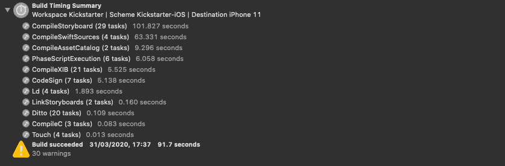
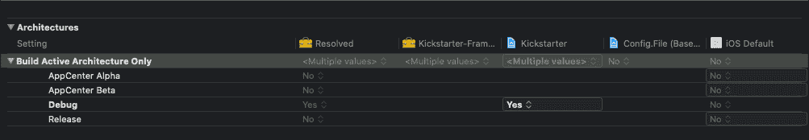
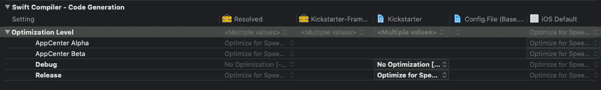
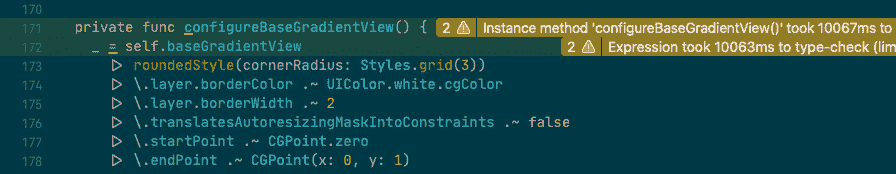
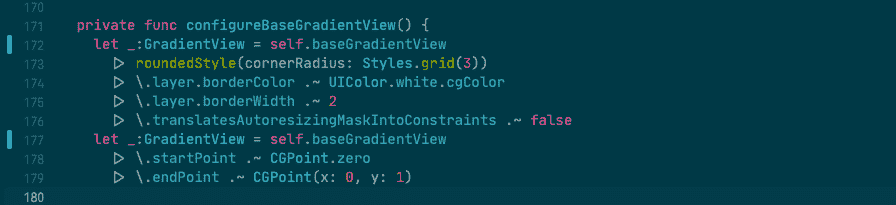
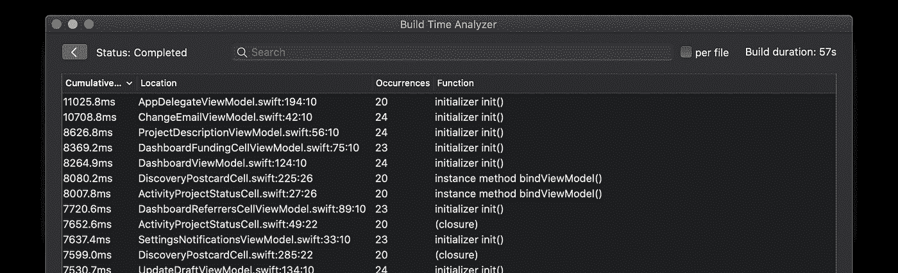
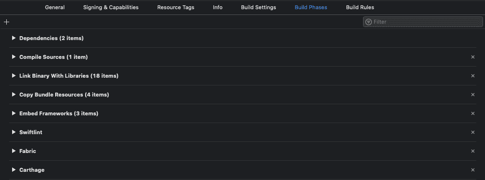
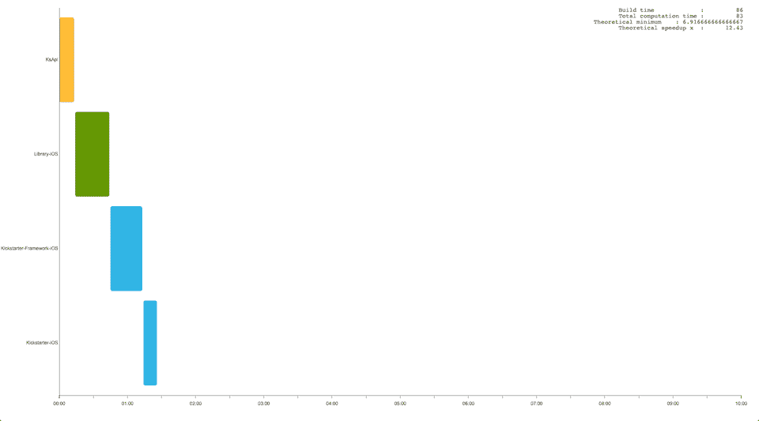
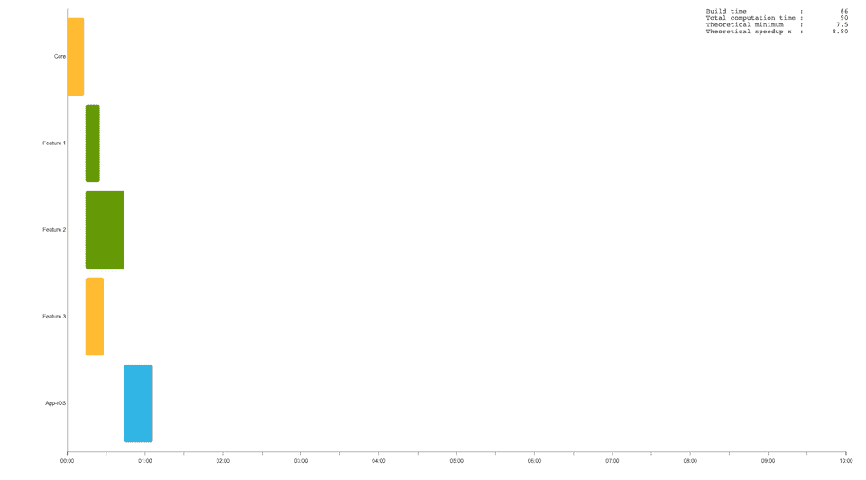

# Xcode 构建时优化(第 2 部分)

> 原文：<https://betterprogramming.pub/xcode-build-time-optimization-part-2-6952daf200b9>

## 探索加速 Xcode 构建时间的技术

图恩·nguyễn·明在 [Unsplash](https://unsplash.com?utm_source=medium&utm_medium=referral) 上拍摄的照片。

加快构建时间对于开发人员的生产力和产品的上市时间至关重要。控制你的构建时间并在需要的时候改进它是非常重要的。

在[的上一篇文章](https://medium.com/@mshcheglov/xcode-build-time-optimization-part-1-9adb5073994b)中，我们学习了如何测量 Xcode 的构建时间，并获得一些指标进行分析。在这一篇中，我将向您展示我们如何解决 Xcode 构建时间瓶颈并加速它。

# 优化什么

在我们开始之前，我建议获取项目的初始构建时间度量。以下是我们收到的关于 [Kickstarter iOS 项目](https://github.com/kickstarter/ios-oss)的 Xcode 构建时间摘要:

使用上面的构建时间度量，我们现在可以找到构建过程中最耗时的任务，并定义哪些可以改进。我将构建时优化技术分为以下几种:

*   构建设置优化
*   源代码改进
*   项目增强
*   其他人

让我们深入细节！

# 构建设置优化

我们应该做的第一件事是检查我们的项目是否针对调试配置进行了优化配置。默认情况下，创建新项目时会预先填充这些设置。但是在现有项目中检查它们是值得的，以防有人不小心更改了它们。

## 仅构建活动架构(ONLY_ACTIVE_ARCH)

如果启用，Xcode 只会为活动架构创建一个二进制文件。在开发阶段，我们在设备或模拟器(活动架构)上构建项目。发布版本应该包含所有支持的架构，因为一个架构通过 App Store 提供给所有类型的用户设备。确保将 Debug 设置为 Yes，将 Release 设置为 No。

## 编译模式(SWIFT_COMPILATION_MODE)

该设置定义了如何在模块内重建 Swift 文件。将其设置为增量调试配置，仅重建过期的 Swift 源文件。使用整个模块进行发布，以重建模块中的所有 Swift 源文件，并应用某些代码优化。

## 优化级别(SWIFT_OPTIMIZATION_LEVEL)

优化级别设置定义了我们希望优化构建的方式。由于优化过程中涉及到额外的工作，代码优化会导致构建时间变慢。调试版本应该配置为没有优化，因为我们需要一个快速的编译时间。对于发布版本，可以设置为优化速度。

## 调试信息格式(DEBUG_INFORMATION_FORMAT)

`dSYM`是一个包含调试信息的调试符号文件，用来表示和解释崩溃报告。您应该总是为发布版本创建一个，但是大多数时候您不会将它用于调试版本。

# 源代码改进

## 找到编译缓慢的代码

正如我们在[上一篇文章](https://www.onswiftwings.com/posts/build-time-optimization-part2/www.onswiftwings.com/posts/build-time-optimization-part1)中了解到的，编译过程中速度变慢的主要原因之一是对复杂表达式的求值。为了帮助我们找到 Swift 编译器遇到困难的地方，Xcode 可以为任何函数或表达式生成一个警告，该函数或表达式的类型检查时间超过了指定的限制。以下是我用[构建时间分析器](https://github.com/RobertGummesson/BuildTimeAnalyzer-for-Xcode)得到的 Kickstarter 项目的结果:

让我们来看看最大的罪犯。函数`configureBaseGradientView()`在 Xcode 构建日志中被提到了 20 次，每次执行类型检查需要 10，067 ms。

中缀运算符`|>`调用链有一个复杂的表达式。毫不奇怪，花了一些时间来打字检查一个。作为一种改进，我们可以显式地指定类型并将它分成两部分:

就这样，我们可以修复剩下的问题，并将总构建时间从 92 秒减少到 57 秒。

## 减少重建工作

理解 Swift 编译器如何工作并找到要重新编译的文件非常重要。您可能知道 Swift 的依赖模型是基于文件的。如果你在一个函数体中做了改变，编译器会很聪明的知道只有那个文件需要重新编译。另一方面，在文件中添加或删除一个新的函数或实体将触发所有依赖于它的文件的重新编译。

您可以执行以下操作来减少编译器在重新生成时应该做的工作:

*   在单独的文件中定义实体。
*   为你的类、结构、枚举、扩展等使用正确的访问修饰符。

## 移除未使用的代码

随着项目的发展，可能会出现不再使用或永远无法访问的代码。它会降低项目的构建时间，因此需要找到并删除它。我在之前的一篇文章中描述了如何做到这一点。

## 预生成依赖项

每个项目都有不同的依赖项，这些依赖项可能会减慢构建过程。您可以通过使用预构建的动态框架和库来提高构建的效率。那么如果有新的版本，就应该重新构建框架。这种方法适用于不经常改变的内部和外部依赖关系。

## 代码与 Xibs 故事板

您可能会考虑从代码中实现 UI，而不是使用 Xib 和故事板文件。在我看来，这两种方法各有利弊。将 UI 定义在 Xib 和故事板文件中会减慢干净构建的速度，并增加应用程序的大小。另一方面，它应该比由代码创建的复杂 UI 更容易理解。说到增量构建，您不会注意到显著的构建时间差异。

# 项目增强

## 改进运行脚本阶段

每当您构建项目时，都会执行运行脚本阶段。您可以在“构建阶段”面板上找到阶段:

我们为此目标定义了下一个运行脚本阶段:

*   Swiftlint —运行`swiftlint`来加强编码风格和约定。
*   Fabric —运行初始化 Crashlytics 的脚本。
*   Carthage —将框架复制到应用程序包中，并删除未使用的架构。

运行项目的所有运行脚本阶段花费了 6 秒钟。我们可能不应该在每次重建项目时都运行这些任务。以下是我们加快速度的方法:

*   请考虑使用 git 提交挂钩。
*   如果可能，跳过运行调试配置或模拟器目标的脚本。
*   声明脚本的输入和输出，或者使用复制文件阶段。

## 采用模块化架构

如果你正在做一个大项目，把一个完整的代码库分成几个模块是一个好主意。模块化您的代码允许 Xcode 只编译您修改的模块，并缓存这些输出以供将来构建。此外，从 Xcode 10 开始，我们可以从尽可能并行构建目标中受益。

让我们使用[xcode-build-times-rendering](https://github.com/PaulTaykalo/xcode-build-times-rendering)来检查模块及其构建时间:

如您所见，该项目包含三个框架目标和负责建立所有依赖关系的应用程序目标。但是我们无法从并行化中获得最大收益，因为这些目标之间存在线性依赖关系。更好的选择是定义独立的功能模块:

以这种方式模块化您的代码使得并行构建执行更加有效，并且加速了增量构建。

# 其他人

使用上述方法，您可以加快大多数项目的构建时间。但是这些并不是你可以使用的所有技术。您可以考虑使用像 Buck 或 Bazel 这样的构建系统，并为构建工件提供远程缓存。

# 结论

漫长的构建时间会减缓开发过程，并直接影响您的生产力。在本文中，我们探讨了如何减少编译器应该做的工作并提高构建效率。

你如何控制项目的构建时间？你使用本文中提到的任何技术吗？让我知道你的想法，或者在下面的评论区问任何你可能有的问题。

感谢阅读！