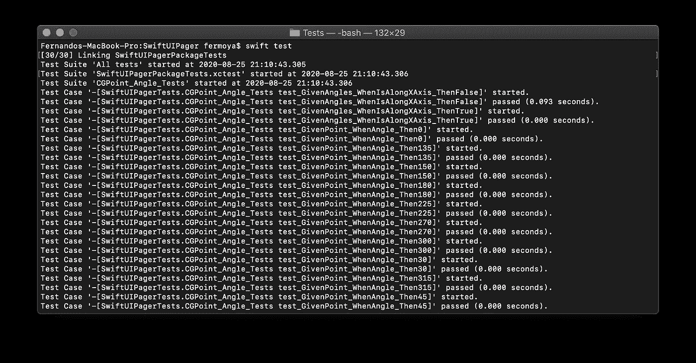

# Xcode 命令行工具:用例

> 原文：<https://betterprogramming.pub/xcode-command-line-tools-use-cases-6eb331eda99d>

## 构建、归档、测试、创建 XCFramework、注入通知和模拟深度链接



图片来源:作者

# 介绍

在这个简短的教程中，我将向您介绍一些有用的 [Xcode](https://developer.apple.com/documentation/) 命令行工具，并展示您可以利用其潜力的有用用例。

# 1.用例:构建工作流

CI/CD 现在很流行，你可以对你的库设置的一个基本检查是确保你的所有目标都被构建。让我们来看看一些有用的命令。但是首先，打开您的终端并运行`cd path_to_your_project_folder`。

## 显示生成设置

以下命令将输出包含所有项目设置的列表:

```
xcodebuild -project MyProject.xcodeproj -showBuildSettings
```

如果你正在寻找一个特别的，使用`grep`来过滤。例如，要查找您的构建目录(`BUILD_DIR`):

```
xcodebuild -project MyProject.xcodeproj -showBuildSettings | grep -m 1 "BUILD_DIR" | grep -oEi "\/.*"
```

**注:**也可以用`-workspace MyWorkspace.xcworkspace`代替`-project MyProject.xcproject`。这也适用于以下所有命令。

## 建立一个计划

要构建您的方案，您可以运行:

```
xcodebuild clean -scheme MyScheme \
                 -project MyProject.xcodeproj \
                 -destination SomeDeviceOrSimulator
```

如果你想要一个全新的版本，在`build`前加上`clean`:

```
xcodebuild clean build  -scheme MyScheme \
                        -project MyProject.xcodeproj \
                        -destination "platform=macOS"
```

以下是一些您可以选择的目的地:

*   `"platform=macOS"`
*   `"platform=macOS,variant=Mac Catalyst"`
*   `"platform=iOS"`
*   `"platform=tvOS"`
*   `"platform=watchOS"`
*   `"platform=iOS Simulator"`
*   …

也可以选择具体的架构:`"platform=macOS,arch=arm64"`。

## 行动中的用例

这就是你如何在 CI 工作流程中利用`xcodebuild`来构建你的所有目标:

```
SCHEMES=( Target1_iOS Target1_macOS Target2 )
PLATFORMS=( "platform=iOS" "generic/platform=macOS" "generic/platform=iOS" )DIR=$(xcodebuild -project MyProject.xcodeproj -showBuildSettings | grep -m 1 "BUILD_DIR" | grep -oEi "\/.*")for i in ${!SCHEMES[@]}; do
  xcodebuild clean build  -scheme ${SCHEMES[$i]} \
                          -project MyProject.xcodeproj \
                          -destination "${PLATFORMS[$i]}" COUNT=$(find $DIR -maxdepth 1 -type d | wc -l) if [ $COUNT -eq 2 ]; then
    echo "$(tput setaf 2)Build succeded for target ${SCHEMES[$i]}$(tput sgr0)"
  else
    echo "$(tput setaf 1)Build failed for target ${SCHEMES[$i]}$(tput sgr0)"
  exit 1
  fidone
```

这个脚本执行一个`for`循环来构建所有的目标，并验证构建是否成功。

# 2.用例:生成 XCFramework

CI 工作流中的另一个常见操作是，一旦您发布了您的发行版并将生成的二进制文件附加到其上，就生成一个 XCFramework，以支持手动安装(在文章[与 GitHub 操作的持续集成](https://medium.com/better-programming/continuous-integration-with-github-actions-fccc5a339b75)中了解更多信息)。

## 存档方案

要存档一个方案，使用`xcodebuild`:

```
xcodebuild archive -scheme MyScheme \
                   -destination "platform=macOS" \
                   -archivePath "./MyScheme.macOS.xcarchive" \
                   SKIP_INSTALL=NO \
                   BUILD_LIBRARY_FOR_DISTRIBUTION=YES
```

该命令将在与所选目标兼容的所选路径中生成一个`.archive`文件。和以前一样，你也可以加上`clean`:

```
xcodebuild clean archive -scheme MyScheme \
                         -destination "platform=macOS" \
                         -archivePath "./MyScheme.macOS.xcarchive" \
                         SKIP_INSTALL=NO \
                         BUILD_LIBRARY_FOR_DISTRIBUTION=YES
```

## 创建 XCFramework

要创建一个 XCFramework，在归档您的方案后使用`-create-xcframework`，并传递归档路径:

```
xcodebuild -create-xcframework \
           -framework "path_to_archived_framework_1" \
           -framework "path_to_archived_framework_2"
           -output "MyProject.xcframework"
```

您可以使用这两个命令非常容易地创建另一个脚本来在您的 CI 工作流中运行，类似于前面看到的脚本。

# 3.用例:运行测试

与前面的用例类似，Xcode 允许您从命令行运行测试。

## 运行测试方案

如果您的项目或工作区有特定的测试方案，那么您可以从命令行运行它们:

```
xcodebuild test -scheme MyScheme \
                -project MyProject.xcodeproj \
                -destination 'platform=OS X,arch=x86_64'
```

## 对您的 Swift 包运行测试

如果您没有项目文件，但有 Swift 包，您可以运行:

```
swift test
```

# 4.用例:模拟深度链接和通知

深度链接和通知是一些更难在设备中测试的功能。幸运的是，Xcode 命令行工具有一个解决方案。

## 深层链接

在代码中的任何地方，您都可以运行:

```
xcrun simctl openurl booted <INSERT_URL_HERE>
```

**注意:**URL 应该包含一个你的应用可以识别的方案。参见文章[深度链接、通用链接和 SwiftUI 应用生命周期](https://medium.com/better-programming/deep-links-universal-links-and-the-swiftui-app-life-cycle-e98e38bcef6e#Setting-App-Deep-Links)中的如何设置您的 deeplink(或通用链接)。

## 通知

从 11.4 开始，Xcode 增加了一种模拟通知的方式。您只需使用通知的有效负载创建一个 APNS 文件:

```
{    
  "aps": {        
    "alert": {
      "title": "Test",
      "body": "Testing notifications in the simulator"
    },
    "sound": "default",
    "badge": 1
}
```

并运行:

```
*xcrun simctl push <device> <bundle identifier> <APNS file>*
```

要获取所有可用设备，您可以运行:

```
instruments -s devices
```

或者，如果它已经启动，运行:

```
xcrun simctl list | grep 'Booted' # Phone: iPhone Xs (AB165068-87DC-43EC-A513-893860CF0615) (Booted)
```

并复制括号中的 ID。

```
*xcrun simctl push* AB165068-87DC-43EC-A513-893860CF0615 *com.example.app push-notification.apns*
```