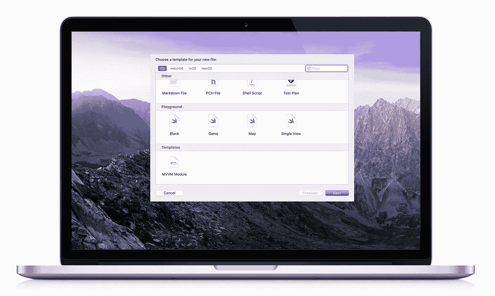
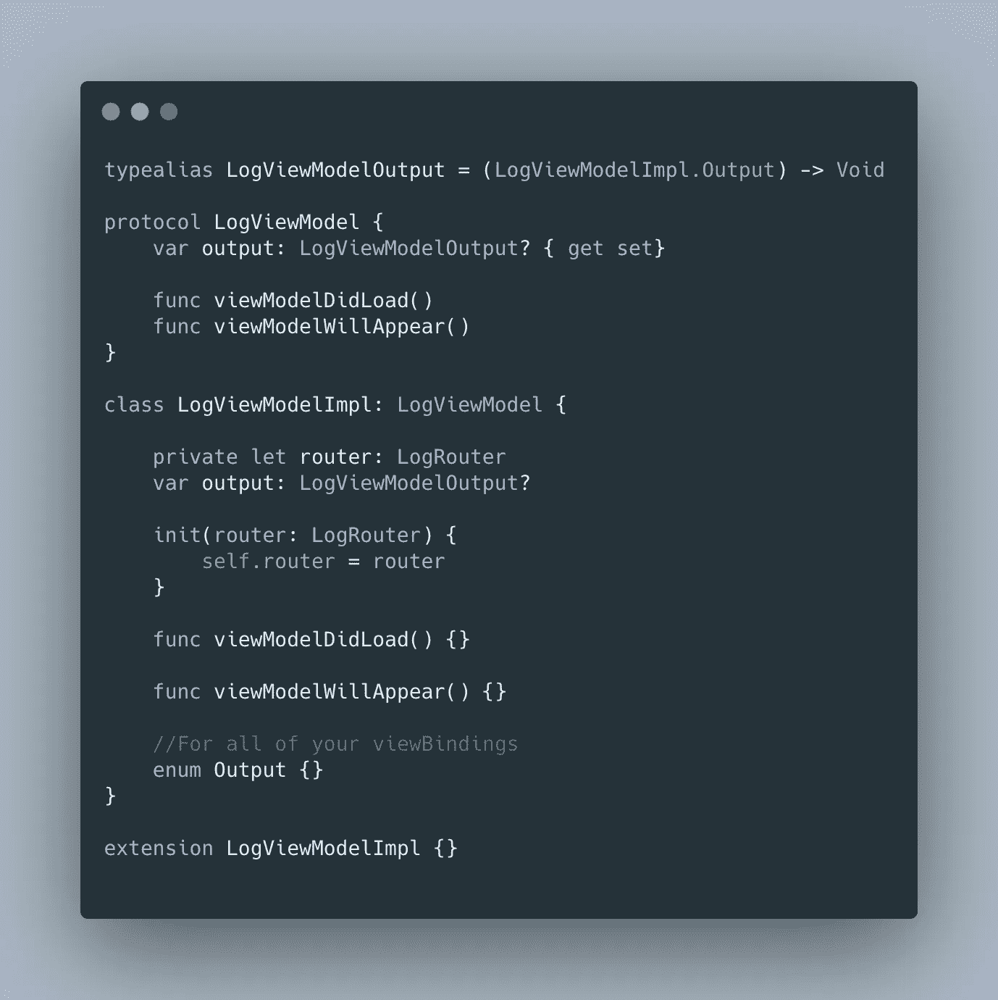
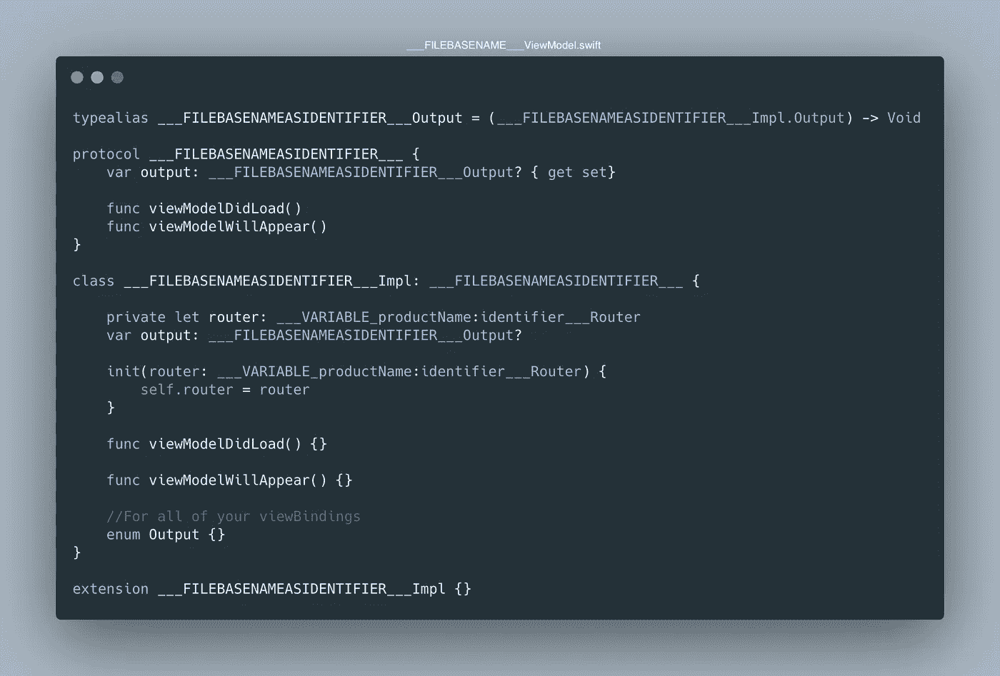
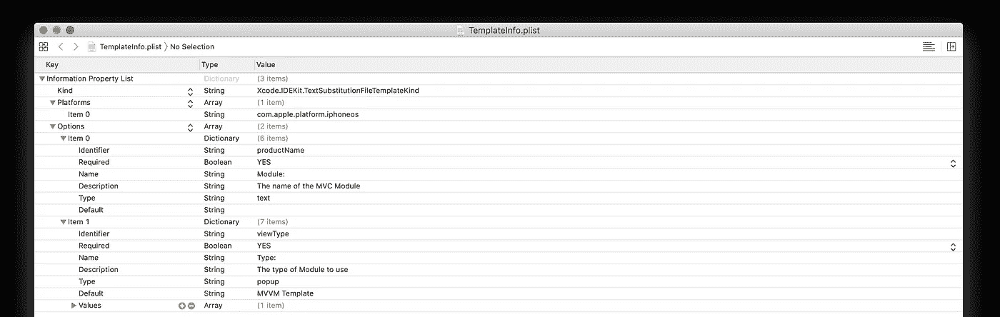
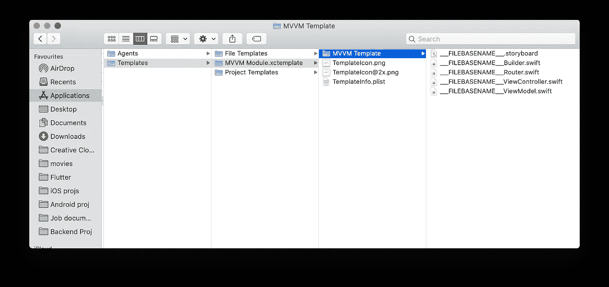
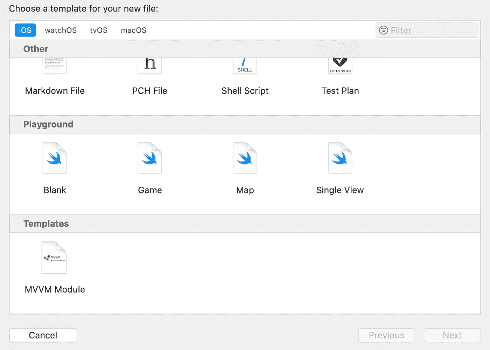
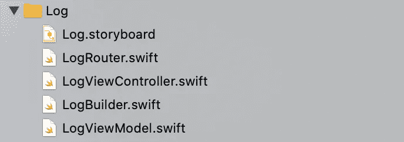

# Xcode 文件模板——一个真正的省时工具

> 原文：<https://betterprogramming.pub/xcode-file-template-a-time-saver-8d37dac1864>

## 创建模板以生成具有相同基本名称的多个文件



在从事 iOS 项目的一段时间里，我一直在考虑让整个代码库保持一致，减少开发工作量。但是确保每个人都编写高质量和一致的代码总是一件困难的工作。

假设您正在开发一个项目，并假设它包含许多屏幕类。您重复地创建每个类，写下每个屏幕类应该有的代码、方法和函数——这是一项相当耗时的工作，但如果您有严格的截止日期，这也很烦人，对吗？

但是今天，我有一个惊人的解决方案，为您的项目创建一些很棒的模板，简而言之，这将有助于减少大量的人力，同时确保每个人都遵守架构指南。

好消息是 Xcode 提供了所有这些特性。如果我想用任何设计架构创建一个 screen 类，所有与这个 screen 类相关的子结构都会自动创建。例如，当我使用 MVVM 架构创建登录屏幕时，绑定方法、视图模型、模型、视图和协议都是自动创建的。

听起来很神奇，对吧？🤩

# 我们开始吧

**注意:**在本文中，我将仅为演示目的创建一个与 ViewModel 相关的模板。您可以自己创建其他文件模板。此外，我还附上了 MVVM-R 模板的 GitHub 链接。

## **让我们写一些模板代码**

让我们从创建一个新的 Swift 文件开始。

其次，我们将从编写一些通用模板代码开始。下面是我的 ViewModel 在模板代码之前的样子。



如果能预发布所有这些代码，是不是很神奇？真见鬼。

所以目前这个视图模型包含特定的模块名，比如`LoginViewModel`。

因此，现在我们将修改我们的视图模型，并将`Login`更改为一些通用的代码模板。我们可以在任何我们想要的地方添加它，并且命名像变魔术一样变化。

在这里，Xcode 开始发挥作用。Xcode 为我们提供了一些我们今天要用到的关键词来达到我们的目标。这些是:

*   `**___FILEBASENAMEASIDENTIFIER___**` : 如果我们想让我们的标识符与文件名相同，我们将使用这个关键字——例如，如果我们的文件名是`LoginViewModel` 并且我们想让这个文件中的类具有相同的名称。此外，我们还可以附加任何其他字符串—例如，如果我们想在`LoginViewModel`文件中包含协议`LoginViewModelProtocol` ，我们只需使用`___FILEBASENAMEASIDENTIFIER___Protocol` *。*
*   `**___VARIABLE_productName:identifier___**` : 当我们想要获取产品名称时，可以使用这个关键字。在创建模块时，我们必须为这个模块指定前缀。该前缀充当产品名称。假设我们正在为`Login`、创建一个模块，我们想在`LoginViewModel`内部创建一个名为`LoginOutput`的变量。我们只是使用关键字和一个像`___VARIABLE_productName:identifier___Output`这样的后缀。
*   这是我今天为这篇文章使用的最后一个关键词。顾名思义，它用于指定文件名。所以我们总是希望我们的模板根据模块名来指定文件名。像创建模块时一样，我们必须为这个模块指定前缀。考虑到我们已经选择了`Login` *。*现在我们将模板文件名指定为`___FILEBASENAME___ViewModel.swift` ，这样用户在名为`filename`的模块中输入的任何内容都会被自动配置。

基于所有这些关键字，我已经更新了我的视图模型，使其表现得像一个模板。这就是:



现在，根据您的架构需求，如上所述创建所有的组件模板。

注意:不要对所有这些文件感到焦虑——我已经在下面添加了我的 Git 回购链接。

## **让我们附上我们的模板**

现在，在创建所有这些文件模板之后。让我们继续将它们添加到 XCode 中。我们将在创建新模块时看到结果。首先，导航到您的 XCode 模板目录(路径如下):

**注意:**根据您的 XCode 应用程序名称和路径更新您的路径。

```
/Applications/Xcode.app/Contents/Developer/Library/Xcode/Templates
```

进入目录后，您已经创建了两个文件夹:

*   文件模板
*   项目模板

在 Add New File 窗口下，在这个目录下创建另一个文件夹，使用后缀`.xctemplate`和您想要显示的名称。因为我想将我的模块名显示为 MVVM 模块，所以我创建了一个名为`MVVM Module.xctemplate`的文件夹。

在这个文件夹中，您将添加三种不同的文件:

*   **模板:**要添加模板，首先创建一个名为`MVVM Template`的文件夹，在这个文件夹中粘贴你为你的模块创建的所有模板。
*   **图标:**现在我们将为我们的模块添加图标，这些图标将显示在添加文件窗口中。您将上传 1x 和 2x 比例的图标，预定义名称为`TemplateIcon.png`和`TemplateIcon@2x.png`。
*   **PLIST 描述:**最后，我们将为名为`TemplateInfo.plist`的描述创建一个 PLIST 文件。您将在 PLIST 中添加一些键，如下所示:



`Kind`值决定了这是否是一个文件模板。平台，你也知道，就是 iOS。选项数组给出了模块的详细信息。

如果您已经按顺序完成了所有步骤，您的新模块就准备好了。

# 结果呢

一旦你完成了所有文件的创建，你的文件夹结构将会是这样的。



重启 XCode 后，您将能够在“添加文件”窗口中看到创建 MVVM 模块的选项，如下所示:



最后，当我在一个构建器中使用 MVVM-R 时，我的结构看起来像这样:

[](https://github.com/rahimkhalid/XCode-MVVM-Template.git) [## rahimkhalid/XCode-MVVM-模板

### 在 GitHub 上创建一个帐户，为 rahimkhalid/XCode-MVVM 模板开发做贡献。

github.com](https://github.com/rahimkhalid/XCode-MVVM-Template.git) 

感谢阅读！