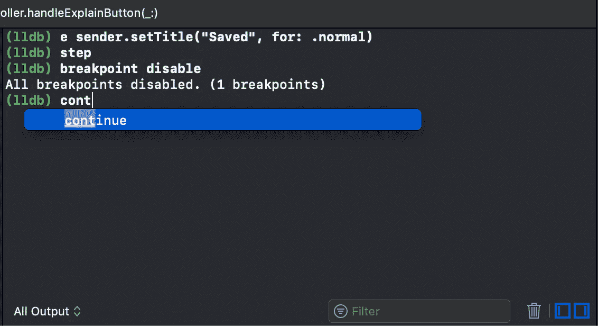

# Xcode Hacks 让您的生活更轻松

> 原文：<https://betterprogramming.pub/xcode-hacks-cf32434cbc2>

## Xcode 的一些鲜为人知的特性和技巧


[杰弗逊·桑托斯](https://unsplash.com/@jefflssantos?utm_source=medium&utm_medium=referral)在 [Unsplash](https://unsplash.com?utm_source=medium&utm_medium=referral) 上拍摄的照片

[Xcode](https://developer.apple.com/xcode/) 是一个用于 macOS 的[集成开发环境](https://en.wikipedia.org/wiki/Integrated_development_environment) (IDE)，包含一套由 Apple 开发的软件开发工具，用于为 macOS、iOS、iPadOS、watchOS 和 tvOS 开发软件。

Xcode 有一些快捷方式可以让您的日常生活变得更简单，比如快速打开(`**⇧ + ⌘ + O**`)或干净构建(`**⇧ + ⌘ + K**` ) 🧹.

但是有一些非常酷的功能在 iOS 开发社区上并不为人所知。我见过很多 iOS 开发人员，他们已经编码很多年了，但是他们并没有尝试充分利用 Xcode。因此，我想写一篇文章，介绍一些不太为人知的有用的技巧，这些技巧是我过去几年一直在使用的，可以改善你的工作流程。

# 黑客#1:创建您的 Swift 模型

您希望基于您的数据库模型创建您的 Swift 模型，而不是逐个编写每一列。你能做到的。只需使用`**⌥ + Hold left mouse**`选择您的字段，使用`**⌘**`和`**arrows**`浏览行，使用`**⌥**`和`**arrows**`浏览单词:

# 黑客#2:创建构造函数

当你想创建一个构造函数时，同样的事情也适用。当然，拥有像 [IntelliJ](https://www.jetbrains.com/idea/) 所拥有的功能是很棒的，它可以帮助你在`**^ + Enter**`组合上生成一个构造函数或 getter/setter，但是既然 Xcode 没有这个功能，这并不意味着你必须通过一个接一个地编写每个属性三次来生成你的 init。相反，你可以使用上面提到的相同的黑客，使用相同的指令👷‍♂️:

# 黑客#3:调试

使用表达式命令 **e** ，我们能够在调试的同时运行 swift 代码并进行代码注入。例如，我们可以改变标签文本颜色或按钮标题，等等。

例如，如果我们想更改按钮标题:

```
(lldb) **e saveButton.setTitle("Saved", for: .normal)**
```

**步骤**也是一个非常有用的命令。它帮助您在调试时单步调试， **stepi** 用于“单步调试”。

借助这些命令，我们可以**禁用/启用**所有断点:

```
(lldb) **breakpoint enable**
(lldb) **breakpoint disable**
```

我们也可以继续执行:

```
(lldb) **continue**
```

如果您继续在调试区域编写命令，并且想要清除控制台上以前的命令，您可以不单击右下角的 trash 按钮。相反，你可以使用`**⌘ + k**`。如果你完成了调试区域，你可以使用`**⇧ + ⌘ + t**`隐藏它。



调试时

# 黑客#4:浏览代码和文件

借助于快速打开功能(`**⇧ + ⌘ + O**`)，转到特定文件的某一行代码非常简单。当搜索窗口出现时，在输入文件名和用冒号分隔的编号(您要去的行)后，您就到达了目的地，例如:

```
BaseTableViewController:250
```

这将把你带到**BaseTableViewController**类的第# **250** 行。

如果您想转到已有文件上的某一行代码，您可以使用`**⌘ + l**`，当输入窗口出现时，添加行号，就可以了。

使用`**^ + 6**`打开属性和方法列表，您可以立即开始输入，通过名称找到特定的方法或属性。

移动一行或多行代码，**上移**或**下移**，无需做**剪切**和**粘贴**，只需选择要移动和使用的代码行:

`**⌥ + ⌘ + [**` —向上移动⬆️线

`**⌥ + ⌘ + ]**` —沿⬇️移动线条

当您想在项目导航器中找到当前工作的文件时，使用`**⇧ + ⌘ + j**`，左侧窗格将会出现您选择的文件。当您的项目中有很多文件并且导航变得困难时，这非常方便。


在 [Unsplash](https://unsplash.com?utm_source=medium&utm_medium=referral) 上由 [Helloquence](https://unsplash.com/@helloquence?utm_source=medium&utm_medium=referral) 拍摄的照片

感谢您花时间阅读本文。Xcode 的功能远不止上面提到的那些——在回复部分写下你最常用的功能！

觉得这篇文章有用？在 Medium 上关注我([贝萨尔](https://medium.com/@besari))获取更多有用的文章。