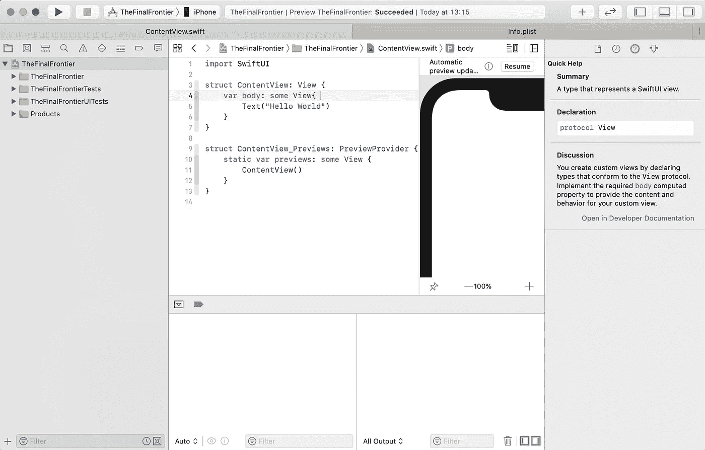
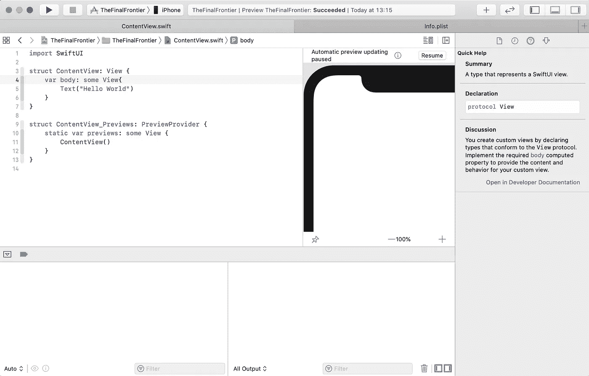
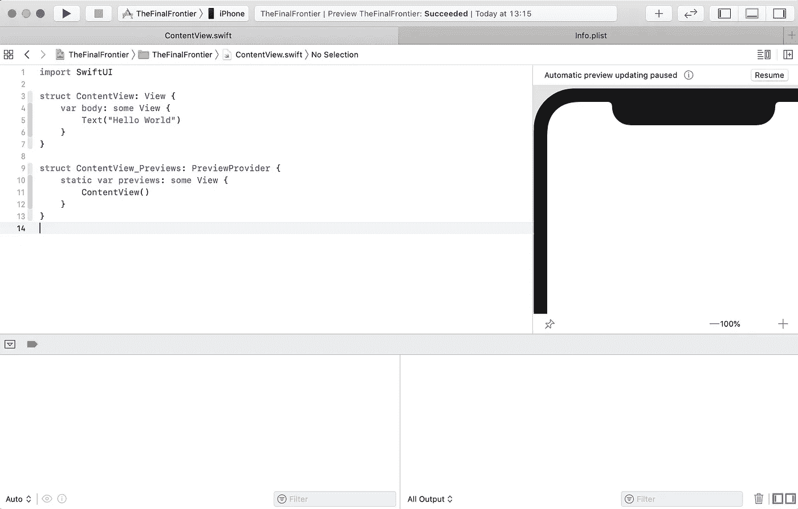
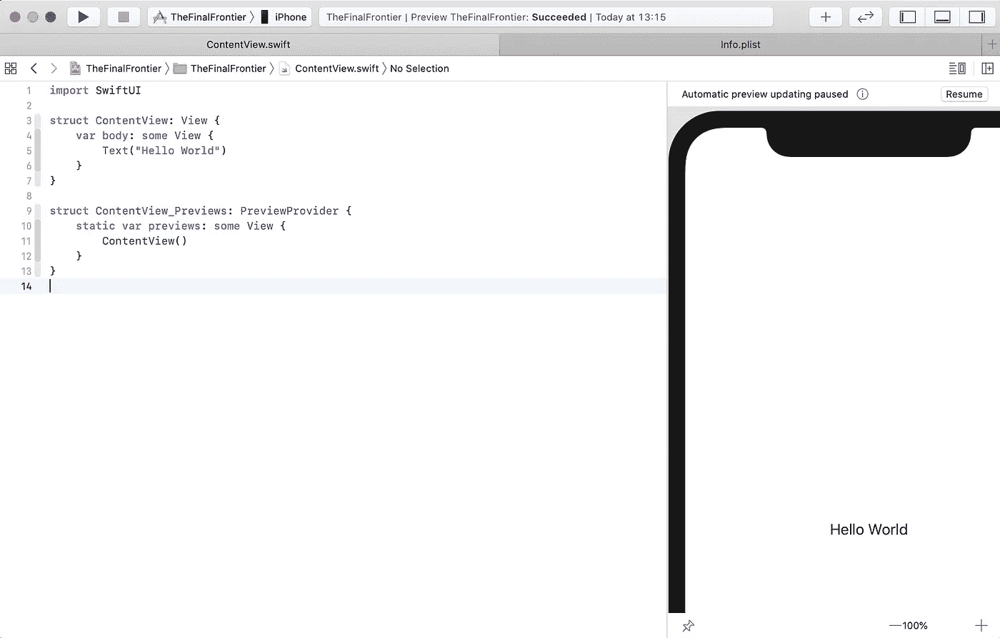
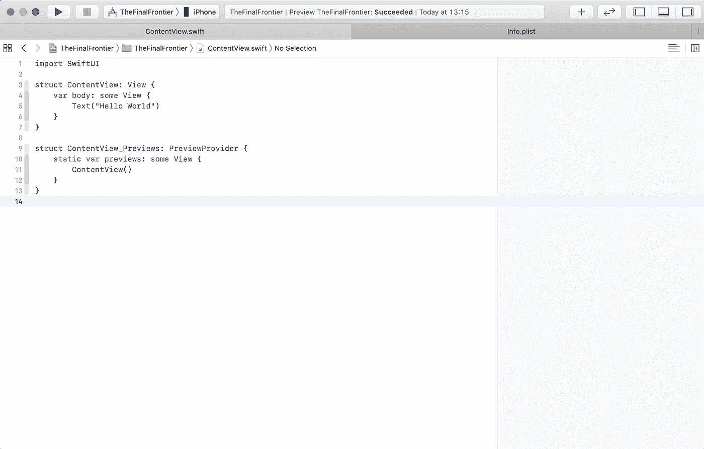
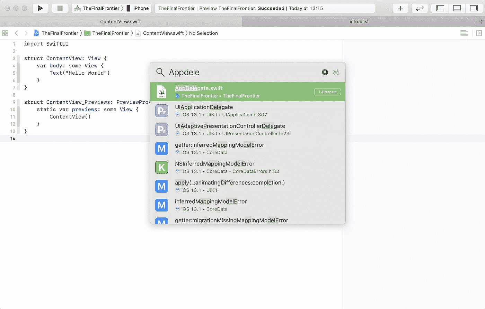
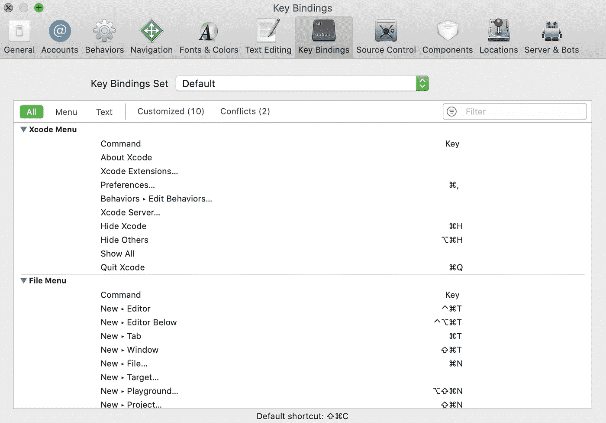

# 小屏幕上的 Xcode

> 原文：<https://betterprogramming.pub/xcode-on-small-screens-2141472e9e50>

## 流线型视觉噪音

[克雷格·加纳](https://unsplash.com/@craiggarner?utm_source=unsplash&utm_medium=referral&utm_content=creditCopyText)在 [Unsplash](https://unsplash.com/s/photos/macbook-air?utm_source=unsplash&utm_medium=referral&utm_content=creditCopyText) 上拍照

如今，开发人员倾向于尽可能多地摆放显示器。

漫步在办公室的一排排桌子上，你可以看到屏幕上塞满了如此之多的窗口，被拉长了，空间里布满了工具和移动的图表；有时你可以看到一个程序员盯着一个屏幕，在另一个屏幕上有辅助应用程序，如 Finder，或通信应用程序，如 Slack。

在全屏模式下，因为你如何填充整个空间？

# 一个屏幕来统治他们所有人

还有其他人。路过的人不禁评论这些叛逆者是如何利用他们的屏幕的。他们在高分辨率显示器上将缩放比例设置为 100%，在小屏幕上享受小世界。

对于那些没有鹰眼的人来说，或者已经买了大眼镜的人来说，仍然有可能在小屏幕上有效地使用 Xcode。套用一个非常著名的巫师的话:

> "我们要决定的是如何利用给我们的空间。"—甘道夫

# 保持控制

实际上，Xcode 在小屏幕上使用非常好。它提供了在编辑器和许多工具上释放您的编码魔法的方法，甚至不需要触摸鼠标或触摸板。

Xcode 出现在屏幕上，正在炫耀:

显示每个工具的 Xcode

它可以做很多事情，也展示了很多。顶部、右侧、底部和左侧都有工具，可以单独隐藏或显示。

# 航海家

在左边，我们看到了*导航器*。对我们来说，这很重要，有助于我们对项目有一个总体的了解，也有助于我们找到穿过零件丛林的路，就像在卫星和全球定位系统出现之前，对船员来说一样。

导航器是必不可少的。虽然它占用了很多空间，但是当开发人员卷起袖子，投入到从他的头脑中涌入打开的文件的思想浪潮中时，就不需要它了。

按下`CMD + 0`(零)并隐藏左侧的导航器。享受我们获得的所有空间:

隐藏导航工具

再次按下`CMD + 0`，工具重新出现。当然，导航器*还有更多功能。*

不需要按一下鼠标，我们通过按下`CMD + X`从左向右跳转子工具，X 是工具的编号，从左向右数。

调试区域应该是`CMD + 7`。如果*导航器*被隐藏，任何一个`CMD + X`都会把它带回来，但是不能让它再次消失。

具有激活调试区的子工具(CMD+7)

# 检查员

我们的使命是拓宽我们的视野——确切地说。右侧有一些空间可供预览使用。要使检查员工具消失，必须按下`CMD + ALT + 0`:

带有隐藏检查器的 Xcode

用户可以在检查器中的各个子工具之间跳转，相应地按下数字。

检查员子工具

# 调试区域

只剩下一样东西了，底侧。为了增加我们的垂直滚动内容区域，我们按下`Shift + CMD + Y`。最后，我们可以把注意力放在我们的声明式 UI 及其右侧的预览上:

折叠调试区域

我们可以用`Ctrl + Cmd + Y`暂停执行，如果我们想快速检查我们的 LLVM 控制台，我们按下`Shift+ CMD + C`并能够在控制台中键入。仅仅这些绑定就有很多好处。

# 还有一点

完成所有的 UI 工作后，我们也可以关闭预览，只需按一下指尖:`ALT + CMD + Enter`将隐藏并再次显示带有预览的*画布*。

仅带有编辑器的 Xcode

啊！多么广阔的空间啊！

我们想跳到那边的`AppDelegate`等一些东西。我们真的必须再次打开导航器吗？

没有*。*是`Shift + CMD + O`快速打开我们想要编辑的文件:

在 Xcode 中快速打开

# 钥匙的主人

已经设置了许多键绑定来帮助我们工作，而不需要移动鼠标。更多信息，我们可以在*按键绑定*部分`CMD + ;`进入设置并添加组合。

# 小屏幕和视觉噪音——思考的空间

当然，小屏幕环境并不适合所有人，因为把一个又一个屏幕放在桌子上可能也不适合。正如前面几节所展示的，使用小屏幕也可以有效地工作。

屏幕的数量是否会变成 insignia 之类的东西？越多，级别越高，还是越高级？

一个全覆盖的屏幕及其所有的视觉噪音是忙碌的标志吗？专业的标志？我们真的需要它们吗，每时每刻都能看到如此多的信息？

精简屏幕上的可视信息，重新聚焦于改变一切的事物——仅仅是屏幕上的字符，被急切闪烁的光标放下，这是一种有趣的体验。