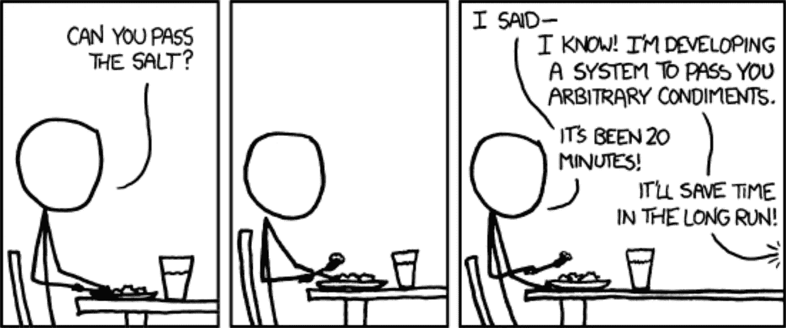
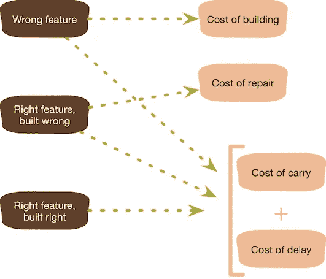

# YAGNI:你不会需要它的

> 原文：<https://betterprogramming.pub/yagni-you-aint-gonna-need-it-f9a178cd8e1>

## 除非完全必要，否则不要添加功能

维塔利·塔拉诺夫在 [Unsplash](https://unsplash.com?utm_source=medium&utm_medium=referral) 上拍摄的照片。

# 介绍

YAGNI，你不会需要它，或者你不会需要它是来自[极限编程](http://www.extremeprogramming.org)(与[精益思想](https://en.wikipedia.org/wiki/Lean_thinking)有某种联系)的一个原则，声明程序员不应该添加功能，直到它是完全必要的:

> “总是在你真正需要的时候实施，而不是在你预见到你需要的时候。”

即使你完全确定以后会需要某个特性或某段代码，也不要现在就实现它。最有可能的情况是，你根本不需要它，或者你实际需要的东西与你先前预见的完全不同。

[https://xkcd.com](https://xkcd.com)

# 相关成本

无论结果如何，你都会产生一系列可以避免或推迟的成本:

马丁·福勒拍摄的照片。

这里有一个快速分类:

*   构建成本——花费在分析、编程和测试一个特性上的所有努力。
*   延迟的代价——失去了现在构建和发布另一个特性的机会。
*   持有成本——特性给代码增加的复杂性，使得软件更难修改和调试。
*   修复成本-花费在修改某个特征上的努力，因为它并不完全是您现在需要的。

# 扶持性实践:避免技术债务

重要的是要知道 YAGNI 是要和其他一些实践结合起来使用的，比如持续重构、持续自动化单元测试和持续集成。

如果没有这些实践，它可能会导致混乱的代码和大量的返工(被称为[技术债务](https://en.wikipedia.org/wiki/Technical_debt))。

# 找到平衡

你可以以最严格的方式应用 YAGNI 原则，不要写一行对当前需求不完全必要的代码。

然而，在我看来，在预先设计或使用模式和完全严格之间总是有一个平衡。不过，它应该总是倾向于最简单的方式。

如果你对软件设计和 YAGNI 如何合作有疑问，马丁·福勒有一篇名为“ [*设计死了吗？*](https://www.martinfowler.com/articles/designDead.html) “这一点你可能会发现很有见地。

# 进一步阅读

马丁·福勒在[的文章](https://martinfowler.com/bliki/Yagni.html)中精彩地解释了 YAGNI 原理(我借用了一些概念和图表)。他写了[另一篇关于软件设计和 YAGNI 的论文](https://www.martinfowler.com/articles/designDead.html)，我上面提到过。

这在以下书籍中也有很好的解释(但被称为增量设计):

*   奥赖利的 [*学习敏捷*](http://shop.oreilly.com/product/0636920025849.do) *，*第七章“极限编程、简单性和增量设计”
*   肯特·贝克的 [*极限编程讲解*](https://www.amazon.com/dp/0321278658/ref=cm_sw_r_cp_ep_dp_TI0SAb1S65NJN) ，第 7 章“初级实践”

最后，你可以在[C2 维基条目](https://wiki.c2.com/?YouArentGonnaNeedIt)中找到参考。