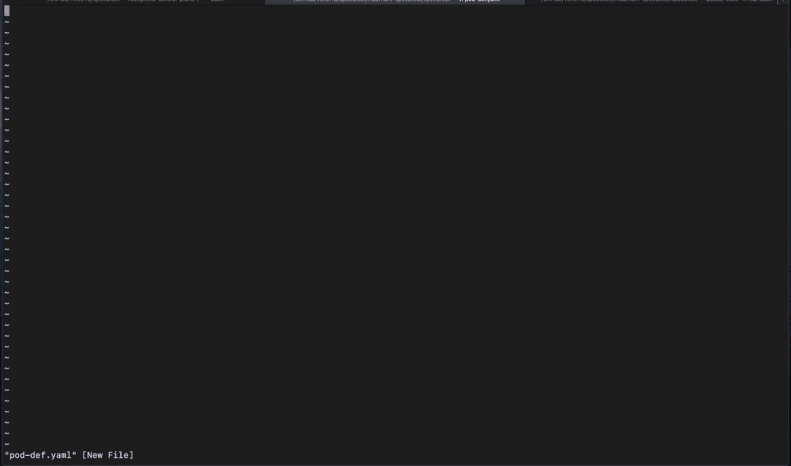

# YAML 文件和豆荚

> 原文：<https://betterprogramming.pub/yaml-files-and-pods-a2625a989d15>

## 让我们开始在 Kubernetes 中创建一个 pod


乔纳森·法伯在 [Unsplash](https://unsplash.com?utm_source=medium&utm_medium=referral) 拍摄的照片。

既然我们已经介绍了 Kubernetes 的体系结构和一般概念，并为您设置了一个友好的集群，现在是时候创建一个 pod 了(使用 YAML 文件)。如前所述，pod 是运行容器映像的容器组。在这些窗格中，需要一个容器映像。这些可以从 Docker Hub 页面获得。

让我们开始在 Kubernetes 中创建一个 pod。

# YAML 档案

在创建 pod 之前，您需要理解 YAML 文件背后的一般思想。通常，使用 JSON 文件，但 YAML 是新的，更有效，更容易使用。

YAML 文件的一个主要概念是键值对。本质上，一个键(如 food)被分配给一个值(如 pasta)。这两个值是一个键值对。他们代表着彼此！以下是一些 YAML 格式的键值对示例:

```
Fruit: Apple
Vegetable: Carrot
Liquid: Water
City: Austin
```

可以看到，格式是`key: value`。需要注意的一件重要事情是键和值之间的空间。如果在`:`后面没有空格，键值对将不会被识别。这是 YAML 档案的主要组成部分之一。

另一个组件是数组/列表。根据名称，您可以看出这个函数的主要目的是列出 YAML 文件的许多不同属性，无论是键值对还是字典/映射。以下是 YAML 格式的数组/列表示例:

```
Cities:
-  Austin
-  Dallas
-  San Francisco
-  New York
```

基于这个例子，您可以看到有一个类别后跟一个``:``。之后，用破折号创建一个列表，并写入列表值。您可能会注意到，列表中所有值的间距都是相同的。这是在 YAML 文件中创建数组/列表时必须记住的事情。

现在，关于 YAML 文件，我要讨论的最后一件事是创建字典。这是数组/列表和键值对的混合。一般来说，YAML 文件中字典的主要用途是存储在某些情况下有用的特定数据(例如，在创建服务、pod、部署等时)。在 Kubernetes)。以下是 YAML 格式的词典示例:

```
Mango:
  calories: 105
  fat: 0.4g
  carbs: 28g
```

如您所见，字典中的条目都在同一级别缩进。这一点很重要！谈到这件事，YAML 是很挑剔的。如果字典有许多不同的元素，记得在同一层缩进它们。否则，您将得到一个错误。

# 创造一个 Kubernetes 豆荚

现在我们已经在 Kubernetes 的上下文中学习了 YAML 文件的基础知识，我们将创建一个 pod。记得吗？这是一组运行相同映像和配置的容器。

现在我们将从…开始，你猜对了！一份 YAML 档案。这些 YAML 文件被称为定义文件，因为它们定义了您正在部署的服务。因为我们正在部署一个 pod，所以我们将使用一个 pod 定义文件。

在写文件之前，我们需要创建文件:

```
vi pod-def.yaml
```

运行此命令后，您应该会看到类似如下的窗口:



放心吧！这一页只是告诉你，你已经准备好编辑文件，并把 YAML 代码。

这是我们将使用的 YAML 文件:

这是 pod 定义文件。这个文件中有很多方面和组件。不要不知所措。我会解释每一个元素！

*   让我们从`apiVersion`(键值对)开始。这用于说明在创建 pod 时，您将在后台运行什么 API 服务器和版本。
*   接下来是`kind`，它表示这是哪种定义文件。在我们的例子中，它是一个豆荚。当我们了解 Kubernetes 中的其他产品时，您将可以尝试其他种类的产品。
*   然后是`metadata`，这是一个包含项目名称的字典。元数据存储的值可以在 Kubernetes 文档页面上更深入地查看。在我们的例子中，当创建一个 Kubernetes pod 时，我们将它命名为`Pod`。
*   `spec`实际上是一个数组/列表。pod 中有特定的规格。对于一个普通的 pod 定义文件，唯一需要的规范是`containers`，它是一个列表。我们将需要指定 pod 中容器的配置，因此这一部分至关重要。在`containers`列表中，我们将包含容器的名称，图像名称将在后面提供。在本例中，容器的名称是`nginx`，我们将使用`nginx:latest`作为 pod 中运行的容器的图像名称。
*   最后，有一个`command`部分表示您将使用的特定命令。没有必要填写，但在某些情况下，命令项可能会派上用场。

我们已经完成了 pod 定义文件。现在点击 Control + C，然后点击`:wq!` 保存并退出文件。

使用此命令创建基于 YAML 文件的窗格:

```
kubectl create -f pod-def.yaml
```

完成后，使用以下命令查看 pod:

```
kubectl get pods
```

# 结论

耶！你创造了你的第一个豆荚！您已经向进入 Kubernetes 及其功能领域迈出了一步。我希望到目前为止你喜欢它。我们将在以后的文章中讨论更多的信息。

如果您想了解更多并做一些实验，请访问下面的 Kubernetes 文档页面。

感谢阅读。

# 资源

[](https://kubernetes.io/) [## Kubernetes 文档页面

### Kubernetes (K8s)是一个开源系统，用于自动化部署、扩展和管理容器化的…

kubernetes.io](https://kubernetes.io/)