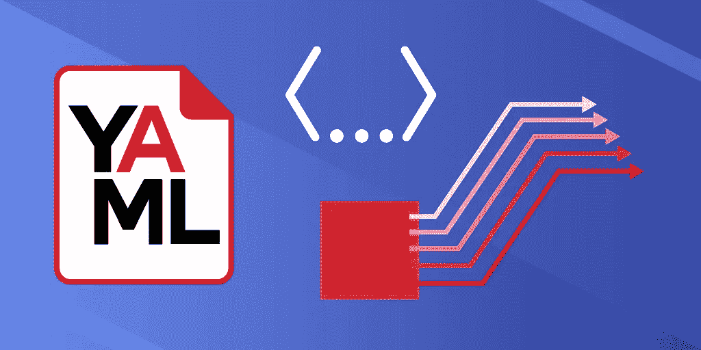

# YAML 教程:5 分钟内开始使用 YAML

> 原文：<https://betterprogramming.pub/yaml-tutorial-get-started-with-yaml-in-5-minutes-549d462972d8>

## 语法、显著特性和高级特性



图片来源:作者

YAML 是一种数据序列化语言，它允许你以紧凑和可读的格式存储复杂的数据。这对于开发运维及虚拟化非常重要，因为这对于高效的数据管理系统和自动化至关重要。

虽然经常被开发人员忽视，但它是一个强大而简单的工具，只需几个小时的学习就可以极大地改善你的就业前景。

今天，我们将通过实践教程帮助您快速学习 YAML，并探索如何在您的下一个数据驱动解决方案中使用它。

**下面是我们今天要讲的内容:**

*   什么是 YAML？
*   YAML 的显著特征
*   YAML 语法
*   接下来要学习的高级概念

# 什么是 YAML？

YAML 是一种数据序列化语言，用于以人类可读的形式存储信息。它最初代表“另一种标记语言”,但后来被改为“YAML 不是标记语言”,以区别于真正的标记语言。

它类似于 [XML](https://www.w3schools.com/xml/xml_whatis.asp) 和 [JSON](https://www.json.org/json-en.html) 文件，但是使用了更简单的语法，即使保持了相似的功能。YAML 通常用于在基础设施即代码(IoC)程序中创建配置文件，或者管理 DevOps 开发管道中的容器。

最近，YAML 被用于创建自动化协议，可以执行 YAML 文件中列出的一系列命令。这意味着您的系统可以更加独立和快速响应，而无需额外的开发人员关注。

随着越来越多的公司采用 DevOps 和虚拟化，YAML 正迅速成为现代开发人员职位的必备技能。通过使用 [PyYAML 库](https://pypi.org/project/PyYAML/)、 [Docker](https://docs.docker.com/get-started/overview/) 或 [Ansible](https://www.ansible.com/) 的 Python 等流行技术的支持，YAML 也很容易与现有技术相结合。

# YAML vs. JSON vs. XML

## YAML(。yml)

*   人类可读代码
*   极简语法
*   专为数据而设计
*   类似于 JSON 的内联风格(是 JSON 的超集)
*   允许评论
*   不带引号的字符串
*   被认为是“更干净”的 JSON
*   高级特性(可扩展数据类型、关系锚和保持键顺序的映射类型)

**用例** : YAML 最适合使用 DevOps 管道或虚拟机的数据密集型应用。当您团队中的其他开发人员经常使用这些数据，因此需要这些数据具有更好的可读性时，这也很有帮助。

## JSON

*   更难阅读
*   明确、严格的语法要求
*   与 YAML 类似的内联风格(一些 YAML 解析器可以读取 JSON 文件)
*   没有评论
*   字符串需要双引号

**用例** : JSON 在 web 开发中备受青睐，因为它最适合序列化格式和通过 HTTP 连接传输数据。

## 可扩展标记语言

*   更难阅读
*   更详细
*   充当标记语言，而 YAML 用于数据格式化
*   包含比 YAML 更多的功能，如标签属性
*   更加严格定义的文档模式

**用例:** XML 最适合需要对验证、模式和名称空间进行精细控制的复杂项目。XML 不是人类可读的，需要更多的带宽和存储容量，但是提供了无与伦比的控制。

# YAML 的显著特征

以下是 YAML 的一些最佳特色。

## 多文档支持

您可以在一个 YAML 文件中包含多个 YAML 文档，以便于文件组织或数据解析。

每个文档之间的分隔由三个破折号(`---`)标记

```
---
player: playerOne
action: attack (miss)
---
player: playerTwo
action: attack (hit)
--------
```

## 内置注释

YAML 允许您使用类似于 Python 注释的散列符号(`#`)向文件添加注释。

```
key: #Here is a single-line comment 
   - value line 5
   #Here is a 
   #multi-line comment
 - value line 13
```

## 可读语法

YAML 文件使用类似于 Python 的缩进系统来显示程序的结构。你需要使用空格而不是制表符来创建缩进，以避免混淆。

它还删除了 JSON 和 XML 文件中的许多“干扰”格式，比如引号、括号和大括号。

总之，这些格式规范增加了 YAML 文件的可读性，超过了 XML 和 JSON。

**YAML**

**JSON**

请注意，传达的是相同的信息；然而，在整个 YAML 文件中去掉双引号、逗号和括号，使得一目了然更加容易阅读。

## 隐式和显式类型化

YAML 通过自动检测数据类型提供了多种类型，同时还支持显式类型选项。要将数据标记为某种类型，只需在值前包含`!![typeName]`。

## 没有可执行的命令

作为一种数据表示格式，YAML 不包含可执行文件。因此，与外界交换 YAML 文件是非常安全的。

YAML 必须与其他语言集成，如 Perl 或 Java，才能添加可执行文件。

# YAML 语法

YAML 有几个基本概念，它们构成了大部分数据。

## 键值对

一般来说，YAML 文件中的大多数内容都是一种键值对的形式，其中键表示键值对的名称，值表示与该名称关联的数据。键值对是所有其他 YAML 构造的基础。

```
<key>: <value>
```

## 标量和映射

标量代表单个存储值。标量使用映射分配给键名。您用名称、冒号和空格定义一个映射，然后为它保存一个值。

YAML 支持整数和浮点数值等常见类型，以及布尔和字符串等非数字类型。

每一种都可以用不同的方式表示，比如十六进制、八进制或指数。还有一些特殊类型的数学概念，如无穷大、-无穷大和非数字(`NAN`)。

## 线

字符串是代表一个句子或短语的字符的集合。您可以使用`|`将每个字符串打印为一个新行，或者使用`>`将其打印为一个段落。

YAML 的字符串不需要用双引号括起来。

## 顺序

序列是类似于列表或数组的数据结构，在同一个键下保存多个值。它们是使用块或内联流样式定义的。

块样式使用空格来组织文档。它更容易阅读，但不如流动风格紧凑。

```
-------- 
# Shopping List Sequence in Block Style
shopping: 
- milk
- eggs
- juice
```

流样式允许您使用方括号内联编写序列，类似于 Python 或 JavaScript 等编程语言中的数组声明。
Flow 风格更紧凑，但更难一目了然。

```
-------- 
# Shopping List Sequence in Flow Style
shopping: [milk, eggs, juice]
```

## 字典

字典是嵌套在同一子组下的键值对的集合。它们有助于将数据分成逻辑类别以备后用。

字典的定义类似于映射，输入字典名、冒号和空格，后跟一个或多个缩进的键值对。

字典也可以包含更复杂的结构，比如序列。嵌套序列是表示复杂关系数据的好技巧。

# 接下来要学习的高级概念

祝贺你迈出了学习 YAML 的第一步。虽然经常被忽略，YAML 是一个简单而有效的工具，您可以从 DevOps 工具包中选择。

**接下来要关注的一些高级主题有:**

*   锚
*   模板
*   带有外部工具(Docker、Ansible 等)的 YAML。)
*   高级序列/映射类型
*   高级数据类型(时间戳、空值等。)

*快乐学习！*