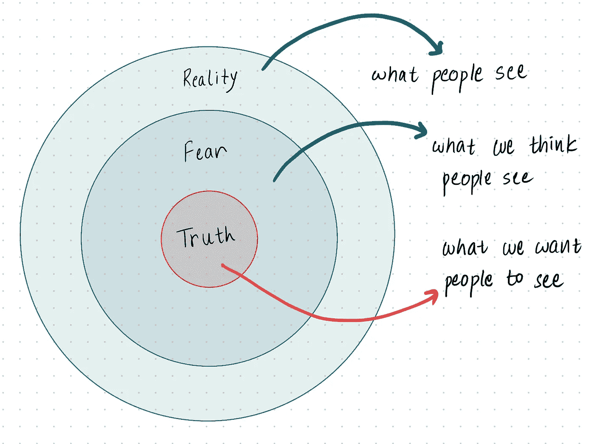
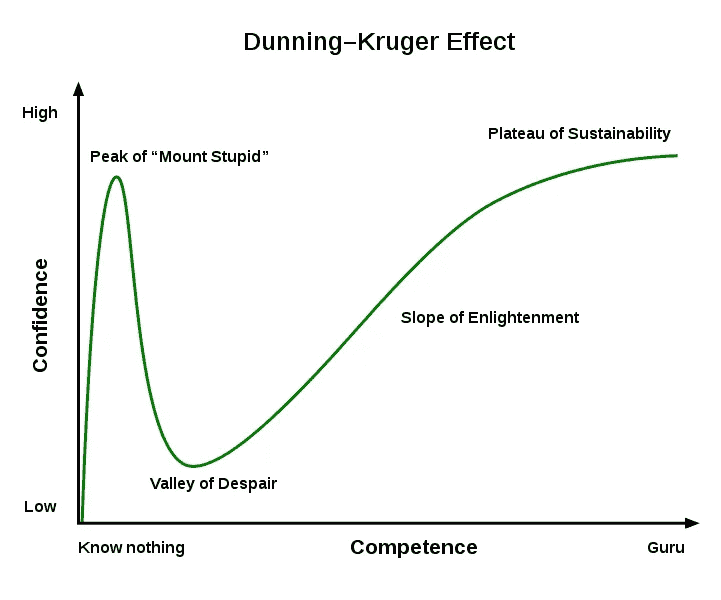
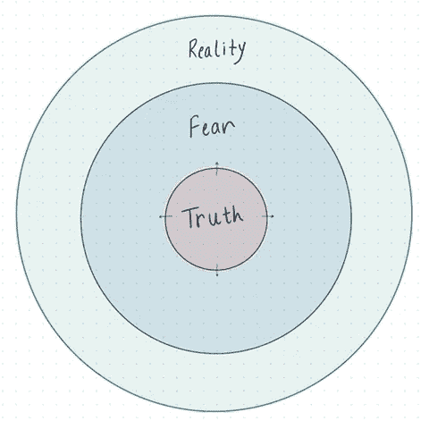

# 是的，冒名顶替综合症实际上对软件开发人员有好处

> 原文：<https://betterprogramming.pub/yes-impostor-syndrome-is-actually-good-for-software-developers-f390852a3ea6>

## 逃避是无济于事的。拥抱它

[克里斯杨](https://unsplash.com/@chrisyangchrisfilm?utm_source=medium&utm_medium=referral)在 [Unsplash](https://unsplash.com?utm_source=medium&utm_medium=referral) 上拍照。

认为你不能胜任你正在做的工作在我们许多人当中是很普遍的。这是一种时常萦绕在每个人心头的感觉，要摆脱它实在太难了。让你觉得自己做的不够，学的不够，或者说自己懂得不够。以下是冒名顶替综合症的一些表现:

*   你在会议上不发言，总是被动的参与者。
*   你假设房间里的其他人知道的比你多。
*   你总是质疑你的投入是否有价值。
*   在大型会议上，你从不坐在前排。
*   你指望别人来证实你的观点。

我永远不会忘记那些让我害怕得说不出话来的会议，当我说话的时候，它毫无意义。这从来不是因为我不知道该说什么。在我的脑海中，我可以说一百个单词来回答一个问题，但在现实中，它只是纯粹的沉默和怪异的句子。

在某种程度上，我觉得我不属于那里，我是个骗子。

# 冒名顶替综合征的动力学

我很确定几乎所有人都知道冒名顶替综合症是不好的。人们声称有几种方法可以克服它。但是我觉得这些可能无法帮助你克服它，因为这个问题因人而异。对此没有一个通用的解决方案。

这个问题源于这样一个事实，即冒名顶替综合症与恐惧紧密相关，而与外部世界无关。内部的湍流给了它力量。外面的人很少注意到，但在你的脑海里，它一直都在。

冒名顶替综合症让你觉得:

*   你是个骗子。
*   你成功是因为运气，不是别的。
*   你讨厌接受新的挑战，因为你认为你可能会失败。
*   你总是害怕有一天一切都会消失。

冒名顶替综合症试图暴露你的恐惧。它让你没有安全感，让你觉得自己不值得。这让你对自己的进步和成功感到内疚。当你正在庆祝你的成功时，它悄悄的进来，让你觉得你不值得拥有它们。

 [## 初级和高级开发人员之间的 6 个关键区别

### 知道他们之间的区别以及如何达到下一个层次

better 编程. pub](/6-key-differences-between-a-junior-and-a-senior-developer-cf2b3d868dd9) 

# 让我们看看到底发生了什么

在下图中:

*   最外面的圆圈是现实。这是其他人看到的。
*   中间的圆圈是我们的恐惧。
*   最里面的圆圈是真理。

作者照片。

我们倾向于关注最外围和中间的圆圈。而且两者冲突不断。有时候我们觉得自己已经足够优秀，配得上我们所拥有的。其他时候，这种感觉消失了，我们感到绝望和无能。这被称为[邓宁-克鲁格效应](https://en.wikipedia.org/wiki/Dunning%E2%80%93Kruger_effect)。

来源:[维基百科](https://en.m.wikipedia.org/wiki/File:Dunning%E2%80%93Kruger_Effect_01.svg)

我们在几乎 90%的时间里错过的是更深一步地潜入最里面的圈子。真理之圈。因为真相一直都在，我们也知道。我们选择方便地忽略它，因为我们太忙于在现实和恐惧之间跳跃。

你所拥有的不是运气的产物。你真的为此努力过，你应该得到你所拥有的——也许不是一切，但对每个人来说都是如此。你需要填补知识或技能上的一些空白。有时候，这实质上意味着后退一步，不是为了升职或加薪，而是为了失去的技能。

 [## 如何适应软件开发人员的新工作

### 新工作，新团队，新代码库。下面是如何发光！

better 编程. pub](/how-to-navigate-a-new-job-as-a-software-developer-fd4ac2e4154b) 

# 冒名顶替综合症有什么帮助？

本质上，冒名顶替综合症帮助你找出你的恐惧。

没有冒名顶替综合症，你的自我会把你生吞活剥。你不会找到一个强有力的理由来反思你的工作。我们都知道失败在一个人的成功之旅中非常重要。当你失败的时候你会怎么做？你努力改变现实。你把它变成了成功。当你知道你的恐惧时，通过努力让它们成为事实变得更容易，最终把它们变成你的新现实。核心圈子越来越大。真相圈取代了我们的恐惧，尽可能地接近现实。

这就是大家一直告诉你要做真实的自己的原因。让人们看到真实的你。

> “不要再浪费时间争论什么是好男人。做一个。”— [马库斯·奥勒留](https://www.brainyquote.com/quotes/marcus_aurelius_383650)

# 最后的想法

冒名顶替综合症的一个不幸的方面是，你永远无法真正摆脱它。即使我专业开发软件快六年了，我还是有。我知道其他有经验的开发人员也经常与它斗争。开始以正确的方式处理它，并理解它对你的实际意义，将有助于你抑制它。

对我来说，理解和接受冒名顶替综合症并改变我的心态产生了最大的影响。每当我开始觉得自己工作效率不够高或者前进速度不够快时，我就会反思一下，很快就会发现问题所在。一旦我发现问题，我就会迎头解决。不惜一切代价！

感谢阅读。