# 另一个 Kubernetes (k8s)指南

> 原文：<https://betterprogramming.pub/yet-another-kubernetes-k8s-guide-52377a72ce65>

## 从头开始学习 Kubernetes

鲍比·伯奇在 [Unsplash](https://unsplash.com/) 上的照片

Kubernetes (k8s)近年来人气飙升。如果你希望部署许多容器化的应用程序， *k8s* 无疑是目前最好的方法，无论是在私有还是公共云环境中。

所有主要和不太重要的云提供商都提供托管 k8s 集群服务。

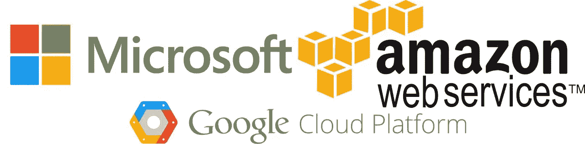

基于 web 的存储库托管平台/DevOps 生命周期工具/“您可能需要做的一切”工具 **GitLab** 提供集成，可直接部署到您定义的 Kubernetes 集群中。其他所有 VCS 上市公司都纷纷效仿。

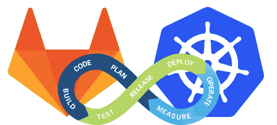

重点是… **它非常受欢迎**，几乎地球上所有主要的科技公司都在大力投资它。这种情况不会消失，你或许应该对此有所了解。

# Kubernetes 有什么意义？

你为什么要关心 Kubernetes？它解决什么问题？

在最简单的层面上，k8s 解决了另一个解决方案产生的问题:*容器化*。

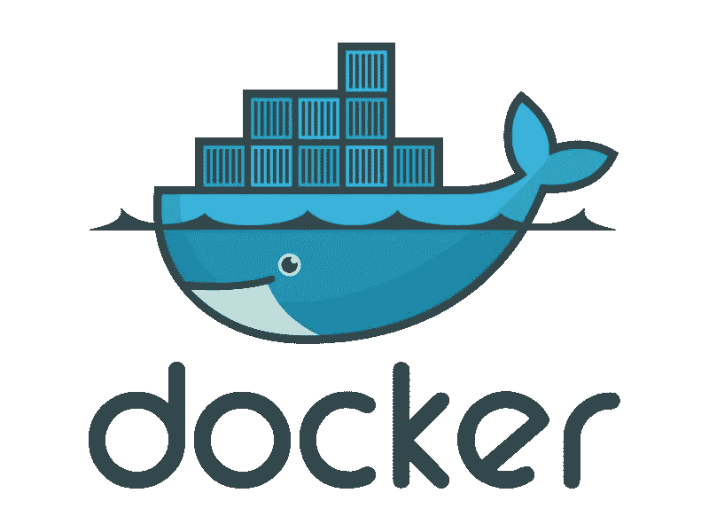

**容器化**，如果你不熟悉的话，是将一个应用程序打包成一个可运行/可执行的软件映像的过程。

应用程序的容器化过程需要理解它的输入、依赖、配置文件和输出，然后将所有这些东西烘焙成一个不可变的映像。

开发这个映像的过程可能会非常困难，这取决于它是什么，但是一旦它被构建，它就可以在任何系统上被实例化为一个容器(假设该系统有一个容器运行时，比如 **Docker** )。

容器化主要解决应用程序在开发环境和生产环境之间的可移植性问题。

有了这种在任何系统上轻松生成各种应用程序的能力*就有了轻松生成多个实例的能力。这解决了*可伸缩性、*的问题，但反过来又产生了新的问题，即*多个实例*的笨拙以及管理它们的需要。这是 Kubernetes 解决的核心问题:**编排**。*

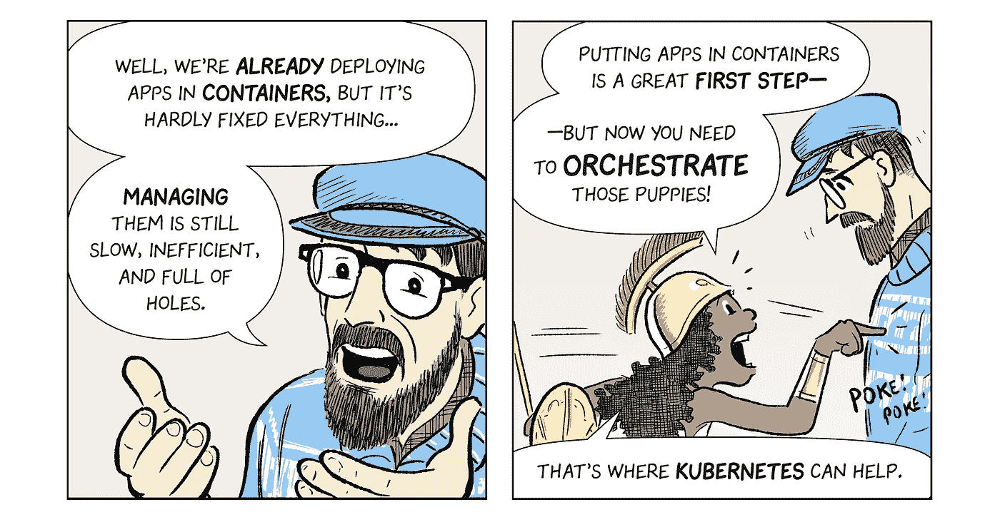

来源:[谷歌云](https://cloud.google.com/kubernetes-engine/kubernetes-comic/)

# 我能用它做什么？

你能用 Kubernetes 做什么？很明显，很多事情:

*   容器化应用程序的部署和运行

但是同时:

*   服务发现和负载平衡
*   发布管理和自动化推出/回滚
*   “自愈”
*   机密和配置管理

# 它是怎么做到的？

## 节点

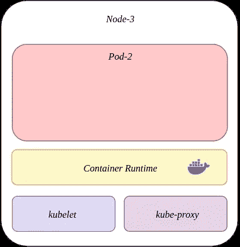

*节点*是集群中的虚拟机或物理机，能够运行容器。

节点运行所需的容器运行时(例如 Docker — *，尽管 containerd 是默认的*)，以及服务 *kubelet* 和 *kube-proxy* 。

*   **kubelet** —在每个 worker 节点上运行的代理，它管理在 pods 中运行的容器。它将容器的当前状态与 pod 的规格相匹配。
*   kube-proxy —一个高度灵活的代理，它转发许多不同类型的请求，并负责处理节点和 Kubernetes 之间的所有交互。

除了这些基础服务，pod 运行在*节点*上，一个*节点*可以同时运行多个 pod。

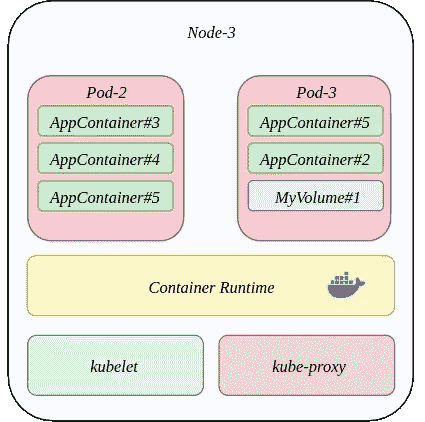

## 分离舱

Kubernetes *pod* 是可在 k8s 集群上部署的最小和最简单的对象。

pod 在 Kubernetes *节点上运行。*一个 Pod 可以由单个或多个容器以及卷组成。

## 卷

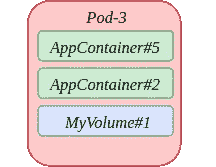

与 Docker 中的卷的概念相似，Kubernetes 卷是一种抽象概念的方式，尽管容器具有短暂的*(短命)*性质，但它可以持久化与 Pod 相关的数据，并确保数据可以在容器重启后持久化。

卷本质上只是一个简单的目录，可以跨 Pod 中运行的容器进行访问。

Kubernetes 卷通常与 Pod 绑定在一起，因此虽然它们会在单个容器重新启动时持续存在，但默认情况下，如果 Pod 不再存在，它们也将不再存在(除非您将它们配置为持续存在)。

## 制导机

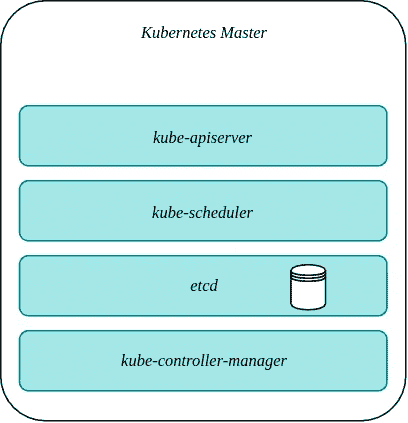

控制平面或 Kubernetes 主节点是运行在主节点上的一系列服务。

这些服务控制 k8s 软件如何与集群交互。服务主要包括:

*   **kube-API server***—*一个组件，负责公开 k8s 集群，并作为集群中所有主组件和工作组件之间进行集群通信的主要接口。
*   **kube-scheduler**
*   ***etcd**—k8s 和 pods 使用的分布式键值存储，用于存储资源定义、pods 的自定义应用程序配置以及集群中存在的任何对象的状态。*
*   *kube-controller-manager —负责管理 pod 生命周期的组件。 *kube-controller-manager* 从 *etcd* 到 *kube-apiserver* 检索期望的和当前的集群状态，并根据需要实例化或移除所需的资源。*

*控制平面组件可以驻留在单个主节点中，也可以分布在多个主节点的各种拓扑中。*

## *串*

*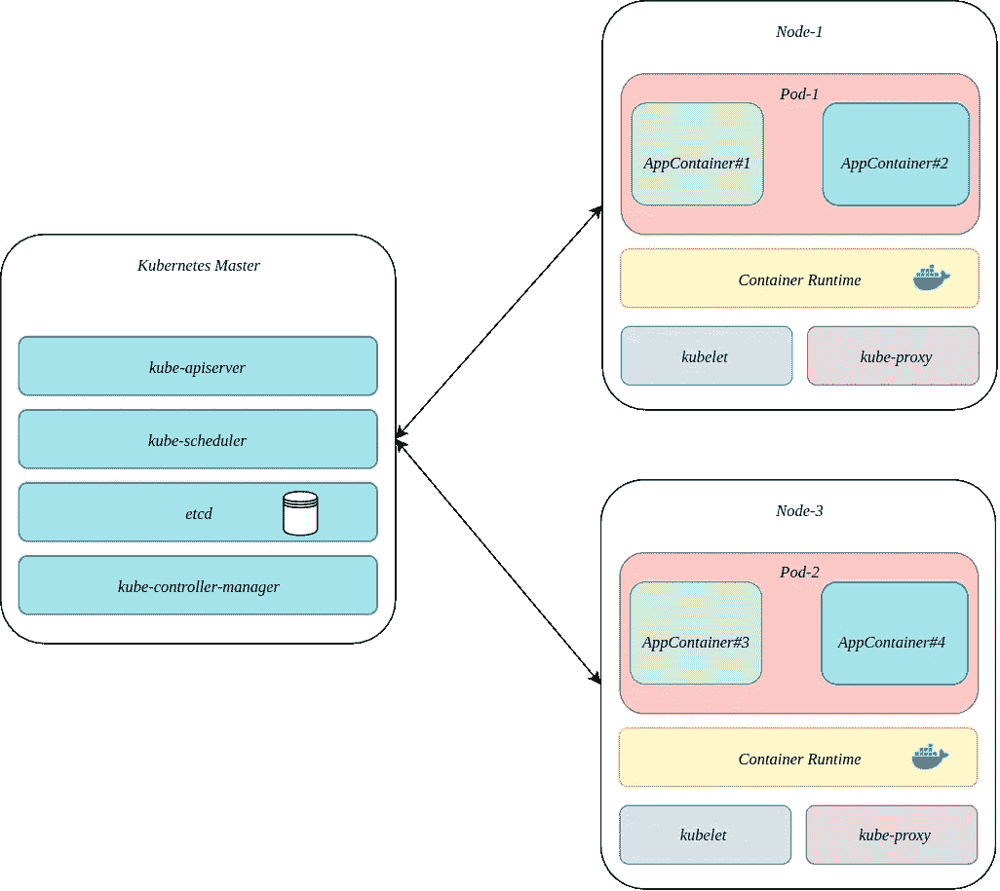*

**集群*是运行由 Kubernetes 管理的服务/pods/组件的一组节点，或者是 Kubernetes 软件本身。*

*集群必须至少有一个 ***主节点*** 。为了让集群完成一些有意义的工作，还必须部署一些服务。这些服务通常必须部署在工作节点上，尽管在主节点上部署服务是可能的，也是有意义的。*

## *服务*

*Kubernetes 豆荚的寿命不是无限的。最终，如果在 Pod 中运行的容器的新版本被发布或者由于其他原因，它们可以被移除。*

**服务*是一种抽象，是一种跨 pod 的有效负载平衡器——解决 pod 之间服务的相互依赖和可用性问题*(可能随机不存在)。**

*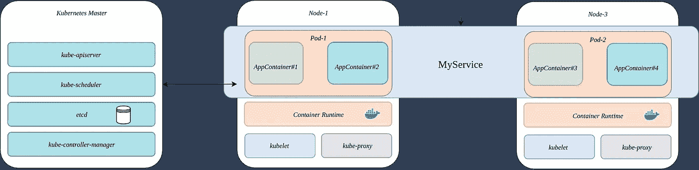*

*如果一个应用程序的一部分在一个 Pod 中运行，而另一部分驻留在另一个 Pod 中，则可以使用服务作为一种方式来维护从一个服务到另一个服务的持续可用的接口，而不管每个服务中的 Pod 是如何单独组成的。*

## *进入*

**Ingress* 是 k8s 向外界公开集群内运行的服务的机制。*

*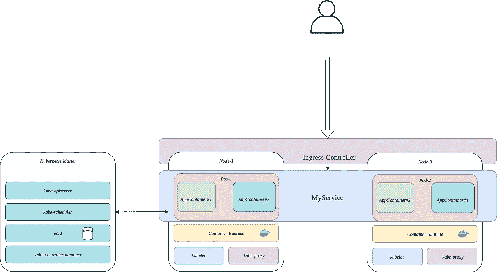*

*入口由入口控制器管理，并通过 HTTP 和 HTTPS 提供服务路由。*

## *部署*

*一个*部署*将所有的 k8s 概念包装在一起，并且是一个您提供给 k8s 的指令，用于创建或循环服务运行 Pods，Pods 运行您的应用程序容器。*

*k8s 中的部署不仅仅是安装软件的简单脚本。*

*Kubernetes 管理部署的部署，以维护服务的可用性，并在出现故障时处理回滚。*

# *…还有别的吗？*

## *库贝特尔*

*kubectl 是控制 k8s 集群和公开集群信息的主要 CLI。*

*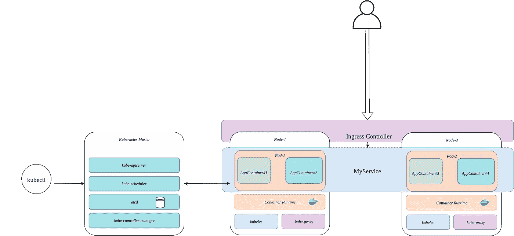*

*语法相当简单，但是有相当多的命令需要学习:*

* [## kubectl 概述

### 编辑此页面 Kubectl 是一个命令行界面，用于对 Kubernetes 集群运行命令。kubectl 寻找…

kubernetes.io](https://kubernetes.io/docs/reference/kubectl/overview/)  [## Kubernetes 备忘单— Linux 学院

### 如果你像我一样，你可能会有这样的时刻，你在终端前，双手在键盘上徘徊，然后…

linuxacademy.com](https://linuxacademy.com/blog/containers/kubernetes-cheat-sheet/) 

## 乔布斯

和*无限*长时间运行的服务一样，k8s 也有作业和 cron 作业的概念，可以按照定义的时间表运行。

正如您可能想象的那样，这些种类的工作负载通过 *kube-scheduler* 进行调度，并为具有明确生命周期的服务提供了一个很好的选择，例如运行直到一个进程完成，然后终止。

## etcd

etcd 不仅仅是集群创建的所有内容的分类账，它还可以用作应用程序配置和机密存储。

这意味着您可以放入一些有用的东西，比如数据库 URIs 和密码，然后[根据需要在您的资源定义中引用它们](https://medium.com/opsguru/securing-kubernetes-secrets-how-to-efficiently-secure-access-to-etcd-and-protect-your-secrets-b147791da768)！

# 谢谢！

感谢阅读！希望这篇文章已经让您对 Kubernetes 及其所能提供的东西有了很好的感受。

这篇文章*真的真的真的不是详尽无遗的*、并且有一些非常高级的 Kubernetes 概念超出了这里所讨论的范围。

如果你想玩 Kubernetes，我推荐你看看下面这个在 Linux 主机上引导 k8s 的零配置工具:

 [## alexellis/k3sup

### k3sup 是一个轻量级实用程序，可以在任何本地或远程虚拟机上使用 k3s 从零配置到 KUBECONFIG。你只需要嘘…

github.com](https://github.com/alexellis/k3sup) 

如果你对更高级的 Kubernetes 模式感兴趣，我推荐这本书:

 [## 库伯内特图案

### 开发人员设计、构建和运行软件的方式已经随着微服务和…

www.oreilly.com](https://www.oreilly.com/library/view/kubernetes-patterns/9781492050278/) 

最后，我还建议你看看下面的漫画:

 [## 更快地部署代码:借助 CI/CD 和 Kubernetes | Kubernetes 引擎|谷歌云

### 使用持续集成和部署(CI/CD)更快地部署代码，防止停机，并节省资金。

cloud.google.com](https://cloud.google.com/kubernetes-engine/kubernetes-comic/)*