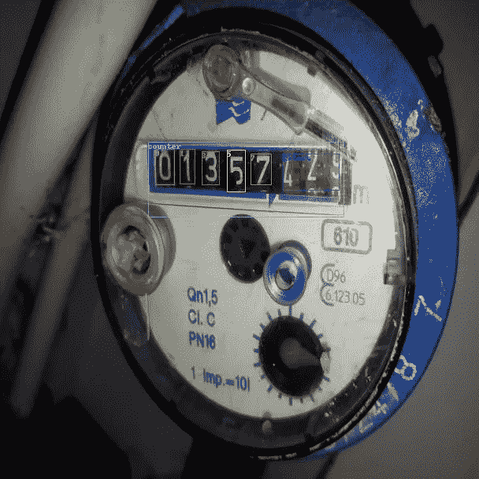
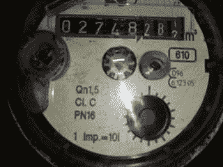
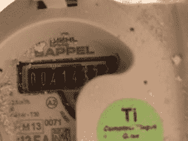
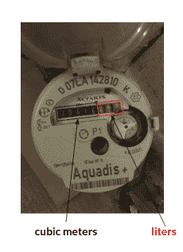
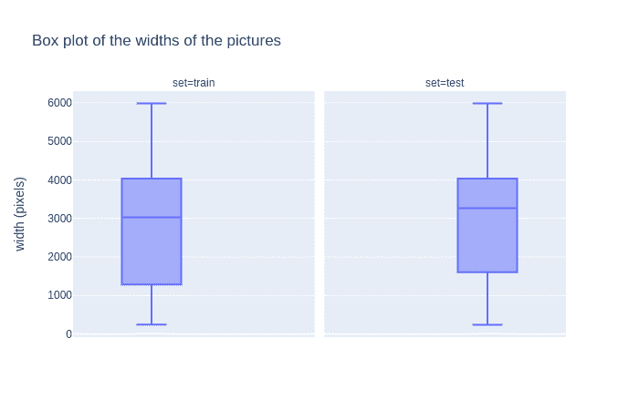
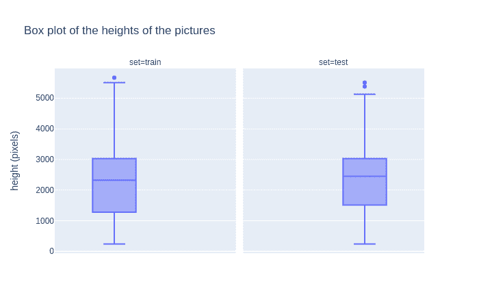
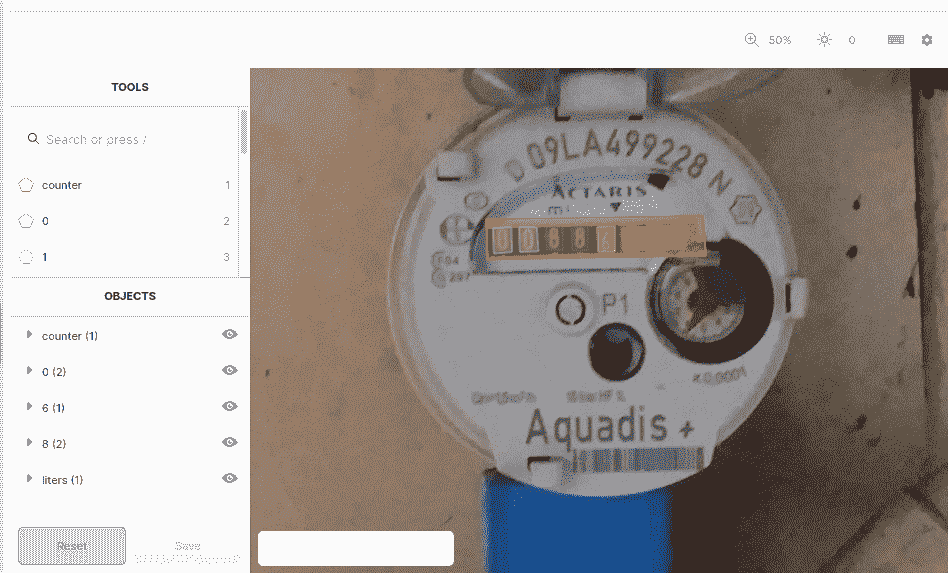
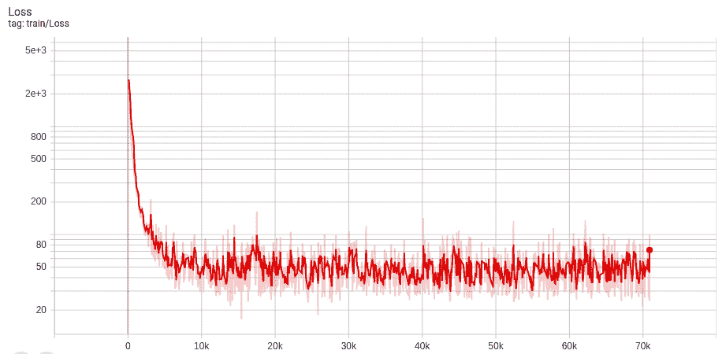
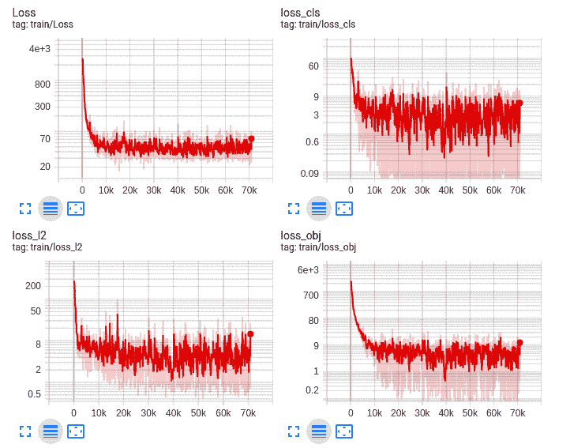
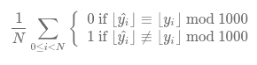

# 使用 YOLOv4 自动抄表

> 原文：<https://betterprogramming.pub/yolov4-for-water-meter-reading-5d27191bc053>

## 一个经过训练的深度学习模型，可以从图片中自动读取仪表



图片来自[高等师范学校](https://challengedata.ens.fr/login/?next=/participants/challenges/30/)

# **简介**

许多需要大量劳动力的任务都实现了自动化。在世界上的许多地区，诸如电、气和水之类的公用事业的消耗是由需要人工读取的仪表来监控的。这种仪表的读数需要公用事业提供商的雇员或代表在场。随着人工智能领域的进步，抄表任务可以部分自动化。

在本文中，我们将展示一个项目，这个项目是关于一个经过训练的模型，它可以自动从图片中读取电表。培训用的笔记本在谷歌 [Colab](https://colab.research.google.com/drive/1doXXwpcZXNdBh0-u4ZpaBpWv9GOVDNpu) 上。结果显示在这个 [web app](http://dnalexen.pythonanywhere.com/) 上，代码可以在这个 [GitHub 资源库](https://github.com/dnalexen/ai_water_meter_reading)中获得。

上面是一个仪表的图像，其指数读数为 1357 米。

## **目录**

```
1\. [Presentation of the data set](#e39c)
2\. [Goal of the project](#aff1)
3\. [Standard approach for automatic meter reading (AMR)](#6825)
4\. [Implementation of a YOLOv4 model](#6db9)
5\. [Conclusion](#9fb0)
6\. [Resources](#9e94)
```

# **数据集的展示**

根据 [Etalab 开放许可证](https://www.etalab.gouv.fr/licence-ouverte-open-licence)的条款[数据集](https://challengedata.ens.fr/participants/challenges/30/)、[开放](https://challengedata.ens.fr/terms_of_use)来自[苏伊士](https://www.suez.com/en)，这是一家总部位于法国的专门从事水和废物管理的公司。

它具有:

*   由 793 张水表图片组成的训练集，由人工标注
*   416 张水表图片的测试集



图片来自[高等师范学校](https://challengedata.ens.fr/login/?next=/participants/challenges/30/)

# 项目的目标

该项目的目标是读取以立方米为单位的确切用水量。如下图所示，立方米写在黑底白字上。一般来说，在我们的数据集中，水表显示两种类型的信息:

*   消耗量的立方米数，黑色背景上的白色数字或相反的数字。这是我们需要从图片中提取的信息。
*   消耗量的升数，数字为红底白字或相反。在读取指数时，仪表的这一部分将被忽略，因为在向消费者计费时，只有立方米是有用的。



图片来自[高等师范学校](https://challengedata.ens.fr/login/?next=/participants/challenges/30/)

# **自动抄表(AMR)的标准方法**

用计算机读取仪表读数有三个主要步骤:

*   仪表的定位
*   仪表中数字的检测
*   数字的分类

我们的数据集面临许多挑战:

*   这些照片是从不同的角度拍摄的
*   所有的图片都有不同的尺寸



训练集和测试集中图像宽度的箱线图。图片由作者提供。



训练集和测试集中图像高度的箱线图。图片由作者提供。

# **yolov 4 型号的实施**

因为 YOLO 是用于对象检测的最好的卷积神经网络(CNN)算法之一。我们决定用 YOLOv4 的 PyTorch 版本来实现我们的模型。

## 给列车组的图片贴标签

我们定义了 12 类我们想要在图片上检测的对象:从 0 到 9 的 10 个数字，与升相对应的仪表部分，以及整个计数器。

我们通过画出找到的每个物体的边界框来标记每张图片。

下面的截图显示了一张标签在 [Labelbox](https://labelbox.com/) 上的图片，这是一个可以标注数据的平台。



图片来自[高等师范学校](https://challengedata.ens.fr/login/?next=/participants/challenges/30/)

从左到右，我们注释了两个类的对象`0`，两个类的对象`8`，一个类的对象`6`，一个类的对象`liters`，和一个类的对象`counter`，它包含了前面所有的六个对象。所以在这幅图中，我们总共有七个物体。

## 图片的预处理

由于图片的形状不同，我们决定将它们的大小调整为 608x608。我们对 [Roboflow](https://roboflow.com/) 进行了放大，随机将图片顺时针旋转 90°，逆时针旋转 90°，然后上下颠倒。

Roboflow 是一个平台，开发者可以用你的数据来管理他们的计算机视觉项目。它允许你将你的图像与在[标签盒](https://labelbox.com/)上完成的注释整合在一起，并在你的图像上应用一些变换。

## 训练模型

我们用由 [Roboflow](https://roboflow.com/) 准备的笔记本在[谷歌实验室](https://colab.research.google.com/)上进行了培训。

以下是 TensorBoard 绘制的过去 100 个纪元的损失图。



TensorBoard 的损失图。图片由作者提供。



TensorBoard 的损失图。图片由作者提供。

该指标是一个经过修改的[零一损耗](https://link.springer.com/10.1007%2F978-0-387-30164-8_884)，因为读数应该是准确的:



图片来自[高等师范学校](https://challengedata.ens.fr/login/?next=/participants/challenges/30/)

⌊⋅⌋是浮点数的整数部分。

将 500 个时期的训练分成四个阶段，每个阶段 100 个时期，我们在测试集上达到了 0.63 的分数。

# **结论**

在本文中，我们展示了使用基于 YOLOv4 的模型读取水表的方法。我们面临的主要问题是一些数字之间的混淆。一些改进的空间可能是更多的增强，如模糊，亮度和噪声。

# **资源**

[1] R. Laroca，V. Barroso，M. A. Diniz，G. Gonç alves，W. R. Schwartz，D. Menotti，[用于自动抄表的卷积神经网络](https://www.researchgate.net/publication/330884234_Convolutional_Neural_Networks_for_Automatic_Meter_Reading) (2019)，电子成像杂志

【2】**j . Solawetz，J. Nelson，[如何在自定义数据集上训练 yolov 4](https://blog.roboflow.com/training-yolov4-on-a-custom-dataset/)(2020)，[https://blog.roboflow.com/](https://blog.roboflow.com/)**