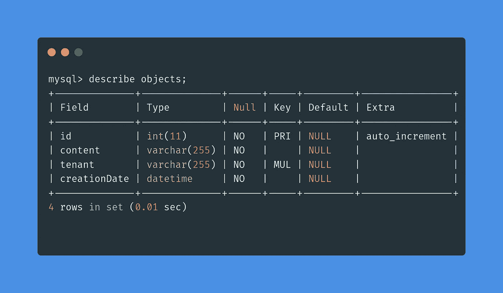
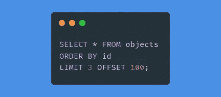
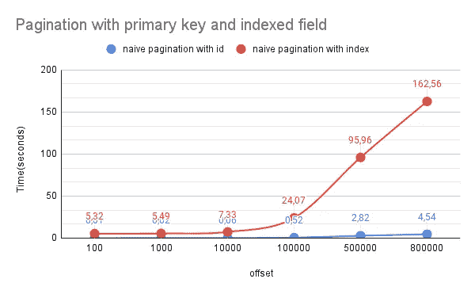
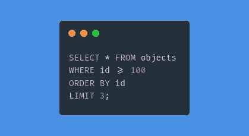
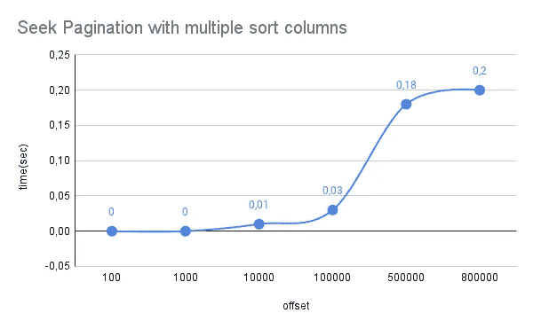
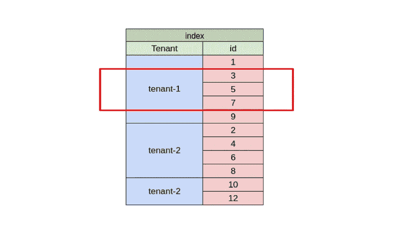
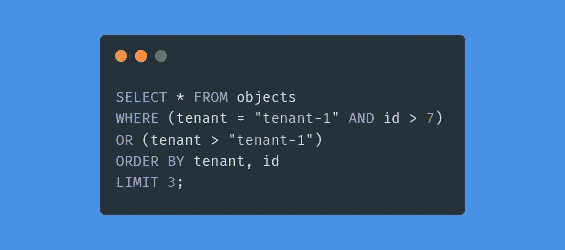

# 你做错了 SQL 分页

> 原文：<https://betterprogramming.pub/you-are-doing-sql-pagination-wrong-739a700acbd0>

## 几乎所有使用 SQL 的应用程序都陷入了这个常见的性能陷阱。现在就避开！

谷歌底部分页部件

每个应用程序在其早期阶段都会面临这些问题:您必须限制发送给客户端的请求数据量，以防止服务质量下降。我们发现这种模式无处不在:

微妙的部分变成了“我们如何实现这个解决方案？”。

我们将在这里看一个简单的用例，用 1000000 行的表对象进行分页。我们正在考虑两种不同的分页情况:一种是按照惟一的主键 id，另一种是按照租户名称(带有索引的 varchar 字段)。

对象表描述—使用 mariadb 10.5.8

# 天真的实现

最简单的分页方法是使用`LIMIT`和`OFFSET` *，在互联网上随处可见。*

偏移分页查询示例

让我们针对两个索引列(`id`和`tenant`)，针对不同的`OFFSET`值，尝试这个查询:

不同偏移值的分页响应时间

当我们检查分页查询的数据库优化器查询计划时:我们注意到数据库使用文件排序操作对非索引列进行排序，并对租户和 id 列使用索引。基于此，我们可以得出结论:

1.  对非索引排序列使用 offset 对数据库来说是一项繁重的任务，必须不惜一切代价避免。

> *MySQL 必须进行额外的传递，以找出如何按排序顺序检索行。排序是通过根据连接类型遍历所有行，并为匹配* `*WHERE*` *子句的所有行存储排序关键字和指向该行的指针来完成的。*

2.使用`OFFSET`，即使是在主键上，对于高数据库容量来说，随着时间的推移会变得越来越慢，因为为了跳过而需要加载的行数变得越来越多。

3.在带有大`key_length`的索引字段上使用偏移量比在小`key_length`字段上慢。

正如我们所看到的，`OFFSET`分页有一些缺点:

*   对于较大的数据库容量，结束页比开始页更难检索，因为要加载和跳过的行数很大。
*   对于不断增长的数据库，随着时间的推移，到达起始行的效率会越来越低。(4，54s 或 160s 的查询对于拥有数千用户的网站变得不可用)
*   当用户从一页滚动到另一页时，如果插入一行，根据列的排序，用户可能会错过一个新项目，并看到一个重复的对象(上一页的最后一个项目)。

由于在项目开始时实现`OFFSET`分页很方便(您不必预测查询计划、UI 排序用例以及索引创建)，所以经常会看到应用程序性能缓慢下降，随着时间的推移变得不可用。然而，由于指定`OFFSET`的方式，数据库必须迭代所有的`OFFSET`行，这使得这个解决方案非常低效。

# Seek 方法分页

如前所述，即使我们尝试使用索引，`OFFSET`也会使效率低下，因为必须加载所有相关的行，我们将不得不构建一个使用索引的查询来检索我们的目标页面。

搜索分页查询示例

让我们来看看这个查询在迭代最后一次看到的`id`T6 时需要多长时间。

搜索分页查询响应时间

结果表明，我们在用例中获得了许多数量级的优势，使得响应查询时间对数据库大小的依赖性降低。然而，当移动到 **Seek pagination** 方法时，一些变化是值得注意的:

*   我们不能再依赖页码 UI 行为，因为我们现在依赖一个令牌来返回给应用程序以获取下一页(上一页的最后一个 id)。
*   我们必须考虑哪一列将用于分页，因为我们需要相应的索引。
*   如果我们希望按非唯一列排序，我们必须创建多列索引(使用主键作为其中一列)并调整我们的查询，以便按照我们的索引导航:

用于搜索分页的多列索引

寻找多列索引分页查询

这种解决方案使分页非常有效，但增加了开发的复杂性:我们需要考虑分页和数据库模式中允许的排序列。

通常在软件工程中，性能是一个权衡。

在这里，我们已经看到了如何在性能非常关键的情况下，在 SQL 数据库中使用`OFFSET`分页。

seek 方法提供了一种与 SQL 供应商无关的最快的数据分页方式，但代价是增加了一点复杂性并损失了一些功能。