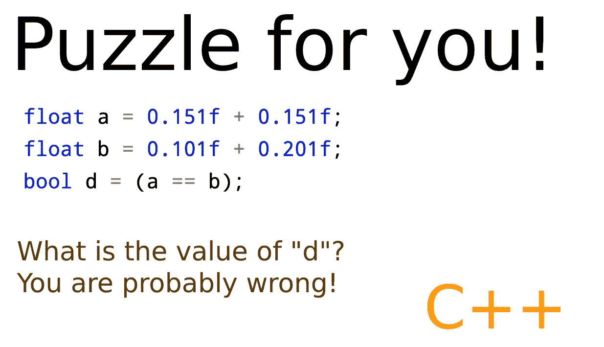
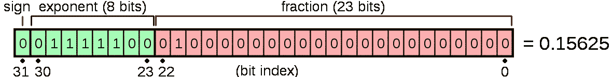
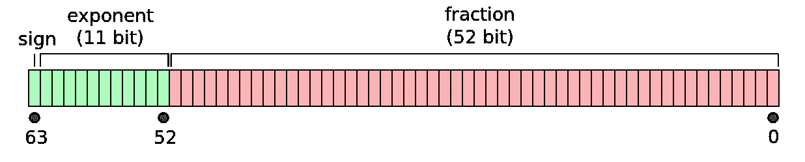
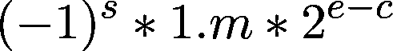

# C++中为什么(0.302 == 0.302)为假？

> 原文：<https://betterprogramming.pub/you-are-top-1-programmer-if-you-know-answer-to-this-d9e29db278b4>

## 一个让每个人解释浮点比较问题的问题——一个需要小心的问题。



图片由 Minhaz(作者)使用 [Photopea](https://www.photopea.com/) 生成。

上面的问题 5%是数学，5%是 C++，90%与主流编程语言中浮点计算的细微差别有关。

在进入理论之前，让我们先从经验上尝试一下。我写了一个迷你程序来测试 1000 万次(只是为了确定)。

上面的代码测试这个问题大约 1000 万次。

你可以试试运行这个程序[这里](https://onecompiler.com/cpp/3yhzce78p)。我得到的输出是

```
Counter = 0
```

你不用再去检查数学了，就像我说的，这只是一道数学题的 5%。这甚至不是我在上面的例子中使用的特定编程语言的问题(在这个例子中是 C++)。

如果你尝试运行一个类似的 Python 程序[这里](https://onecompiler.com/python2/3yhzcu3xd)，你会得到类似的结果。

# 这是怎么回事？

## 内存中浮点值的表示

这与浮点值在内存中的表示方式有关。

与直接以二进制值存储的整数值不同，浮点值表示为由符号、指数和尾数(分数)组成的等式。

32 位浮点数布局的一个例子是



32 位浮点数的表示形式。来源[维基百科](https://en.m.wikipedia.org/wiki/Floating-point_arithmetic)。

类似地，64 位浮点数可以存储为



32 位浮点数的表示形式。来源[维基百科](https://en.m.wikipedia.org/wiki/Double-precision_floating-point_format)。

IEEE 754 是表示非整数的最常用标准。几乎所有的现代处理器都包含称为 FPU(浮点单元)的专门硬件来处理它们。

浮点数通常表示为



浮点方程的例子，由作者使用[quicklatex.com](https://quicklatex.com/)生成。

在哪里，

*   s —是有符号位
*   m —由尾数位(小数部分)表示
*   e —(无符号整数)由指数位表示
*   c —是“e”最大值的一半(32 位为 127，64 位为 1023)

在指数位为零的特殊情况下，数字表示为


指数为零时的浮点方程示例，由作者使用[quicklatex.com](https://quicklatex.com/)生成。

这使我们能够更准确地存储接近于零的值(称为非正常值或次正常值)。某些表示允许我们表示-∞、+∞和 NaN(非数字)值。

## 你现在明白问题了吗？

由于这种表示形式，浮点值不能存储任意实数，甚至不能存储任意有理数。它只能存储可以用上述等式表示的值。

例如，如果我们声明一个变量，如

```
float a = 1.0f
```

“a”变成了`0.10000001490116119384765625`，最接近`0.1`的 32 位浮点值。

这就是上面的计数器返回零的原因。

如果仍然不清楚，请检查这段代码:

显示完全相同的值的差的结果的 C++代码。

这段代码的输出应该是零，对吗？

不是的，这段代码输出:

```
a = 100.302; b = 100.302
Diff = 7.62939e-06
```

试试在这里自己跑[。](https://onecompiler.com/cpp/3yj2bsmkb)

# 如何解决这个问题？

有几种方法可以做到这一点。一个相当天真但最常见的方法是看这些数字是否几乎相等，而不是正好等于最后一位。

这可以通过确保两个数字之间的差异小于某个小阈值(通常用字符ε-ε表示)来实现。

`FLT_EPSILON`是标准库中预定义的常数`float.h`。我们可以修改上面的代码来得到预期的答案。

这样，输出变成:

```
Counter = 10000000
```

值得注意的是，这种方法也有局限性。

因为浮点方程是指数型的，所以相邻值上的数字之间的距离是指数增长的。因此，大数之间的距离，甚至是`100.0f`的范围，都会与`1.0f`不同。

这使得比较浮点值变得特别困难，因为我们需要用一种方法来处理接近零、稍大和非常大的数字。

如果我们用稍大的数字改变代码值

使用 FLTε的 isNearlyEqual()对 100.0f 范围内的值都不起作用

结果又变成了:

```
Counter = 0
```

另一个解决这个问题的方法是使用相对ε值。试试在线代码[这里](https://onecompiler.com/cpp/3yj2ar3q2)。

isNearlyEqual 的修改版本(..)这应该适用于更大的值。

虽然这比简单的方法更有效，但要意识到`max_relative_diff`的正确值应该是多少仍然很棘手。

# 更好的方法？

有更好的处理方式。如果上面的方法对您的用例不起作用(也考虑到极限情况)，请尝试阅读下面的文章:

*   [比较浮点数很棘手](https://bitbashing.io/comparing-floats.html)
*   [我应该如何进行浮点比较？](https://stackoverflow.com/a/32334103/2614250)

# 参考

上述理论的很大一部分来源于[马特·克莱恩](https://bitbashing.io/about.html)在文章[中的一篇令人惊叹的文章——比较浮点数很棘手](https://bitbashing.io/comparing-floats.html)。

## 其他参考文献

*   [浮点比较](https://floating-point-gui.de/errors/comparison/)