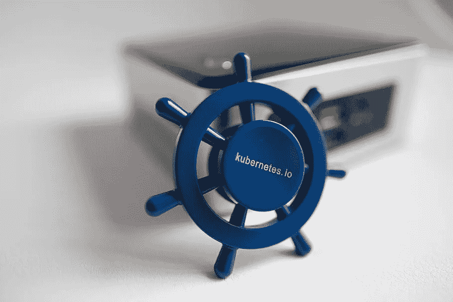
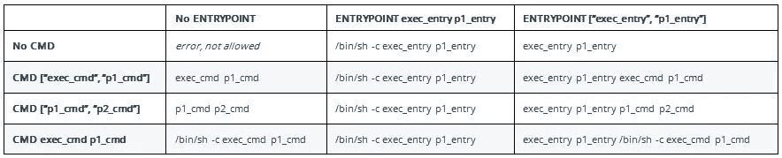
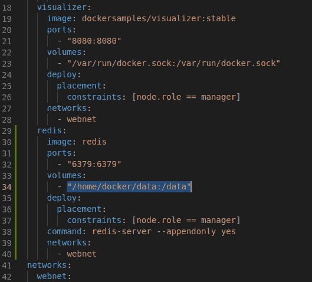
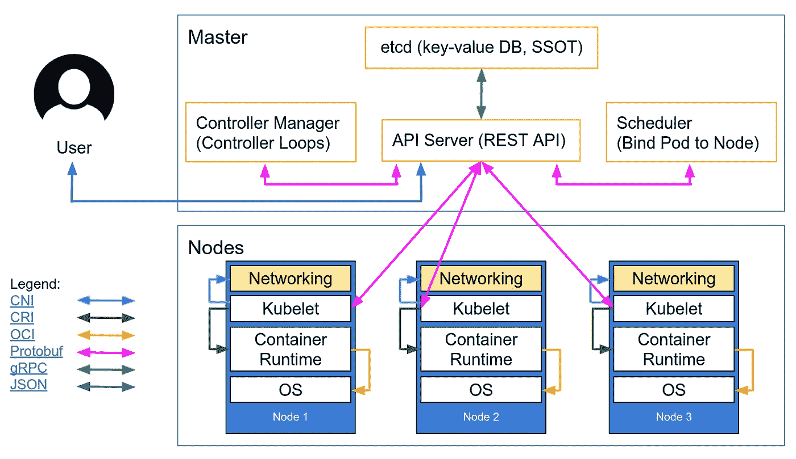

# 你造了一个容器，现在怎么办？

> 原文：<https://betterprogramming.pub/you-built-a-container-now-what-4bda43aa1cd>

## 了解 Docker、Docker Compose 和 Kubernetes 之间的区别



图片来自[壁纸光斑](https://www.wallpaperflare.com/electronics-kubernetes-ukraine-l-viv-headset-headphones-wallpaper-evoaq)

厌倦了在不同的机器上反复配置相同的软件？处理你需要安装的 16 个不同的包，一遍又一遍地遵循一个 wiki 文档开始变得很麻烦。你有没有在 Medium 上找到关于如何运行你的第一个 Docker 容器的教程？太棒了，现在你做什么？

开始使用 Docker 和容器时，人们最常问的一个问题是*下一步是什么？*

*   如何在 Docker 容器中运行我的 Angular 应用程序？
*   我应该为我的应用程序的每个版本创建一个新的容器吗？
*   如何将数据库连接到我的应用程序？
*   什么是`docker-compose`文件？
*   既然 Kubernetes 使用容器，我应该学习它吗？

如果你有和上面类似的问题，请继续读下去，让我为你一一解答。

# 运行容器与构建容器

如果您是一名应用程序程序员，您可能正在尝试构建一个容器，并使用 Dockerfile 文件让它运行。如果您是系统管理员，您可能会尝试运行 Docker 容器并管理它的生命周期。理解您在运行时和构建时能做什么之间的区别是很重要的。

## **运行时间**

简单地运行一个容器与在桌面上启动一个应用程序没有什么不同。有一个预配置的脚本，在构建时用`ENTRYPOINT`配置，它会做启动所需的任何事情。容器将一直运行，直到脚本以`0`状态退出。理解这一点非常重要，尤其是在构建容器的时候。

## **构建时间**

当使用 Dockerfile 时，考虑需要将什么放入新容器的最简单的方法是这样的:使用一些基本级别的容器，并在 Dockerfile 中添加或覆盖内容，最终生成一个独立的容器，这是一个新的映像。

因此，如果你试图获取一个`centos:7`容器，并在其中安装一个应用程序，让它在你执行`run`命令时自动启动并运行，你需要记住这些关键的事情:

*   对于您需要做的任何命令行事情，使用`RUN`语法
*   使用`COPY`语法从本地计算机获取文件，并将其放入容器映像中
*   学习`BASH`脚本并更新默认的`ENTRYPOINT`,这样 Bash 脚本就可以执行新的软件，而不会退出脚本

启动容器后不会立即停止容器的 Bash 脚本示例:

```
#!/bin/bash
echo “Hello-docker” > /usr/hello.txt
java -jar myprogram.jar
/bin/bash
```

最后一行将启动`/bin/bash`命令行，它总是在 Linux 容器启动时运行。这允许您的`.jar`程序退出或崩溃，并且您仍然可以登录到容器来检查日志或进行故障排除。

在生产中，如果 Java 程序崩溃，您可能希望脚本退出，因此相应地更新您的脚本。

# **“运行”与“命令”和“入口点”**



[来源](https://i.stack.imgur.com/gVtK9.jpg)

*   `RUN`在一个新的层中执行命令并创建一个新的映像——例如，它通常用于安装软件包
*   `CMD`设置默认命令和/或参数，当 Docker 容器运行时，可以从命令行覆盖这些命令和/或参数
*   `ENTRYPOINT`配置作为可执行文件运行的容器

# 用于不同应用的不同容器

使用容器的下一个逻辑步骤是需要保持关注点的分离。你不想把一堆不同的服务和程序都塞进一个容器里。拜托，永远不要这么做！

基本应用程序的一个非常常见的模式是需要一个 web 应用程序和一个数据库。这些应该在两个不同的容器中运行。

## 输入 Docker 撰写

让多个容器一起启动的最简单的方法是使用 Docker Compose。请将该文件视为您的运行时配置。是的，您正在更改一个文件来运行容器，但是您并没有在这里构建容器。

让我们快速回顾一下——我有一个应用程序，它有一个 web 组件和一个数据库组件。

1.  我需要一个`Dockerfile`来构建应用程序的 web 部分(安装中间件，复制应用程序代码，运行 webserver)。
2.  我还需要一个`Dockerfile`来构建应用程序的数据库部分(安装数据库软件，运行 SQL 来构建模式，启动数据库)。
3.  我需要一个一起启动两个容器的`docker-compose`文件。
4.  我运行`docker-compose up`来支持我的全栈应用程序。



Docker 撰写文件示例

# 那么 Kubernetes 呢？



[来源](https://kubernetes.io/images/blog/2018-06-05-11-ways-not-to-get-hacked/kubernetes-control-plane.png)

Kubernetes(或 K8s)是生产就绪、高度可用的应用程序和演示环境之间的区别。我从来没有运行过一个`docker-compose`命令和应用程序来作为我的生产环境和部署应用程序的手段。

Kubernetes 提供了一个控制平面，本质上是作为您的自动化部署工程师。该控制平面的组件包括:

*   `kube-apiserver`:API 服务器是 Kubernetes [控制平面](https://kubernetes.io/docs/reference/glossary/?all=true#term-control-plane)的一个组件，它公开了 Kubernetes API。API 服务器是 Kubernetes 控制平面的前端。
*   `etcd`:一致且高度可用的键值存储，用作 Kubernetes 所有集群数据的后备存储
*   `kube-scheduler`:监视没有分配[节点](https://kubernetes.io/docs/concepts/architecture/nodes/)的新创建的[pod](https://kubernetes.io/docs/concepts/workloads/pods/pod-overview/)——并选择一个节点供它们运行
*   `kube-controller-manager`:运行[控制器](https://kubernetes.io/docs/concepts/architecture/controller/)进程

考虑 Kubernetes 与 Docker Compose 的最简单方式是 Docker Compose 定义了我要运行的应用程序堆栈——仅此而已。Kubernetes 定义了我的应用程序堆栈，并让控制平面监控我的容器，将它们部署到多个服务器，并在它们崩溃时保持运行。

Kubernetes 基本上是用类固醇合成的。

# **总结**

*   您应该始终学习和理解如何一次构建和运行一个容器
*   对于本地开发环境或概念验证，Docker Compose 非常适合用来建立一堆容器
*   要部署具有高可用性的生产就绪型应用程序，您需要一个可部署的 Kubernetes 基础架构——这将您的`docker-compose`配置发挥到极致

享受容器带来的乐趣！