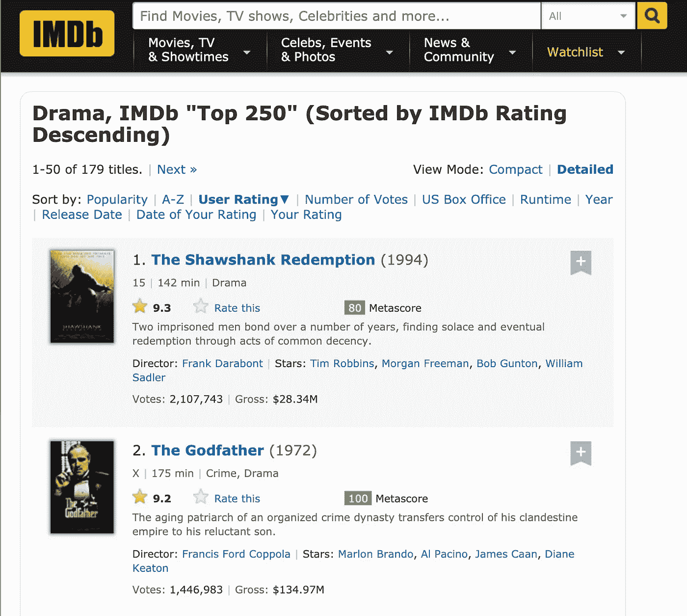
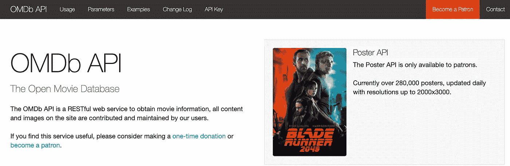
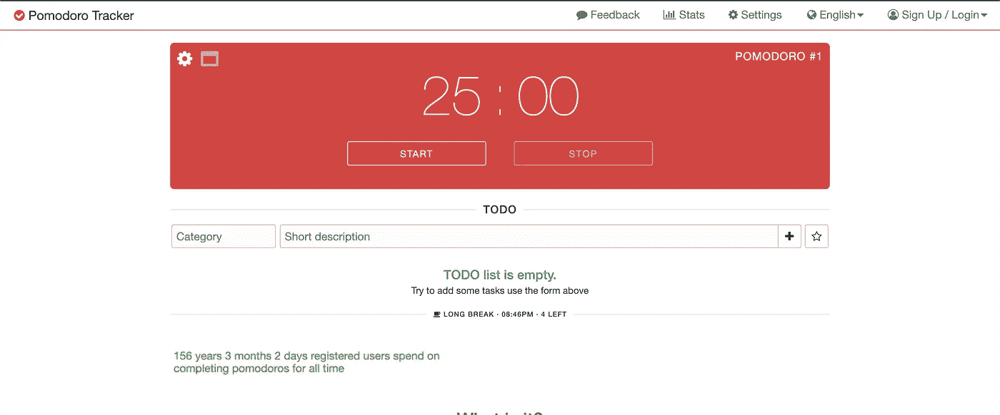
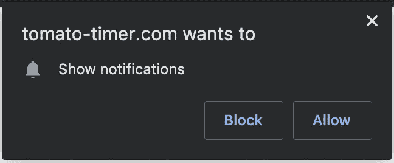
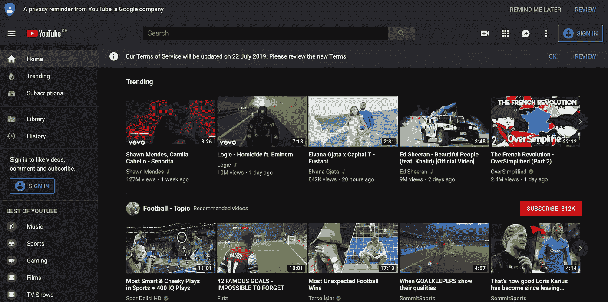
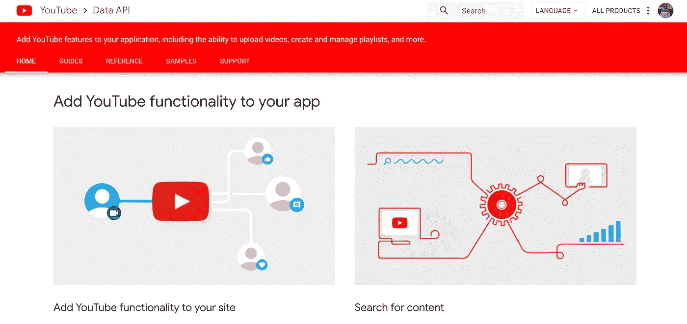
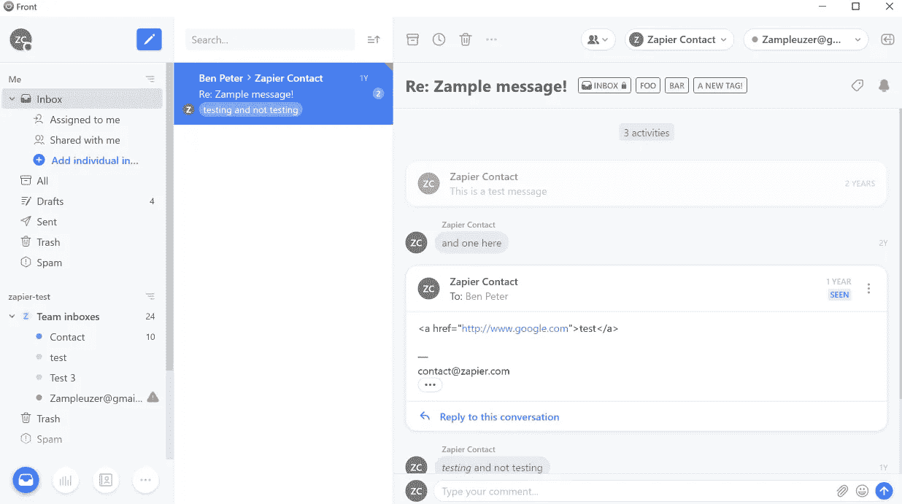
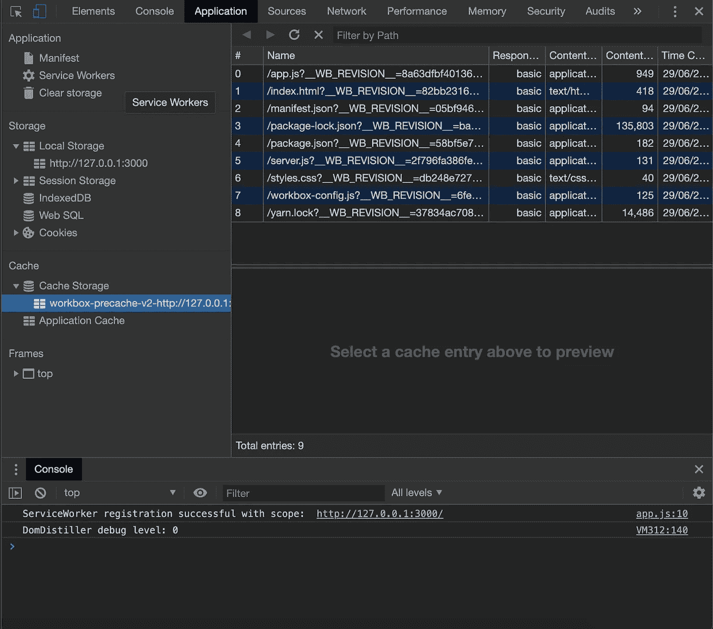

# 只有通过构建东西，你才能变得擅长编程——这里有一些关于应用的想法

> 原文：<https://betterprogramming.pub/you-can-only-get-good-at-programming-by-building-stuff-heres-a-bunch-of-app-ideas-a09af0d6734d>

Rami Al-zayat 在 [Unsplash](https://unsplash.com?utm_source=medium&utm_medium=referral) 上拍摄的照片

如果你想擅长编程，你必须愿意付出努力和汗水。编码不容易；如果是的话，每个人都会这么做。

> “天才是 1%的天赋和 99%的努力。”——托马斯·爱迪生

作为工程师，我们经常渴望构建一些东西和代码，但缺乏构建什么的想法。

这是一个系列，在这个系列中，我在享受乐趣的同时提出构建应用程序的想法。您可以使用任何您希望的技术，只要您构建了应用程序。

让我们跳进来吧！

# IMDb 克隆

通过构建 IMDb 克隆体，您将了解到:

*   处理用户搜索。
*   获取和过滤电影列表。
*   了解如何用 HTML 和 CSS 构建用户界面。

我推荐使用 [OMDb API](http://www.omdbapi.com/) 来获取电影。它是免费的，并附有示例。

开放电影数据库—[https://www.omdbapi.com/](https://www.omdbapi.com/)

# 番茄定时器

[https://pomodoro-tracker.com/](https://pomodoro-tracker.com/)

番茄工作法是一种可以用于任何任务的时间管理方法。使用这种方法，你可以把工作日分成 25 分钟的时间段，中间用 5 分钟的休息时间隔开。

这些间隔被称为番茄。大约四五个番茄之后，你会休息更长时间(15 到 20 分钟)。

你将从制作番茄定时器中学到什么:

*   用浏览器推送通知。如果您想了解更多关于通知 API 和渐进式 web 应用程序的信息，请查看这篇文章。

[浏览器通知](https://medium.com/better-programming/everything-you-need-to-know-about-pwas-push-notifications-e870bb54e14f)提醒用户何时休息，何时恢复工作。

*   处理异步操作，如运行计时器、停止计时器和重置计时器。我写了关于[如何用 async 和 await](https://medium.com/better-programming/improve-your-asynchronous-javascript-code-with-async-and-await-c02fc3813eda) 改进异步 JavaScript 代码。
*   将结果存储到数据库中。
*   理解如何用 HTML 和 CSS 构建 UI。

# YouTube 克隆

[https://www.youtube.com/](https://www.youtube.com/)

互联网上最受欢迎的网站之一，理由很充分。只要你有互联网，YouTube 让每个人都可以很容易地获取内容。

通过建立你自己的 YouTube，你会学到什么:

*   视频和音频的工作原理。你必须展示一个视频播放器，并与音频同步。
*   如何从 API 获取数据？
*   如何用 HTML、CSS 和 JavaScript 构建 UI？

幸运的是，你可以从[官方 API](https://developers.google.com/youtube/v3/) 获取 YouTube 相关数据。

YouTube 数据 API—【https://developers.google.com/youtube/v3/ 

# 电子邮件客户端

电子邮件客户端示例

这个想法比较先进，需要的时间也比较长，但无论如何都要试一试。确保你的电子邮件客户端是[端到端加密(E2EE)](https://en.wikipedia.org/wiki/End-to-end_encryption) 。

你将从构建电子邮件客户端中学到什么；

*   加密和解密的工作原理。
*   安全存储加密密钥。
*   从邮箱中检索邮件。
*   从邮箱发送邮件。
*   消息撰写。

如果你不太清楚电子邮件客户端是如何工作的，可以查看一下官方维基。

# 制作一个渐进式网络应用程序

把你之前开发的任何一个应用程序，变成一个 PWA。

[你需要知道的关于 PWAs 的一切—工具箱](https://medium.com/@indreklasn/everything-you-need-to-know-about-pwas-workbox-de5755672fb3)

我坚信渐进式应用是未来。浏览器上将有一个一致的应用程序，具有推送通知、离线支持、相机支持等原生功能，而不是发布在谷歌商店、苹果商店、微软商店等。

通过构建 PWA，您将了解到:

*   如何从缓存中为您的应用提供服务。这种方法用于大幅提高性能，尤其是在慢速互联网上。
*   如何为你的应用添加离线支持？用户可能会失去连接，但即使没有互联网连接，您的应用程序仍然可以工作。
*   如何使用现代浏览器功能，如[推送通知](https://medium.com/better-programming/everything-you-need-to-know-about-pwas-push-notifications-e870bb54e14f)，支付 API 等。

如果你不太确定从哪里开始，我建议从[这篇文章](https://medium.com/better-programming/everything-you-need-to-know-about-pwas-8e41a7e745aa)开始。

 [## 你需要知道的关于 PWAs 的一切

### 渐进式网络应用——它们是什么以及如何开始

medium.com](https://medium.com/better-programming/everything-you-need-to-know-about-pwas-8e41a7e745aa) 

没有找到你感兴趣的东西？查看第一部分、[第二部分](https://medium.com/better-programming/summer-is-over-you-should-be-coding-heres-yet-another-list-of-exciting-ideas-to-build-a95d7704d36d)或[第三部分](https://medium.com/better-programming/the-secret-to-being-a-top-developer-is-building-things-d3d058e4e472)了解更多想法。

如果你想让你的 JavaScript 更上一层楼，我推荐“ [*你不知道的 J* S](https://amzn.to/319YTBF) ”系列丛书。

感谢阅读！享受建筑的乐趣。