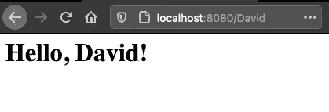

# 你可以使用任何编程语言进行后端开发——甚至是 Brainfuck

> 原文：<https://betterprogramming.pub/you-can-use-any-programming-language-for-backend-development-even-brainfuck-d70e5d964fff>

## 选择哪种语言并不重要。更重要的是你为什么要用它


坚克·巴图汉·奥扎尔通在 [Unsplash](https://unsplash.com/s/photos/choices?utm_source=unsplash&utm_medium=referral&utm_content=creditCopyText) 上拍摄的照片

如果您是 web 开发的新手，并且希望在 web 应用程序的后端工作，您可能会想知道什么语言最适合您的应用程序。取决于你问谁这个问题，你可能会得到不同的答案。你会听到 PHP、JavaScript、C#、Python 和许多其他语言。

这里的事实是，您使用哪种编程语言真的没那么重要。当然，每个开发人员都有自己的偏好，但是如果您正在开发您的第一个应用程序，这并不重要。尝试几种语言，并用它们开发相同的应用程序——找出哪种语言最适合你。

您应该记住的是，在非常基础的层面上，每种后端编程语言都只是一种生成客户端(例如，您的浏览器)可以理解的数据的工具。这可以是 HTML、JavaScript、CSS、JSON、原始文件数据或其他内容。

如果您使用的是 PHP 之类的语言，您将运行一个程序来执行 PHP 代码，并将它生成的内容返回给客户端，比如 Apache 或 nginx。如果你正在用 C#编写一个应用程序，你的应用程序本身将处理与客户端的连接。

只要您开发的应用程序能够生成浏览器能够理解的内容，那么您使用哪种语言并不重要。

当然，每种语言都有它的优点和缺点。网上有无数的列表比较了所有流行的编程语言。但是这篇文章不是关于那个的。本文不会深入研究流行的语言，也不会解释哪种语言是最好的。这篇文章是关于提出一个观点。这一点是，在选择一种语言时，最重要的部分是个人偏好。因为语言没那么重要。

为了证明这一点，我将向您展示如何使用 Brainfuck 创建一个非常简单的 web 应用程序。我们要做的就是接受一个输入参数，并将其处理成一个问候语。为什么？因为我们可以。

# 大脑-什么？！

[Brainfuck](https://en.wikipedia.org/wiki/Brainfuck) 是 1993 年设计的一种极其简单的编程语言。尽管它并不意味着任何真实世界的使用，但它完全是图灵完成的。它的工作原理是有一个“磁带”,你可以在上面写值并移动指针指向磁带上的不同单元格。这需要你把指令分解成非常简单的小步骤。

Brainfuck 只有八个单字符命令。使用`>`和`<`，将单元格指针在磁带上左右移动。使用`.`，输出 [ASCII 字符](http://www.asciitable.com)，该字符属于指针当前指向的磁带上单元格中的值。

使用`[`和`]`，您可以创建一个循环，如果指针指向的磁带上的值在循环开始时不为零，那么这个循环将会运行。

使用`,`从输入中读取一个字符，并将其 ASCII 值放在当前选择的单元格中。

最后，使用`+`和`-`，分别递增和递减当前选中单元格中的值。

现在我们已经了解了 Brainfuck 的完整语法，让我们深入了解一下，看看我们将如何使用它来创建我们的 web 后端。

# 解读脑残剧本

在我们开始用 Brainfuck 编写程序之前，我们需要一个解释器——一个可以读取我们的 Brainfuck 程序并实际运行它的程序。因为我的目标是在 Linux 机器上运行我的应用程序，所以我将使用 [Beef](https://github.com/andreabolognani/beef) ，因为它已经作为 [Ubuntu 包](http://manpages.ubuntu.com/manpages/bionic/man1/beef.1.html)可用。

使用 Beef 运行 Brainfuck 脚本很容易:我们可以简单地通过命令行调用它。你可以从上面链接的 Ubuntu 手册页下载 Hello World 示例并尝试运行它:

```
beef helloworld.b
```

您的终端应该会显示`Hello, World!`作为回应。

对于我们的脚本，我们还需要将输入传递给`stdin`以提供给我们的脚本。我们将通过`echo`对内容进行处理，并通过管道将结果传递给 Beef，如下所示。

```
echo "MyInput" | beef script.b
```

# 构建一个简单的脚本

为了展示我们可以使用 Brainfuck 构建后端，我们创建了一个简单的用例。我们要创建的是一个问候脚本，它从 URL 的路径中获取一个名称。所以当我们访问`http://our-web-service/David`时，我们希望看到一个标题，上面写着“你好，大卫！”为此，我们去掉路径的第一个字符(`/David`)以获得名称，并将其添加到字符串中。在 PHP 中，应该是这样的:

我们将在 Brainfuck 中构建的 PHP 脚本

现在让我们用 Brainfuck 写这个。因为这是一个愚蠢的问题，所以它是一个简单的一行程序:

我们基于大脑的问候脚本

呃，什么？

这个程序已经表明 Brainfuck 编程语言名副其实。

这个程序做的是用 30 到 110 的值填充单元格 1 到 9，并用这些值打印`<h1>Hello,` 。然后，它读取所有输入数据，并将其放入单元格 11 及以上。然后，它返回到单元格 10，打印所有读取的输入数据，除了第一个字符(所以我们不包括 URL 路径中的第一个`/`)。

因为我们用来将输入传递给 Beef 的输入方法(通过`echo`操作输入，然后通过管道将输入传递给 Beef)在输入的末尾包含了一个新行，所以我们也将省略输入的最后一个字符。

之后，它返回到预填充的单元格，打印出最终的`!</h1>`。让我们通过添加一些空白、注释和一些磁带状态来分解 Brainfuck 程序，这样我们就可以看到实际发生了什么。

我们的天才迎宾员带来了一些评论和澄清

现在我们已经编写了脚本并保存为`hello.b`，让我们用 Beef 运行它。我们通过`echo`模拟一个路径并把它输入到脚本中来为脚本提供输入。我们的目标是被模仿的路径`/YourName`，因为这是我们希望在 web 服务器上看到的路径。

```
~$ echo “/David” | beef hello.b
<h1>Hello, David!</h1>
```

太好了，这个管用！现在，让我们找到一种方法，在被请求时将它提供给浏览器。

# 我们上菜吧！


既然我们已经编写了一个 Brainfuck 脚本来生成我们的 HTML 内容，我们需要一种方法来服务于此。我们不会为此动脑子——如果可能的话，这将是完全的疯狂。今天，我们的目标只是一个正常的、健康的疯狂。

我们要做的是用 Python 建立一个简单的 HTTP 服务器。你可能会认为这是欺骗，并说我们现在没有用 Brainfuck 编程，但当你用 PHP 编程你的 web 应用程序时，你也使用了一个外部程序，如 Apache 或 nginx 来提供你的内容——没有人声称他们已经用 Apache 编写了他们的应用程序。

我们在 Python 中所做的是监听端口 80(默认的 HTTP 端口),响应每个到达的 GET 请求，发送适当的头，并使用提供的路径调用我们的 Brainfuck 脚本。这远不是一个好的或有效的设置，但它是一个概念证明。

一个简单的 Python 服务器，调用我们的 Brainfuck 脚本

我们现在可以用`python server.py`运行这个脚本，只要脚本存储在`/app/hello.b`中，我们就应该有一个调用 Brainfuck 脚本的工作 web 服务器。但是在检查我们的结果之前，我们还需要再走一步…

# 把它包在码头集装箱里

为了运行我们的 web 应用程序而不必在本地设置所有依赖项，我们将为它创建一个 Docker 容器。我们把这个基于一个 Python 映像，我们正在安装 Beef 并把我们的 Python 和 Brainfuck 脚本放在里面。

在 Docker 容器中提供我们基于 Brainfuck 的脚本

使用这个 docker 文件，我们可以构建一个容器来运行我们的应用程序。

```
docker build -t brainfuck-server .
```

随着容器的成功创建，让我们运行服务器，这样我们就可以访问我们的 Brainfuck 驱动的网站。为了防止与主机上其他正在运行的服务发生冲突，我们将把容器上的端口 80 暴露给主机的端口 8080。

```
docker run -p 8080:80 -it brainfuck-server
```

现在至高无上的时刻:让我们打开浏览器，看看我们有什么！导航到`http://localhost:8080/YourName`，看看结果如何…



这个输出是用 Brainfuck 代码生成的！

我们成功了！为了一个非常简单的结果，做了很多工作…

# 我们能从中学到什么？

用 Brainfuck 编写 web 应用程序的后端实在是太复杂太难了。然而，用 Brainfuck 生成输出并提供给最终用户是可能的。这表明你的 web 后端使用的编程语言并不重要，所以试一试吧！

尝试不同的语言、框架和设置，看看什么最适合你。经过一些试验，你会发现不同语言的优缺点，你会知道什么适合你。

但最重要的是，在这样做的时候要开心！

编码快乐！