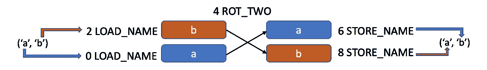

# 你没有真正理解著名的 Python 技巧:a，b= b，a

> 原文：<https://betterprogramming.pub/you-didnt-truly-understand-the-infamous-python-trick-a-b-b-a-2e4e8634f5a9>

## 引擎盖下到底发生了什么？


由[文森特·范·扎林格](https://unsplash.com/@vincentvanzalinge?utm_source=medium&utm_medium=referral)在 [Unsplash](https://unsplash.com?utm_source=medium&utm_medium=referral) 拍摄的照片

当人们学习用 Python 编程时，许多人喜欢阅读“你可能不知道的 X Python 技巧”等文章，包括 Medium。在这些文章中，经常提到的一个著名技巧是在没有中间变量的情况下交换两个变量，如下所示:

```
# instead of doing:
temp = a
a = b
b = temp# do this:
a, b = b, a
```

但是，您真的知道这行看似简单的代码在幕后做了什么吗？

这篇文章是关于更深入地研究这种技术的。当然，这不仅仅是发现它本身是如何工作的；在探索过程中学习相关技术更为重要。

事不宜迟，让我们开始吧。

# 赋值语句

首先，你必须明白这个操作`a, b = b, a`是 Python 中的一个语句，而不是一个表达式。表达式是计算出一个值的代码。相比之下，语句执行一个操作而不计算值。更具体地说，该语句是一个赋值语句，因为它使用了赋值运算符——等号。

在赋值操作符的右边，您正在创建一个 tuple 对象。请注意，即使您在正常创建元组时看不到括号，但是使用逗号符号表示创建了元组对象，即使只有一个项目，如下所示:

```
>>> a = 5, 6
>>> b = 4,
>>> type(a)
<class 'tuple'>
>>> type(b)
<class 'tuple'>
```

# 元组解包

与左侧包含单个变量的典型赋值语句不同，上面的操作左侧有两个变量。它的特别之处在于，右边元组的项会被顺序赋给左边的两个变量，这个操作被称为元组解包。

更具体地说，当两边的项目编号都匹配时，拆封被称为一对一拆封，即左边的项目将具有右边匹配位置的项目的值。例如，这样的操作可以发生在三个、四个甚至更多的项目上。

```
a, b, c = c, b, a
a, b, c, d = d, c, b, a
a, b, c, d, e = e, d, c, b, a
...
```

以上所有的开箱操作都是一对一的那种。虽然这里不太相关，但是有各种各样的解包技术，包括使用带星号的表达式来捕获全部内容，使用下划线来表示解包中不需要的项目。相关的例子如下所示，供您快速参考，但我不打算在这里展开这个主题。感兴趣的读者可以在[我之前的文章](/6-essential-python-tuple-unpacking-techniques-you-can-use-fc5d56a2c5f4)中找到更多信息。

```
>>> numbers = (1, 2, 3, 4, 5)
>>> a, *b, c = numbers
>>> _, *d = numbers
>>> print(a, b, c, d, _, sep="___")
1___[2, 3, 4]___5___[2, 3, 4, 5]___1
```

# 元组解包真的有用吗？

基于对元组解包技术的理解，你可能会猜到`a, b = b, a`是这样的:在右边，我们创建了一个元组`(b, a)`，通过解包，`a`得到`b`的值，而`b`得到`a`的值。很有道理，不是吗？

为了说明这个操作到底发生了什么，让我们利用`[dis](https://docs.python.org/3/library/dis.html#module-dis)`模块(代表反汇编)，它允许我们分析 [CPython](https://en.wikipedia.org/wiki/CPython) 实现中的字节码。

请注意，实现 Python 和 CPython 有不同的方法，CPython 是用 C 和 Python 编写的，它是默认的和最广泛使用的实现。

为了研究这个操作，我们用内置的`compile`函数创建一个用于反汇编分析的`Bytecode`对象。使用`dis`函数，我们可以检索关于代码对象操作的详细步骤。让我们来分析这些命令。

出于分析的目的，我们还通过访问`co_names`属性来检索代码对象使用的两个变量名:`(‘a’, ‘b’)`。

如你所见，这两个变量名是字符串(为简单起见，我们称之为`label 'a’`和`label 'b’`)，你应该把它们看作标签，它们引用内存中的底层对象(为简单起见，我们称之为`object a`和`object b`)。

您需要理解标签(即变量的名称)和对象(即内存中的数据)之间的区别。



交换两个变量

为了帮助您理解这个过程，我创建了一个图表，如上所示。

第一个`LOAD_NAME`将变量`label 'a’`(你可以把它想象成`object a`)的对象引用加载到堆栈中(旁注:你可以把堆栈概念化为一个线性数据模型，你可以从顶部添加和移除项目)。

第二个`LOAD_NAME`将`label 'b’` ( `object b`)的对象引用加载到堆栈中，这使得它位于`object a`的顶部。

`ROT_TWO`命令是最有趣的部分。

值得注意的是，它与元组解包无关。对于好奇的读者，我们来看看这个命令的[源代码](https://github.com/python/cpython/blob/main/Python/ceval.c)。给定有意义的函数名，操作应该简单明了。

正如你所猜测的，`ROT_TWO`通过将第二个放在顶部，同时将顶部的一个作为第二个，直接交换堆栈的两个项目。

```
TARGET(ROT_TWO): {            
    PyObject *top = TOP();            
    PyObject *second = SECOND();            
    SET_TOP(second);            
    SET_SECOND(top);            
    DISPATCH();        
}
```

交换后，第一个`STORE_NAME`存储堆栈的顶部(也将从顶部移动)，这是对`object a`到`co_varnames`中的`label ‘b’`的引用。

因为栈顶现在变成了对`object b`的引用，第二个`STORE_NAME`将把对`object b`的引用存储到`label ‘a’`。至此，Python 完成了交换。

`LOAD_CONST`操作加载常量，在本例中为`None`。每个 Python 操作都可以返回值—在本例中，`RETURN_VALUE`返回隐式返回值— `None`。

顺便提一下，您可能会注意到，这里在命令前使用了偶数 0、2、4…因为 Python 需要两个字节来表示每个指令。

# 拆包对对换没有作用吗？

我们已经知道 Python(更准确地说是 CPython 实现)本质上是使用`ROT_TWO`来交换两个变量，而没有使用任何解包技术。您可能想知道拆包根本不涉及交换。为了回答这个问题，我们来尝试一些实验。

有了三个变量，一切都保持不变，除了`ROT_THREE`的引入，它“将第二个和第三个堆栈项目向上提升一个位置，将顶部向下移动到位置三”([来源](https://docs.python.org/3/library/dis.html#opcode-ROT_THREE))。

有了四个变量，事情就变了。如您所见，该操作涉及两个命令:`BUILD_TUPLE`和`UNPACK_SEQUENCE`，这两个命令创建 tuple 并在接下来解包它。可以想象，当变量超过四个时，会应用相同的命令，有兴趣的读者可以自己试试。

# 结论

在本文中，我们使用`dis`模块来研究一个广为流传的技巧——交换两个变量而不交换第三个变量:`a, b = b, a`。以下是要点的快速回顾:

*   元组解包是一种将多个项目的元组映射到多个变量的技术。当数字匹配时，就是一对一的拆包。
*   看来`a, b = b, a`涉及到了一对一的拆包。然而，事实证明 Python 使用了优化的操作(即`ROT_TWO`)来交换栈上的引用。
*   当涉及到三个变量时，就会发生这种交换。然而，当有四个变量时，元组创建和解包就开始起作用了。
*   应该注意的是，这里讨论的所有内容都属于 Python 语言的 CPython 实现的范畴。对于这种特定的操作，还有其他可能具有不同实现机制的实现。
*   CPython 是默认的、使用最广泛的实现。