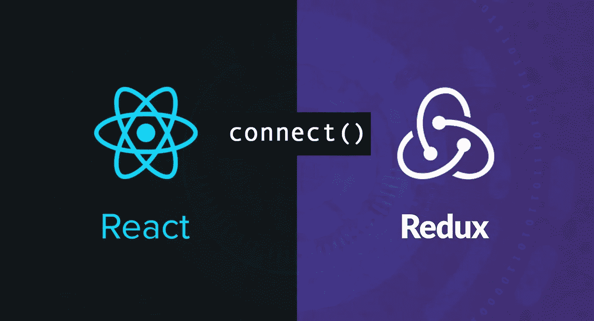
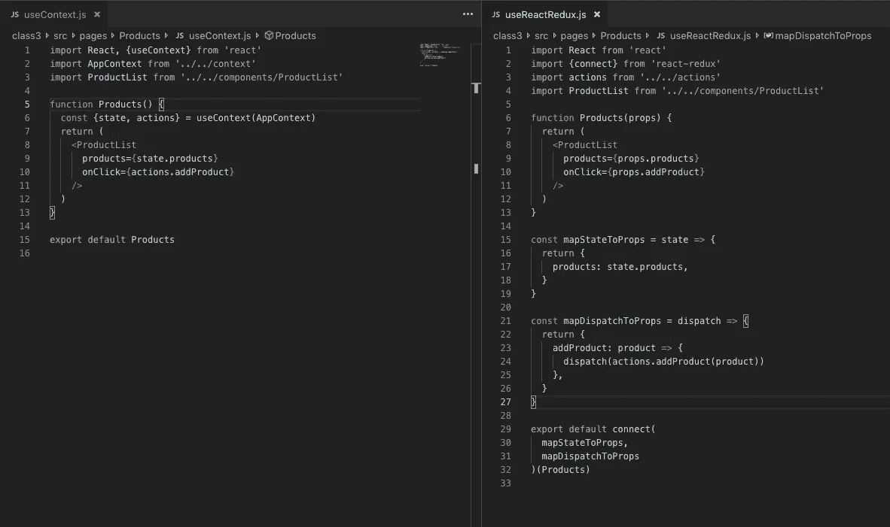
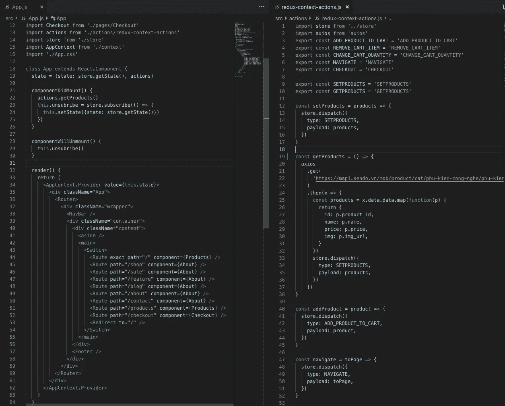

# 你甚至不需要 React-Redux 和 Redux Thunk

> 原文：<https://betterprogramming.pub/you-dont-even-need-react-redux-and-redux-thunk-d9dce6c0a89f>

## 使用上下文在 React 应用程序中使用 Redux，而不使用 React-Redux 或 Thunk

当你使用 [React](https://reactjs.org/) 和 [Redux](https://redux.js.org/) 时，每个人都会想到 [React-Redux](https://react-redux.js.org/) (将 Redux 与 React 应用程序连接)和 [Redux Thunk](http://redux-thunk) 。

Redux Thunk 处理异步动作，有些使用 sagas，但是现在让我们忽略它。在这篇文章中，我将只关注 Thunk。但是，没有 React-Redux，如何使用 React app 中的 Redux 商店呢？

答案是语境。

如果您不熟悉上下文，请查看一下 [React 文档](https://reactjs.org/docs/context.html)。

在向您展示如何使用上下文将 Redux 连接到 React 应用程序之前，我将向您展示这样做的好处。

1.  不需要在应用程序中安装额外的库。
2.  让你的组件代码更短，更易读。
3.  减少 React-Redux 的额外学习曲线。

第一是显而易见的，我不认为我需要解释。

第二:这是一个使用 React-Redux 的组件和一个不使用 React-Redux 的组件的代码。

看吧！左边的组件只需要 15 行代码，而右边的组件(使用 React-Redux)需要 32 行代码，是另一个的两倍。

第三:(减少 React-Redux 的额外学习曲线)。我仍然记得我第一次与 React 合作的时候(两三年前)。

名为`mapStateToProps`和`mapDispatchToProps`的东西让我花了一段时间才习惯使用它。更别说什么叫高阶函数“connect”的东西了，让初级开发者很困惑。

我肯定你现在有什么困惑。这是哪里来的？

`const {state, actions} = useContext(AppContext)`

在我解释它是什么和它来自哪里之前，我将向您展示如何使用上下文将 Redux 连接到您的 React 应用程序。

就在那里。左边是`App.js`(我的 React app 的根组件)，设置上下文的地方。

您将看到我们的上下文值包含来自商店的`appState`和所有动作(从左边的`index.js`文件导入)。

请注意，我们必须向 Redux store 订阅应用程序状态，这样每当 Redux store 发生变化时，它都会得到通知。当应用程序卸载时，不要忘记取消订阅。

然后，我们将把 app 组件的所有内容包装在上下文提供者中。这样，React 应用程序中的其他组件就能够访问产品组件中的应用程序状态和操作，如上所述。

这里要注意的一点是，在每个动作中，我们不是返回包含类型和有效载荷的对象，而是直接在动作函数中调度它。这是因为我们没有使用 React-Redux，所以我们必须在 action 函数中调用 dispatch。

仅此而已。对我来说，这是一种真正简单的结合 React 和 Redux 的方式，不需要 React-Redux。使用 React 语法编写组件将更加本地化。

不再有`mapDispatch`、`mapState`，以及其他连接的东西。

另一件事是，使用这种方法，我们不需要 Redux Thunk 来处理异步操作。我们只是在一个动作中直接调用它们，并在异步动作被解析时分派一个动作。

# 结论

## **免责声明**

每次提供者更改值时，React context 都会导致其所有使用者重新呈现，从而严重影响性能。

## **解决方案**

解决此问题的提示:

你应该用容器(在这个上下文中称为消费者)和组件(那些不关心 Redux 商店的，他们只依赖于道具)来架构你的应用。

容器总是呈现组件，而不是 DOM，并且组件总是呈现 DOM，并且仅在其属性或状态改变时才重新呈现。

容器可以任意多次重新渲染。我们不介意，因为这实际上并没有重新呈现 DOM，所以不会影响我们应用程序的性能。

## 密码

我已经把参考代码放在这个 [GitHub repo](https://github.com/chiquyet199/redux-context) 里了。

感谢阅读！