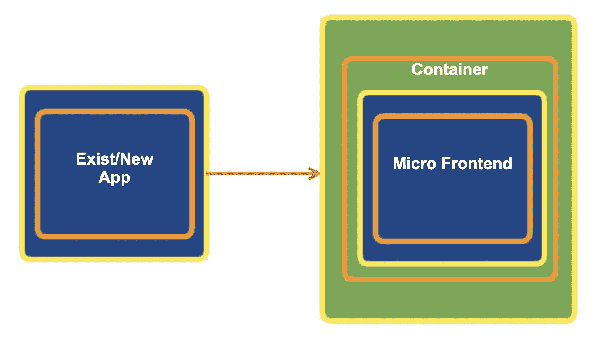
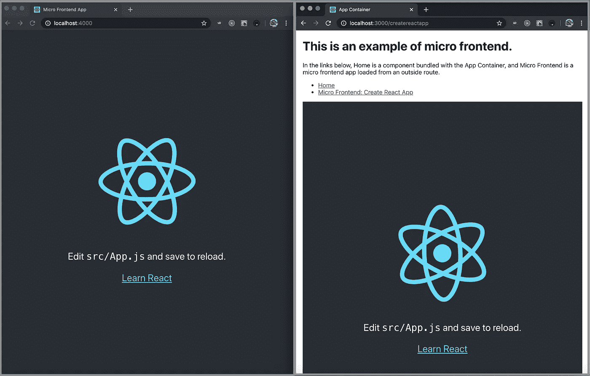
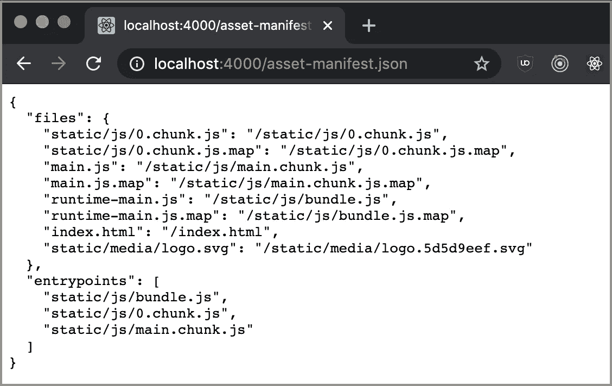
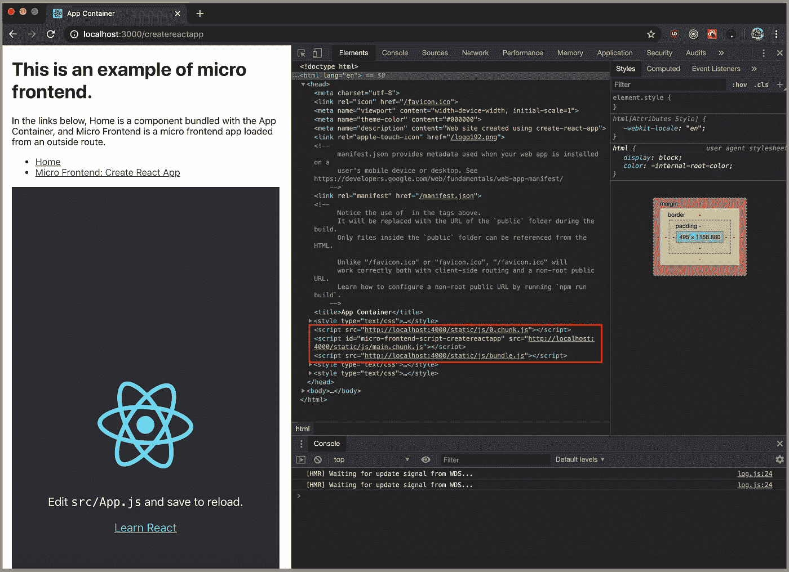

# 你不必失去微前端的优化

> 原文：<https://betterprogramming.pub/you-dont-have-to-lose-optimization-for-micro-frontends-60a63d5f94fe>

## 一种从 manifest.json 逐步加载分块微前端的方法


照片由[托马斯·威廉姆斯](https://unsplash.com/photos/p-_RJY6hN3E)在 [Unsplash](http://unsplash.com) 拍摄

在“[将随机 React 应用程序转变为微前端的 5 个步骤](https://medium.com/better-programming/5-steps-to-turn-a-random-react-application-into-a-micro-frontend-946718c147e7)之后，一位读者问我们:

> 在项目太大时，如果在加载时不拆分代码，那么它就变得难以扩展并且会对 UX 产生不好的影响。

是的，这是一个有效的陈述。我们必须解决这个问题。

# 代码是如何工作的？

在“[将随机 React 应用程序转变为微前端容器的 3 个步骤](https://medium.com/better-programming/3-steps-to-turn-a-random-react-application-into-a-micro-frontend-container-a80e33b6a066)中，我们展示了微前端是如何工作的。微前端作为独立的应用程序运行。在捆绑阶段或运行时，这些应用程序被加载到微前端容器中。应用程序容器运行它们，就好像这些微前端是它自己的组件一样，并向用户提供无缝的工作流。

在我们的基本示例中，有一个微前端应用程序和一个应用程序容器。



这转化为下图，左边是一个微前端应用，右边是一个应用容器。



为了让它工作，我们禁用了块优化，它将代码分割成小块，以便逐步加载。


在这里，我们重新启用块优化。



现在怎么办？

我们需要修改 [Cam Jackson](https://camjackson.net/) 的`[MicroFrontend.js](https://github.com/micro-frontends-demo/container/blob/master/src/MicroFrontend.js)`来处理块:

第 13 到 38 行加载小块 js 文件。当所有的块都被加载后，它在第 31 行调用`this.renderMicroFrontend()`。这就是微前端保持优化的方式。

现在我们可以看到 micro-frontend 的三个分块文件被加载:


它们嵌入在应用程序容器的 HTML 文件中:



## 钩子版本的 MicroFrontend.js

作为奖励，我们将 MicroFrontend.js 转换为使用 Hook。

[正如 natansevero 指出的](https://gist.github.com/JenniferFuBook/0cd7d34548c76df1837988692880b54c#gistcomment-3350826)，对于任何使用该算法并且不想在`<head>`标签上加载所有微前端 JavaScript 的人来说，你可以替换第 33 行到`document.body.after(script)`的代码。工作正常:)

# 代码库

这个例子有两个代码库:

*   **app 容器:**三步转换后的应用容器位于[这里](https://github.com/JenniferFuBook/app-container)。

```
git clone --single-branch --branch chunkOptimization https://github.com/JenniferFuBook/app-container.git
npm i
npm start
```

*   **微前端 app:** 五步转换的微前端应用位于[这里](https://github.com/JenniferFuBook/micro-frontend)。

```
git clone --single-branch --branch chunkOptimization https://github.com/JenniferFuBook/micro-frontend.git
npm i
npm start
```

> *作为 MicroFrontend.js 的这个改进版本，在步骤 1 中可以不用* `*react-app-rewired*` *，步骤 2 可以完全跳过。5 步减为 3.5 步。*
> 
> *这种节省在* chunkOptimization *分支中被捕获。*

# 发射命令

假设这两个存储库在您的`home`目录中。在 Bash 配置文件中设置以下别名:

```
alias runBoth='cd ~/app-container; concurrently "npm start --prefix ~/micro-frontend" "npm start"'
```

`runBoth`使用`[concurrently](http://micro%20front-end/)`命令启动 app 容器和微前端 app。对于这个工作分支，我们保留了微前端的优化。

# 结论

你不必为了微前端而失去优化。

这项工作的一部分是由乔纳森马贡献。

感谢阅读。我希望这有所帮助。

这是一个关于微前端的系列。以下是其他文章的列表:

*   "[将随机 React 应用程序转变为微前端的 5 个步骤](https://medium.com/better-programming/5-steps-to-turn-a-random-react-application-into-a-micro-frontend-946718c147e7)"
*   "[将随机 React 应用程序转变为微前端容器的 3 个步骤](https://medium.com/better-programming/3-steps-to-turn-a-random-react-application-into-a-micro-frontend-container-a80e33b6a066)"
*   "[打造自己的微前端生态系统](https://medium.com/better-programming/build-your-own-micro-frontend-ecosystem-a05128c74f99)"
*   "[微前端方法的 10 个决策点](https://medium.com/better-programming/10-decision-points-for-micro-frontends-approach-4ebb4b59f40)"
*   "[创建多版本 React 应用程序的 6 个步骤](https://medium.com/better-programming/6-steps-to-create-a-multi-version-react-application-1c3e5b5df7e9)"
*   "[使用 Webpack 5 模块联盟的微前端](https://medium.com/better-programming/micro-frontends-using-webpack-5-module-federation-3b97ffb22a0d)"