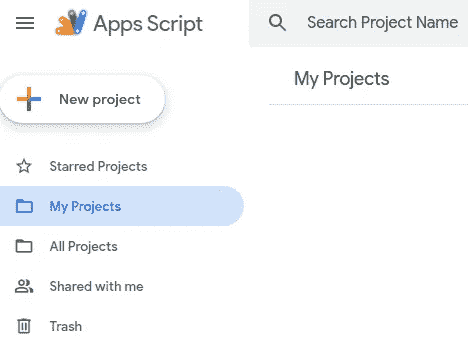
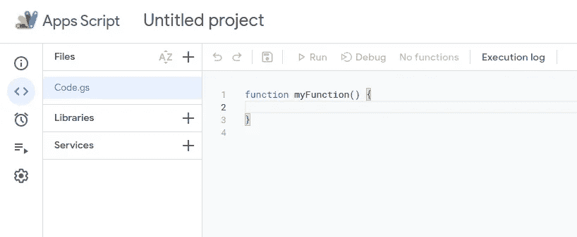
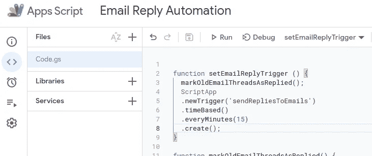
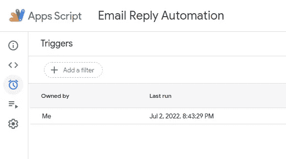

# 厌倦了回复邮件？使用谷歌应用程序脚本自动回复

> 原文：<https://betterprogramming.pub/you-dont-have-to-reply-to-emails-ever-again-a549ba1af696>

## 你再也不用回复邮件了！


处理电子邮件是一件麻烦事。每个人每天都会收到数百封电子邮件。回复所有的邮件需要一天中相当长的时间。你可以花时间和家人在一起，从事一项爱好，或者漫无目的地浏览社交媒体。

回复邮件对我们大多数人来说是必须的。假设你正在开始一项新业务。尽快回复你的客户是非常重要的。你的竞争对手赢得那个你花了太长时间才回应的客户只是时间问题。

如果我说有一种方法可以自动回复你收到的每封邮件。你不必查看每一封邮件。如果你错过了任何邮件，你不必担心。寄信人会对你的快速回复感到高兴。

# 什么是 Google Apps 脚本？

[Google Apps 脚本](https://developers.google.com/apps-script)主页定义如下。

一个基于云的 JavaScript 平台，让您可以集成和自动化跨 Google 产品的任务。

Google 在隐藏连接不同 Google APIs 的所有复杂性方面做得非常好。一个应用程序脚本用户必须调用几个预定义的函数和 viola，你可以创造奇迹！！！

还没印象深刻？让我给出一些应用程序脚本的示例用例。

*   基于电子表格上的事件详细信息创建日历事件，并将注册表单发送给事件的受邀者。
*   创建一张漂亮的发票，并使用电子表格中的数据通过电子邮件发送出去。
*   使用 Google Chat 创建 Google 日历事件。

现在我们已经很好地理解了什么是应用脚本，让我们看看如何利用应用脚本来实现我们的目标；给你的邮件发送自动回复。我们一步一步来看解决方案。

# 步骤 1:设置应用程序脚本项目

首先，你必须去 script.google.com。点击`+ New Project`按钮，创建一个全新的项目来完成我们的任务。



它将打开一个类似下图的优雅编辑器。



您的代码放在默认打开的文件`Code.gs`中。让我们清除编辑器中的模板代码，并添加代码来完成我们的电子邮件任务。

# 第二步:阅读新邮件

为了阅读新邮件，我们需要访问 Gmail。Apps 脚本为此提供了一个 API，`GmailApp`。

我们只需要搜索新的电子邮件。但是，无法直接访问收件箱中的未读邮件。

在这里，我们做一个小把戏。一旦我们回复了一封邮件，我们就给它加上一个标签。先说`replied`。下次我们搜索时，我们只需在收件箱中寻找没有标记为`replied`的邮件。我们用搜索查询`is:inbox-label:replied`。这里`is:inbox`确保对收件箱邮件的搜索已经完成。`-label:replied`确保搜索没有标签`replied`的邮件。

假设`sendRepliesToEmails`是我们的函数名。这是目前为止的代码。

阅读新邮件

# 第三步:回复过滤后的邮件

现在，我们必须回复列表上的每一封邮件。

回复每封邮件

我们必须想出`sendReplyTo`功能的逻辑。

在这里，我在回复消息中添加了一个示例正文作为`replyBody`。你可以改变它来满足你的要求。

我使用由`GmailApp` API 提供的`reply`函数发送一个带有`replyBody`的回复。

# 步骤 4:将回复的电子邮件主题标记为“已回复”

我们现在已经回复了收件箱中的所有新邮件。为了避免下次运行脚本时回复相同的邮件，我们应该用标签`replied`标记我们回复的邮件。在下面的函数中，我们从它的名字`replied`中获取标签，然后将标签添加到我们刚刚回复的电子邮件线程中。

现在我们已经创建了一个脚本来读取所有新邮件并给它们发送回复。你可能会想，是不是每天醒来都要运行这段代码！不要担心。应用程序脚本为您提供了保障。

# 步骤 5:创建一个触发器来定期运行该过程

应用程序脚本有一个很酷的设置触发器的功能。触发器可以在不同的动作上被激活。我们需要的是一个周期性启动的触发器。您可以设置一个触发器，只运行一次，就大功告成了！

在下面的代码段中，从第 3–7 行，您可以看到我已经创建了一个调用函数`sendRepliesToEmails`的触发器。每 15 分钟触发一次。

您可能还注意到，在上面代码的第 2 行，我使用了一个名为`markOldEmailThreadsAsReplied`的函数。让我解释一下。

当您第一次运行函数`sendRepliesToEmails`时，它会搜索未标记为`replied`的电子邮件线程。因为没有邮件被标记为已回复，所以你所有可以追溯到恐龙时代的旧邮件都会被回复。根本不是我们想要的😆。

因此，我们创建了一个名为`replied`的标签，获取所有收件箱邮件线程，并将它们标记为`replied`。在创建触发器之前，第一次只需要这样做一次。

## 完全码

这是我们到目前为止所经历的代码片段的组合。

# 第六步:执行

从下拉菜单中，选择我们想要执行的功能`setEmailReplyTrigger`。然后点击️▶️ `Run`按钮。



第一次运行该脚本时，会出现一个弹出窗口，您可能需要接受访问 Gmail 的权限请求。弹出窗口甚至可能指出脚本不安全。嘿…你创作了剧本。能有多不安全😄

您可以看到在选项卡中已经创建了一个触发器⏰`Triggers`。选项卡中显示了定期执行📑`Executions`。



现在你可以啜饮一杯咖啡，享受你的早晨。应用程序脚本会照顾你的电子邮件。

```
**Want to Connect?**You can connect with me on [LinkedIn](https://www.linkedin.com/in/gayal-dassanayake/).
```