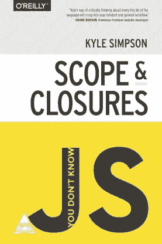

# “你不知道 JS:”我对作用域和闭包的理解

> 原文：<https://betterprogramming.pub/you-dont-know-js-my-understanding-of-scopes-closures-e0d2bfe4c328>

为了尽可能深入地理解 JavaScript，阅读 Kyle Simpson 的 YDKJS 系列丛书是必不可少的。下面是我对这个令人惊奇的系列丛书中的第二本书“范围&闭包”的理解。



[“范围&关闭”凯尔·辛普森](https://github.com/getify/You-Dont-Know-JS/blob/2nd-ed/scope-closures/README.md)

在我们的程序中包含变量是执行任务的最基本要求之一。但这也引发了一些问题:

1.这些变量存在于哪里，或者存储在哪里？
2。我们的程序在需要它们的时候是如何找到它们的？

针对上述问题以及更多问题的一组定义明确的规则被称为*范围。*

# 编译理论

尽管 JavaScript 属于动态语言或解释语言的范畴，但事实上，它是编译语言。为了简单起见，我就不深究编译的各个步骤了。

任何 JavaScript 代码片段都必须先编译(通常是*对*之前！)就执行了。所以 JS 编译器将首先获取程序`var a = 2;`并编译它，然后准备执行它——通常是马上。

如果我们以`var a = 2;`为例，JavaScript 引擎会将`var a = 2;`分解成单独的块字符，将这些块解析成所谓的*抽象语法树，*，然后将该树转化为一组机器指令，以实际创建一个名为`a if not previously declared in the current scope`的变量(在编译阶段)，并在稍后为其分配值`2`(在执行阶段)。

# 编译器查找

这里，作者介绍了左侧(LHS)和右侧(RHS)查找的概念。但问题是:到*的那一边是什么？*向**侧**进行作业。

当一个变量出现在赋值操作的左边时，就完成了 LHS 查找，就像在`var a = 2;`的例子中，LHS 查找试图找到变量容器本身，以便它可以赋值。

当变量在赋值操作的右边时，RHS 查找完成，如`console.log(a);`所示。对`a` 的引用是一个RHS 引用，因为这里没有给`a`赋值。相反，我们希望检索`a`的值，这样该值就可以传递给`console.log(…)`。相比之下，在`a = 2;`中，对`a`的引用是一个 LHS 引用，因为我们实际上并不关心当前值是多少——我们只是想找到变量作为`=2`赋值操作的目标。

如果在 LHS 查找的作用域链中找不到该变量，将自动创建一个全局变量(在非严格模式下)，或者抛出一个`ReferenceError`(在严格模式下)。

如果在 RHS 查找的作用域链中找不到该变量，将抛出`ReferenceError`。

因此，无论何时您在控制台中看到一个`ReferenceError`，您都可以确定它与范围故障有关。

# 词法范围

*词法范围*是 JavaScript 作者在编写代码时定义的范围。(这是一种很好的思考范围的方式！)这完全取决于作者选择将他/她的变量和函数(以及块)放在哪里。这个位置告诉 JavaScript 引擎应该在哪里执行 LHS 和 RHS 查找——换句话说，就是它需要向上移动来查找变量的范围链。

## JavaScript 使用词法范围

当我们从 RHS 和 LHS 的角度来看待嵌套作用域的概念时，理解和编码变得更加容易和有趣。

考虑:

```
function foo(a) {
	console.log( a + b );
}

var b = 2;

foo( 2 ); // 4
```

对于`b`的 RHS 引用不能在函数`foo`中解析，但是可以在它周围的作用域中解析(在这种情况下，它是全局作用域)。

## 遍历嵌套范围的简单规则

我们从当前执行的范围开始，在那里寻找变量。如果找不到，我们继续向上一级——以此类推。如果到达最外层的全局范围，搜索就会停止，不管是否找到变量。

这本书给出了一个非常好的嵌套作用域的例子，即“相互嵌套的气泡”

# 作弊词汇

在我讨论两个欺骗或者修改词法范围的方法之前，我必须给出一个警告——主要有两个原因:

1.  这是一种不好的做法，会被更广泛的 JavaScript 社区所反对
2.  这会导致较差的性能

因此，我将不再赘述。尽管如此，这很有趣。好了，我们开始吧:

## evaluate 评价

考虑一下这个:

```
function foo(str, a) {
	eval( str ); // cheating!
	console.log( a, b );
}

var b = 2;

foo( "var b = 3;", 1 ); // 1 3
```

很简单，您可以看到,`eval(..)`接受一个字符串，并将该字符串的内容视为实际上是在程序中的该点编写的代码。

换句话说，您可以在您创作的代码中以编程方式生成代码，并运行生成的代码，就像它在创作时就在那里一样。

## 随着

`with`通常被解释为对一个对象进行多个属性引用而不每次都重复对象引用本身的简写。

```
var obj = {
	a: 1,
	b: 2,
	c: 3
};

// more "tedious" to repeat "obj"
obj.a = 2;
obj.b = 3;
obj.c = 4;

// "easier" short-hand
with (obj) {
	a = 3;
	b = 4;
	c = 5;
}
```

# 在函数中隐藏东西

这里我们介绍*最小曝光*原理。顾名思义，我们应该只暴露最不必要的东西，本质上，隐藏所有其他的东西。

## 防止空中相撞

将变量和函数隐藏在作用域内的另一个好处是避免两个名称相同但用途不同的不同标识符之间的意外冲突。冲突通常会导致意外的值覆盖。

例如:

```
function foo() {
	function bar(a) {
		i = 3; // changing the `i` in the enclosing scope's for-loop
		console.log( a + i );
	} for (var i=0; i<10; i++) {
		bar( i * 2 ); // oops, infinite loop ahead!
	}
}foo();
```

在 for 循环中，`bar(..)`中的`i = 3`赋值意外地覆盖了`foo(..)`中声明的`i`。

在这种情况下，这将导致一个无限循环，因为`i`被设置为固定值`3`，并且将永远保持`< 10`。

# 函数声明与函数表达式

这是一个非常重要的概念，但我完全忘记了。

简单来说，如果`function`是语句中的第一件事，那么它就是一个函数声明。否则就是函数表达式。

函数声明:

```
function foo() { 
	console.log("This is a function declaration");

}
```

考虑一下这个:

```
var a = 2;(function foo(){ // <-- insert this var a = 3;
	console.log( a ); // 3})(); // <-- and thisconsole.log( a ); // 2
```

作为表达式的`(function foo(){ .. })`表示标识符`foo`只在`..`指示的范围内，而不在外部范围内。因此，包围`(function foo(){ .. })`的作用域中的值不会被全局作用域中的值污染。

以下是编写函数表达式的不同方法:

```
var foo = function() { 
	console.log("This is an anonymous function expression");

}var x = function foo() { 
	console.log("This is a *named* function expression");

}(function() { 
	console.log("This is a self-invoking function expression");

})()(function foo() { 
	console.log("This is a named self-invoking function expression");
})()setTimeout( function(){
	console.log("This is an anonymous function expression as a callback parameter");
}, 1000 );setTimeout( function(){
	console.log("This is a named function expression as a callback parameter");
}, 1000 );
```

# 立即调用函数表达式(IIFE)

生活可以用两种不同的方式书写:

```
(function() {
  console.log('First')
})();(function() {
  console.log('Second')
}());
```

# 块作为作用域

考虑一个 for 循环:

```
for (var i=0; i<10; i++) {
	console.log( i );
}
console.log(i) //10
```

现在，我们可以清楚地看到，在 for 循环中声明`i` 是有意义的，但是当使用`var`时，这是不相关的，因为它们总是属于封闭范围。那么，为什么要用只在 for 循环中使用的`i`变量来污染函数的整个范围呢？解决方案是`let`和`const`。让我们来看看它们:

`Let`和`const`创建它们自己的块范围，就像 try…catch 语句中的 catch 一样。

以下示例将进一步阐明这一点:

## 试着…接住

```
try {
	undefined(); // illegal operation to force an exception!
}
catch (err) {
	console.log( err ); // works!
}

console.log( err ); // ReferenceError: `err` not found
```

如您所见，`err`仅存在于 catch 子句中，当您试图在其他地方引用它时会抛出一个错误。

## 让

```
var foo = 1;

if (foo) {
	let bar = foo * 2;
	console.log( bar );// 2
}

console.log( bar ); // ReferenceError
```

使用`var`运行时的相同代码:

```
var foo = 1;

if (foo) {
	var bar = foo * 2;
	console.log( bar );// 2
}

console.log( bar ); // 2
```

## 常数

```
var foo = 1;

if (foo) {
	var a = 2;
	const b = 3; // block-scoped to the containing `if`

	a = 3; // just fine!
	b = 4; // error!
}

console.log( a ); // 3
console.log( b ); // ReferenceError!
```

Const 也创建一个块范围的变量，但是值是固定的(常量)。以后任何更改该值的尝试都会导致错误。

# 提升

这可能是我们在上面学到的所有东西中最重要的结论——也可能是最有趣的。

让我们看两个场景:

```
Scenario 1:
a = 2;

var a;

console.log( a ); // 2Scenario 2:
console.log( a ); // undefined

var a = 2;
```

输出看起来令人困惑的原因是因为提升。

JS 引擎分两步工作:第一步是*编译*阶段，接下来是*执行*阶段。这两步的工作是不同的。

在编译阶段，处理所有变量和函数声明。

在编译阶段之后，在执行阶段，所有的逻辑和赋值都发生了。

当你看到`var a = 2;`时，你可能认为那是一个陈述。但是 JavaScript 实际上把它想成了两个语句:`var a;`和`a = 2;`。第一个语句是声明，在编译阶段处理。第二个语句，赋值，留在执行阶段的位置。

**注意:**在上面的例子中，*到位*部分非常重要。同样重要的是要注意，吊装是按范围进行的。

我们的第一个片段是:

```
var a;a = 2;

console.log( a ); // 2
```

我们的第二个片段:

```
var a;console.log( a ); //undefined

a = 2;
```

## 功能第一

一个微妙但重要的细节:函数首先被提升，然后是变量。

考虑:

```
foo(); // 1var foo;function foo() {
    console.log( 1 );
}foo = function() {
    console.log( 2 );
};
```

打印`1`而不是`2`。该代码片段被引擎解释为:

```
function foo() {
    console.log( 1 );
}foo(); // 1foo = function() {
    console.log( 2 );
};
```

虽然多重/重复的`var`声明被有效地忽略了，但是后续的函数声明确实覆盖了之前的声明。

考虑接下来的两个片段:

片段 1:

```
foo(); // 3 since the second function decalaration overrides the first one.

function foo() {
    console.log( 1 );
}

var foo = function() {
    console.log( 2 );
};

function foo() {
    console.log( 3 );
}
```

片段 2:

```
foo(); // "b"

var a = true;
if (a) {
   function foo() { console.log( "a" ); }
}
else {
   function foo() { console.log( "b" ); }
}
```

出现在普通块内部的函数声明通常提升到封闭范围，而不是像上面的代码所暗示的那样是有条件的。

# 关闭

如果对词法范围理解得足够好，闭包是一个很容易理解的概念。本质上，我们经常使用闭包，但并没有真正理解它。

我们可以把闭包看作一种调用函数或者在函数的词法范围之外使用函数的方式，或者看作函数访问其词法范围的能力，即使该函数在其词法范围之外被调用。

考虑这个简单的代码:

```
function foo() {
	var a = 2;

	function bar() { // this function has a closure over the scope of foo
		console.log( a ); 
	}

	bar();
}

foo(); // 2
```

为了使上面的代码更加清晰，请考虑以下情况:

```
function foo() {
	var a = 2;

	function bar() {
		console.log( a );
	}

	return bar; // we return the entire function of bar
}

var baz = foo(); // now baz has the same function definition as bar but it can acess bar's lexical scope

baz(); // guess what the output is, yes it's the same as above: 2
```

所以定义一下:

> 闭包是指函数能够记住并访问其词法范围——即使该函数在其词法范围之外执行。

# 模块

我并不熟悉本书中解释的*模块*的概念，但是它们非常有趣并且很有帮助。

模块是利用闭包力量的代码模式。

以此为例:

```
function Module() {
	var a= "This is a module!";

	function func() {
		console.log( a );
	}

	return {
		func: func
	};
}

var foo = Module();
foo.func(); // This is a module!
```

这是 JavaScript 中的模式，我们称之为模块。

更简单地说，对于要运用的模块模式有两个要求:

1.  必须有一个外包函数，并且至少要调用一次(上例中是`Module`)。
2.  外部封闭函数必须返回至少一个内部函数，因此这个内部函数在私有范围上具有闭包，并且可以访问和/或修改私有状态。(上例中，是`func` *。*)

# 完成的

现在是时候深入研究第三本关于 [this 和对象原型](https://github.com/getify/You-Dont-Know-JS/blob/2nd-ed/objects-classes/README.md)的书了

编码快乐！