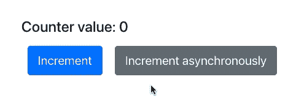
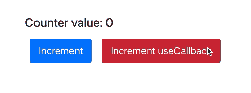
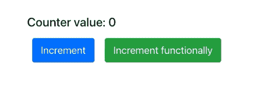

# 在使用功能更新之前，您不知道使用状态

> 原文：<https://betterprogramming.pub/you-dont-know-usestate-until-you-ve-used-functional-updates-5da52117620f>

## 何时我们可能需要使用状态功能更新以及如何使用它们


找到合适的工具通常是成功的一半。作者照片。

当我们需要保持任何状态时，`useState`是现今 React 中最常见的解决方案。它返回当前状态值和更新它的方法:

```
const [state, setState] = useState(initialValue);
```

大多数情况下，`setState`是以一种简单的方式使用的，当我们调用它时，我们希望状态值作为参数传递:`setState(newState)`。
大多数情况下很简单也很充分。

然而，这并不是用`setState`修改状态的唯一方法。在关于`useState`的 React 文档中，有一段解释了更新状态的函数方式:[函数更新](https://reactjs.org/docs/hooks-reference.html#usestate)。

基本上，它们让你传递一个函数给`setState`而不是一个值。该函数将接收当前状态作为第一个参数，返回值将变成一个新状态，如下所示:

```
setState(currentState => {
  const newState = modify(currentState);
  return newState;
});
```

# 什么时候我可能需要使用功能更新？

如果我们在同步环境中操作，大多数时候，一个常规的`setState`就足够了。当应用程序的多个部分共享状态，并且我们必须使用异步函数时(例如，当发出 API 请求时)，事情就变得复杂了。

换句话说，当我们调用一个异步函数并到达调用`setState`的点时，我们用来计算新状态的其他变量可能已经过时了。

# 例子

出于本文的目的，让我们假设我们正在构建一个简单的计数器。当点击按钮时，它将增加。

我们将有两个按钮:一个只是立即增加计数器，另一个超时(例如，模仿正在进行的 API 调用)。


我们将要建造的柜台

# 履行

## 常规设置状态

让我们从一个简单的同步按钮开始增加计数器:

它是这样工作的:


简单的计数器。

## 添加异步调用

现在，让我们添加第二个按钮，它将异步递增计数器。我们将使用下面的`wait`辅助函数来模拟一个异步函数调用，该调用在指定的时间段后结束:

让我们创建递增函数`async`，等待一段时间，然后像我们对第一个按钮所做的那样递增计数器:

我们使函数异步，我们可能认为这应该做的工作。但是让我们来看看结果:



具有直接异步增量的计数器

我们递增计数器，然后点击异步计数器，再递增几次。为什么计数器的最终状态是`2`？

当调用`handleIncrementAsync`时，`counter`值为`1`。该值将在函数的整个生命周期中被记住。这就是为什么我们最后得到了`2`。当`await wait()`结束时，我们仍然引用旧值(`1`)并递增该值。

## 是否使用帮助回调？

起初，我们可能认为`useCallback`会有助于解决这种情况。将`counter`作为一个依赖项应该会使函数引用成为最新的值。让我们试试下面的代码:



使用基于回调的异步增量的计数器

同样的情况仍然会发生，即使`counter`在依赖数组中。每当它改变时，`handleIncrementCallback`确实被更新，但是只有“新的”函数调用利用了这一点。如果我们有一个已经运行的函数(就像我们一样，因为对“Increment useCallback”处理程序的第一次调用仍在等待`wait`完成)，这没有什么区别。

## 功能更新

现在让我们探索另一种调用`setCounter`的方法。正如开头提到的，它可以接受一个函数而不是一个值。React 将调用该函数，并将状态的当前版本作为参数传递。这种方式被称为[功能更新](https://reactjs.org/docs/hooks-reference.html#functional-updates)让我们回顾一下:

```
setState(currentState => {
  const newState = modify(currentState);
  return newState;
});
```

在我们的例子中，`currentState`将代表计数器的实际值。让我们修改代码并使用功能更新方法:

我们这样调用`setCounter`:`setCounter(_counter => _counter + 1)`。
`_counter`值将代表调用`setCounter`时计数器的最新值。我们来看看效果:



具有异步功能更新的计数器

总共有六次点击:

*   两秒钟后第一个异步递增的
*   当我们等待`wait`解决时，点击五次实例化“增量”。

当`wait`结束时，计数器值为`5`。该值被传递给函数更新调用。作为一个效果，我们正确地计算了所有的点击。

## 小奖励

当我们使用函数更新时，首先重用状态变量名是有意义的。例如:

```
const [counter, setCounter] = useState(0);
// ...
function handleIncrement() {
  setCounter(counter => counter + 1);
}
```

但是从外部范围隐藏(重用)变量并不是一个好的做法。我们可以使用`_`或者——更好的是——`current`作为变量的前缀，但是以我的拙见，它看起来还是不够好:

```
setCounter(_counter => counter + 1);
setCounter(currentCounter => currentCounter + 1);
```

就我个人而言，我建议将增量操作提取到一个单独的函数中，并将其传递给`setCounter`:

```
function increment(value) {
  return value + 1;
}// ...setCounter(increment);
```

# 摘要

我们已经学习了使用功能更新来更新状态的不同方法。我们还强调了为什么使用`useCallback`的类似方法在这种情况下不是正确的解决方案。

现在，每当您需要多个异步函数共享一个状态时，您就有了一个解决方案来以方便的方式处理这种情况。

像往常一样，整个项目都在一个 [GitHub 库](https://github.com/tfiechowski/use-state-functional-updates-tutorial)中。

感谢你坚持到文章的结尾。欢迎在评论中发表你的观点。我非常开放，渴望听到你的反馈，无论是积极的还是消极的！