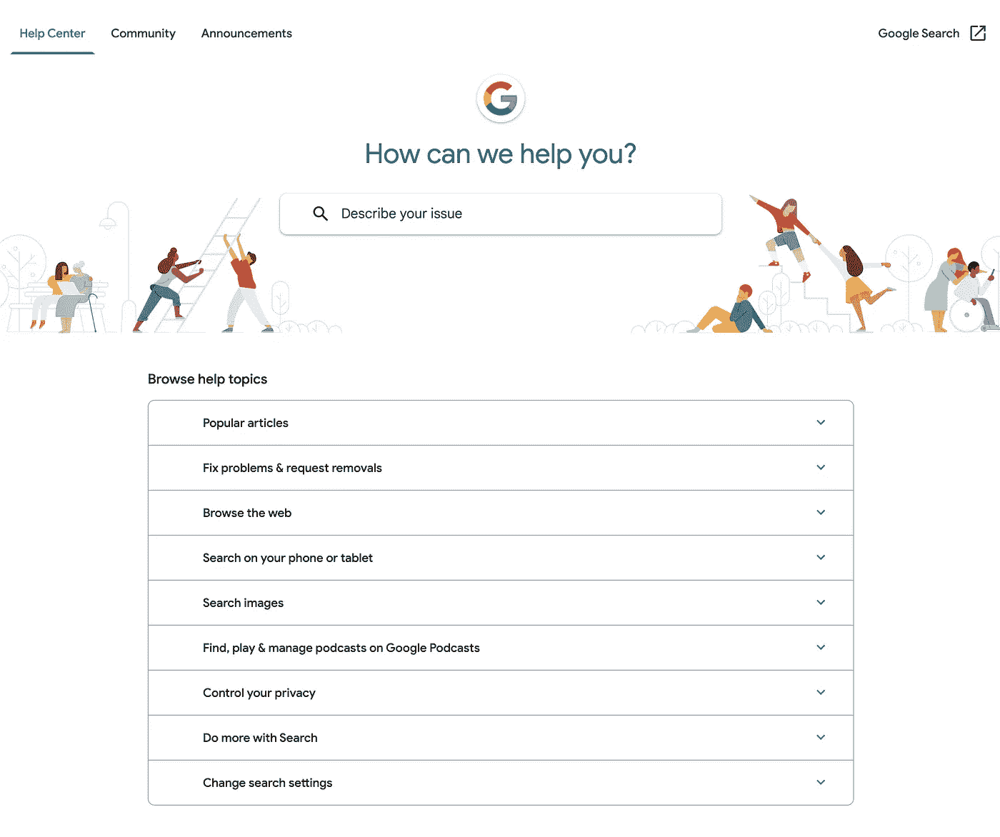
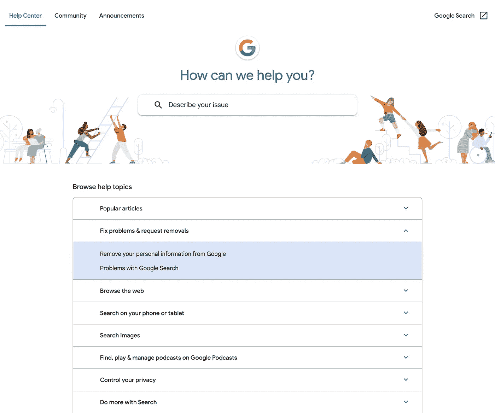

# 你不需要图书馆来放手风琴

> 原文：<https://betterprogramming.pub/you-dont-need-a-library-for-accordions-453961a90c2d>

## 用 JavaScript 构建您自己的本地用户界面


【unsplash.com】@ cookiethepom/

在本系列中，我将介绍不同的常见用例场景，在这些场景中，您的第一个想法可能是使用一个库或从头开始完全定制一些东西，即使有实现这些的本地方法。

查看本系列文章的完整列表:

*   你不需要进度条库
*   [你不需要手风琴图书馆](/you-dont-need-a-library-for-accordions-453961a90c2d)

其中一个非常常见的用例是生成一个手风琴。你知道，就是那些标题很短，打开或展开后可以显示更多信息的。

这些通常用在 FAQ 部分，在那里你有一堆问题/主题和解释或答案。看看谷歌的搜索帮助是什么样子的。



谷歌的搜索帮助(折叠)



[谷歌搜索帮助](https://support.google.com/websearch)(一个手风琴展开)

你知道有一个原生的 HTML 元素可以让你生成吗？嗯，准确地说是两个，你必须一起使用它们。它们是`details`和`summary`元素。

如果你去查看谷歌的搜索帮助，你会看到他们使用标题的`h3`元素和每个选项的`div`来生成手风琴。让我们继续向这些人展示如何正确地编写该部分的代码！我们走吧。

不过首先，让我们看看这些原生元素在不同的浏览器中是什么样子的。老实说，彼此之间没有太多的差异。


苹果操作系统——火狐 94


macOS — Chrome 97


macOS — Safari 15

检查以下代码片段。我用它来生成上面的截图，这是我们自己的基本谷歌搜索帮助，只使用了原生 HTML 元素。

我们自己的基本谷歌搜索帮助

那很容易，不是吗？

正如您在代码片段的 HTML 选项卡中看到的，生成 accordion 的基本结构如下:

```
<details>
  <summary>Summary or title</summary>
  <p>Details that will be shown once this element is clicked</p>
</details>
```

我们刚刚开始模仿谷歌页面的旅程。目前，这不是你在网上看到的最吸引人的东西，但是别担心，我会帮你搞定的！

让我们给前面的代码添加一些样式。看看这个。

我们自己的谷歌搜索有助于一些很酷的风格

请注意我是如何添加了几个类和一个助手`div`来使我的生活变得更容易，尽管它们并不是绝对必要的。

即使这已经是谷歌搜索帮助的一个不那么糟糕和有效的副本，我们也可以通过添加一些更多的细节来不断改进它，例如圆形边框和自定义列表标记。

我们自己的谷歌搜索帮助完全定型

好吧，现在看起来不错，是吧？是的，我知道那些给边框添加半径的技巧有点过分了，但是这是 CSS，你还期望什么呢？

我们就快成功了，只需要做一些最后的调整。你可能已经注意到了，在谷歌的搜索帮助上，当你打开一个主题并试图点击另一个主题时，第一个主题被关闭了。这是本机元素无法提供的，所以我们必须使用 JavaScript 来实现。

也就是说，看看我们自己的 Google 搜索帮助的完整版本，只用了原生元素和几行 JS 就实现了。

我们自己的谷歌搜索帮助

值得一提的是，根据[caniuse.com](https://caniuse.com/)，95%以上的浏览器都支持这个元素，所以继续使用它吧！


[https://caniuse.com/details](https://caniuse.com/details)

我希望这对你有帮助！干杯，编码快乐！