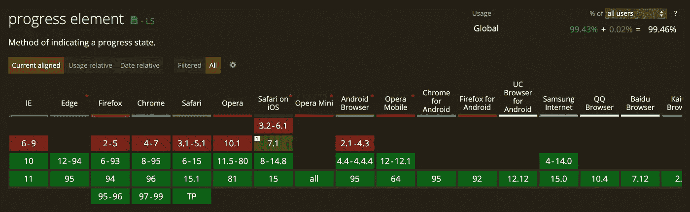

# 你不需要进度条库

> 原文：<https://betterprogramming.pub/you-dont-need-a-library-for-progress-bars-ed589d0671f4>

## 用 JavaScript 构建您自己的本地用户界面

[@ cookiethepom](https://unsplash.com/@cookiethepom)/[unsplash.com](https://unsplash.com/)

在本系列中，我将介绍不同的常见用例场景，在这些场景中，您的第一个想法可能是使用一个库或从头开始完全定制一些东西，即使有实现这些的本地方法。

查看本系列文章的完整列表:

*   [你不需要进度条库](/you-dont-need-a-library-for-progress-bars-ed589d0671f4)
*   你不需要图书馆来存放手风琴

让我告诉你一件在网上很常见的事情:跟踪进度。它可能是一项任务的进展，比如下载你已经等了几个月的全新游戏。这可能是为你准备晚餐汉堡的送货员的进步。可能是很多事情。

我确信你已经在某个时候实现了某种跟踪器，并且需求总是相似的:“我们必须显示 X 的进度，所以我们将显示进度条和完成百分比”。我也确信你使用了一个库或者几个带 javascript 的 div 来使它工作。别误会我的意思，这没什么不好的，很好。但是，如果我告诉你有一个本地 HTML 元素可以做到这一点呢？是的，你也可以设计它。

我说的是`<progress></progress>`元素。这是 HTML5 中引入的原生元素，它允许我们使用两种不同的模式来跟踪进度，确定和不确定。

这是主流浏览器默认情况下确定版本的样子。

苹果操作系统——火狐 94

macOS — Chrome 96

macOS — Safari 15

很酷吧？这是确定版本和不确定版本的代码外观。

本机默认进度条

毫不费力！

让我们更进一步，让我们的本地进度条更吸引人一点，给它一些自定义的风格。

查看下一个例子，我设计了一个确定的进度条

本机风格的进度条

现在看起来好多了，它甚至还有实际进度的百分比。

现在，让我们把它投入到工作中，让它随着进度的更新而更新。查看下面的例子，在这个例子中，我使用普通的 javascript 每秒更新一次进度。

本机完全工作进度条

值得一提的是，根据[caniuse.com](https://caniuse.com/)，99%以上的浏览器都支持这个元素，所以继续使用它吧！

[https://caniuse.com/progress](https://caniuse.com/progress)

我希望这对你有帮助！如果您对进度条元素有任何问题，对下一个元素有任何建议，或者只是想保持联系，请留言。

干杯，编码快乐！