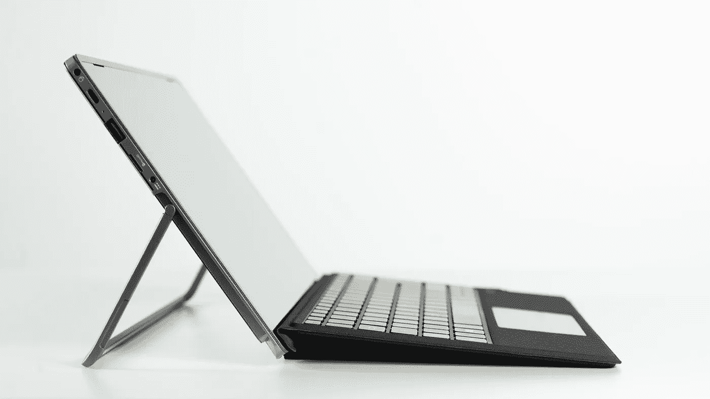
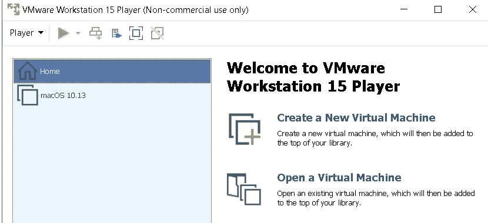
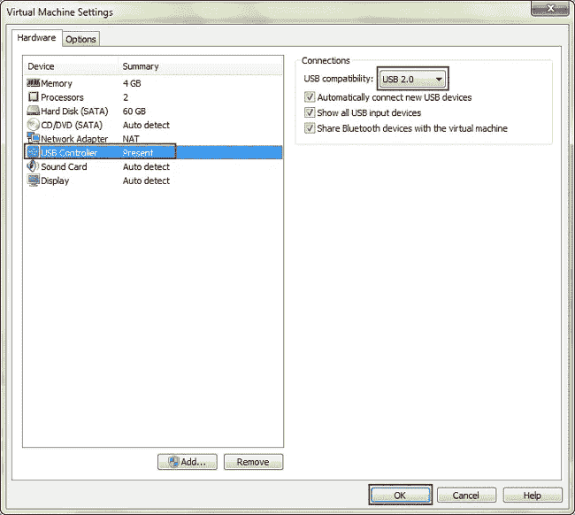
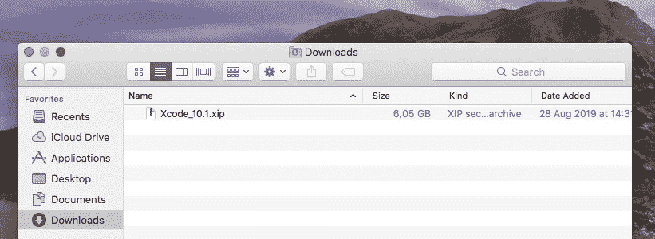
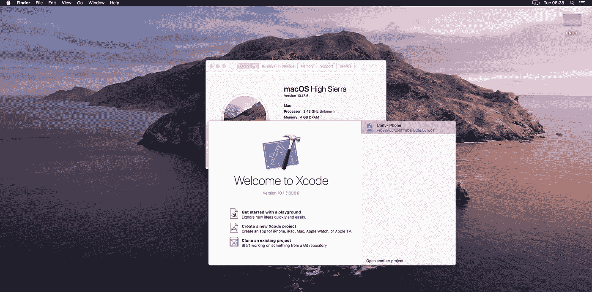

# 开发 iOS 应用需要 Mac 吗？

> 原文：<https://betterprogramming.pub/you-dont-need-a-mac-to-develop-your-ios-app-9170fe68f6b9>

## 不再是了，您只需要一台虚拟机和正确的提示

莱昂·塞伯特在 [Unsplash](https://unsplash.com/search/photos/windows-pc?utm_source=unsplash&utm_medium=referral&utm_content=creditCopyText) 上拍摄的照片

# 放弃

本文仅用于教育目的，旨在证明无需购买 Mac 就可以用 [Xcode](https://developer.apple.com/xcode/) 测试 iOS 应用程序。但是，在将应用程序发布到 App Store 之前，您应该考虑在真实的 MacOS 设备上进行测试。

# 获得第一台“Mac”的所有步骤

好了，现在让我们来看看“Mac”是如何制造的。

## 要求

你需要一台运行 Windows 或 Linux(未经测试)的电脑和一台 iOS 设备(iPad 或 iPhone)。还要求:

1.  VMWare 或 VirtualBox
2.  USB 2.0，不是 3.0
3.  苹果开发者账户
4.  Xcode 10.1(无其他版本)

## VMWare 还是 VirtualBox？

在不同的虚拟机系统如 [VMWare](https://www.vmware.com/) 和 [VirtualBox](https://www.virtualbox.org/) 上测试了各种 MacOS 版本后，我发现最快的解决方案是 VMWare Player 15 和 High Sierra 10.13。

较新版本的 MacOS 极大地降低了系统的性能，可能是由于较新的图形驱动程序与 VM 软件不是 100%兼容。

## 第一步

第一步是安装您的虚拟机:

*   [如何在 VMWare 13 上安装 Mac OS High Sierra](https://www.wikigain.com/install-macos-sierra-vmware/)
*   [如何在 Virtualbox 上安装 Mac OS High Sierra](https://www.wikigain.com/install-macos-sierra-10-12-virtualbox/)

## 切换 USB

在您的虚拟机完全连接并处于活动状态后，您将需要尝试连接到真实的 iOS 设备。

在 VMWare 上，你必须将 USB 模式从 3.0 切换到 2.0，才能让“Mac”看到你的苹果设备。

处理好之后，重启虚拟机并连接设备，同时在虚拟机中打开 iTunes。几秒钟后，您应该会看到设备与之配对。

## 苹果开发者账户

接下来，你需要准备你的苹果开发者账户。别担心，当你在本地设备上测试应用程序时，它是免费的。你只需要付费就可以在 App Store 上发布你的应用。

1.  在[developer.apple.com](https://developer.apple.com/account/)登记
2.  登录并进入[developer.apple.com/download/more/](https://developer.apple.com/download/more/)
3.  搜索 Xcode 10.1 并下载[这个 XCode zip 文件](https://download.developer.apple.com/Developer_Tools/Xcode_10.1/Xcode_10.1.xip)，大约 5.6GB
4.  解压缩文件，并将应用程序文件移动到应用程序文件夹。

## Xcode 版本必须是 10.1

除了 10.1 版本，您不应该下载任何版本的 Xcode。

这是因为新版本在 High Sierra 10.13.6 上不受支持。[有些人](https://codewithchris.com/xcode-update/)已经可以使用最新版本，但这需要修改一些应用文件，只会让操作变得更加困难。

但是，如果您使用的是 10.1 版本，那么您只需几分钟就可以编写代码，而不是几个小时。

## **获得一些支持**

使用 Xcode 10.1 有一个缺点。

它不支持新的 iOS 版本，如 iOS 12 或 13。因此，如果你试图在装有 iOS 13 的 iPhone 上运行你的应用程序，你会得到一个警告，说它不能在那台设备上安装。

幸运的是，由于 Github 上的这个令人敬畏的库，有一个非常简单的修复方法。打开您的终端，键入以下命令:

轻松点。

# 魔术完成了！您的个人 MacOS 运行在您的首选操作系统中

# **资源和参考资料**

*   [https://www . isunshare . com/MAC/VMware-MAC-OS-x-not-recognize-IOs-device . html](https://www.isunshare.com/mac/vmware-mac-os-x-not-recognize-ios-device.html)
*   [https://developer.apple.com/download/more/](https://developer.apple.com/download/more/)
*   [https://github.com/iGhibli/iOS-DeviceSupport](https://github.com/iGhibli/iOS-DeviceSupport)