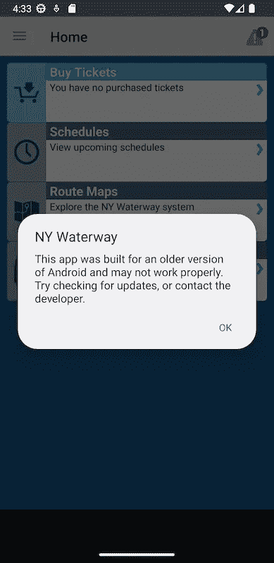

# 您必须是 64 位才能乘坐此渡轮

> 原文：<https://betterprogramming.pub/you-must-be-64-bit-to-ride-this-ferry-61ed45c57a93>

## 逆向工程的像素 7 更新纽约水路应用程序


麦克斯韦·里奇韦在 [Unsplash](https://unsplash.com?utm_source=medium&utm_medium=referral) 上拍摄的照片

> **TLDR** :如果你有更新的 Android 设备，不允许你安装 NY Waterway，你可以**下载** [**我的修改版应用**](https://drive.google.com/file/d/1k4sC932ZZDepRbTJ3wCLZxJR1NsQMa_s/view?usp=share_link) 。你应该始终小心安装随机应用程序，尤其是来自官方 Play Store 之外的来源——就像这篇由一个你从未听说过的随机家伙写的文章。如果您想特别小心，您可以提前阅读，看看 APK 是如何修改的(如果您愿意，甚至可以自己重复这些步骤)。

2019 年， [Google 对 Play Store 中所有新的和更新的应用做出了 64 位支持要求](https://android-developers.googleblog.com/2019/01/get-your-apps-ready-for-64-bit.html)。从 2021 年 8 月开始，不支持 64 位架构的应用程序将无法在 Play Store 中用于 64 位设备。值得注意的是，[新的 Pixel 7 和 Pixel 7 Pro 根本不支持安装仅 32 位的应用](https://android-developers.googleblog.com/2022/10/64-bit-only-devices.html)*。*

*对于乘坐哈德逊河渡轮的纽约人来说，这相当不方便，因为在你的手机上提供电子船票的应用程序[NY Waterway](https://play.google.com/store/apps/details?id=co.bytemark.nywaterway)*实在是太老了*。它最近一次发布是在 2018 年 6 月，只包含 32 位架构的原生库……因此，对于新 Pixel 设备的用户来说，**哈德逊河轮渡**没有电子票给你！*

*我在很多年前就开始使用 iPhone 了，但是当我还是 Android 用户的时候，我经常修改操作系统和应用程序——安装定制的 rom 和反编译应用程序。我的一个好朋友有了新的 Pixel 7 Pro，并且一直乘坐哈德逊河渡轮，所以他开玩笑地敦促我为他修复这个应用程序。开始了。*

# *窥视应用程序*

*让我们从检查 NY Waterway 应用程序开始，以确定只有 32 位的部分，这些部分阻止了它的安装。使用`[apktool](https://ibotpeaches.github.io/Apktool/)`，我们可以提取 Android 应用程序并检查其代码。*

```
*$ apktool d ./NYWaterway.apk
I: Using Apktool 2.6.1 on NYWaterway.apk
I: Loading resource table...
I: Decoding AndroidManifest.xml with resources...
I: Loading resource table from file: /Users/joeywatts/Library/apktool/framework/1.apk
I: Regular manifest package...
I: Decoding file-resources...
I: Decoding values */* XMLs...
I: Baksmaling classes.dex...
I: Copying assets and libs...
I: Copying unknown files...
I: Copying original files...
$ cd ./NYWaterway
$ ls -l
total 72
-rw-r--r--    1 joeywatts  staff   8797 Nov 21 18:37 AndroidManifest.xml
-rw-r--r--    1 joeywatts  staff  21382 Nov 21 18:37 apktool.yml
drwxr-xr-x   14 joeywatts  staff    448 Nov 21 18:37 assets
drwxr-xr-x    5 joeywatts  staff    160 Nov 21 18:37 lib
drwxr-xr-x    4 joeywatts  staff    128 Nov 21 18:37 original
drwxr-xr-x  178 joeywatts  staff   5696 Nov 21 18:37 res
drwxr-xr-x   10 joeywatts  staff    320 Nov 21 18:37 smali
drwxr-xr-x   10 joeywatts  staff    320 Nov 21 18:37 unknown*
```

*`apktool`将输出一个新目录，其中包含从二进制文件反编译成人类可读的基于文本的格式 Smali 的应用程序字节码、捆绑的资源(比如图像)、本地库和应用程序配置。Smali 可能看起来很可怕，但它比你想象的更容易接近——稍后会详细介绍……现在，让我们专注于修复 64 位兼容性。要做到这一点，我们需要了解正在使用哪些本地库。*

# *64 位兼容性和本地库*

*Android 应用程序通常是用 Java 或 Kotlin 编写的，这两种语言都面向 Java 虚拟机，这是一种高级抽象，通常可以让您不必担心特定于平台的兼容性。然而，您可以使用 *Java 本地接口* (JNI)来调用本地的、特定于平台的代码(通常由 C 或 C++等低级语言编译)。如果我们查看`libs`目录，我们可以看到纽约水道应用程序中包含的本地库。*

```
*$ ls -lR lib/*
lib/armeabi:
total 8352
-rw-r--r--  1 joeywatts  staff   177900 Nov 21 18:37 libdatabase_sqlcipher.so
-rw-r--r--  1 joeywatts  staff  1369284 Nov 21 18:37 libsqlcipher.so
-rw-r--r--  1 joeywatts  staff  2314540 Nov 21 18:37 libsqlcipher_android.so
-rw-r--r--  1 joeywatts  staff   402604 Nov 21 18:37 libstlport_shared.so

lib/armeabi-v7a:
total 2552
-rw-r--r--  1 joeywatts  staff  1303788 Nov 21 18:37 libsqlcipher.so

lib/x86:
total 14616
-rw-r--r--  1 joeywatts  staff  1476500 Nov 21 18:37 libdatabase_sqlcipher.so
-rw-r--r--  1 joeywatts  staff  2246448 Nov 21 18:37 libsqlcipher.so
-rw-r--r--  1 joeywatts  staff  3294132 Nov 21 18:37 libsqlcipher_android.so
-rw-r--r--  1 joeywatts  staff   455740 Nov 21 18:37 libstlport_shared.so*
```

*我们可以看到`lib`下有三个目录，分别对应不同的平台:`x86`、`armeabi`、`armeabi-v7a`。这三个平台都是 32 位的。绝大多数 Android 设备(基本上所有手机)都使用 ARM 架构。“armeabi”是遗留的 ARM 架构(Android 不再支持)。ARM V7(“ARM eabi-v7a”)是 32 位 ARM 架构。对于 64 位 ARM 支持，我们期望有一个`arm64-v8a`文件夹。*

*这里的另一个观察是`armeabi`和`x86`有四个库，而`armeabi-v7a`只有一个。对于要由 Android 应用程序加载的库，它必须调用`java.lang.System.loadLibrary`或`java.lang.Runtime.loadLibrary`。在 Smali 代码中搜索“loadLibrary ”,只能找到一个加载本地库的地方。*

```
*$ grep -r loadLibrary smali/
smali//net/sqlcipher/database/SQLiteDatabase.smali:    invoke-static {v0}, Ljava/lang/System;->loadLibrary(Ljava/lang/String;)V
$ grep loadLibrary -A 2 -B 3 smali/net/sqlcipher/database/SQLiteDatabase.smali
    :try_start_0
    const-string v0, "sqlcipher"

    invoke-static {v0}, Ljava/lang/System;->loadLibrary(Ljava/lang/String;)V
    :try_end_0
    .catchall {:try_start_0 .. :try_end_0} :catchall_0*
```

*唯一由应用程序直接加载的库是“sqlcipher”(`libsqlcipher.so`)。为某些架构列出的其他库文件要么是未使用的，要么只是`libsqlcipher.so`的可传递依赖。*

*我们需要一个 64 位 ARM 构建的`lib/arm64-v8a`中的`libsqlcipher.so`来使应用程序与新的像素设备兼容。方便的是，SQLCipher 是一个开源库。查看用于与本地 sqlcipher 库交互的高级粘合代码，我们可以看到所使用的库的版本。*

```
*$ grep -ri version smali/net/sqlcipher 
smali/net/sqlcipher/database/SQLiteDatabase.smali:.field public static final SQLCIPHER_ANDROID_VERSION:Ljava/lang/String; = "3.5.4"*
```

*在对开源 repo 做了一些快速挖掘后，我可以看到真正的 64 位支持[是在 v3.5.5](https://github.com/sqlcipher/android-database-sqlcipher/compare/v3.5.4...v3.5.5) 中实现的(比 NY Waterway 中使用的版本更新了一个补丁版本)。我们试试升级吧！*

## *将 SQLCipher 升级到 v3.5.5*

*升级过程包括用新版本的代码替换 SQLCipher Smali 代码和本地库。如果 SQLCipher 的公共 API 表面发生显著变化，这将导致问题(例如，如果 NY Waterway 使用的公共函数更改了签名或被删除，那么用新版本替换它将导致问题)。快速浏览一下从 v3.5.4 到 v3.5.5 的变化，这里似乎不会出现问题。我下载了 SQLCipher v3.5.5 的 AAR 文件[，然后用`unzip`解压。](https://search.maven.org/artifact/net.zetetic/android-database-sqlcipher/3.5.5/aar)*

```
*$ mkdir ../sqlcipher && cd ../sqlcipher
$ unzip ~/Downloads/android-database-sqlcipher-3.5.5.aar
Archive:  /Users/joeywatts/Downloads/android-database-sqlcipher-3.5.5.aar
  inflating: AndroidManifest.xml     
   creating: res/
  inflating: classes.jar             
   creating: jni/
   creating: jni/arm64-v8a/
   creating: jni/armeabi/
   creating: jni/armeabi-v7a/
   creating: jni/x86/
   creating: jni/x86_64/
  inflating: jni/arm64-v8a/libsqlcipher.so  
  inflating: jni/armeabi/libsqlcipher.so  
  inflating: jni/armeabi-v7a/libsqlcipher.so  
  inflating: jni/x86/libsqlcipher.so  
  inflating: jni/x86_64/libsqlcipher.so*
```

*提取之后，我们看到在`jni`目录下是本地库。它还输出一个包含所有调用本地库的 Java 类文件的`classes.jar`文件。这些不是小文件，所以我们需要转换这些代码，以便将其转换成`apktool`能够理解的格式。*

*Android SDK 提供了一个名为`d8`的命令行工具，可以将`jar`文件编译成 Android 字节码(`classes.dex`文件)。还有一个叫做`[baksmali](https://github.com/JesusFreke/smali)`的工具可以将`dex`文件反编译成`smali`。将这些步骤结合在一起:*

```
*$ export ANDROID_HOME=/Users/joeywatts/Library/Android/sdk
$ $ANDROID_HOME/build-tools/33.0.0/d8 classes.jar \
   --lib $ANDROID_HOME/platforms/android-31/android.jar
$ java -jar ../baksmali.jar dis ./classes.dex*
```

*这会产生一个包含库的 Smali 代码的`out`目录。因此，我们可以简单地将`smali/net/sqlcipher`替换为`out/net/sqlcipher`，将`lib`目录替换为`jni`。*

```
*$ rm -r ../NYWaterway/smali/net/sqlcipher ../NYWaterway/lib
$ mv out/net/sqlcipher ../NYWaterway/smali/net/sqlcipher
$ mv jni ../NYWaterway/lib*
```

# *构建和运行修改后的应用程序*

*现在，我们可以重新构建应用程序并对其进行签名，这样它就可以安装在设备上了！*

```
*$ cd ../NYWaterway
$ apktool b .
$ keytool -genkey -v -keystore my-release-key.keystore -alias alias_name \
    -keyalg RSA -keysize 2048 -validity 10000
$ $ANDROID_HOME/build-tools/33.0.0/apksigner sign \
    --ks my-release-key.keystore ./dist/NYWaterway.apk*
```

*安装`./dist/NYWaterway.apk`后，显示这个画面！*

**

*它跑了！我们确实有这个唠叨的弹出窗口😔*

# *增加目标 SDK 版本*

*为了摆脱这个表明应用程序是为旧版本 Android 构建的弹出窗口，我们需要在`apktool.yml`中增加目标 SDK 版本。Play Store 不再接受针对 SDK 版本< 31 的应用，所以我选择将其增加到那个版本。*

*针对较新版本的 Android SDK 可能需要更改代码，因为不推荐使用的 API 在较新的 SDK 版本中变得不可用。NY Waterway 需要针对 SDK v31 进行一些更改。*

## *更安全的组件导出*

> *[如果您的应用面向 Android 12 或更高版本，并且包含使用意图过滤器的活动、服务或广播接收器，您必须为这些应用组件显式声明](https://developer.android.com/about/versions/12/behavior-changes-12#exported) `[android:exported](https://developer.android.com/about/versions/12/behavior-changes-12#exported)` [属性。](https://developer.android.com/about/versions/12/behavior-changes-12#exported)*

*有几个活动和一个接收者有`<intent-filter>` s，需要在`AndroidManifest.xml`中添加一个`android:exported="true"`属性。*

## *待定意向可变性*

> *[如果你的应用面向 Android 12，你必须指定你的应用创建的每个](https://developer.android.com/about/versions/12/behavior-changes-12#pending-intent-mutability) `[PendingIntent](https://developer.android.com/about/versions/12/behavior-changes-12#pending-intent-mutability)` [对象的可变性。这一额外要求提高了应用程序的安全性。](https://developer.android.com/about/versions/12/behavior-changes-12#pending-intent-mutability)*

*这一个更棘手，因为它要求我们更改实际的代码(与项目配置或复制库的升级版本相反)。*

*任何时候创建一个`PendingIntent`对象，它都需要明确指定`FLAG_MUTABLE`或`FLAG_IMMUTABLE`。在以前的 SDK 版本中，如果没有指定标志，`FLAG_MUTABLE`是默认的。`PendingIntent`对象由类上的一组静态方法创建:`getActivity`、`getActivities`、`getBroadcast`或`getService`。我们可以从搜索这些函数的调用开始。*

```
*$ grep -r -E "PendingIntent;->(getActivity|getActivities|getBroadcast|getService)" smali
smali/android/support/v4/f/a/ac.smali:    invoke-static {p1, v2, v0, v2}, Landroid/app/PendingIntent;->getBroadcast(Landroid/content/Context;ILandroid/content/Intent;I)Landroid/app/PendingIntent;
smali/com/google/firebase/iid/r.smali:    invoke-static {p0, p1, v0, p4}, Landroid/app/PendingIntent;->getBroadcast(Landroid/content/Context;ILandroid/content/Intent;I)Landroid/app/PendingIntent;
smali/com/google/firebase/iid/m.smali:    invoke-static {p0, v2, v0, v3}, Landroid/app/PendingIntent;->getBroadcast(Landroid/content/Context;ILandroid/content/Intent;I)Landroid/app/PendingIntent;
smali/com/google/firebase/messaging/c.smali:    invoke-static {v0, v2, v1, v3}, Landroid/app/PendingIntent;->getActivity(Landroid/content/Context;ILandroid/content/Intent;I)Landroid/app/PendingIntent;
smali/com/google/android/gms/common/m.smali:    invoke-static {p1, p3, v0, v1}, Landroid/app/PendingIntent;->getActivity(Landroid/content/Context;ILandroid/content/Intent;I)Landroid/app/PendingIntent;
smali/com/google/android/gms/common/api/GoogleApiActivity.smali:    invoke-static {p0, v0, v1, v2}, Landroid/app/PendingIntent;->getActivity(Landroid/content/Context;ILandroid/content/Intent;I)Landroid/app/PendingIntent;
smali/com/google/android/gms/c/cbx.smali:    invoke-static {v1, v2, v0, v3}, Landroid/app/PendingIntent;->getActivity(Landroid/content/Context;ILandroid/content/Intent;I)Landroid/app/PendingIntent;
smali/com/google/android/gms/c/cbx.smali:    invoke-static {v2, v7, v1, v7}, Landroid/app/PendingIntent;->getBroadcast(Landroid/content/Context;ILandroid/content/Intent;I)Landroid/app/PendingIntent;
smali/com/google/android/gms/c/v.smali:    invoke-static {v0, v1, v2, v3}, Landroid/app/PendingIntent;->getActivity(Landroid/content/Context;ILandroid/content/Intent;I)Landroid/app/PendingIntent;
smali/com/google/android/gms/c/bj.smali:    invoke-static {v1, p2, v0, v2}, Landroid/app/PendingIntent;->getActivity(Landroid/content/Context;ILandroid/content/Intent;I)Landroid/app/PendingIntent;
smali/com/google/android/gms/c/byd.smali:    invoke-static {v1, v4, v0, v4}, Landroid/app/PendingIntent;->getBroadcast(Landroid/content/Context;ILandroid/content/Intent;I)Landroid/app/PendingIntent;
smali/com/google/android/gms/c/mr.smali:    invoke-static {v1, v3, v0, v3}, Landroid/app/PendingIntent;->getBroadcast(Landroid/content/Context;ILandroid/content/Intent;I)Landroid/app/PendingIntent;*
```

*不少！幸运的是，大多数都是相当简单的变化。我们只需要先了解一点字节码。*

## *理解 Smali*

*`invoke-static`字节码指令将一系列寄存器作为参数传递给静态函数。静态函数的符号看起来像`Landroid/app/PendingIntent;->getBroadcast(Landroid/content/Context;ILandroid/content/Intent;I)Landroid/app/PendingIntent;`,它是完全限定类名和函数签名的直接翻译。它以类名`Landroid/app/PendingIntent;`(或普通 Java 语法中的`android.app.PendingIntent`)开始。然后是函数名(`->getBroadcast`)以及参数和返回类型。`Landroid/content/Context;ILandroid/content/Intent;I`为参数，可拆分为四个参数:`Landroid/content/Context;`(`android.content.Context`)`I`(`int`)`Landroid/content/Intent;`(`android.content.Intent`)`I`(`int`)。最后，右括号后是返回类型:`Landroid/app/PendingIntent;`。*

*因此，上述函数的`invoke-static {v1, v2, v3, v4}`将通过`v1`作为`Context`、`v2`作为第一个`int`、`v3`作为`Intent`、`v4`作为`int`。对于这些`PendingIntent`API，`flags`总是最后一个参数(`int`)，所以我们只需要确保该值总是设置了`FLAG_MUTABLE`或`FLAG_IMMUTABLE`。 [Android SDK 文档](https://developer.android.com/reference/android/app/PendingIntent#FLAG_MUTABLE)揭示`FLAG_MUTABLE`的值为`0x02000000``FLAG_IMMUTABLE`为`0x04000000`。在大多数情况下，最后一个参数被指定为一个局部变量寄存器(`v#`)，该寄存器被初始化为一个常数值(如`const/high16 v3, 0x8000000`或`const/4 v4, 0x0`)。在这些情况下，我们可以简单地检查`FLAG_MUTABLE`或`FLAG_IMMUTABLE`是否被设置，如果没有，就更新常量。*

```
*-    const/high16 v3, 0x8000000
+    const/high16 v3, 0xA000000

     invoke-static {v1, v2, v0, v3}, Landroid/app/PendingIntent;->getActivity(Landroid/content/Context;ILandroid/content/Intent;I)Landroid/app/PendingIntent;

# you may need to change from const/4 to const/high16 to specify the flag
# const/4 is a loading a signed 4-bit integer (seen used to load 0x0).
# const/high16 loads the high 16-bits from a value (the low 16-bits must be 0)

-    const/4 v4, 0x0
+    const/high16 v4, 0x2000000*
```

*有一种情况(在`com/google/firebase/iid/r.smali`中)是`flags`作为参数(`p#`寄存器)传入的。*

```
*.method private static a(Landroid/content/Context;ILjava/lang/String;Landroid/content/Intent;I)Landroid/app/PendingIntent;
    .locals 2

    new-instance v0, Landroid/content/Intent;

    const-class v1, Lcom/google/firebase/iid/FirebaseInstanceIdInternalReceiver;

    invoke-direct {v0, p0, v1}, Landroid/content/Intent;-><init>(Landroid/content/Context;Ljava/lang/Class;)V

    invoke-virtual {v0, p2}, Landroid/content/Intent;->setAction(Ljava/lang/String;)Landroid/content/Intent;

    const-string v1, "wrapped_intent"

    invoke-virtual {v0, v1, p3}, Landroid/content/Intent;->putExtra(Ljava/lang/String;Landroid/os/Parcelable;)Landroid/content/Intent;

    invoke-static {p0, p1, v0, p4}, Landroid/app/PendingIntent;->getBroadcast(Landroid/content/Context;ILandroid/content/Intent;I)Landroid/app/PendingIntent;

    move-result-object v0

    return-object v0
.end method*
```

*如有必要，更新`p4`以设置`FLAG_MUTABLE`位比跟踪此功能的所有引用直到指定`flags`更容易。为此，我们需要手工编写一些字节码！等效的类似 Java 的代码如下所示:*

```
*if (p4 & (FLAG_IMMUTABLE | FLAG_MUTABLE) == 0) {
    p4 |= FLAG_MUTABLE;
}*
```

*`FLAG_IMMUTABLE | FLAG_MUTABLE`是常数`0x6000000`，我们可以用`const/high16`指令将它加载到寄存器中。我们可以使用`and-int`指令与`p4`进行按位 AND 运算。`if-nez`如果寄存器不等于零，允许您跳转到标签。最后，`or-int`让我们对两个寄存器进行按位“或”运算。Google 有关于 Dalvik 字节码的[文档，这对发现指令及其语法很有用。将所有这些放在一起，我们得到下面的代码，它可以在调用`getBroadcast`之前插入。](https://source.android.com/docs/core/runtime/dalvik-bytecode)*

```
*const/high16 v3, 0x6000000 # v3 = FLAG_IMMUTABLE | FLAG_MUTABLE
and-int v2, p4, v3         # v2 = p4 & v3
if-nez v2, :cond_0         # if (v2 != 0) { goto :cond_0; }
const/high16 v3, 0x2000000 # v3 = FLAG_MUTABLE
or-int p4, p4, v3          # p4 = p4 | v3
:cond_0*
```

*最后，函数顶部的`.locals 2`指令表示应该为此函数分配两个局部变量寄存器(`v0`和`v1`)。因为我们在上面的代码中又用了两个(`v2`和`v3`)，所以需要把这个改成`.locals 4`。*

## *文件系统权限更改*

> *[私有文件的文件权限不应再被所有者放松，而试图使用](https://developer.android.com/about/versions/nougat/android-7.0-changes#permfilesys) `[MODE_WORLD_READABLE](https://developer.android.com/about/versions/nougat/android-7.0-changes#permfilesys)` [和/或](https://developer.android.com/about/versions/nougat/android-7.0-changes#permfilesys) `[MODE_WORLD_WRITEABLE](https://developer.android.com/about/versions/nougat/android-7.0-changes#permfilesys)` [这样做，将会触发](https://developer.android.com/about/versions/nougat/android-7.0-changes#permfilesys) `[SecurityException](https://developer.android.com/about/versions/nougat/android-7.0-changes#permfilesys)` [。](https://developer.android.com/about/versions/nougat/android-7.0-changes#permfilesys)*

*在`com/google/android/gms/ads/identifier/AdvertisingIdClient.smali`有一些使用`MODE_WORLD_READABLE`的`SharedPreferences` API 用法。这很容易解决，因为这是一个从切换到`MODE_WORLD_READABLE` ( `0x1`)到`MODE_PRIVATE` ( `0x0`)的问题。*

```
*--- a/smali/com/google/android/gms/ads/identifier/AdvertisingIdClient.smali
+++ b/smali/com/google/android/gms/ads/identifier/AdvertisingIdClient.smali
@@ -93,7 +93,7 @@

     const-string v4, "google_ads_flags"

-    const/4 v5, 0x1
+    const/4 v5, 0x0

     invoke-virtual {v2, v4, v5}, Landroid/content/Context;->getSharedPreferences(Ljava/lang/String;I)Landroid/content/SharedPreferences;*
```

## *Apache HTTP 客户端弃用*

> *[在 Android 6.0 中，我们移除了对 Apache HTTP 客户端的支持。从 Android 9 开始，这个库从 bootclasspath 中移除，默认情况下对应用程序不可用。](https://developer.android.com/about/versions/pie/android-9.0-changes-28#apache-p)*

*NY Waterway 使用的是 Android 版本的 Apache HTTP 客户端，但是对它的修复非常简单——只是对`AndroidManifest.xml`的另一个改变。*

```
*diff --git a/AndroidManifest.xml b/AndroidManifest.xml
index 1490d73..39ccbf3 100644
--- a/AndroidManifest.xml
+++ b/AndroidManifest.xml
@@ -16,6 +16,7 @@
     <permission android:name="co.bytemark.nywaterway.permission.C2D_MESSAGE" android:protectionLevel="signature"/>
     <uses-permission android:name="co.bytemark.nywaterway.permission.C2D_MESSAGE"/>
     <application android:allowBackup="false" android:icon="@drawable/icon" android:label="@string/app_name" android:name="co.bytemark.nywaterway2.core.NYWWApp" android:theme="@style/AppTheme">
+        <uses-library android:name="org.apache.http.legacy" android:required="false" />
         <meta-data android:name="com.google.android.gms.version" android:value="@integer/google_play_services_version"/>
         <receiver android:exported="false" android:label="NetworkConnection" android:name="co.bytemark.android.sdk.BytemarkSDK$ConnectionChangeReceiver">
             <intent-filter>*
```

## *默认情况下启用网络 TLS*

> *[如果你的 app 目标是 Android 9 或更高版本，](https://developer.android.com/about/versions/pie/android-9.0-changes-28#tls-enabled) `[isCleartextTrafficPermitted()](https://developer.android.com/about/versions/pie/android-9.0-changes-28#tls-enabled)` [方法默认返回](https://developer.android.com/about/versions/pie/android-9.0-changes-28#tls-enabled) `[false](https://developer.android.com/about/versions/pie/android-9.0-changes-28#tls-enabled)` [。如果您的应用需要为特定的域启用明文，您必须在应用的网络安全配置中将这些域的](https://developer.android.com/about/versions/pie/android-9.0-changes-28#tls-enabled) `[cleartextTrafficPermitted](https://developer.android.com/about/versions/pie/android-9.0-changes-28#tls-enabled)` [明确设置为](https://developer.android.com/about/versions/pie/android-9.0-changes-28#tls-enabled) `[true](https://developer.android.com/about/versions/pie/android-9.0-changes-28#tls-enabled)` [。](https://developer.android.com/about/versions/pie/android-9.0-changes-28#tls-enabled)*

*由于这项新的安全功能，网络请求失败。使应用程序兼容的最简单的方法就是对`AndroidManifest.xml`做另一个改变，添加`android:usesCleartextTraffic="true"`属性。*

```
*diff --git a/AndroidManifest.xml b/AndroidManifest.xml
index 39ccbf3..69b4aa7 100644
--- a/AndroidManifest.xml
+++ b/AndroidManifest.xml
@@ -15,7 +15,7 @@
     <uses-permission android:name="com.google.android.c2dm.permission.RECEIVE"/>
     <permission android:name="co.bytemark.nywaterway.permission.C2D_MESSAGE" android:protectionLevel="signature"/>
     <uses-permission android:name="co.bytemark.nywaterway.permission.C2D_MESSAGE"/>
-    <application android:allowBackup="false" android:icon="@drawable/icon" android:label="@string/app_name" android:name="co.bytemark.nywaterway2.core.NYWWApp" android:theme="@style/AppTheme">
+    <application android:allowBackup="false" android:icon="@drawable/icon" android:label="@string/app_name" android:name="co.bytemark.nywaterway2.core.NYWWApp" android:theme="@style/AppTheme" android:usesCleartextTraffic="true">
         <uses-library android:name="org.apache.http.legacy" android:required="false" />
         <meta-data android:name="com.google.android.gms.version" android:value="@integer/google_play_services_version"/>
         <receiver android:exported="false" android:label="NetworkConnection" android:name="co.bytemark.android.sdk.BytemarkSDK$ConnectionChangeReceiver">*
```

# *结论*

*在做了以上所有的修改后，应用程序成功运行，没有一个烦人的弹出窗口说它是为旧版本的 Android 构建的！*

*有点出乎意料的是，使它与较新的目标 SDK 版本一起工作比实际修复 64 位问题要复杂得多，但最终，一切都只是代码，代码没有什么可怕的…*

**想要连接？在* [*Twitter*](https://twitter.com/joeywatts96) *或*[*LinkedIn*](https://www.linkedin.com/in/jwatts96/)*上给我发消息！**