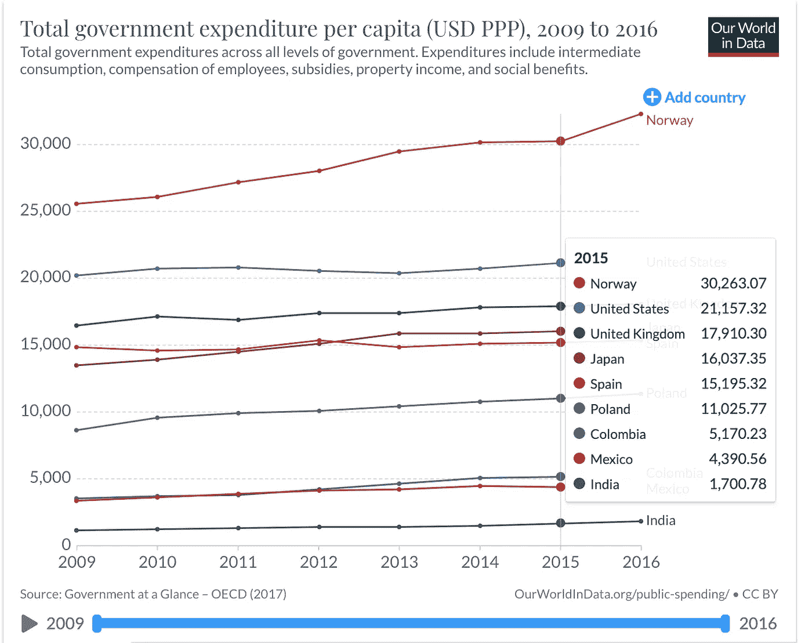

# 你应该期待在新的远程工作岗位上同工同酬

> 原文：<https://betterprogramming.pub/you-should-expect-equal-pay-for-equal-work-at-your-new-remote-job-beaa9a2d29a4>

## 这个问题很难问你的远程雇主，他为你提供基于生活成本的补偿

米歇尔·汉德森在 [Unsplash](https://unsplash.com/?utm_source=unsplash&utm_medium=referral&utm_content=creditCopyText) 上的照片

> *对于团队来说，你在乡下的明星设计师和那些在大城市家庭办公室工作的设计师一样有价值(或许更有价值)。确保她有那种感觉。*
> 
> 同样，作为一名远程工作者，你不应该仅仅因为你住在一个更便宜的城市，就让雇主少付你工资。“同工同酬”可能是一个满是灰尘的口号，但它是有原因的。如果在薪酬方面，你接受了基于地点的二等工人待遇，那么你就为在其他方面受到不良待遇打开了大门。
> 
> ——大卫·海涅梅尔·汉森和杰森·弗里德在[远程](https://www.nityesh.com/books-read/#remote-office-not-required-by-david-heinemeier-hanson)

在这突如其来的疫情，几乎所有的知识工作都变成了在家工作。社会、公司、员工和求职者都已经转向这种新的工作方式。

我为所有新的求职者写这篇文章。这是一个艰难的市场，但无论你将来在哪个遥远的公司工作，你都应该期待同工同酬。我们大多数人可能不会很快得到它——但我相信设定期望值是有价值的。

# 反对基于生活费用的调整的难点

像 Twitter、Shopify 和脸书这样的大公司已经宣布他们将永远采用远程工作。这必然会为其他公司效仿铺平道路。

但与此同时，他们也可能让基于位置的补偿成为常态。

这里有一些棘手的问题要问采用这种做法的雇主。

## #1.为工作中的歧视敞开大门

如果你不住在世界上工资最高的城市，你可能会在公司有一个同行住在比你更贵的城市。你准备好仅仅因为你的地理位置而被当作二等员工对待了吗？

你怎么知道所有糟糕的工作没有被直接交给你，以“投资回报”来衡量是合理的？你的经理有最终决定权——难道他们不会给你一个低风险、低影响的项目，而你的“更昂贵”的同事却被指派一个高风险、高影响的项目？

你所在公司的人力资源部可能会说*“*我们有一项政策，规定我们不会基于员工的工作地点进行歧视。”

这很好，但是沉默的偏见呢？

当你的经理给你分配一个你不喜欢的项目时，你怎么能确定他不是出于好意呢？从投资回报的角度来看，他们难道不会做出明智的决定吗？你能确定他们不会吗？

## #2.各国政府支出的差异

公共支出使政府能够生产和购买商品和服务，以实现其目标——如提供公共产品或重新分配社会保障、教育和医疗等资源。

> *最近的公共支出数据显示，各国之间存在巨大差异。相对于低收入国家，高收入国家的政府支出往往要大得多(人均支出和占国内生产总值的份额)，而且往往更侧重于社会保护。*
> 
> [—我们的数据世界](https://ourworldindata.org/government-spending)

在印度，政府 2015 年的人均支出约为 1700 美元(根据购买力平价调整)；而在挪威等国家，这一数字超过 30，000 美元(根据购买力平价调整)，在美国超过 21，000 美元。

来源:[https://ourworldindata.org/government-spending](https://ourworldindata.org/government-spending)

这种政府支出的不足最终会转嫁到公民身上，他们不得不用自己的钱来支付——所以这反映在他们的生活成本上。

糟糕的公立学校系统意味着员工需要把他们的孩子送到昂贵的私立学校。破损的公立医院基础设施意味着人们需要使用昂贵的私立医院进行医疗保健。在危机时期，许多私营企业并没有脱离暴利。

*基于生活成本的薪酬如何考虑各国政府支出的差异？难道不应该补偿员工这个差价吗？*

## #3.重新安置往好了说会变得复杂，往坏了说会变得不公平

*如果我搬到一个低收入地区，会发生什么？我会得到不同的补偿吗？*

像 GitLab 这样的公司对此相当透明。[是的，你降薪](https://about.gitlab.com/handbook/total-rewards/compensation/#relocating)。

但是如果我住在一个便宜的城市，并决定搬到一个更贵的城市，会发生什么呢？

我问过 Gitlab 的 CEO。他是这样回答的:

我来自印度，我知道低收入国家的很多人会抓住这个机会。

如果我选择成为一名数字流浪者，每隔几个月就更换一次城市，会发生什么？

如果我选择在某个昂贵的城市获得正式地址，而实际上我住在郊区，该怎么办？

## #4:对“生活成本”的定义不严谨

反对远程员工同工同酬的最常见的理由是城市或国家之间的房价差异。

那么如何定义“生活成本”呢？仅仅是房价吗？杂货呢？可能是餐馆账单？

所有这些似乎都不完整——这只是许多人实际生活成本的一小部分。

照顾年迈父母的费用呢？单身生活和已婚生活相比怎么样？就此而言，有一个全职太太和一个高薪工作的太太相比怎么样？

一个人有多少个孩子呢？狗的数量？猫？

*生活费用包括什么？*

更重要的是，谁来定义？应该由员工来承担这些成本吗？还是应该由雇主来支付员工的工资？

## 其他棘手的问题

*谁规定了我花钱的比例？*

大品牌的电子设备不管是在美国还是在巴西销售，价格都是一样的。在世界上的每个城市，Macbook 的价格都是一样的(除了美国以外的人可能需要承担的进口税)。

那么，如果我选择将收入的 10%用于住房支出，30%用于购买世界上最新的科技产品，会怎么样呢？或许另外 40%投资纳斯达克股票？

仅仅因为我 10%的开销就减少我 100%的薪水，这肯定是没有道理的。

公司的领导住在哪里？

提供基于 COL 的薪酬的公司中的领导层通常生活和工作在高工资市场，但如果他们做同样的工作却获得更低的薪酬，他们可能会有不同的感受。

*你如何解释那些不住在初级人才市场的员工机会减少的成本？*

不住在世界科技中心的人可能不得不承受人际网络优势减少和替代工作机会减少的代价。

除非一家公司准备好对所有此类问题给出满意的答案，否则就应该默认同工同酬。

做同样工作，提供同样价值的人应该得到同样的报酬。

很简单。很公平。

一位 COL 雇主:*“但这不现实！”*

事实上，没有。许多远程公司已经在这么做了:

# 反对同工同酬的强硬观点及我的回应

另一方面也有一些棘手的问题。我已经考虑了一段时间，我会试着写一封回信给他们。

## “给生活在世界不同城市的人支付同样的钱，难道不违背市场经济吗？”

不，不是的。相反，我认为同工同酬是默认的市场状态。

事实上，我们已经在很多地方看到了它:

*   自由职业者已经这样生活了很长时间了。在巴厘岛的海滩上为自己创造一个名字，为美国的客户工作。
*   当你创办一家公司时，不管你住在哪里，你的客户都会付钱给你(除非你的产品的价值是特定市场的)。
*   写一本书、教授一门在线课程、付费时事通讯和其他形式的被动收入并不能为创作者带来基于她所居住城市的补贴收入。

这是因为，作为消费者，我们为我们获得的价值买单，而不管提供价值的个人的性别、年龄或地理位置。

因此，自由市场为同等工作支付同等报酬，除非工作的内在价值取决于地理位置(比如当地新闻媒体)。

这很有道理。从不同的地点实际访问互联网对你所能创造的价值没有任何影响。

## “这难道不会导致大量工作岗位离开美国吗？”

我在这里引用[布莱尔·里维斯](http://blairreeves.me/2020/05/22/paying-remote-employees-fairly/)的话:

> “如果其他地方有人能以更低的薪酬把某项工作做得非常好，那么让他们做显然是有商业意义的。我可以清楚地理解，为什么一个在门洛帕克一年挣 50 万美元的脸书工程师会被吓到。”
> 
> “毕竟，海得拉巴、基辅和拉各斯的人也一样聪明，可以胜任其中的大部分工作。从 20 世纪 90 年代开始，我们就听到了一些不祥的警告，软件开发行业正处于将所有工程角色外包的边缘。(说真的，这在 90 年代末被认为是个大问题。)但这不仅没有发生，对美国工程师和其他知识工作者的需求也大幅增长。我认为这种情况将继续下去。我认为，制造主要针对美国受众和公司的产品，让美国员工变得有价值。”

话虽如此，但我确实相信，这一次，这种担心可能并非杞人忧天。我认为这是对美国，尤其是硅谷的真正威胁。

但我也相信，从长远来看，这对每个人都有好处。如果你考虑到它将如何增加城市、国家和政府之间的竞争，那么未来有很大的潜在价值。

竞争性的，而不是垄断性的市场，会给*所有*消费者带来最好的结果。如果你同意这种观点，那么政府间竞争的加剧只会导致世界上每个人生活水平的提高。

[引用](http://investorfieldguide.com/thompson/) Stratechery 的 Ben Thompson:

> [原文]“…这种观点认为，技术越是向外传播，越是不以旧金山为中心，城市之间和政治家之间的竞争就越激烈，影响也越广，我认为我们产生了非常积极的影响。旧金山为什么能经营得这么差？所有这些科技公司都在那里。嗯，没有竞争。他们哪儿也不去。因此，彼此之间只是一种普遍的烦恼状态，并没有实际的变化。”

# 远程工作的未来

> “从长远来看，”马特·莫楞威格说，“我认为市场力量和人才的流动性将迫使雇主停止基于地理位置歧视地理不可知的角色。”他认为，出于“道德和竞争的原因，随着时间的推移，公司将朝着全球公平薪酬的方向发展，其角色可以在任何地方完成。”
> 
> 【Automattic 如何支付不同地理位置的远程员工的工资， [*Techcrunch*](https://techcrunch.com/2020/05/26/how-automattic-pays-its-remote-employees-across-different-geographies/)

不取决于你选择工作的城市的薪酬将很快成为一家远程公司在全球市场吸引人才的决定性因素。最优秀的员工会涌向那些不会因为生活选择而歧视他们的竞争对手。

在(不那么遥远？)未来，我怀疑远程工作会成为所有知识工作者的常态。我们在经济中管理人力资本的方式将会发生全球性的转变。

现在是时候让偏远地区的公司采取非歧视性的薪酬政策，在这个迫在眉睫的未来占得先机了。

*   **一级市场(服务)价格提供前 10%**
    示例— [Basecamp](https://m.signalvnoise.com/how-we-pay-people-at-basecamp/) 。Basecamp 的创始人(本文开头引用)可能是远程工作背景下同工同酬的第一批支持者。他们向公司里的每个人支付旧金山市场价的 90%或最高的 10%,而不管他们的职位或居住地。
*   **二级市场(纽约、波士顿)比率—前 10-25%**
    示例— [帮助侦察](https://www.helpscout.com/blog/remote-employee-compensation/)。它已经承认，在硅谷地区争夺人才在财务上是不可行的。因此，它将其员工薪酬与波士顿、纽约和西雅图等二线市场挂钩。
*   **Tier-n market (India) rate 提供外包费率**
    将会有其他市场层级将其薪酬标准化到特定地点，以吸引那里的人才。最后一层将占据最廉价的劳动力市场。

不是每个公司都有能力提供硅谷的市场价格，就像不是每个公司都有能力呆在硅谷一样。他们的薪酬将实现标准化，并与特定级别保持一致。

最有才华的员工会希望为一线公司工作，就像今天世界各地雄心勃勃的技术人员想去硅谷一样。远程工作的能力只会降低人们实现其全部潜力的门槛。

一个来自尼日利亚五级市场的伟大工程师将能够在不影响家人、朋友、房子或城市的情况下晋升到二级公司！

同工同酬将带来一个有更多机会的更美好的世界。

请与远程工作的朋友、家人和同事分享这篇文章。很有可能他们的雇主正在进行某种形式的基于 COL 的补偿，或者正在考虑。诸如此类的棘手问题将有助于设定正确的期望值，并帮助他们协商报价。