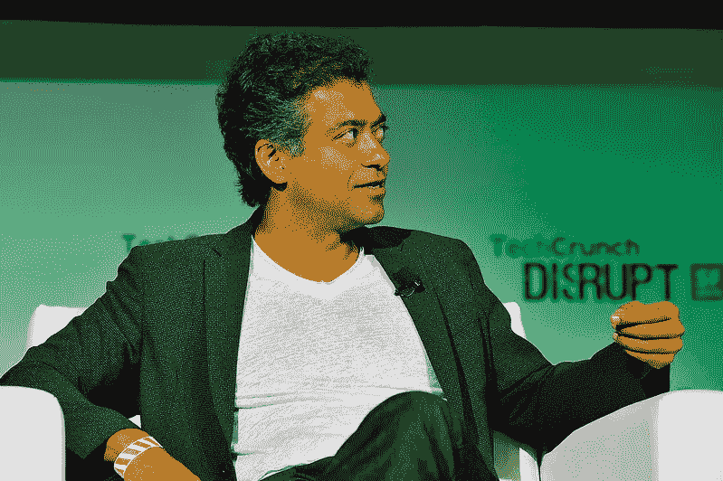

# 你应该花更多的时间无所事事——那是你真正成长的时候

> 原文：<https://betterprogramming.pub/you-should-spend-more-time-doing-nothing-thats-when-you-actually-grow-21e85b7e343a>

## “慢则顺，顺则快。”

过度刺激行业最冷静的头脑。由 [TechCrunch](https://www.flickr.com/photos/techcrunch/) 通过 [Flickr](https://www.flickr.com/photos/techcrunch/15199578361/in/photolist-6eYbuV-XyZhTN-ZFztQD-9m16Rx-2jkxHP5-oSV9Cg-pa8P6T-efqfLP-papoBK-oSU2Xr-efvYJo-fND6yx-XAyVao-XCLjWX-fND5Qr-YSBrvM-efv4pf-YBm2y5-XzQgPL-oSUBZW-oSU2DF-efyrdL-UDQ9H9-UGxWYR-efvYHG-efqfSa-Uja1FN-TEB6Qz-Uja1Nw-Uja1Gu-Uja1GQ-YAJHqG-YRRW8K-UGxX26-XzQhfL-XzQi5w-Uja1HS-YRRWJK-UGxWZn) 进行商业授权

Naval Ravikant 可能不是亿万富翁，但以我的标准来看，他是成功的。为什么？因为，47 岁的他比我 7 岁的弟弟笑得还多。

海军的生活相当忙碌。他是 AngelList 的创始人和前首席执行官，据报道是一家价值 1 亿多美元的公司[。他投资了 200 多家公司的早期阶段，包括优步和 Twitter。然而，在帕洛阿尔托度过紧张的职业生涯后，这个男人仍然是内心平静和常识的灯塔。](https://www.crunchbase.com/organization/angellist/company_financials#:~:text=AngelList%20has%20a%20post%2Dmoney,%2C%202013%20%2C%20according%20to%20PrivCo.&text=AngelList%20has%20made%2095%20investments,has%20made%2014%20diversity%20investments.)

他问的一个问题彻底摧毁了我对正念的理解:

> “如果你这么聪明能干，为什么你就想不出如何快乐？”

创始人说，现在，他很难和其他人在一起。或者说，他们很难在他身边。看，他们不习惯一个总是微笑的人。

# 你有 4906 封未读邮件。

我的夏天相当累人。不是因为我完成了很多，而是因为我总是在做一些事情。我起床，刷牙，吃三明治，上班，给朋友打电话，看节目，睡觉。

今年夏天我毫无进展。我在事业上没有进步。我没有创造任何有趣的东西。我没有形成任何持久的关系。我甚至没有任何改变人生的顿悟。这只是我做的一系列事情。这一切感觉就像一个无聊的梦，我即将忘记。

Naval Ravikant 以不同的方式度过了他的夏天。事实上，他的整个人生都与众不同。

> “我几乎讨厌称之为冥想。[……]字面意思就是随便走走。”

海军明白什么我不明白？为什么我的一个英雄会花时间故意什么都不做，“关注自己的想法？”

我决定模仿他的方法。当我什么都不做的时候，我故意挤出时间。规则是，我可以喝茶或听音乐，但不允许做任何“有成效的”、“有用的”、“有教育意义的”或“娱乐性的”事情。没有呼吸技巧，只是无所事事。

结果非常有趣。正如你所料，一开始感觉很奇怪，很不舒服。我的大脑一直在寻找转移注意力的方法。我想我开始阅读面包的标签。如果你不知道的话，它含有相当多的糖。

但是，神奇的事情发生了。很长时间以来，我第一次开始有了自己的想法。非程序性指令。不是计划。不是梦。思想。单词，粘在一起，形成对话。我又听到了。

我也能感觉到我的大脑在工作。事实上，在工作时间，它比以前工作更努力。即使我什么都没想，引擎也在嗡嗡作响。

Naval 将这个过程比作清理你的“精神收件箱”

> “当你长大后，所有这些事情都会发生在你的生活中。有些你正在处理，有些你应该多想想，但你没有。就像你的电子邮件收件箱，堆积如山。一封又一封邮件。”

他不只是在说未处理的创伤。他说的是未经加工的*东西*。形成你的判断和激发你的动机的东西。20、30 年前的东西驱动着你今天的选择。

Naval 说，清空收件箱的唯一方法是“什么都不做”,让你的思维自由流动。

他称之为“自我治疗”你不再花钱请治疗师来听你说话，而是充当自己的治疗师。最终，你回复了所有的“邮件”，跟上了现实，达到了平静和清晰的状态。

当然，将潜意识机制与有形结果联系起来是很危险的。我们不知道它是如何工作的。但我现在确信，人类生来就注定要独自思考，不受刺激。反其道而行之，就相当于剥夺了自己一种必不可少的营养。

# 哈里·斯泰尔斯救不了你

我们已经沉迷于呼吸技巧和叙述式冥想应用，但也许我们错过了 20 年过度刺激的关键一课:在你的待办事项清单上，少即是多。

生产力意味着你会更快地完成一篇文章。思维清晰意味着你知道该写什么，以及是否应该写。

生产力意味着你能更快回家。思维清晰意味着你会快乐地回家。

高效意味着你会在一周内挤出额外的锻炼时间。精神清晰意味着默认情况下你会感到放松、精力充沛、容光焕发。

生产力(通常)意味着你会做 10 个小时的普通工作。思维清晰意味着你将做 1 小时非凡的工作。

生产力可能会让你精疲力尽，所以你会让哈里·斯泰尔斯给你讲一个睡前故事来帮助你入睡。思维清晰意味着该睡觉的时候你会睡着。

生产力是“如何”中的“如何”这是一个如何更快到达某地的机械问题。头脑清晰是指南针，指引你应该去哪里。

我不是说生产力不重要。我是说这不是答案。不是为了你的幸福，不是为了你的表现。因为，正如 Naval [所说的](https://youtu.be/3qHkcs3kG44?t=1174)，

> “我们生活在一个杠杆无限的时代。你的行为可以成倍增加，无论是通过广播播客，或投资资本，或让人们为你工作，或编写代码。正因为如此，良好决策的影响力比过去大得多。”