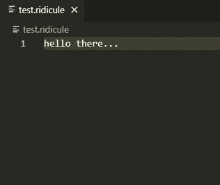
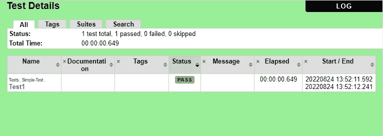

# 你的 API 测试必须是可重复的！

> 原文：<https://betterprogramming.pub/your-api-tests-must-be-reproducible-6e1c57986f4>

## 使用 VCRPY 和 Robotframework 来实现它


由 [Gabriel Petry](https://unsplash.com/photos/TovN2Tg5Bas#:~:text=Submit%20a%20photo-,Gabriel%20Petry,-Gabriel%20Petry) 在 [Unsplash](https://unsplash.com/) 上拍摄的照片|图像高度改变

API 测试对于现代微服务架构是必不可少的，但是随着 API 变得越来越复杂，重现测试执行变得更加困难。
在本文中，我将介绍一个非常棒的 Python 库，它允许您轻松记录 HTTP 请求。

# VCRPY 简介

[VCRPY](https://github.com/kevin1024/vcrpy) 使用“卡带”来比喻特定代码块的记录 HTTP 流。

这个想法是为我们希望记录的特定代码块使用一个`context-manager`或一个`decorator`，反过来库创建一个“卡带”,它是一个序列化文件(默认情况下，它是一个 YAML 文件),包含所有 HTTP 流量。

首先，我们需要从 pip 安装我们的依赖项:

```
pip install vcrpy==4.2.0 requests==2.28.1
```

现在，让我们在代码中使用 vcrpy 库。这里有一个例子:

在上面这个简单的例子中，我们使用了 VCR 模块中的`use_cassette`函数。它创建了一个上下文管理器，该管理器将生成文件`my-cassette.yaml`。

在这个上下文中，我们使用`requests`库向 postman-echo 网站发送两个 HTTP 请求，在每个请求之后，我们断言`foo1`属性等于`bar1`。

运行代码后，我们可以在新创建的 YAML 文件中找到以下内容:

这给了我们测试脚本中 HTTP 流量的所有细节！
当我们希望重现测试执行时，我们可以很容易地做到这一点。

## 但是还有更多！

创建磁带后，每次重新运行测试时，vcrpy 都会拦截 HTTP 流量，并用自己的 mock 替换它。

vcr.py 的优点包括:

1.  为单元测试轻松创建模拟对象
2.  容易记录的 HTTP 流量，当你的测试脚本使用随机数据时非常有用。
3.  更容易复制片状的虫子

## 还有更多！

VCRPY 也很容易扩展。

例如，您可以创建自己的请求序列化程序:

在这个例子中，我们的序列化程序完全没有用。它把数据打印到 std 输出，然后返回“hello there”，这个信息将被附加到磁带上。

运行这段代码的结果将是:

```
{'interactions': [{'request': {'body': None,
                               'headers': {'Accept': ['*/*'],
                                           'Accept-Encoding': ['gzip, deflate'],
                                           'Connection': ['keep-alive'],
                                           'User-Agent': ['python-requests/2.28.1']},
                               'method': 'GET',
                               'uri': '[https://postman-echo.com/get?foo1=bar2&foo2=bar2&foo3=bar3'](https://postman-echo.com/get?foo1=bar2&foo2=bar2&foo3=bar3')},
                   'response': {'body': {'string': '{"args":{"foo1":"bar2","foo2":"bar2","foo3":"bar3"},"headers":{"x-forwarded-proto":"https","x-forwarded-port":"443","host":"postman-echo.com","x-amzn-trace-id":"Root=1-630600d8-7cd8544e36022682693d82e7","user-agent":"python-requests/2.28.1","accept-encoding":"gzip, '
                                                   'deflate","accept":"*/*"},"url":"[https://postman-echo.com/get?foo1=bar2&foo2=bar2&foo3=bar3](https://postman-echo.com/get?foo1=bar2&foo2=bar2&foo3=bar3)"}'},    
                                'headers': {'Connection': ['keep-alive'],
                                            'Content-Length': ['358'],
                                            'Content-Type': ['application/json; '
                                                             'charset=utf-8'],
                                            'Date': ['Wed, 24 Aug 2022 '
                                                     '10:43:36 GMT'],
                                            'ETag': ['W/"166-/OQmSZQmpVBffJEwyD65r935+QE"'],
                                            'Vary': ['Accept-Encoding'],
                                            'set-cookie': ['sails.sid=s%3AEBHLjc0aS_0cpuyhvKBS_GSU0eRyYgA7.qIcCjTOp8gHXNvykDiUhOOmsKgp848t4Hjfcacue0OI; '
                                                           'Path=/; HttpOnly']},
                                'status': {'code': 200, 'message': 'OK'}}}],
 'version': 1}
```

文件`test.ridicule`应该是这样的:



# 附加部分:与机器人框架的集成

首先，让我们从 pip 安装`robotframework` 和`robotframework-requests`:

```
pip install robotframework==5.0.1 robotframework-requests==0.9.3 
```

现在，让我们创建机器人测试文件，如下所示:

现在，我们可以使用 robotframework 的[监听器接口](https://robotframework.org/robotframework/latest/RobotFrameworkUserGuide.html#listener-interface)来集成我们的测试和 VCR。代码如下:

因此，我们的监听器保留当前测试套件和测试用例的名称，一旦测试开始，它将打开 VCR 上下文管理器，并在测试结束时退出上下文管理器。

让我们用下面的命令运行测试:

```
robot --listener [path/to/listener/file].VcrListener -P . tests
```

这是测试结果:



并且在`vcr_cassettes`目录中查找，可以找到对应的卡带。它看起来是这样的:

*感谢阅读！*

*敬请期待更多。*