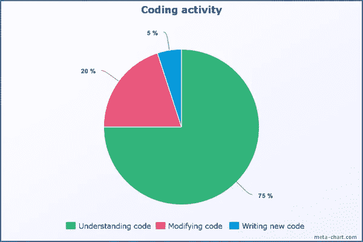

# 你的代码应该讲述一个故事

> 原文：<https://betterprogramming.pub/your-code-should-tell-a-story-8e9d42e91ef2>

## 实用惯例


尼克·莫里森在 [Unsplash](https://unsplash.com/s/photos/writing?utm_source=unsplash&utm_medium=referral&utm_content=creditCopyText) 上拍摄的照片

把写代码想象成写故事是一个有用且简单的比喻。这也是对我们看待和编写代码的方式的一种奇妙的理解。

我在日常生活中看到了这些良好的实践如何帮助我和我的团队变得更快、更有成效。

可读代码的结构随程序员将他们的思维模式转换成代码的计算机语言而变化。然而，在大多数高级语言中，有许多准则可以遵循，以帮助确保代码易于阅读。



图片来源:“[像莎士比亚一样编码:实用函数命名约定](https://dmitripavlutin.com/coding-like-shakespeare-practical-function-naming-conventions/)”

本文将带您了解为我们未来的自己编写更好的代码的最佳实践，并让其他开发人员阅读和改编他们从未见过的代码。

# 1.使用明确的名称

对正确命名变量保持高度警惕。无论是函数的参数，还是全局或局部变量的参数，都要明确变量的名称。跨代码库为变量使用一些简写名称是很常见的，比如用`fname`代表`firstName`。这可能看起来是一种更快更简单的方式来编写和交付一段代码，但是这是一个非常糟糕的想法。

一个变量`filteredStudentNames`可能看起来太长，但是相信我，不看代码一段时间后，你不会记得任何缩短的变量名。如果你为你的团队雇佣了一个新的开发人员，那么他们可能需要大量的帮助和时间来理解代码库。

变量名非常强大，因为这是你告诉读者你的代码在做什么的机会。

还有几个你可能想知道的实践:

*   对于布尔值，以`has`或`is`、**、**开始命名，例如`isUserLoggedIn`。
*   存储集合名称的值应该是复数，例如`Users`。
*   忘掉你所听到的关于命名的一切。根据变量应该做什么来命名它是非常重要的。

这个确定名字的规则同样适用于函数名和类名。在函数上面写一堆行来详细说明是很常见的，但是使用函数名来表示缩进总是被低估了。

文章“ [Coding like Shakespeare](https://dmitripavlutin.com/coding-like-shakespeare-practical-function-naming-conventions/) ”是一篇很好的范例实践文章，所以请花点时间阅读一下。下面我列举了几个重要的。

*   更喜欢解释性的名字——“名字应该清楚、明确地表明功能是做什么的。你不必跳来跳去寻找真相。”
*   避免不相关的函数名——“显然，产品代码不应该包含没有严格意义的函数名。或者只是为了命名而命名。”
*   避免将函数命名为通用的——“应该避免使用一个包含不同位置的许多/不同操作的名称。给出详细具体的名字。”
*   不要说一套做一套——将一个函数命名为某物(例如`add`)，然后在里面做一个或多个不相关的动作，这是一种非常常见的做法。

# 2.编写小而名字好的函数

当我们是初级开发人员时，我们总是习惯于编写一个大函数来同时做很多事情。这在过去给我造成了三个非常具体的问题。

*   除了现有的全局或类变量/属性之外，我可能还需要创建和跟踪一些函数范围的变量。
*   给定义函数意图的函数起一个合适的名字变得很复杂。
*   当我为这些功能编写单元测试时，我可能会讨厌自己。

```
const **handleSubmit** = (event) => {
         event.preventDefault();
         NoteAdapter.update(currentNote).then(() => {
                   setCurrentAlert('Saved!')
                   setIsAlertVisible(true);
                   setTimeout(() => setIsAlertVisible(false), 2000);
         }).then(() => {
               if (hasTitleChanged) {
                 context.setRefreshTitles(true); 
                 setHasTitleChanged(false);
               }
           });
     };
```

上面的函数可能看起来很熟悉。函数本身没有问题，但是像这样将所有的逻辑写成一个巨大的函数会使阅读、理解和测试变得更加困难。

相反，我们可以将函数分解成更小的离散函数，从而使理解和阅读更加简单。编写小函数还可以让您命名函数，从而提高可读性。这有时也允许您重用它们。

```
const **displaySaveAlertFor** = (**milliseconds**) => () => { 
  **setCurrentAlert**('*Saved!*')
  **setIsAlertVisible**(true);
  **setTimeout**(() => **setIsAlertVisible**(false),**milliseconds**);
};const **updateTitleIfChanged** = () => {
  if (**hasTitleChanged**) {
    **context**.setRefreshTitles(true); 
    **setHasTitleChanged**(false);
  }
};const **handleSubmit** = (**event**) => {
  **event**.preventDefault();
  **NoteAdapter**.update(**currentNote**)
    .then(**displaySaveAlertFor**(2000))
    .then(**updateTitleIfChanged**);
  };
```

让一个功能只执行一项任务:做你说要做的事情。

# 3.放弃注释——正确使用函数来传达目的

声明:评论是有地点和时间的。我并不反对注释本身，只是反对在干净的代码是更好的选择时过度使用它们。

依赖注释会导致代码需要更长的时间来阅读和消化。你应该考虑你的代码将如何继续。这是一个其他人将要阅读的故事，可能会持续多年。

为今天的问题写代码很容易。为未来编写代码需要技巧。

有时，我们可能不得不使用非常规的方法来解决问题，因为其他方法都不起作用，或者我们没有足够的时间来想出更好的解决方案。这可能很难用代码来解释。在我们的代码中使用注释可以帮助我们解决这个问题。评论可以帮助我们向其他人解释为什么我们写了我们所写的东西，以及为什么我们以那种特定的方式写它。这样一来，其他人就不用猜了。

也就是说，我们应该只在必要的时候使用注释，而不是解释糟糕的代码。写不完的注释行不会帮助我们把写得不好的代码变成干净的代码。如果代码不好，我们应该通过改进代码来解决问题，而不是添加一套如何使用它的指令。

干净的代码应该优先于快捷方式的便利。

# 底线:可读代码优于智能代码

有几种设计模式、框架和库可以用来帮助编写更好的代码。但是有了所有这些工具，以及一层又一层的抽象和依赖，一件经常被遗忘的事情就是简单的好处。简单点，笨蛋。不管你使用什么语言和框架，这都是最基本和最重要的原则之一。做到这一点的方法之一是编写简单、优雅和干净的代码。如果处理得当，使用这段代码会非常愉快，就像阅读一个故事一样。

感谢阅读。请在评论中留下你在日常生活中遵循的任何建议和任何其他好的做法。