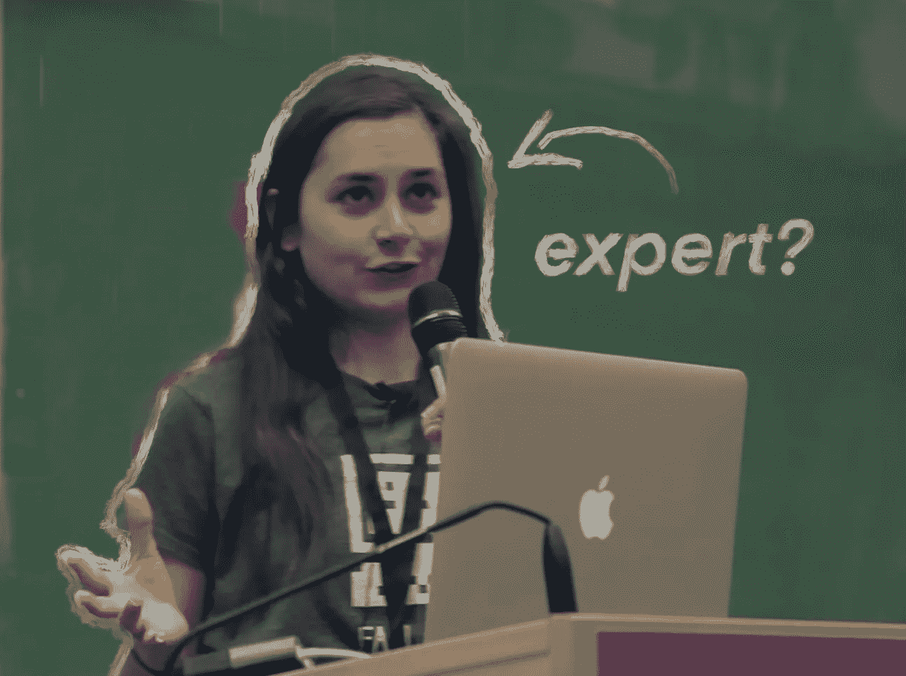
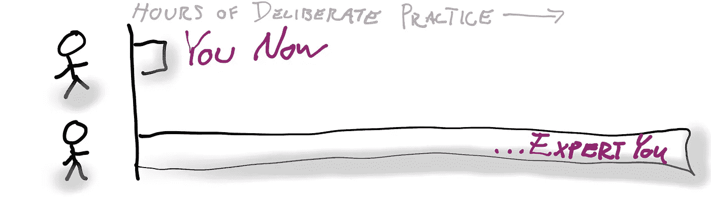
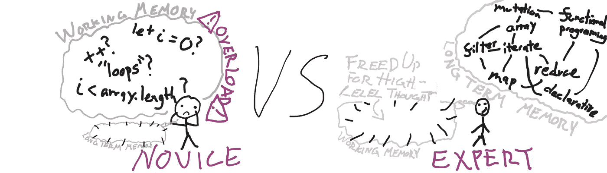

# 你的编码建议比专家的更好

> 原文：<https://betterprogramming.pub/your-coding-advice-is-better-than-an-experts-b50e14902ea2>

## 请相信我



Anjana Vakil 就是这样开始她的关于 Javascript 函数式编程的 JSUnconf 演讲的:

> “大约六个月前，我对函数式编程一无所知，对 JavaScript 也知之甚少。我不是这方面的专家，所以这将是我带你一起踏上我的学习之旅，仅此而已。”

她的演讲有超过一百万的浏览量。

Anjana Vakil 是如何在一个她显然不具备专业知识的主题上创造出如此受欢迎的资源的？

嗯，你有没有想过:*外面有那么多专家。在我了解更多之前，我没有任何有价值的东西可以分享(如果我现在尝试，我可能看起来很傻)！*

部分是真的。在一个话题上，专家可能比你知道的更多。

但是，当你处于学习某样东西和成为专家之间的时期时，你有一些专家做的事情:**对学习那项技能需要什么的实际理解**。

在某些方面，你比专家更有资格教授你的新技能——专家为了获得他们的专业知识，不得不将所有棘手的细节交托给他们的直觉。

注意:我不是在贬低专业知识的重要性。它带来深刻的洞察力，有助于防止错误信息。但是相信只有专家才能恰当地解释想法会扼杀技术的多样性。

为了说明原因，我们将探索人们最初是如何获得专业知识的，以及这如何影响他们分享知识的能力。



# 如何成为专家？

你可能会猜测先天能力在很大程度上决定了专业技能。

并非如此。也许令人惊讶的是，科学响亮地告诉我们，与持续的、刻意的练习相比，先天能力的价值就相形见绌了。

具体来说，这意味着 Martina 可能比 Estefania 更擅长编码，但如果 Estefania 每周花几个小时仔细识别和改进她最弱的技能，科学表明，从长远来看，她将远远超过 Martina。这适用于音乐、体育和工程。

这通过两个深刻的观点为非专家建议的价值奠定了基础。

# 1.你和专家的区别(至少在认知上)很大程度上在于大量的练习

专家并不天生比你更聪明或更有才华——你可以满足(并超越)他们的专业技能！

**注意:**为了扩大范围，我忽略了获取专业知识的系统性障碍，比如社会经济学和身份威胁。

# 2.成为专家通常会让你成为一个糟糕的老师

刻意的练习可以帮助你将学习的本质细节融合成直观的块，这样你就可以学习更高级的东西。通过在你的生长点上努力，直到它们变得直观，你创造了构建更先进想法的基础。于是，*专长*。

但是这种专家的想法会让你与新手的学习方式脱节…



## 一个实际的例子:Estefania 学习“for”循环

再次想象 Estefania 一边学习`for`循环，一边进行刻意的练习。

```
for (let i = 0; i < array.length; i++) {...}
```

起初，细节让她困惑。`++`在做什么？一个代码块是如何出现多次的？

她仔细研究她的问题，然后通过在各种情况下使用`for`循环来测试她的知识。她投入了辛勤的工作和时间。因此,《学习科学》告诉我们，她开始将所有细节分块成对循环的直观理解。她不假思索地使用他们的语法，专注于她的任务而不是细节。

甚至，她开始将`for`循环与它们有用的环境和问题联系起来。她将 `for`循环理解为围绕`while`循环的语法糖。她将它们与她对数组的了解联系起来。她甚至开始在理解的基础上进行构建，使用`for`循环来掌握更多的函数方法，如`map`和`reduce`。

科学家称之为*知识重组*——她实际上是在改变这个概念与她大脑中一切事物的联系。

## …但这对她未来的学生来说很糟糕

通过她的组块和知识重组，Estefania 的大脑发生了严重的变化。这让她见识深刻。但这也让她的“大脑”远离那些刚刚开始使用`for`循环的人。

简而言之，新手面临的挑战甚至不再是她大脑中的路径。

这就是你，在你的非专业领域，进来的地方。

# 目标:欢迎非专家➡为新来者提供更好的资源➡培养多样性

你的声音很重要。你如何看待和学习很重要。不仅仅是对你，而是对那些能向你学习的人。当你的大脑还对新的变化记忆犹新的时候，你现在可能已经准备好分享你的知识了。

技术有一个严重的多样性问题。解决这个问题的最大方法之一就是改善我们的管道，去掉我们的看门人。通过分享您的知识，您可以:

*   为新人创建**可访问的资源**
*   通过分享你自己的旅程和正常化的奋斗来培养初学者的归属感
*   帮助**多样化**科技的面貌

最后，也许你*是*你不熟悉领域的专家——学习你刚刚学到的知识和分享你刚刚走过的旅程的专家。

所以让你的声音被听到，专家。