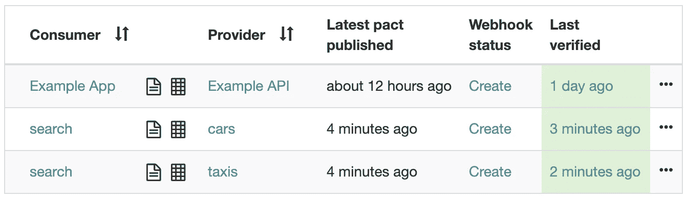

# 你的合同测试没有保护你

> 原文：<https://betterprogramming.pub/your-contract-tests-are-not-protecting-you-563a5d6cdfef>

## 超越数据协议的适当 API 测试

由 [timJ](https://unsplash.com/@the_roaming_platypus?utm_source=unsplash&utm_medium=referral&utm_content=creditCopyText) 在 [Unsplash](https://unsplash.com/s/photos/tests?utm_source=unsplash&utm_medium=referral&utm_content=creditCopyText) 拍摄的照片

在许多场合，我听到人们说他们正在进行合同测试，或者合同测试可以帮助解决他们的问题。我还从未见过合同测试被完全完成！它经常被忽视，或者做得不正确，当合同被破坏时，允许部署继续进行。

> ***契约测试*** *是一种测试集成点的技术，通过单独检查每个应用程序来确保它发送或接收的消息符合“契约”中记录的共享理解。—* [单据约定 io](https://docs.pact.io/)

Pact 是一个测试 HTTP JSON APIs 契约的工具，它是保存两个服务之间契约定义的文件的名字。您可以用不同的语言编写 pact 测试，但是术语和思想是相同的。下面是合同测试不同部分的概述，以及它们如何保护你(或不保护你)。

**TL；DR:如果你没有使用** `can_i_deploy` **你就没有得到完全的保护！**

# 消费者测试是做什么的？

契约是消费者驱动的，这意味着是消费者定义了契约。在测试中，您定义了契约，最好使用一个库，然后该库基于该契约建立一个模拟服务器。然后，您可以对模拟服务器使用您的消费者代码，并验证它是否按预期工作。这确实*而不是*验证了客户端发出的请求将对生产者不利，或者被嘲笑的响应与生产者将返回的一样，因为它都被你嘲笑了。

有很多关于为不同语言和框架编写消费者测试的在线教程。看看 docs.pact.io/implementation_guides 的。

# 生产者测试是做什么的？

生产者测试实际上验证了契约。Pact 可能是消费者驱动的，但是只有生产者能够实际验证请求和响应是否匹配。消费者测试创建的 pact 文件是针对您的应用程序运行的。您的应用程序启动，最好使用模拟数据，并向它发出契约中定义的请求。然后对照契约中的预期响应来验证这些响应。如果他们符合测试通过。

# 什么是协议经纪人？

契约代理是不同应用程序共享契约的方式。消费者将契约上传到代理，允许生产者下载并验证契约。当生产者验证了一个契约后，他们将状态(通过或失败)上传回代理供将来使用。

契约有一个版本，当契约改变时，它也会改变。如果没有变化，多个应用程序版本可能具有相同的契约版本。

可以在 pact broker 中标记应用程序版本，这可以用来显示应用程序的版本部署在哪里。

## Webhooks 是干什么用的？

因为只有生产商才能真正确认协议是否有效，所以我们需要一种方法在协议改变时运行验证测试。输入 webhooks。Webhooks 是 pact broker 的一个特性，它向可配置的端点发出 HTTP 请求，以改变 pact 的生命周期。最有用的生命周期事件是契约发生变化的时候。当这种情况发生时，webhook 可以触发一个管道，该管道将运行相关的生产者测试来验证更改后的契约。一旦验证通过，就可以安全部署了。如果没有 webhooks，在部署更新之前，您必须手动找到并运行管道来验证已经更改的约定。

Webhook 配置示例

# `can_i_deploy`是做什么的？

`can_i_deploy`按照罐头上说的做。它是一个命令行工具，检查你发布你的应用程序是否安全。如果你部署的东西会破坏合同，或者合同还没有被验证，它就会失败。**不使用这个，你可能会部署坏掉的东西**。

这个命令有几个重要的参数。pact broker URL —因此它知道从哪里检查契约的状态，正在部署的应用程序的名称—因此它知道哪些契约是相关的，应用程序的版本—以获得契约的正确版本，最后是任何标签。

标记可用于显示应用程序版本已部署到哪些环境中。这可以防止您意外地将变更发布到生产环境中，而该生产环境具有仅在其他环境中部署的依赖关系。

# 那么，我如何保护我的部署呢？

如果您在管道中使用`can_i_deploy`,那么在部署到每个环境之前，以及完成之后标记与环境的契约，您将是安全的。您不希望测试阻碍您的部署，所以为了保持事情顺利和自动化，您可以设置 web hooks——但它们不是必需的。有关 Pact 和实施指南的更多信息，请查看 [pact.io](https://pact.io) 。标记和使用`can_i_deploy`的备忘单可以在[这里](https://medium.com/@harryemartland/pact-cheat-sheet-ebe97c864145)找到。