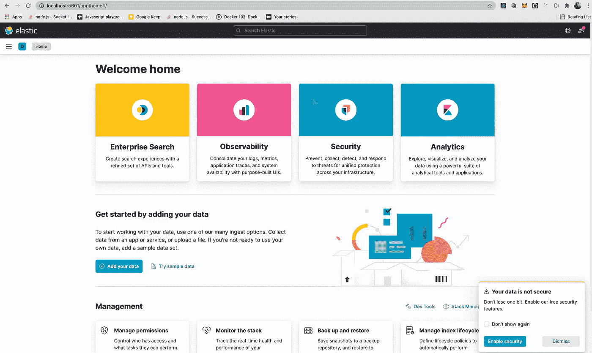
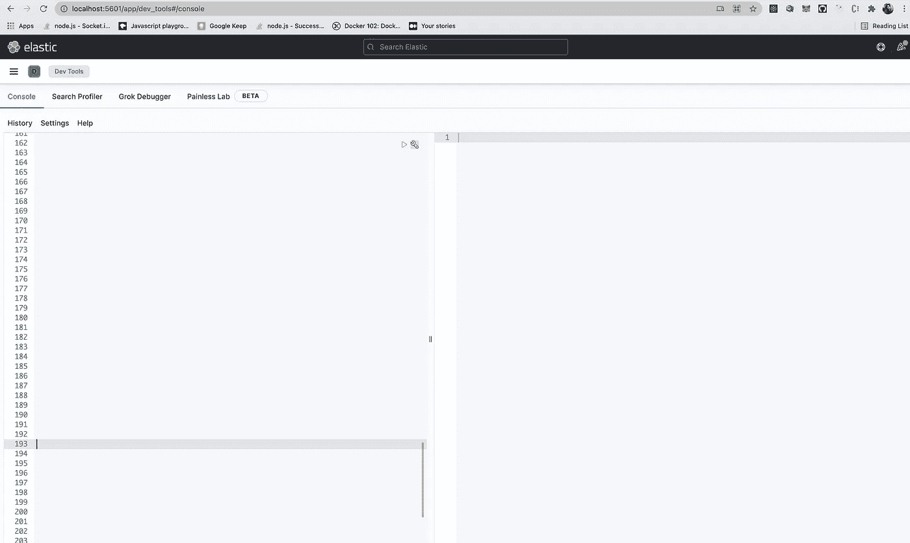
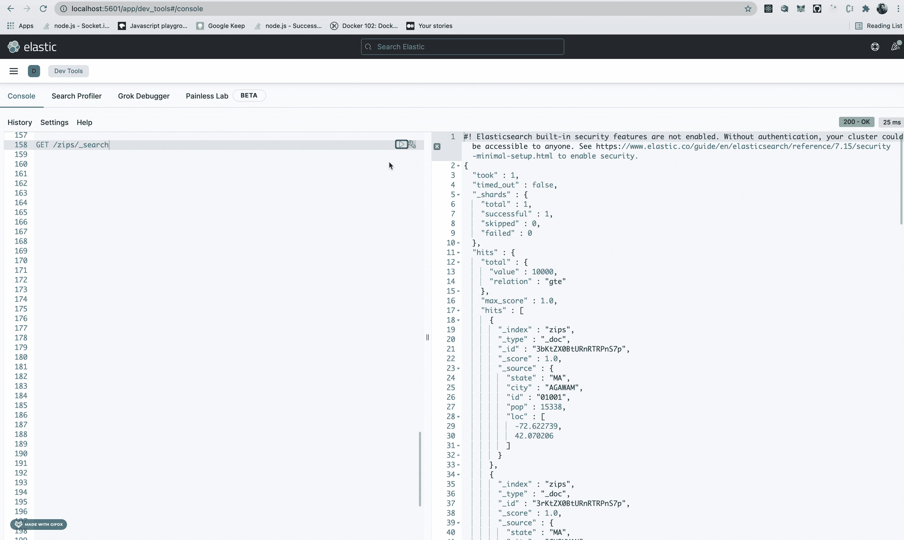

# 构建您的第一个 Elasticsearch Web 应用程序

> 原文：<https://betterprogramming.pub/your-first-elasticsearch-application-7db5ea74ef02>

## 以非凡的响应时间添加搜索功能


在 [Unsplash](https://unsplash.com?utm_source=medium&utm_medium=referral) 上 [NeONBRAND](https://unsplash.com/@neonbrand?utm_source=medium&utm_medium=referral) 拍摄的照片

每当我们想到快速搜索的时候，首先想到的就是谷歌搜索，这是有充分理由的。

谷歌投入了数年时间和数十亿美元来实现和改进其搜索功能。

但在今天的场景中，我们甚至看到几个新时代的产品在他们的平台上提供几乎一样快的搜索功能，对普通消费者来说，感觉几乎和谷歌搜索一样快。

那么，谷歌花了数年时间才掌握的专业知识，这些产品是如何在如此短的时间内实现的呢？

答案是他们没有，这要感谢像 Elasticsearch 这样的工具，它为这些产品抽象出整个逻辑，并允许他们以非凡的响应时间建立搜索功能，而无需重新发明轮子。

# 什么是 Elasticsearch？

如果我们查阅 Elasticsearch 的官方文档，我们会发现:

> Elasticsearch 是一个分布式、免费和开放的搜索和分析引擎，适用于所有类型的数据，包括文本、数字、地理空间、结构化和非结构化数据。Elasticsearch 基于 Apache Lucene 构建，由 Elasticsearch N.V .(现名为 Elastic)于 2010 年首次发布。

## **Lucene**

Lucene 是一个基于 Java 的搜索引擎库，它基本上构成了弹性搜索所提供的核心功能。

## 弹性搜索

Elasticsearch 在 Lucene 上形成了一个抽象层，并为我们提供了基于 JSON 的 REST APIs，以方便的方式利用 Lucene 的特性。

除此之外，Elasticsearch 还在 Lucene 上提供了一个分布式层，这是 Lucene 中默认没有的，它构成了 Elasticsearch 提供的高可用性和高吞吐量的基础。

Elasticsearch 还提供其他支持特性，如线程池、队列、节点/集群监控 API、数据监控 API、集群管理等。

这不是关于 Elasticsearch 的，但这足以给你一个什么是 Elasticsearch 的要点，如果你想了解更多这方面的信息，请在评论中告诉我，我可能会就此写另一篇文章。现在，让我们转到撰写本文的部分。

# 如何实现 Elasticsearch？

在本节中，我们将实现基于 Node.js 的 Elasticsearch，其中我们将涵盖以下子部分:

1.  为 Elasticsearch 和 Kibana 安装 docker 图像
2.  编写脚本将 JSON 数据导入 Elasticsearch
3.  创建一个带有端点的 express API 来查询来自本地 Elasticsearch 的数据
4.  创建一个基本的前端，将查询文本传递给 Express API 并显示结果。

整个项目可以在这里找到[。所以让我们开始吧。](https://github.com/AkshayCHD/elasticsearch-tutorial)

## 为 Elasticsearch 和 Kibana 安装 docker 图像

在本文中，我们将使用 Elasticsearch 和 Kibana 的 docker 实现，因为它更简单，并且有助于保持文章的操作系统不可知性。如果你想知道 Kibana 现在到底是什么，Kibana 是 ELK Stack(Elasticsearch Logstash Kibana)的一部分，在这里我们将使用它来可视化我们的 elastic search 数据。Elasticsearch 和 Kibana 可以被认为有点像 MongoDB(数据库)和 MongoDB Compass(数据库可视化工具)。

现在要安装 Elasticsearch，你必须先安装 docker。要安装 docker 你可以在这里看一下。

一旦你安装了 docker，你可以运行

```
docker network create elasticdocker pull docker.elastic.co/elasticsearch/elasticsearch:7.15.2docker run --name es01-test --net elastic -p 127.0.0.1:9200:9200 -p 127.0.0.1:9300:9300 -e "discovery.type=single-node" docker.elastic.co/elasticsearch/elasticsearch:7.15.2
```

一旦安装了 Elasticsearch，那么让我们安装 Kibana

```
docker pull docker.elastic.co/kibana/kibana:7.15.2docker run --name kib01-test --net elastic -p 127.0.0.1:5601:5601 -e "ELASTICSEARCH_HOSTS=http://es01-test:9200" docker.elastic.co/kibana/kibana:7.15.2
```

一旦两个容器都启动并运行，您就可以转到下面的 [URL](http://localhost:5601/app/home#/)



如果安装成功，那么您应该会看到上面的用户界面。

## 编写脚本将 JSON 数据导入 Elasticsearch

现在我们已经启动并运行了 Elasticsearch，现在我们的下一个任务是将数据导入 Elasticsearch，我们可以从我们的 web 服务器查询这些数据。

为此，我们将使用一个 zip 数据集，其中每个 zip 具有以下结构。

```
{"_id":"01001","city":"AGAWAM","loc":[-72.622739,42.070206],"pop":15338,"state":"MA"}
```

现在我们必须编写一个脚本来将这些数据导入到 Elasticsearch 中。因此，我们必须在我们的`insertToElasticSearch.js`文件中导入 Elasticsearch 依赖项，并将其连接到我们的本地 Elasticsearch 部署。

然后我们编写一个 run 函数，它有两个任务，首先在 Elasticsearch 中创建一个名为 zips 的索引，然后从文件中读取文档并将它们插入 Elasticsearch。

弹性搜索中的索引是文档的容器，在我们的例子中，`zips`索引是`zip`文档的容器。类似地，您可以将 Elasticsearch 索引与基于 SQL 的数据库中的表或非 SQL 数据库中的集合进行比较。

我们使用 Elasticsearch 的批量插入功能将多个文档一次插入到 zips 索引中，你可以从[这里](https://www.elastic.co/guide/en/elasticsearch/reference/current/docs-bulk.html)阅读更多关于 Elasticsearch 批量插入的内容。

一旦脚本运行，您可以导航到 [Kibana 开发工具](http://localhost:5601/app/dev_tools#/console)并验证数据是否被成功获取。

您应该会看到以下页面:



在控制台中输入以下查询，并按下旁边的小播放图标来执行它

```
GET /zips/_search
```



如果一切正常，您应该会看到存储在 Elasticsearch 中的 zip 子集作为输出。

## 创建一个带有端点的 express API 来查询来自本地 Elasticsearch 的数据

现在我们已经运行了 Elasticsearch 并接收了数据，因此我们可以创建 express API 来查询 Elasticsearch，为此，我们必须首先导入 Elasticsearch 并像使用脚本那样进行连接。

接下来，我们实现我们的端点来查询我们的 Elasticsearch `zips`索引，为此我们将使用一个类型为`phase_prefix`的`multi_match`查询，这实质上意味着您希望所有文档中的任何提供的字段都具有与提供的`queryText`相似的前缀，您可以从[这里](https://www.elastic.co/guide/en/elasticsearch/reference/current/query-dsl-multi-match-query.html)详细了解这种类型的查询:

我们可以将文件命名为`index.js`,并使用以下命令启动服务器:

```
node index.js
```

然后，您可以导航到浏览器以调用 API，如下所示:

```
[http://localhost:3030/elastic?text=AG](http://localhost:3030/elastic?text=AGA)A
```

并查看以下输出:


## 创建一个基本的前端，将查询文本传递给 Express API 并显示结果

现在，我们创建一个基本的 react 应用程序来查询我们创建的这个 API，并查看运行中的搜索功能。

要初始化空的 react 项目，您可以运行:

```
npx create-react-app elasticsearch-app
```

除了 React 之外，还有一些我们在下面使用过的其他助手包(比如 Material-UI 和 Axios)，你可以在这里找到完整的`package.json`文件。

然后在源目录中，我们创建一个包含 2 个组件的组件目录

*   `SearchBox` —使用材质 UI 实现，将`queryText`的值设置为在其中键入的任何值

*   `ZipList` —物料 UI 表格实现，以表格的形式展示查询结果

现在，在主`App.js`文件中，每当`SearchBox`中的`queryText`改变时，我们导入`axios`依赖项来命中我们的 Elasticsearch 节点服务器。

因此，最终我们的`App.js`看起来会像这样

现在我们可以使用

```
npm start
```

随着我们的快速服务器使用

```
node server/index.js
```

如果一切正常，我们应该在 [URL](http://localhost:3000/) 上看到以下输出


# 结论

我想这种裸机项目足以让你开始使用 Elasticsearch 和 ELK stack，但是我们都知道 Elasticsearch 有比本文所涵盖的更多的内容。

为了进一步提高你的技能，[这篇](https://www.elastic.co/webinars/getting-started-elasticsearch)教程是下一步研究的好地方。

```
**Want to Connect With the Author?**For regular updates about their latest pieces, you can follow them on [Twitter](https://twitter.com/StandupCoder).
```