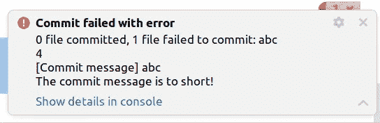

# 您的 Git 提交历史应该读起来像一本历史书。以下是方法。

> 原文：<https://betterprogramming.pub/your-git-commit-history-should-read-like-a-history-book-heres-how-7f44d5df1801>

## 不要再浪费时间去解释提交做了什么。


托马斯·凯利在 Unsplash[拍摄的照片](https://unsplash.com/s/photos/history-book?utm_source=unsplash&utm_medium=referral&utm_content=creditCopyText)

我们可以从历史中吸取教训。历史告诉我们过去的哪些事件塑造了现在。波士顿倾茶事件导致了独立战争。滑铁卢战役导致了拿破仑的失败。你能说出哪个决定，哪个提交导致了你的软件的当前状态吗？也许不是。

因为许多提交消息令人困惑、混乱且无用。

我敢打赌你见过(或写过)这样的提交消息:

```
wipwork on feature XYZfixed typoFixed JIRA-123
```

如果您需要跟踪一个问题或发现为什么实现是这样，这些消息没有帮助。

我们必须回答两个问题来改进我们的提交历史:

1.  什么是好的提交消息？
2.  我如何让我的同事(和我自己)遵循这种格式？

# 什么是好的提交消息？

没有明确的答案。提交消息应该包含足够的信息，以便了解发生了什么变化及其原因。它应该是一个完整的句子还是要点就足够了？在每个提交消息中需要票号吗？

我能给出的最佳答案是:

与您的同事讨论并就提交信息的范围达成一致。

你不必毫无准备地参加讨论。有一些关于提交消息结构的建议。我们来看看其中的一个:[常规提交](https://www.conventionalcommits.org/en/v1.0.0/)。

将[常规提交](https://www.conventionalcommits.org/en/v1.0.0/)视为提交消息的框架。它给了你一个可以使用的结构。每个提交消息至少包含一个类型和消息本身。范围、正文和页脚是可选的。还有一种简单的方法来显示提交包含了一个突破性的变化。

基本结构是这样的:

```
<type>[optional !][optional scope]: <description>

[optional body]

[optional footer(s)]
```

以下是一些例子:

```
feat: allow user to keep logged infix: messages are now serialized correctlyfeat(api)!: removed the old way users are handledci(deployment): the application will now be deployed on nonlive as well
```

第一个改进是显而易见的。

您可以浏览提交，因为现在每个提交都有一个*类型*。如果您搜索一个 bug 修复，只需查看所有带有`fix`的提交。可选范围帮助您缩小搜索范围。

感叹号表示重大变化。这也可以在提交消息的页脚中更加明确，例如:

```
chore: drop support for Node 6

BREAKING CHANGE: use JavaScript features not available in Node 6.
```

您可以使用类型自动生成[语义版本号](https://www.conventionalcommits.org/en/v1.0.0/#how-does-this-relate-to-semver)。A `fix`增加补丁等级，而 a `feat`增加次要等级。每一个突破性的改变都会增加主要等级。

常规提交将改进您的提交消息。

然而，心有余而力不足。你的同事和你可能会用到它，但是你可能会很快忘记它。您仍然会得到混乱的提交消息。简单的解决方案是:让 git 强制您使用常规提交。

# 使用 [git 钩子](https://git-scm.com/book/en/v2/Customizing-Git-Git-Hooks)来执行常规提交

你可以用 git 钩子改变 git 的行为。有服务器端和客户端挂钩。我们将专注于客户端钩子，因为我们大多数人都没有自己的 git。git 挂钩是一个 shell 脚本，它在 git 工作流中的一个事件上执行。

有一个钩子特别有趣:T2 钩子。Git 在您输入提交消息后执行它。它获取一个临时文件的路径，并将提交消息作为参数。您可以检查提交消息是否符合您的规则。

例如，这个钩子检查提交消息是否至少有十个字符长:

一个简单的提交消息挂钩。

要使用这个钩子，在你的库的根目录下创建一个新目录，例如`.githooks`，并在那里添加一个新文件`commit-msg`。这个名字对于 git 理解它是哪个钩子至关重要。不要忘记使文件可执行！

```
chmod +x .githooks/commit-msg
```

现在告诉 git 在创建的文件夹中寻找挂钩。你的每个同事都必须做一次。

```
git config core.hooksPath .githooks
```

Git 将从现在开始拒绝短提交消息。

```
> git commit -am "abc"
[Commit message] abc
The commit message is to short!
```

它也适用于 IntelliJ:



如果提交消息太短，IntelliJ 中的错误消息。

# 将这一切结合在一起

现在可以使用 git 挂钩来执行常规提交。我甚至扩展了它，使得在类型之后，每条消息都必须包括票号，或者如果没有票号，则不包括 JIRA。这是我的钩子:

commit-msg 钩子用于常规提交+票号。(整个剧本不是我自己写的；它是我在 GitHub 上找到的一个的扩展。遗憾的是，我再也找不到原件了。)

# 一锤定音

您的存储库的提交消息变得更加可读。相信我，这是速战速决。但最重要的是每个人都必须同意这个想法。人们总是会避开他们不喜欢的东西。所以先和你的同事谈谈。

不要忠实地遵循这一点。选择对你有用的东西并付诸实施。试试看！

# 来源

*   [常规提交规范](https://www.conventionalcommits.org/en/v1.0.0/)
*   [Git 挂钩](https://git-scm.com/book/en/v2/Customizing-Git-Git-Hooks)

```
**Want to Connect?**Subscribe to my newsletter so you never miss a new post:[https://verbosemode.dev/subscribe](https://verbosemode.dev/subscribe)
```