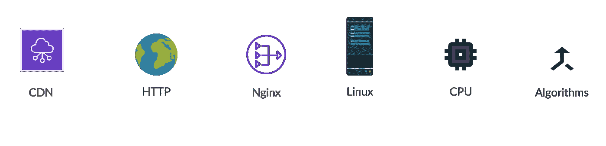
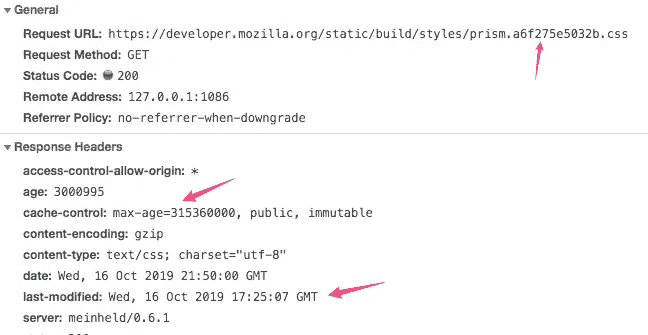
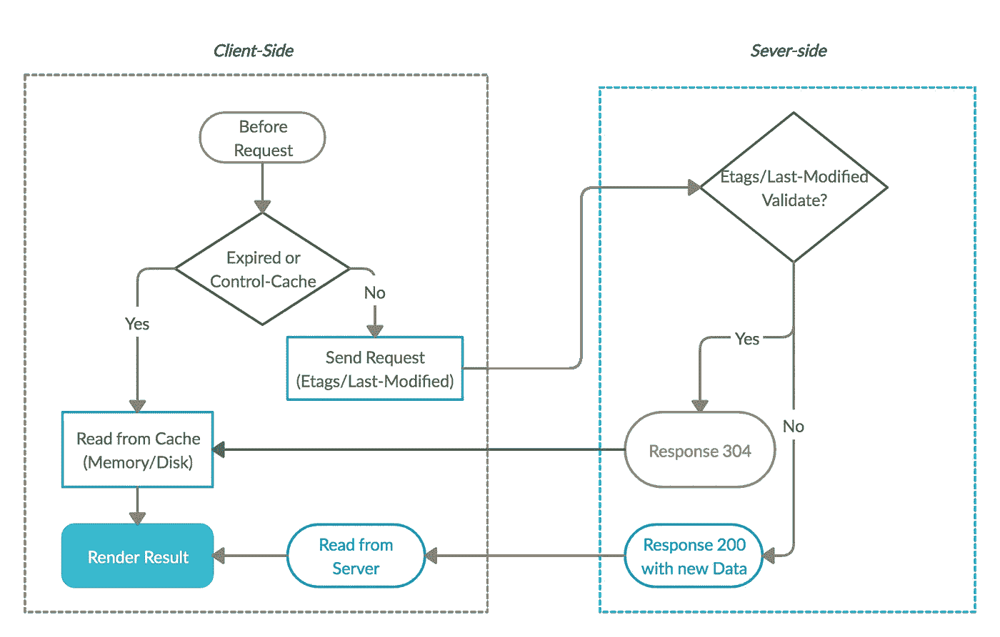
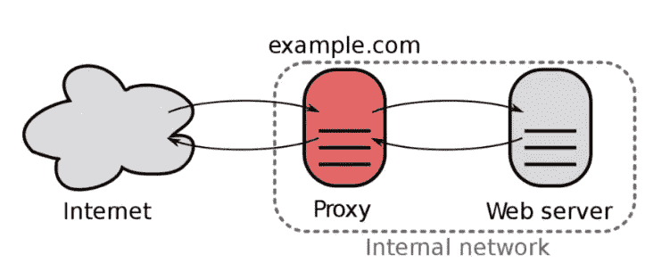
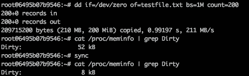
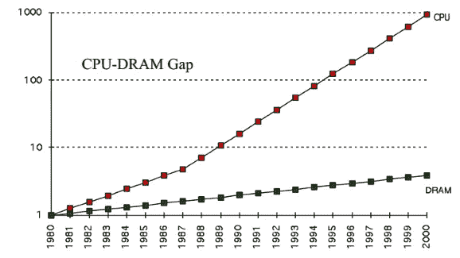
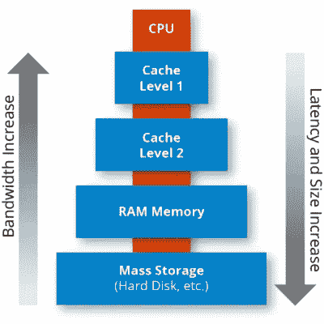
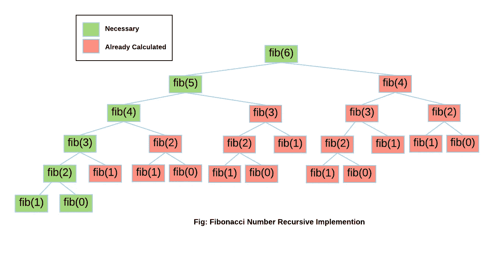

# 缓存指南:从上到下

> 原文：<https://betterprogramming.pub/your-guide-to-caching-from-top-to-bottom-638d5fde9f01>

## *“计算机科学只有两个硬东西:缓存失效和事物命名”*


每个程序员都会遇到缓存。

这是一个核心和广泛的概念，每个程序员都应该深刻理解，它对于系统设计和性能关键型程序来说极其重要。

> *“计算机科学只有两个硬东西:缓存失效和事物命名。”—菲尔·卡尔顿*

技术来了又去，但原则往往保持不变。

在计算世界中，无处不在的技术源于缓存的概念。缓存是在多个抽象层中设计和实现的，从 CDN、web 浏览器、操作系统、CPU 和算法设计。



图 1:缓存:自上而下

# 什么是缓存

Cachingexplained.com[会给你缓存最好的解释。](https://cachingexplained.com/#caching-explained)

> "缓存是存储数据的硬件或软件组件，以便将来对该数据的请求可以得到更快的服务；存储在缓存中的数据可能是早期计算的结果，也可能是存储在其他地方的数据的副本。—维基百科

缓存的基本思想是利用空间进行时间优化，这是大小和速度之间的权衡。

缓存用于以下情况:

*   读取操作多于写入操作。
*   操作遵循[的局部性原则](https://en.wikipedia.org/wiki/Locality_of_reference)。

缓存的好处包括增加读取吞吐量和减少后端负载。

以下是与缓存相关的一些关键方面:

## **1。命中率**

```
 𝑁(ℎ𝑖𝑡) / (𝑁(ℎ𝑖𝑡)+𝑁(𝑚𝑖𝑠ℎ𝑖𝑡))
```

未命中意味着提取的内容不在缓存中，将发出额外的请求来提取它。显然，命中率越高，缓存的工作效率越高。

## **2。缓存数据访问和更新策略**

有多种[缓存策略](https://codeahoy.com/2017/08/11/caching-strategies-and-how-to-choose-the-right-one/)，我们应该根据数据访问模式，也就是如何读写数据来选择合适的策略。

此外，通常的高速缓存是以有限的大小实现的。当缓存已满时，我们需要选择哪些缓存内容将被逐出(或替换为新数据)，这里有几种常见的策略:

*   最近最少使用(LRU)。
*   最不常用(LFU)。
*   最近使用的(MRU)。
*   先进先出(FIFO)。

同时，缓存可能会引入一些其他问题，如数据不一致。

## **3。单一或分布式缓存**

分布式缓存适用于高流量的站点，在分布式环境中会复杂得多。

让我们讨论缓存的一些经典用法。

# 加拿大

[CDN](https://www.globaldots.com/content-delivery-network-explained) (内容交付网络)是一个至关重要的互联网基础设施，实现了缓存的概念。

CDN 改善了网页的加载时间，加快了点播视频下载和流媒体播放的速度。

当我们在流式传输网飞的视频时，客户端从地理上离我们最近的 CDN 节点下载视频，而不是直接从中央服务器获取视频，从而缩短了加载时间。


图 2:来源:维基

典型的 CDN 工作流程是:

当客户端从 CDN 节点请求数据时，CDN 节点检查缓存的数据是否过期。

*   如果缓存的数据没有过期，缓存的数据将直接返回给客户端。
*   否则，CDN 节点向源服务器发送请求。从源服务器获取最新数据，更新本地缓存，然后将最新数据返回给客户端。

这里的权衡是 CDN 节点会缓存内容多长时间，这对命中率有直接影响。

如果 CDN 缓存时间短，CDN 边缘节点上的数据最容易过时，导致对源服务器的频繁请求，增加了源服务器的系统负载，延迟了用户的访问。如果 CDN 缓存时间过长，可能会向客户端提供过期数据。

后续问题:CDN 服务器如何检查客户端是否有最新的缓存内容？

答案是指 HTTP 缓存方法。

# HTTP 缓存

在网络环境中，用户阅读比写作更频繁。

通过网络获取数据既慢又贵，因此缓存和重用以前获取的资源的能力对于优化性能至关重要。

HTTP 上下文中使用了许多缓存模式。最重要的缓存头是`cache-control`。



图 3:与缓存相关的 HTTP 头

*   缓存控制:`no-store`

缓存不应该存储任何关于客户端请求或服务器响应的信息。请求被发送到服务器，并且每次都下载完整的响应。

*   缓存控制:`no-cache`

在释放缓存的副本之前，缓存会将请求发送到源服务器进行验证。

*   缓存控制:`private`

`private`表示响应仅供单个用户使用，不得由共享缓存存储。在这种情况下，专用浏览器缓存可以存储响应。

*   缓存控制:`public`

`public`指令表示响应可以被任何缓存缓存。如果内容需要缓存在 CDN 中，则需要`public`。

但是我们如何解决陈旧数据的问题呢？

答案是`ETags/last-modified`，服务器会检查这些头来确定客户端的本地缓存是否经过验证。



图 4: HTTP 缓存:客户机和服务器流程

如果通过验证，将发送一个包含 304 的 HTTP 响应，否则，将发送一个包含最新内容的 200 响应。

过期数据的另一个解决方案是为资源生成一个新的唯一 URL，在正常情况下，样式表文件、HTML 页面中的图像、JavaScript 文件都会在文件名中嵌入指纹。这样，如果服务器更新了内容，客户端将从新的 URL 获取内容。

结合使用 cache-control、ETags 和惟一 URL，我们可以获得最佳结果:长有效期、对响应缓存位置的控制以及按需更新。

# NGINX 缓存



图 5:图片来源:隐私加拿大([https://privacycanada.net](https://privacycanada.net/))

在实践中，NGINX 通常用作应用程序前面的反向代理或负载平衡器，它也可以充当缓存服务器。NGINX 缓存的一个简单配置是:

```
server {
    # Note that it's listening on port 9000
    listen 9000 default_server;
    root /var/www/;
    index index.html index.htm; server_name example.com www.example.com; charset utf-8;
    include h5bp/basic.conf; location / {
        try_files $uri $uri/ =404;
    }
}
```

它是几乎任何后端应用程序的透明缓存层，这意味着简洁的架构。

这里还有一点需要注意。我们将内存空间(用于缓存键)的大小设置为 10m，缓存的值存储在路径为`/tmp/nginx`的磁盘上。

`inactive=60m`选项用于指定一个项目在不被访问的情况下可以在缓存中保留多长时间。

除了更好的性能，NGINX 缓存还可以提高网站的可用性，我们可以使用`proxy_cache_use_stale`选项在源关闭时提供缓存的内容。

NGINX 还有其他丰富的特性，如流量限制、内容压缩等。如果你对高性能调优感兴趣，强烈推荐你阅读: [*NGINX 高性能缓存*](https://www.nginx.com/blog/nginx-high-performance-caching/#HowItWorks) 。

# Linux 系统缓存

请记住，系统调用开销很大，磁盘上的数据操作(读/写)比内存上的操作慢得多。Linux 将最大限度地利用计算机的内存以获得最佳性能。

让我们检查一下`free`的命令:


图 6: Linux 自由命令

正如我们所看到的，没有太多的`free`内存，尽管我们目前没有运行很多应用程序。

别担心，Linux 不是在吃你的内存。系统只是借用*未使用的内存*用于磁盘缓存。这使它看起来像你的内存不足。

当数据被写入时，Linux 首先将其写入页面缓存(在内存中)并将页面标记为*脏。*这些脏页的内容会定期(以及通过系统调用`sync`或`fsync`)传输到底层存储设备。

让我们运行一些命令来验证它:



图 7: Linux sync 命令

从输出中，我们可以发现在写入 200MB 数据后，系统中的脏页会增加。

然后，如果我们运行命令`sync`，它会缩小，因为脏页中的数据已经同步到磁盘。

文件块被写入页面缓存，不仅在写入期间，在读取文件时也是如此。

例如，当您一个接一个地读取 100MB 文件两次时，第二次访问会更快，因为文件块直接来自内存中的页面缓存，而不必再次从硬盘中读取。

# CPU 缓存

发明 CPU 缓存是为了弥补 CPU 和内存之间的速度差距。



图 8:extremetech.com 信用图像

CPU 缓存是小内存池，存储 CPU 接下来最有可能需要的信息。所有现代 CPU 都有多级 CPU 缓存。

每个缓存级别之间的访问时间差异很大，速度较快的级别的每字节成本高于速度较慢的级别，容量也较小。L1 缓存比 L2 缓存快，L2 缓存比 RAM 快。



图 9:形象信用[https://hazelcast.com/glossary/memory-caching/](https://hazelcast.com/glossary/memory-caching/)

根据[局部性原则](https://en.wikipedia.org/wiki/Locality_of_reference#cite_note-1)，一个程序花费的大部分时间都集中在核心操作上，CPU 很可能在很短的时间内重复访问同一组内存位置。

遵循这一原则至关重要，因为高速缓存中的高未命中率可能会给程序带来性能损失。

让我们用这两个 C 函数来检查一下，它们之间有什么区别？为什么第一个函数比后一个函数快了差不多两倍？

```
int array_sum_row(int a[M][N]) {
  int i,j,sum=0;
  for(i = 0; i<M; i++)
    for(j = 0; j<N; j++)
      sum += a[i][j];
  return sum;
}int array_sum_col(int a[M][N]) {
  int i,j,sum=0;
  for(i = 0; i<N; i++)
    for(j = 0; j<M; j++)
      sum += a[j][i];
  return sum;
}
```

因为 C/C++编译器使用内存中的行优先布局。当`a[i][0]`中的数据被访问时，附近的数据`a[i][1]` ~ `a[i][K]`将可能被加载到缓存中。

按照迭代顺序，因为附近的元素已经缓存了，所以我们在缓存上会得到很高的命中率。

但是，如果我们将迭代顺序反转为 col-major，由于加载的数据之后不会被访问，并且大多数数据不会从缓存中提取，因此会引发高未命中率问题和运行时的糟糕性能。

# 算法中的缓存

在算法设计中，为了时间性能，我们通常将计算结果存储在缓存中。让我们深入研究一下经典的递归版本的斐波那契算法:

```
function fib(n) {
 if (n < 2) {
   return n
 }
 return fib(n - 1) + fib(n - 2)
}
```

如果我们在可视化中分析计算过程，我们会发现在计算过程中有一些重复的部分。它在 big-O 符号中的复杂度是𝑂(2^𝑛).



图 10:图片来源:[https://medium.com/@porzingod](https://medium.com/@porzingod)

内存化(自顶向下的缓存填充)可用于优化性能，我们使用一个数组来存储计算结果:

```
memFib(n) {
   if (mem[n] is undefined)
       if (n < 2) result = n
       else result = memFib(n-2) + memFib(n-1)
       mem[n] = result
   return mem[n]
}
```

或者我们可以使用自下而上的缓存填充，这将产生一个迭代版本程序:

```
tabFib(n) {
   mem[0] = 0
   mem[1] = 1
   for i = 2...n
       mem[i] = mem[i-2] + mem[i-1]
   return mem[n]
}
```

减少重复计算的思想也应用在[动态规划](https://en.wikipedia.org/wiki/Dynamic_programming) (DP)中，对 DP 问题的关键观察是找到重叠子问题，并使用缓存存储重叠结果。

# 摘要

我们对不同层次的缓存技术进行了研究。缓存不仅是架构和设计的一种方法，也是解决问题的一种通用思想。

基本原则是:

*   如果需要，将重复数据存储在更快的组件上(例如 CDN、内存缓存)。
*   使用缓存来减少计算中的重复(Fibonacci/DP 中的情况)。


图 11:资料来源:quotefancy.com

在大多数情况下，缓存是我们在解决性能问题时需要的抽象层，缓存技术值得有抱负的程序员认真学习。

# 参考

*   [CDN](https://www.globaldots.com/content-delivery-network-explained)
*   [CDN 缓存](https://support.stackpath.com/hc/en-us/articles/360001212783-CDN-Caching-Explained)
*   [HTTP 缓存 1](https://tools.ietf.org/html/rfc7234)
*   [HTTP 缓存 2](https://developer.mozilla.org/en-US/docs/Web/HTTP/Caching)
*   [NGINX 缓存](https://docs.nginx.com/nginx/admin-guide/content-cache/content-caching/#enable)
*   [CPU 缓存](https://www.extremetech.com/extreme/188776-how-l1-and-l2-cpu-caches-work-and-why-theyre-an-essential-part-of-modern-chips)