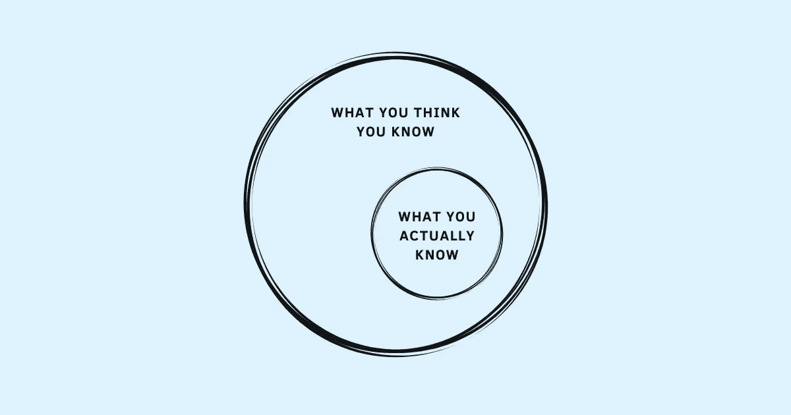

# 你的无知是导致你作为一个领导者失败的原因吗？

> 原文：<https://betterprogramming.pub/your-ignorance-is-causing-you-to-fail-as-a-leader-df4dce31f642>

## 你是如何处理你的盲点的？

鸣谢:作者

一个领导不可能什么都知道。不管他们有多聪明、有能力、有智慧，在前进的道路上应对挑战和未知需要他们不断学习——获取新知识、培养新技能、取代旧的和过时的信念，以适应行业的未来需求。

作为一名领导者，不知道一些事情并不是一个很大的缺点。对他们不知道的事情不好奇不开放。

将团队推向地面的领导者和将团队推向高峰的领导者之间的区别不在于知识、能力或竞争力。这甚至不是他们成功的动机和愿望。他们都想获得成功。

让他们与众不同的是他们处理无知的方式不同。让他们与众不同的是自信和谦逊。自信谦逊是对领导者做出正确决定的能力的信心，同时承认他们需要其他人来做正确的决定。知道他们不知道什么，相信他们所做的。这是对他们的优势有信心，同时也意识到他们的弱点。接受他们没有所需的知识，但对他们获取知识的能力有足够的信心。

> “自信谦逊是对我们的能力有信心，同时意识到我们可能没有正确的解决方案，甚至没有解决正确的问题。这让我们有足够的怀疑来重新审视我们的旧知识，并有足够的信心来追求新的见解。”—亚当·格兰特，“再想想:知道自己不知道的东西的力量”

所有的领导者都有盲点——已知的未知(他们知道自己不知道的事情)和未知的未知(他们不知道自己不知道的事情)。

自信谦逊的领导者并非没有盲点。相反，他们采取措施应对那些[盲点](https://www.techtello.com/leadership-blind-spots/)。

无知的领导者拒绝看到他们的盲点。阻碍他们成功的不是他们的无知，而是他们对这种无知的态度。他们的无知不仅限于他们的技能和能力，还包括他们如何给别人留下印象。他们如何参与他们的团队。

# 无知的类型

## 1.不知道他们的行为

人们如何看待自己和他人如何看待他们之间存在潜在的差距，从而导致无意中的盲点。他们过去的信仰、经历、教养和许多其他心理因素进一步加剧了这种情况。除非领导者花时间去调和现实，否则这些盲点会使与他们的人民的脱节和不和谐永久化。

当有人犯错时，他们会如何表现？他们如何应对工作中的挑战？他们如何处理冲突？他们的所作所为和行为方式远比他们所说的更有分量。

*   当他们说一套做一套时，员工们得出结论“她不可信。”
*   当他们把失败视为无能的标志时，他们会传达“不惜一切代价避免错误”的信息
*   当他们试图谨慎行事，拒绝需要冒险的机会时，他们实际上是告诉员工也不要冒险。
*   当他们经常开会迟到时，这表明别人的时间没有价值。
*   当他们[通过把头埋在沙子里来避免坏消息](https://www.techtello.com/ostrich-effect/)时，其他人也学着这么做。
*   当他们推迟艰难的对话或通过让他们的不适妨碍有意义的对话来避免冲突时，他们团队中的其他人也会寻找借口来避免他们。

良好的沟通不在于说了什么。而是对方如何看待。领导者需要将这一点内在化，以消除自己的偏见，这些偏见阻碍了他们如何给别人留下印象。只有当他们倾听他们的人，并真正倾听他们所说的话时，他们才能区分有益和无益的行为，只有这样，他们才能将他们的无知转化为有意义的贡献。

> “如果你不知道自己哪里做错了，你就无法进步。”—谢恩·帕里什

## 2.不了解他们的人民

不了解员工的领导者无法发现影响团队生产力和绩效的真正问题。

他们与员工的关系很肤浅，通常仅限于与工作相关的互动——为什么有些事情不顺利。我们要怎么解决它？他们什么时候交付项目？

如果不花时间去理解他们的员工，首先是人，其次是员工，他们永远不会建立起作为一个团队取得任何重大成就所需的联系。人们工作并把他们的工作职责视为一种义务，而不是他们关心的事情。缺乏进步感、目标感和归属感，经常导致他们的团队[精疲力竭](https://www.techtello.com/wrong-about-burnout-at-work/)。

个人不关心他们的团队也使他们忽视了每个人的力量。这使得他们很难将合适的人与合适的机会对应起来。错过业务目标会导致挫败感，缺乏适当的增长机会会导致流失。

只有当领导者建立了人际联系，只有当他们花时间提出问题，只有当他们连接到他们的人民的内部动机时，他们才能将他们的无知转化为有效性。

## 3.不知道他们的能力

很多领导认为自己比实际情况要好。他们的认知偏见阻碍了他们正确自我评估的能力。他们错误地高估了自己的知识和技能。他们认为自己比实际上更聪明、更有能力、更有竞争力。

Dunning Kruger 效应使情况变得更糟——他们对处理决策和工作中的日常挑战充满信心，但能力却很差。

这是最糟糕的一种无知——不知道自己实际上知道的有多少。

他们的聪明才智妨碍了做出正确的决定。这使得他们认为他们的现实版本就是现实，而不仅仅是现实的一个版本。他们拒绝听取别人的意见。他们不是问问题，而是用答案来引导。他们不是鼓励不同意见，而是惩罚与他们意见相左的人。

他们不仅知道的比他们认为的要少，而且他们也拒绝使用他们团队的集体知识来做出更好的决策。他们无法建立新的技能或获得新的知识来帮助他们更好地工作。困在他们知道得足够多的世界观中，让他们忽略了他们的[错误](https://www.techtello.com/learning-from-mistakes/)，放弃了所有的学习机会。

有时候，这种无知可能会被视为纯粹的傲慢，而在其他时候则是彻头彻尾的愚蠢。

另一个问题是他们对待问题的态度。当事情不尽如人意时，他们拒绝承担责任，因为这违背了他们作为一个高能力、聪明、有知识的人的信念体系。拒绝承认问题会让他们求助于责备，从而放弃解决真正问题的机会。

作家、企业家和大脑科学家杰夫·斯蒂贝尔写道:“当我们停止快速积累知识时，我们中的许多人都陷入了自己的困境。研究表明，一般来说，人们认为自己远远高于平均水平。换句话说，几乎每个人都认为自己远比实际聪明。正是这种类型的傲慢，这种让我们相信我们知道一些事情的傲慢，阻止了我们真正学好它。”

承认无知是接受学习心态的唯一方法。如果你是一个领导者，忽视你的无知不是一个选项。

> "与其说无知是一种耻辱，不如说不愿学习是一种耻辱。"—本杰明·富兰克林

# 摘要

1.  每个领导者都有盲点——他们不知道的事情。不知道什么不是问题。更重要的是他们对自己无知的态度。
2.  对他们的能力有信心，却不谦逊地提出问题和挑战他们的假设，会让领导者的无知变成傲慢。
3.  一个无知的领导者可能不知道他们的行为对他人的影响，不知道他们的人民的需求，也不知道他们自己的能力。
4.  对自己的行为无知的领导者不会注意自己的行为对他人的影响。如果不小心向团队传达信息，他们最终会助长不健康的行为和做法。
5.  不了解员工的领导者不会花时间在个人层面进行沟通。如果不了解每个人的优势、动机和愿望，他们就会错过业务目标，无法发展团队。
6.  不知道自己知识和技能差距的领导者拒绝寻求他人的意见，盲目坚持自己的错误决策，忽视培养技能和增长才干的机会。

在 Twitter 上关注我，了解更多故事。

*这个故事最初发表于*[*【https://www.techtello.com】*](https://www.techtello.com/ignorant-leader/)*。*