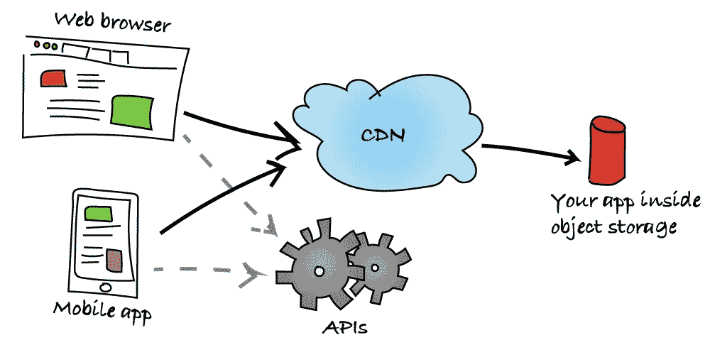
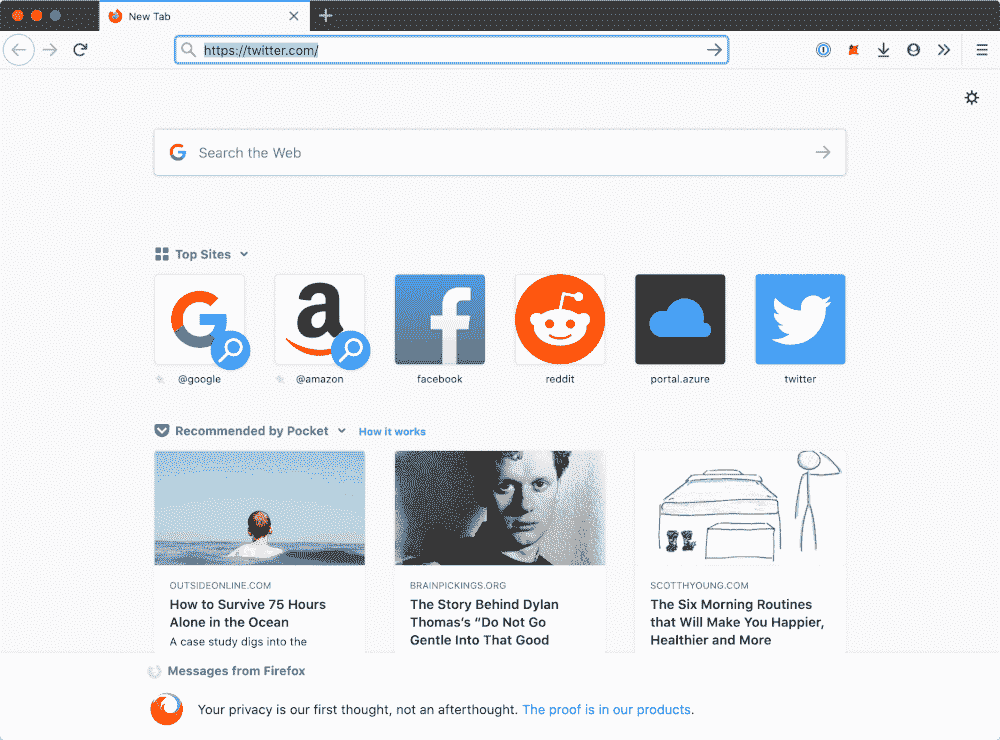
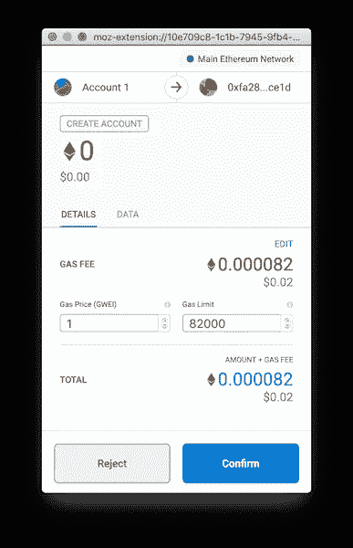

# 你的下一个应用可能没有后端

> 原文：<https://betterprogramming.pub/your-next-app-may-not-have-a-backend-aacc728bd032>

## 看看 JAMstack，看看接下来会发生什么

伊戈尔·米斯克在 [Unsplash](https://unsplash.com/s/photos/website?utm_source=unsplash&utm_medium=referral&utm_content=creditCopyText) 上的照片

历史有重演的趋势。

我在 1999 年建立了我的第一个网站，使用了当时*网站管理员*(我真的不能用*开发者*这个词)可以使用的一些最先进的技术:所见即所得编辑器。

对我来说(还有很多很多其他人！)，它原本的意思是[微软 FrontPage](https://en.wikipedia.org/wiki/Microsoft_FrontPage) ，我带着既怀旧又羞愧的尴尬笑容告诉你这些。

我的网站是一堆静态的 HTML 页面，有足够多的 JavaScript 和浮华的 gif，是 2000 年时代的互联网，由静态主机商提供服务，本质上相当于意大利的 GeoCities。

在接下来的几年里，我逐渐有了更好的选择，比如 2002 年发布的 Macromedia[Dreamweaver](https://helpx.adobe.com/support/dreamweaver.html)MX(现在的 Adobe)；它最大的优势是它生成的代码更符合标准。

十年后的 2009 年我还在建网站，但当时的关键词是*动态*。所有页面都是使用 PHP 在服务器端生成的。不仅仅是 PHP:开发者正在构建全栈的 web 应用。NET，Java， [Python](https://www.python.org/) ， [Ruby](https://www.ruby-lang.org/en/) …

这些技术并不完全是新的:ASP 在 1996 年就出现了，PHP 在 1994 年首次出现！然而，在简化 web 开发的新框架的推动下，这些技术在 2000 年的后半段才开始为更多的小团队和个人开发者所用。

比如 2005 年出的 [Django](https://www.djangoproject.com/) 和 Ruby on Rails。此外，在那几年，我们开始看到动态网站的非常便宜的主机选项(共享主机，如成立于 2003 年的 Bluehost)，因此开发人员不必管理自己的服务器。

云计算在当时还是一个相对较新的事物，无论如何，它主要是基础设施即服务。

快进到现在。现在是 2019 年，开发者们又一次开始构建静态网站。你可以称之为尼采式的永恒循环 T2 应用于网络开发的案例。

然而，这一次，情况有所不同:由于更新的 HTML、JavaScript 和 CSS 标准和 API，web 浏览器的功能比 20 年前显著增强。

从电子表格到 3D 游戏，我们可以构建在网络浏览器中运行的极其复杂的应用程序，并且我们不需要依赖外部插件。(我们也回到了使用大量 gif 的问题上，但这一次我们是在讽刺！)

# JAMstack 和隔离前端

HTML5 的第一个草案发布于 2008 年，从那时起，浏览器供应商一直在不断地实施新的 web 标准，并向 web 添加 API。

从更“基本”的东西，比如对 Adobe Flash 的消亡做出巨大贡献的`<video>`标签，到我们构建 web 的方式的提议的基础性改变，比如 [WebAssembly](https://developer.mozilla.org/en-US/docs/WebAssembly) ，开发者通常很难掌握新的和可能的东西。

然而，最大的进步之一是一种新的 web 应用程序设计范式的普及，这种范式被称为[*jam stack*](https://jamstack.org/):JavaScript、可重用 API 和预渲染标记。

受移动应用程序的启发，这一想法是，即使是 web 应用程序也应该将前端层与后端层完全隔离，只通过一组商定的接口通过 HTTPS 进行通信。

JAMstack 应用程序架构的概念性概述

JAMstack 的 JavaScript 部分应该是不言而喻的:整个应用程序在客户端运行，这是一个 web 浏览器，由 JavaScript 提供支持(您也可以更广泛地解释这个定义，在浏览器中指向执行 JavaScript 代码的同一个 VM，因此也包括 WebAssembly)。

“A”肯定是最有趣的部分，指的是 API:它们使 JAMstack 应用程序具有交互性，并为最终用户提供良好的体验。您的静态应用程序可以通过在 HTTPS 上调用的 API 与其他服务进行交互。

最简单的例子是 RESTful APIs，它们易于构建和使用。最近， [GraphQL](https://graphql.org/) 越来越受欢迎，它对可以用图形表示的数据特别有用(它是在脸书发明的，这不是巧合)。

对于某些场景，例如需要交换大量结构化数据的应用程序，协议缓冲区和 [gRPC](https://grpc.io/) 是另一种选择，尽管它们目前需要一个代理来与 web 浏览器一起工作。

最后，实时应用可能会利用[的 WebSocket](https://developer.mozilla.org/en-US/docs/Web/API/WebSockets_API) 。您可以自由选择您想要的任何 API 格式，只要它符合您的需要。

说到 API，一个非常重要的细节是它们可以属于任何人。您的应用程序可能会与您(或您的后端团队)构建和维护的 API 进行交互。或者，您可能使用第三方 API，例如 SaaS 应用程序提供的 API。我们稍后将重点讨论这些问题。

最后，JAMstack 中的“M”代表预先呈现的标记。Web 应用是静态的 HTML 文件，由各种捆绑工具在“构建时”预先呈现，如 [webpack](https://webpack.js.org/) 、[package](https://parceljs.org/)或 [Rollup](https://rollupjs.org/guide/en/) 。

也可以从 Markdown 文件中呈现内容，就像静态站点生成器所做的那样，例如 [Hugo](https://gohugo.io/) 、 [Gatsby](https://www.gatsbyjs.org/) 和 [Jekyll](https://jekyllrb.com/) 。在部署应用程序之前，所有的预处理都在开发人员的机器或持续集成(CI)服务器上完成。

使用 JAMstack 编写的应用程序一旦被“编译”,就只是一堆 HTML、JavaScript 和 CSS 文件，以及所有附带的资产(图像、附件等)。).任何时候都没有服务器端处理。这给 JAMstack 应用程序带来了巨大的好处。

首先，JAMstack 应用程序非常容易部署、扩展和操作，并且可以具有出色的性能。

你可以从云对象存储服务(如 [Azure Blob Storage](https://docs.microsoft.com/en-us/azure/storage/blobs/storage-blob-static-website) 或 [AWS S3](https://docs.aws.amazon.com/AmazonS3/latest/dev/WebsiteHosting.html) )中交付你的静态文件，这些服务非常便宜(每月每 GB 存储几美分)，并且高度冗余和可靠。

当您使用对象存储服务时，您也不需要管理和修补服务器或框架，因此开销更少，安全性更高。

当您在对象存储前放置 CDN(内容交付网络)时，您的网站将由全球多个终端节点直接提供服务和缓存，为全球所有访问者带来最小的延迟和难以置信的可扩展性。

如果你愿意，你也可以通过行星间文件系统(IPFS)提供你的文件，就像我做的那样。

其次，JAMstack 的开发人员体验(DX)轻而易举。首先，前端开发人员和后端开发人员可以各自专注于自己的代码，只要他们在接口和 API 上达成一致，他们就可以基本上自主地操作。

带有复杂模板引擎的单一应用程序的时代已经一去不复返了(还记得 PHP 吗？)，这导致了两个团队的冲突和头痛。

因为前端应用程序在编译后最终只是一堆静态文件，所以它们也很容易部署，原子地:在高层次上，你将新的捆绑包复制到你的存储区域，然后更新 CDN 以指向新的资产。

前端应用程序的编译往往非常快，而且不需要担心容器化和容器编排、 [Kubernetes](https://kubernetes.io/) 等。

考虑到工具的标准化程度，建立持续集成和持续交付(CI/CD)管道通常很简单，这要归功于预先制作的模板。

最后，前端开发人员可以自由试验，在某些情况下，他们甚至可以将开发前端指向生产后端。

# 这都是速度的问题

对终端用户来说，真正的好处是应用速度快。这不仅提高了用户满意度，还提高了用户的参与度和保留率。

有三个方面可以解释为什么应用程序感觉很快。

首先，应用程序本身异步加载数据，因此用户可以在数据加载时看到界面，并与之交互。看看新 Twitter 应用加载的 GIF:

新的 Twitter 应用程序可以即时加载并异步请求数据

应用程序本身几乎可以立即加载。然后，它逐渐开始异步请求数据，并填充接口的所有部分。

第二个原因是能够大量缓存应用程序。对于许多 JAMstack 应用程序来说，JavaScript 和 CSS 文件不会频繁更改，所以客户端可以在下载后缓存它们很长时间。

这节省了请求应用程序代码的时间，因此客户端只需要获取数据。此外，如果 web 应用通过 CDN 提供，它允许用户从靠近他们的终端节点检索您的代码，从而大大减少延迟。

尽管该应用程序的代码可能有数 KB 大小，但从 CDN 下载的延迟时间缩短，并且能够在本地缓存文件，这意味着应用程序实际上更快。

关于缓存，你也可以使用更多的技术，如[服务人员](https://developers.google.com/web/ilt/pwa/caching-files-with-service-worker)来实现应用程序代码和(一些)数据的缓存，以进一步加快页面加载，甚至提供离线体验。

最后，API 服务器不需要花费时间来生成和提供完整的 HTML 页面，它只需用原始数据(通常是一个 JSON 有效负载，在传输过程中用 GZIP 压缩)进行响应，让客户机完成构建页面的工作。

当您将资产放在对象存储服务中时，后端服务器不会接收对静态资产的所有请求，因此它有更多的资源来处理实际的业务逻辑和 API。

# 您可能不需要自己的 API

我在上面写道，JAMstack 中的“A”代表 API，你可以使用任何人构建和操作的*任何* API。

您可以向外部身份提供者验证用户。如果你正在构建一个企业应用，你的目录可能已经在 [Azure AD](https://docs.microsoft.com/en-us/azure/active-directory/fundamentals/active-directory-whatis) 或 [G Suite 目录](https://support.google.com/a/topic/20016?hl=en&ref_topic=9197)中(或与之同步)。

对于消费者应用程序，请登录社交提供商，如[苹果](https://developer.apple.com/sign-in-with-apple/)、[脸书](https://developers.facebook.com/docs/facebook-login/)、 [GitHub](https://developer.github.com/v3/guides/basics-of-authentication/) 等。

也有像 [Auth0](https://auth0.com/) 和 [Okta](https://www.okta.com/) 这样的公司提供强大的、可扩展的解决方案，包括账户管理(注册表单、密码重置……)和与各种外部提供商的集成。

好的一面是，许多其他 API 可以支持至少来自上述一些提供者的认证令牌，因此您可以获得即时集成。此外，无论如何，使用外部身份提供者而不是滚动自己的身份验证代码是一个好主意，因为这是最安全的做法。

此外，你还可以集成大量的 SaaS 服务，让你的应用无需付出任何努力就能访问海量数据和功能。

有天气和交通的 API，显示股票价格和地图，监控航班，甚至[订购披萨外卖](https://riaevangelist.github.io/node-dominos-pizza-api/)。

您可以使用 Google Analytics 或 Adobe Analytics 来衡量网站的流量。如果你正在建立一个博客，让用户对你的文章发表评论是很容易的，像 [Disqus](https://disqus.com/) 或 [Commento](https://commento.io/) 这样的服务。

如果你需要一个 CMS 来轻松地、动态地修改网站的内容，你可以在“无头内容管理系统”中有多种选择。比如 [Strapi](https://github.com/strapi/strapi) 和 [Ghost](https://github.com/TryGhost/Ghost) 。甚至无处不在的 WordPress 都可以在[无头模式](https://developer.wordpress.org/rest-api/)下使用。

对于企业应用程序，集成 Microsoft Office 365 和 G Suite 等办公套件可以让您收发电子邮件、管理日历和联系人、创建文档和电子表格、访问企业目录等等。

这些服务还带有 OneDrive 和 Google Drive 中的云存储，所以你可以轻松地使用它们来存储和检索数据。

开发人员还可以依赖外部服务，如接受信用卡支付(Stripe)、在文件格式之间转换、为图像生成缩略图(例如 [CloudConvert](https://cloudconvert.com/) )、处理视频、发送消息(例如通过 Slack、Teams、Twilio 等)。)…

不胜枚举。一些数据库服务可以直接从前端应用程序访问，如 [Firestore](https://firebase.google.com/products/firestore/) 。

最后，您还可以利用一些“低代码/无代码”服务来处理服务器环境中绝对需要进行的所有处理，例如，因为它们需要连接客户端无法直接访问的服务(数据库、某些企业应用程序等)。

其中一个解决方案是 [Azure Logic Apps](https://docs.microsoft.com/en-us/azure/logic-apps/logic-apps-overview) ，它本质上是一个面向开发者和企业的 IFTTT，你可以通过 REST 调用来触发它。

使用外部服务提供的 API 的好处不容忽视。确保它们的可用性和按需扩展是其他人的责任。

您不需要修补任何应用程序或框架，更不用说基础架构了，它们由一个团队来维护，也保证了它们的安全性。

在隐私和合规性方面也有一些有趣的好处。

如果你的应用只在客户端，不存储任何数据，GDPR 合规的负担在很大程度上是由你所依赖的服务提供商承担的，就像使用外部服务进行支付一样，比如 Stripe，让你不必遵守 PCI-DSS。

当然，当你别无选择时，你也可以求助于构建你自己的 API。

有了像 AWS [Lambda](https://aws.amazon.com/lambda/) 和 [Azure Functions](https://azure.microsoft.com/en-us/services/functions/) 这样的*无服务器*平台，你就不需要管理和扩展自己的服务器，尽管你仍然要对一些事情负责。

这些事情包括修补您的应用程序，确保它在受支持的运行时上运行(例如，当您正在使用的 Node.js 版本达到生命周期的终点时，以更新的 node . js 版本为目标)，以及可选地考虑如何地理复制部署和跨这些部署的负载平衡。

构建您自己的 API 通常也需要管理您的数据存储，这些数据存储需要复制、备份和扩展。

# 接下来会是什么:“杰姆斯塔克”

依靠我们自己的 API 和/或第三方 API，用 JAMstack 构建 web 应用程序是当今 web 开发中最先进的设计模式之一。

在花了几十年时间将应用程序移动到服务器上，全栈，并尽可能多地将工作从客户端移走后，我们又回到了将更多任务放到浏览器上。

只有一个部分仍然需要服务器，不管是您的还是其他人的:API。那么，下一个合乎逻辑的问题是:“我们如何才能完全摆脱服务器？”

答案可能最终来自于使用区块链，特别是以太坊。

我建议我们称之为“JEMstack”，这是 JavaScript、以太坊和预渲染标记的缩写。

这个堆栈将是“web 3.0”或分布式 web 的一部分。你的“JEMstack”分布式应用程序(或 dapps)将通过 [IPFS](https://ipfs.io/) 提供服务，它们的数据将存储在一个区块链中，作为一个分布式账本。

一些好处包括将数据控制权交还给用户，让开发人员不用担心任何基础设施。

我们还没到那一步。你完全可以使用区块链，尤其是以太坊来构建 dapps，事实上已经有很多这样的应用了:一个很好的精选列表在 App.co 上。然而，在这样的技术成为主流之前，还有许多事情需要解决。

开发基于以太坊的应用的开发者体验真的很好。

通过简单、无缝地调用智能合约，应用程序可以轻松访问和修改存储在区块链上的数据。这种智能合约由为以太坊区块链(从技术上讲，以太坊虚拟机)编译并运行的代码组成。

智能合约可以存储数据并进行计算，它们通常是用一种叫做[可靠性](https://solidity.readthedocs.io/en/v0.5.13/introduction-to-smart-contracts.html)的类 C 语言编写的。

然而，当我写这篇文章时，终端用户体验(UX)仍然有很大的改进空间，这是广泛采用 dapp 的最大障碍，而且可能还要持续一段时间。

首先，大多数用户需要安装浏览器扩展来与以太坊交互，例如用于 Firefox 和 Chrome 的 [Metamask](https://metamask.io/) ，用于 Safari 的 [Tokenary](https://tokenary.io/) 。只有不太受欢迎的浏览器，如 Brave 和 Opera，为以太坊钱包提供内置支持。

移动是另一个雷区，用户需要下载像比特币基地钱包或 Opera Mobile 这样的特殊应用程序来与区块链互动。

然后，用户还要处理以太坊钱包。虽然从以太坊读取数据是免费和简单的(不需要用户的交互)，但在区块链上写任何东西都需要用户的人工批准，并至少支付一笔“燃气费”。

这是用户需要支付的以太坊令牌的一小部分，以便能够执行改变区块链状态的代码，无论智能合约的功能本身是否是付费的(即，它将资金、以太转移给其他人)，都需要它。

UX 并不令人愉快，它要求用户明确地点击一个弹出窗口，然后等待几秒到几分钟，等待以太坊区块链确认交易。

当然，用户需要首先购买以太坊令牌，这并不像看起来那么简单，尤其是在世界上的一些国家。

最后，如果用户放错了钱包的私人密钥或恢复单词，或者不够小心，就会有安全问题。

确认弹出窗口是元掩码 UX 的常见部分

有一个庞大的社区正在致力于改进区块链应用程序的 UX，使添加身份更容易，建立更透明的流程，使交易更快甚至更即时，等等。

正如每一种仍处于不稳定状态的技术一样，有各种竞争的区块链技术，也有许多不同的平台和框架。

我希望在接下来的几个月和几年里，我们会看到更多的融合和标准化，最终写在“JEMstack”上的 dapps 可能会成为新的规范。