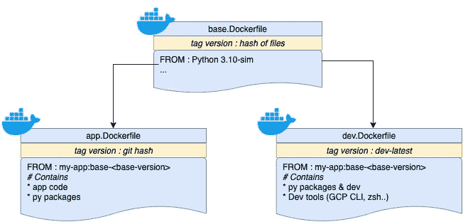

# 您的下一个容器策略:从开发到部署

> 原文：<https://betterprogramming.pub/your-next-container-strategy-from-development-to-deployment-66167c0d028a>

## 了解如何通过 Python API 项目管理 docker 文件和版本


容器球依赖关系—图片由作者提供

在当今的发展世界中，容器无处不在。这是一种实用的本地测试方法，只要它支持容器映像，就可以部署在任何云服务上。然而，很容易陷入`dockerfile(s)`和版本的地狱。

在本指南中，我将提供一个清晰的策略，并举例说明如何用一个令人敬畏的`Makefile`从开发到部署建立您的容器策略。我们将把一个部署在[云运行](https://cloud.google.com/run?utm_source=google&utm_medium=cpc&utm_campaign=emea-de-all-en-dr-bkws-all-all-trial-e-gcp-1010042&utm_content=text-ad-none-any-DEV_c-CRE_526671526787-ADGP_Hybrid%20%7C%20BKWS%20-%20EXA%20%7C%20Txt%20~%20Compute%20~%20Cloud%20Run-KWID_43700059490201715-kwd-1072793830925-userloc_9060640&utm_term=KW_google%20cloud%20run-NET_g-PLAC_&gclsrc=ds&gclsrc=ds&gclid=COqX__fsq_QCFQgGGwodvyMBGQ)上的 python API 项目作为案例研究，你将拥有一个完整的工作代码示例。

# 战略🗺



作者图片

目标是在开发环境(Docker 桌面)、CI 流程(例如 [Github 动作](https://github.com/features/actions)，用于测试/部署)和应用程序运行时(GCP 云运行)之间几乎没有差别。

为了做到这一点，我们将它们分成多个 Dockerfile。这带来了几个好处:

*   不要让 Dockerfile 文件太大
*   能够散列一个 Dockerfile 文件来检测一个变化，并将其用作容器版本标签

我们将利用一个强大的`Makefile`，它将有助于成为开发和 CI 的单一入口。

# 基本容器

## 里面是什么？

这基本上是所有其他容器的根(这里是开发/CI 和应用)。这是您通常定义将要使用的操作系统以及为编程语言设置基线的地方。

在这里的实践中，我们将把:

*   Debian 10
*   Python 3.9
*   几个 Debian 包比如 curl，git 等。

有时，您的公司可能有一个基础映像，他们希望您使用它来避免 Linux 操作系统发行版中太多的不一致和更好的安全补丁管理。

这里，我们将直接使用来自官方 python repo 的图像。

## 如何管理版本？

一个简单的策略是对文件或文件夹列表做一个`[md5](https://en.wikipedia.org/wiki/MD5)`散列。这样，我们可以确信我们生成的版本与代码的内容紧密相关，并且是独一无二的。这样的脚本看起来会像这样。

管理每层版本(图像标签)的脚本示例

根据 docker 层的不同，我们将使用相同的脚本。获得最新版本的`dev`层应该是:`./version.sh dev`

如果您在这个基本映像中使用了任何脚本或文件(例如:创建一个定制的 Linux 用户)，可以随意将它们添加到散列中，以便跟踪这些更改！

# 应用程序容器

## 里面是什么？

*   基础映像中包含的所有内容
*   密码
*   Py 包

## 什么会定义这个版本？

它可以是一个简单的散列。我们在这里使用 git 散列来散列整个目录。

# 开发容器🏗

我们的策略是利用 VSCode 的`[devcontainer](https://code.visualstudio.com/docs/remote/containers)`特性，这样我们就可以在基础映像上构建一个完全隔离的开发环境。

## 里面是什么？

*   基础映像中包含的所有内容
*   没有代码(因为它将是一个挂载卷，所以我们可以在开发时热重装)
*   CLI 工具(GCP CLI)
*   Py 包(和开发依赖项)

## 什么会定义这个版本？

除非您想加快构建时间并将映像推送到远程 docker 注册表上，否则不需要对此版本进行修改。

# 使用 Makefile 打包所有内容

开发/构建/测试/部署的唯一要求只有`make`和`docker`！

我们将使用一个可以是 base、app、dev 的`DOCKER_LAYER`参数来构建一个命令。我们可以动态获取最新版本，并尝试从远程注册表获取`pull`,如果不存在，则尝试获取`build`。

为了考虑 docker 层之间的依赖关系(base → dev 和 base → app ),我们可以添加一个简单的 if/else 用例，这样无论我们请求哪个层，基础层总是在前面构建。

示例:

`make get-img DOCKER_LAYER=dev`

将首先提取或构建最新版本的`base` docker 映像。

使目标`get-img`看起来像这样:

为 get-img 制作目标示例

# 使用 CI 自动化测试和部署

现在我们所有的行为都被容器化了，我们的 CI 行为将变得非常简单。除了对云服务进行认证的专用方法之外，其他一切都只是一个`make`命令。

请注意，在准备配置项映像时，我们会推送映像(`base`、`dev`)。这将加速在分支上进行开发时的 CI 过程(如果在`base`图像中没有变化)。

GitHub 操作的 CI 命令示例

# 结论

通过这个例子，您可以很好地了解如何将下一个项目从开发到部署进行容器化！

当您需要升级或测试不同版本的依赖项时，在不同层的基础映像上保持良好的一致性将有助于您更快地行动。

根据您的需求和您想要做出的权衡，许多东西可以很容易地适应或扩展。

该项目的完整代码可以在[这里](https://github.com/mehd-io/python-api-boilerplate/)找到。

编码快乐！

```
**Want to Connect With the Author?**Follow me on 🎥 [Youtube](https://www.youtube.com/channel/UCiZxJB0xWfPBE2omVZeWPpQ),🔗 [LinkedIn](https://linkedin.com/in/mehd-io/)
```