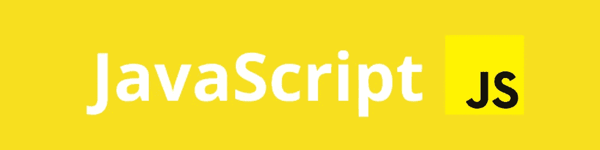

# 你正在创建一种新的编程语言——它的语法会是什么样的呢？

> 原文：<https://betterprogramming.pub/youre-creating-a-new-programming-language-what-will-the-syntax-look-like-35199d2a44e9>

## 我问了一些程序员他们最喜欢的语法——以下是他们的回答

不久前，我决定找点乐子，写了一篇名为[的文章，“我最喜欢的 8 种不同编程语言的语法”](https://medium.com/swlh/my-favorite-pieces-of-syntax-in-8-different-programming-languages-ba37b64fc232?source=friends_link&sk=02c2d09a27f96dfe3e428f447338fab5)

我发表了它，然后决定在一个子网站上分享它—[r/编程语言](https://www.reddit.com/r/ProgrammingLanguages/)。这引发了一场关于编程语言语法的有趣讨论，因为用户分享了他们自己的最爱。

这让我别无选择:我必须用 r/ProgrammingLanguages 社区中我最喜欢的语法写一篇新文章。

# 跨编程语言的语法汇编

在我们开始之前，我应该快速澄清一下这篇文章是什么，不是什么。

## ❌:这不是编程教程。

## ❌:它不会解释这些片段。

## ❌:这不是一份客观的清单。

## ✅:这是为了好玩。

## ✅:它汇集了各种各样的人的意见。

虽然深入研究每个片段会很棒，但它们实在太多了。无论如何，我并不熟悉所有提到的语言。

因此，如果有的话，我会添加一点发帖子的用户的解释。 不过，欢迎你在 [GitHub](https://github.com/yakkomajuri/favorite-syntax) 上给这个列表投稿，那里欢迎更深入的解释。

最后，本文标题的原因是 subreddit 中的许多用户实际上已经构建或正在构建他们自己的编程语言，有些人提到他们希望在其中包含他们喜欢的其他语言的语法。

也许你可以从这个列表中为你自己的编程语言汲取灵感。

# 生成器表达式/列表理解

发布者: *u/ibrahimqasim* 和 *u/usernamecreationhell*

# 变量解包和多重赋值

发帖人: *u/ibrahimqasim*

# 带“块”

发布者: *u/Beefster09*

# 做记号

发帖人: *u/* 超级巨星 64

`do`符号是“组合一元函数的语法糖”

# 列出理解

发帖人: *u/* batllista101

# 变量解包和多重赋值

发帖人: *u/* batllista101

# 匿名函数

发帖人: *u/* Yul3n

OCaml 具有匿名函数，使用`function`关键字自动触发模式匹配，因此您可以编写如下代码:

是的，这个看起来很奇怪。但是必须保持一致！

# 无支架控制结构

发帖人: *u/* Yul3n

具有单行体的控制结构可以省略括号:

# 数组析构

发帖人: *u/* 那个你就是

# 变量/常量声明和导入块

发布者: *u/* almbfsek

# 接收器功能

发布者: *u/* almbfsek

# 案例类别

发帖人: *u/* Adriandmen

# 灵活的调用语法

发帖人: *u/* xigoi

# 风格不敏感

发帖人: *u/* 西戈伊

# 实用程序

发帖人: *u/* 西戈伊

Pragmas 不再需要像`inline`这样的关键字，您可以轻松定义自己的关键字。

# 结果变量

发帖人: *u/* 西戈伊

每个过程自动定义一个名为`result`的变量，该变量被初始化为默认值，并在结束时自动返回，除非您显式返回其他内容。

就这些，感谢阅读！

# 进一步阅读

对学习不同的编程语言感兴趣吗？

查看这篇关于一种强大但鲜为人知的编程语言 Nim 的教程:[“Python 的替代品？我尝试了你从未听说过的最好的编程语言“T21”。](https://medium.com/better-programming/a-python-substitute-i-tried-out-the-best-programming-language-youve-never-heard-of-9e29cd1893c0?source=friends_link&sk=61b12cfd6456f992013ba61e710efc72)