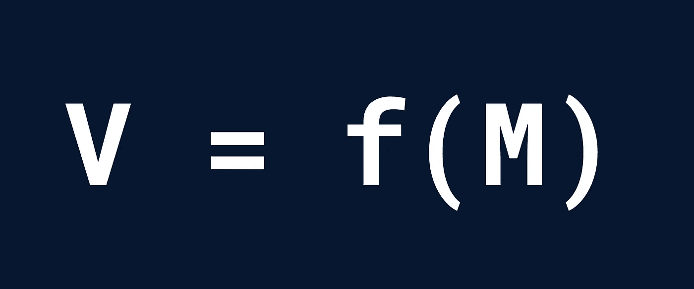

# 想让主人有什么反应？考虑渲染，而不是生命周期

> 原文：<https://betterprogramming.pub/youre-looking-at-function-components-wrong-8b2ac4c51737>

## 你看错了功能组件

劳拉·吉尔克里斯特在 Unsplash[拍摄的照片](https://unsplash.com?utm_source=medium&utm_medium=referral)

嗯，您可能很好地理解了 React 中的函数组件，但许多人并不理解。这很遗憾，因为它们提供了一种可预测的和声明性的方法来构建 UI。

尽管它很优雅，但这种方法并不总是直观的，特别是对于习惯于具有大量反应性“魔法”的库(如 Vue 和 Svelte)或采用更强制性方法的库(如 jQuery)的开发人员来说。

通过一些例子，我们将深入 React 中函数组件的基础，以及为什么你可能会想错它们。

# 胡克之前的日子

在钩子被引入反应之前，函数组件必须是纯的(没有状态或副作用)。尽管有这些限制，它们提供了类组件所缺乏的简单性和可预测性。

此外，他们还引入了一个基本原则，这个原则现在是 React 的基础:**视图是模型的函数**。

对于纯组件来说，“模型”只不过是组件的道具。所以就目前来说，我们可以把函数组件看成只是一个接受道具并返回视图的函数。直截了当，对吧？

当然，在现实世界中，用户界面并不纯粹。最重要的是，他们有一个讨厌的叫做国家的东西，它会毁掉一切。根据定义，状态不能作为函数的输入(那只是一个道具)，这意味着函数组件需要一种方法来“了解”有状态数据，而不接受它作为参数。输入钩子。

# 钩子是什么？

你可能认为钩子完全违背了我们的心智模型，即视图是模型的一个函数。他们没有。视图不是模型的一个纯粹的函数——有状态性阻止了这一点——但是从`V = f(M)`的角度考虑仍然有助于我们编写更好的代码。

钩子就像是从我们的函数到外部有状态世界的一种逃避。它们实际上是如何工作的[实际上并没有那么复杂](https://medium.com/@ryardley/react-hooks-not-magic-just-arrays-cd4f1857236e)，但是现在已经超出了范围。

关于钩子，真正重要的是要理解没有反应魔法。它们只是普通的变量，可以在函数组件的范围内访问。

这在实践中是如何运作的？

# 这一切都回到渲染

呈现一个函数组件就像调用函数一样简单。这听起来是显而易见的，但重要的是要真正理解这一点:每次组件被渲染或重新渲染时，并没有什么神奇的事情发生，只是一个简单的函数调用，返回一个视图(JSX，在 React 的情况下)。

纯组件只需要在道具变化时重新渲染。React 在这种情况下的工作非常简单:每当道具改变时，调用组件函数，传入新的道具值，并显示返回的 JSX。

用钩子渲染一个组件更复杂。我们以`useState`挂钩为例。它在渲染过程中扮演两个重要角色:

1.  它告诉 React 在调用 setter 函数时重新呈现组件
2.  它必须在每个渲染中提供状态的当前值和 setter 函数

我们将关注第二个问题的含义，因为第一个问题并不特别有趣，也超出了本次讨论的范围。

请记住，重新渲染就像调用函数一样简单。假设我们重新渲染这个组件:

基本反应计数器应用程序

你可能认为`counter`有一些神奇的反应，但事实并非如此。这是一个`const`:它的值在函数调用的范围内不会改变。

(顺便说一下，现在是复习 Javascript 中闭包的好时机。不理解闭包就无法掌握 React。)

对于第一次从类组件迁移到函数组件的 React 用户来说，这是一个典型的陷阱。对于类组件，状态是可变的，所以任何对状态值的引用都会给你真正的最新值。

在功能组件中并非如此。假设我们在增量回调中添加了一个延迟打印语句。如果我们第一次点击增量按钮，你认为会打印出什么数字？

计数器 app，超时…会怎么样？

虽然`1`可能看起来是直观的答案，但打印出来的值实际上是`0`。但是为什么呢？

记住`counter`是函数调用范围内的常数。按钮处理程序是在这个函数调用过程中创建的，并且`counter`被永久设置为`0`。因此，在第一次呈现中，`useState`提供初始状态值，并像在任何其他 Javascript 函数中一样进行替换:

我们组件的第一个渲染看起来像什么

现在可以更清楚地看到，`setTimeout`回调只能打印创建回调时`counter`的值。而且重要的是，即使后来更新了`counter`的值，重新渲染了组件，初始的回调也不会改变；相反，新的呈现将创建一个新的回调，然后打印更新后的值。

整个过程大概是这样的:

1.  初始渲染。`counter`为 0，因此点击处理程序创建一个回调函数，该函数将在 1 秒后`console.log(0)`
2.  重新渲染，因为已经调用了`setCounter`。现在，同样的渲染函数再次被调用，但这次`counter`的值为 1，而*只在这个新函数调用*的范围内。仍在等待执行的超时处理程序保持不变(多亏了闭包)。
3.  3 秒钟后，执行在初始渲染中创建的回调，打印`0`。

# 这一切意味着什么？

很多人认为 React 中函数组件和类组件的区别只是组件实际上是如何编写的问题。

要掌握 React，你必须用与函数组件相同的方式思考。与其考虑组件的生命周期，不如从渲染的角度考虑:当组件重新渲染时，是什么导致了组件的重新渲染(属性改变，状态改变，等等)。)?道具和挂钩提供的价值是什么，是不可改变的吗？

这种开发功能组件的方法将帮助您更深入地理解它们，更快地诊断和修复 bug，并设计出更可预测、更干净的 UI 组件。