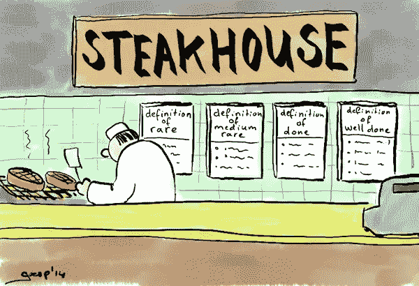
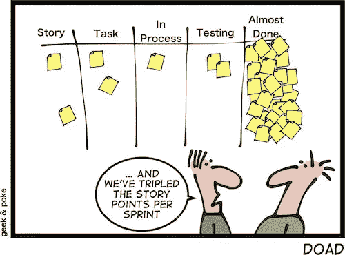
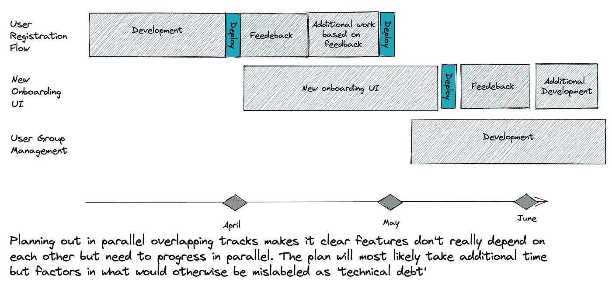

# 你永远不会结束。根据定义。

> 原文：<https://betterprogramming.pub/youre-never-done-by-definition-c04ac77c616b>

## “完成的定义”如何不能描述使一个特性成熟所需的努力



来源:@ [**戈尔普**](https://twitter.com/goerp)[https://blog.goerp.nl/?p=361](https://blog.goerp.nl/?p=361)获得业主许可

很容易理解为什么我们需要一个“完成的定义”，一旦你采用了它，它就是那些看起来很明显的事情之一。没有׳done׳定义，关于发展进程的交流就变得模糊不清。如果我们不清楚完成一个特性需要什么，团队可能不会考虑其他类型的工作，包括审查、测试、确保可维护性、部署等等。

在我工作过的许多工程团队中，开发人员会被更吸引人的编码任务所吸引，而忽略了其他的主题。最终，我们会发现被证明为“完成”的事情并不是真的“完成了”，就像俗话说的那样。剩下的琐碎任务被视为小的收尾工作，结果却需要大的努力来打乱整个计划。

“完成的定义”很棒，很重要，我们都需要它。

# 它还会误导人，经常被曲解

事实是，完成的定义根本没有定义‘完成’。刚刚发布的功能经常没有实现，这是不可能的。除非我们考虑到这一点，否则我们在资源配置和规划方面将再次完全失误。

我想起了丹尼尔·特霍斯特-诺斯的一篇旧文章，尽管它已经过去了十多年，但不知何故还是留在了我的脑海里。丹·诺斯(我是你的超级粉丝！)，指出软件确实是一个非常年轻的行业，它不像更传统的行业那样有相同类型的经验和实践可以借鉴。我想补充的是，这尤其具有影响力，因为软件在开发方式上也与其他行业非常不同。

# 软件开发并不总是线性的

虽然我们从其他职业中借鉴了实践、术语和隐喻(你注意到软件“架构师”的惊人数量了吗？)，软件不一样。它不同于建筑、制造汽车或焊接钢材。这是不同的，因为我们创建的软件通常不是一次性的。软件是一个连续体。

也不可能从头到尾发展下去。为了知道我们需要发展什么，我们需要反馈，而反馈需要时间。牵引力不会在一夜之间增长，用户不会马上采用功能。我们试图评估我们交付的功能的可用性偏好、性能要求和预期用途。用户将永远偏离我们为他们规划的幸福之路，这太糟糕了。

只有当软件特性与现实世界交互时，我们才能理解它们在成熟度曲线上的位置，缺少什么，以及什么需要做得更好。只有在那个时间点上，才有可能真正估计出“完成”对该特性的实际意义。

# “三分熟”的定义

当开发团队决定他们“完成”或者甚至“完成”时，他们实际上的意思是该特性“足够成熟，可以部署到产品中”。根据我的经验，组织中的其他人通常不会这样看待这个里程碑。

这就是国防部的真正危害变得明显的地方。我见过很多产品经理，一听到‘完成’这个词，就赶紧推进地图上的路线图令牌。偏向于推出显示更多“进步”的新功能，任何最终将到达的反馈都被归档为“技术债务”或“增强”。

通过这种方式，基于现实世界使用的优化、重构和可用性改进被放入一个单独的待办事项列表中。没有人喜欢积压的工作。



来源:[https://geek-and-poke.com/](https://geek-and-poke.com/)。

# 向功能成熟发展

定义什么对于初始部署来说足够好是很重要的。在我们的开发者生涯中，我们都需要一个国防部。然而，额外的实践需要到位，以使剩余的工作被正确地识别和接受为特性开发的一部分。

下面是我看到的一些成功应用于支持异步开发的实践:

1。将特性进度计划为平行的轨道而不是线性的路径，并提前计划反馈和改进。创建一个在功能“A”和功能“B”之间有一条类似甘特图的线的工作计划，将自动地使整个组织偏向于尽快到达“B”。另一方面，拥有两个显示进度的独立轨道将传达平行进度。

我是最后一个对估算与不估算的争论发表评论的人。但是，如果一些计划是基于假设制定的，请确保这些假设包括反馈周期。


线性路线图—作者提供的图片



功能成熟度的平行跟踪—按作者分类的图片

2。确保你的开发工具能够提供反馈，否则，这些成熟度问题都不会困扰你，因为你只是不知道而已。当发布特性时，开发者应该强调他们想要跟踪的是什么，并确保信息能够到达他们手中。

技术代码级别的反馈和产品反馈一样重要。代码执行得如何？哪些代码段会被使用，哪些不会被命中？用户遇到了哪些错误？许多成熟度差距被忽略了，因为它们对产品经理来说太技术性了，而开发人员在特性发布后没有跟踪它们。

3。持续跟踪特性成熟度，以及对成熟度的信心水平。即使在交付之后，主要特性也应该一直在仪表板上。为了正确区分产品的优先级，产品经理需要真正能够评估现有的功能差距。优先顺序是关键，它需要基于真实数据。

# 结论— YMMV

在过去的几年里，异步函数成为用多种语言编写代码的主要方式。记住这一点，异步开发和发布过程可能看起来并不陌生。

你的组织如何处理非线性发展的不确定性和迟来的反馈？你遇到过这里描述的偏见吗？你是如何跟踪特性成熟度的？我非常想听听您自己的经历，以及该领域的组织正在应用的解决方案。

```
**Want to Connect?**You can reach me on Twitter at @doppleware or here.
Follow my open-source project for continuous feedback at https://github.com/digma-ai/digma
```