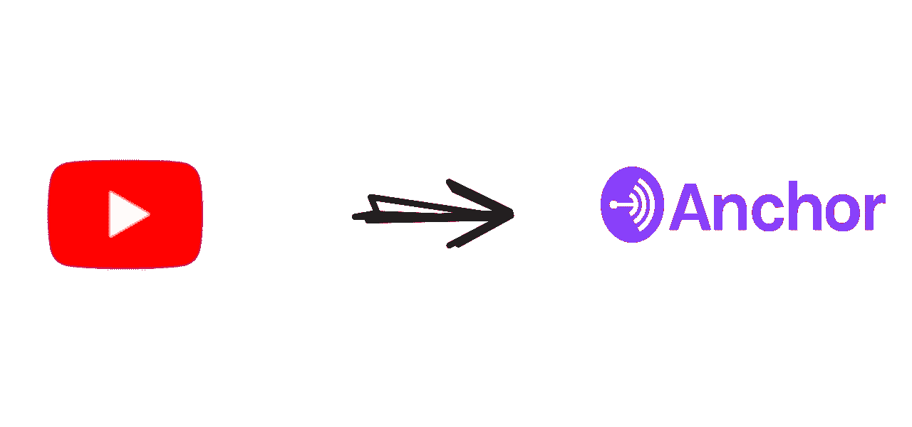

# 使用 GitHub 操作自动发布您的播客

> 原文：<https://betterprogramming.pub/youtube-to-anchor-fm-a-github-action-to-automate-the-publishing-process-of-your-podcast-1dbb0fc90560>

## 将您的播客从 YouTube 发送到 Anchor.fm



存储库封面图像

# 背景

隔离期间，我和几个朋友在 YouTube 上开了一个意大利科技直播节目，在 Spotify 和 Anchor.fm 上开了一个播客。这个节目叫做薛定谔的帽子。

我们很喜欢在网上创建这些内容，但是我们遇到了一些技术问题。其中一些是小问题，我们在那段时间很容易解决，但接下来是大问题。

# 问题

我们在将音频文件从 YouTube 上传到 Anchor.fm 时遇到了一些问题，因为这个操作需要时间，一个转换工具，你知道，在 2020 年，没有人有太多的时间。

我们开始思考。我们搜索了一些 Anchor.fm APIs，但什么也没找到，直到发生了以下对话:

> "我们应该创建一个私有的 Anchor.fm API 吗？"
> 
> “嗯，我听说了一些关于 Github Actions 的事情，也许我们可以通过使用它来自动化整个过程”
> 
> “闭嘴，让我们开始编码。”

# 解决方案

我们通过 Github 管理整个播客项目，通过 Github 操作，您可以在您的存储库中自动化、定制和执行您的软件开发工作流。

我们开发了一个 Github Action，可以在 [Github Action Marketplace 上找到，](https://github.com/marketplace/actions/upload-episode-from-youtube-to-anchor-fm)它可以自动完成从 YouTube 到 Anchor.fm 的整个发布过程。

[](https://github.com/Schrodinger-Hat/youtube-to-anchorfm) [## 薛定谔帽/youtube 到主播 fm

### 此操作会将给定 youtube 视频中的音频文件自动上传到您的 Anchor.fm 帐户。这是非常…

github.com](https://github.com/Schrodinger-Hat/youtube-to-anchorfm) 

工作流程和操作都是免费的，在麻省理工学院的许可下是开源的。

# 它是如何工作的

Github 动作正在使用`youtube-dl`库和`puppeteer`。第一个是`npm`模块，用于从 YouTube 下载视频/音频，同时 Puppeteer 会将生成的文件上传到 Anchor.fm 仪表盘(通过登录)。

每次您对`episode.json`文件进行更改时，该操作都会启动。您需要指定视频的 Youtube ID。该操作使用基于 ubuntu 18.04 构建的 Docker 映像。设置环境需要一些时间(安装依赖项和 chromium-browser)。

# 怎么用？

您可以从 [Github 动作市场](https://github.com/marketplace/actions/upload-episode-from-youtube-to-anchor-fm)使用此动作的最新版本。在你的存储库根目录下，你应该添加一个包含你的 Youtube 视频 ID 的`episode.json`文件，例如:

```
{
  "id": "nHCXZC2InAA"
}
```

然后你可以在`.github/workflows`目录下为这个 YAML 文件添加:

**注意**:您需要设置`*ANCHOR_EMAIL*`和`*ANCHOR_PASSWORD*`的密码。这些环境变量是强制性的，因为它们指定了登录帐户。

# *一点工作流程解释*

上面的工作流程是这样的:“每次你在 episode.json 文件上推送一些更改，它都会用你的 Anchor.fm 帐户(在你的 secrets 中指定)设置“YouTube to Anchor.fm”操作，该操作会下载指定的 YouTube 视频，将其转换为音频文件(最佳质量)并上传到你的 Anchor.fm 帐户

# 结论

我们喜欢在 Github Actions 上构建这个动作，它节省了我们大量的时间。我们希望这将帮助其他使用相同平台的创作者。我建议 Anchor.fm 制作一些公共 API，允许开发者推送音频文件，并更好地管理整个发布过程。