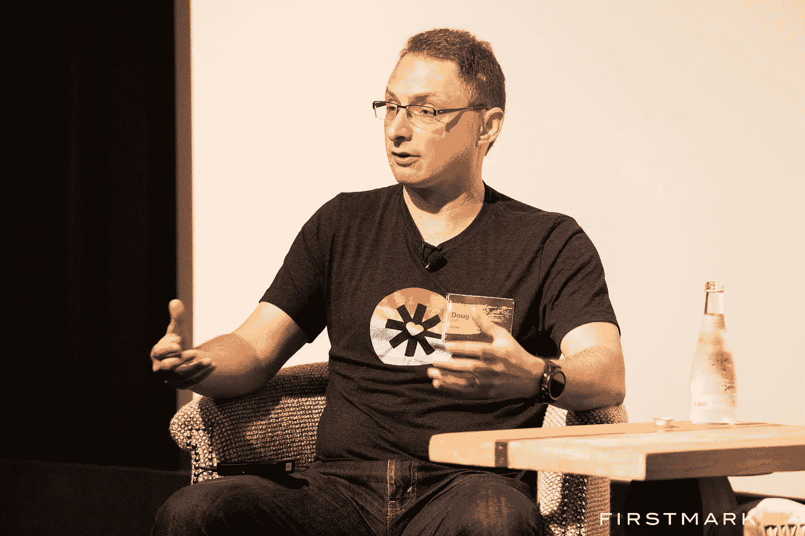
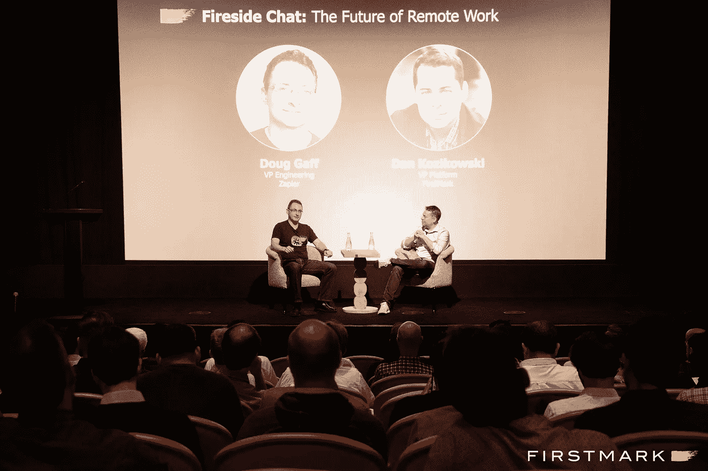
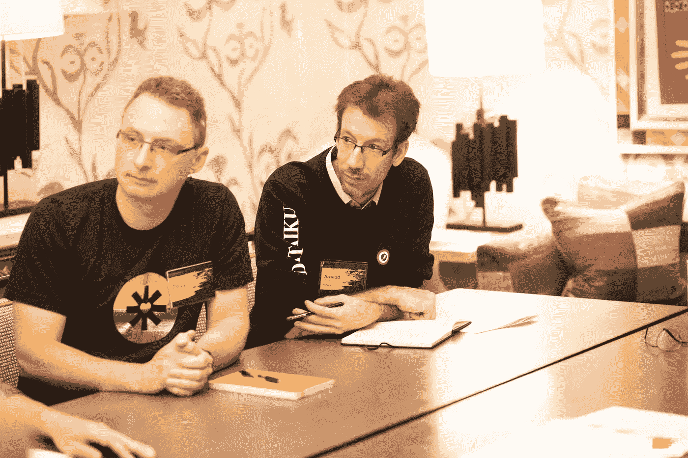

# 来自 Zapier 工程副总裁的管理远程团队的 15 个技巧

> 原文：<https://betterprogramming.pub/zapiers-vp-of-engineering-shares-15-tips-for-managing-remote-teams-6fe530634cd2>

## 向最好的远程公司学习

扎皮尔工程副总裁道格·加夫

分布式团队是工作的未来，但是他们实际上是如何工作的呢？在 FirstMark，我们自豪地支持了许多致力于这一未来的公司，如 InVision、Upwork 和其他使用远程工作作为释放和加速其发展和成功的方式的公司。

但是为什么远程工作开始流行了呢？随着越来越分散的工作人员和大量支持持续沟通的远程友好工具(Slack、Zoom、Google Hangouts 等)。)，越来越多的创业公司开始将远程员工纳入他们的团队。远程友好型不仅使这些公司无论身处何地都能获得最优秀的人才，还能为员工提供生活质量方面的好处，如与家人的距离更近、节省成本等，这些都是传统的办公室公司无法比拟的。

Zapier 位于 SaaS 网络的中心，将 API 连接到其他 API，以“如果这样，那么那样”的逻辑帮助公司的工作流程自动化。该公司拥有 300 多名员工，据报道 ARR 超过 5000 万美元，是任何重视效率和自动化的公司的显而易见的选择。他们没有办公室或工作空间，员工依靠上面提到的工具来交流业务目标、项目需求、日常任务和公司价值观。

道格·加夫是 Zapier 的工程副总裁。这不是他第一次领导远程团队。在加入 Zapier 之前，他在 FirstMark 支持的 InVision 担任产品工程副总裁。今年早些时候，在我们的年度技术峰会上，Doug 和 FirstMark 的 Dan Kozikowski 就远程工作的未来进行了一次炉边谈话。

以下是 Doug 在讨论如何成功管理远程团队时得出的一些最重要的技巧。

# 关于招聘

## **1。重组你的招聘流程，关注公司价值观**

虽然不是远程员工的专利，但当一个办公室的结构和责任消失时，文化契合的招聘变得更加重要。这就是为什么 Zapier 使用关于其五种价值观的问题作为采访的基础。

“我们确保在违背我们的文化价值观的情况下尽可能地雇佣最好的员工，”Gaff 解释道。“我们有一个由部门外的人进行的文化面试，他们试图根据候选人接受和体现我们价值观的程度来给他们打分。”

## **2。给他们一个带回家的作业**

为了确定候选人是否具备在贵公司取得成功所必需的技术技能，请他们完成一项限时的带回家的任务。然后让他们向招聘团队展示他们的任务。这会让你很好地了解这个人是如何思考的，如何管理他们的时间，以及如何找到创造性的解决方案。

# 论领导力与文化

## **3。确保分散的员工感觉他们是更大的事情的一部分**

面对面的交流对于任何团队的长期成功都是至关重要的，因此为您的组织安排定期视频会议和偶尔的面对面静修是非常关键的。Zapier 主持每周一次的公司视频会议，在此期间，领导层可以分享公司信息，并开放问答环节。他们每年还主持两次面对面的全公司务虚会，以及一次部门外会议。

Zapier 的工程副总裁道格·加夫(Doug Gaff)与 FirstMark 的丹·科济科夫斯基(Dan Kozikowski)聊天

## **4。促进情感分享**

即使有了视频会议，你也很难真正了解和你一起工作的人。因此，Zapier 不仅开辟了许多涵盖爱好和兴趣的有趣的 Slack 频道，而且他们还有一个名为#fun-mentalhealth 的频道。

“这听起来有点像矛盾修饰法，”加夫说。“但人们在度过艰难的一天时会说，‘我今天开始有点困难。我感觉自己被待办事项清单压得喘不过气来。然后聊天的其他人会跟他们聊这个。对于我们的员工来说，这是一个非常好的工具。"

他还强调，领导层需要参与这些渠道，以鼓励和规范对这些问题的讨论。

## **5。**通过放松创造水冷时刻

当你的团队分散时，你经常会失去美妙的、自发的水冷时刻。松弛渠道为这些对话提供了一些空间，但 Gaff 鼓励领导层实际构建和安排这些有机对话的时刻。

“我个人每周都会和所有团队一起安排跳级，”Gaff 解释道。“领导团队的所有成员都有自己创造这些时刻的方式。但事实是，它总是有一定的结构，因为它需要有人在空闲时伸出援手或安排一些事情。”

# 关于职业成长

## **6。建立清晰的职业道路**

任何组织都将受益于创造和分配清晰的职业道路，但当与更容易感到静止的远程员工一起工作时，这变得更加必要。即使职业轨迹会随着时间的推移而改变，给员工一个起点并帮助他们理解他们所处的位置也是有好处的，因为等级制度对现场员工来说并不明显。

## **7。数字化绩效考核**

定期的站立会议对远程员工和现场员工同样重要。但是如果你和不同时区的员工一起工作，可能很难找到一个对每个人都合适的时间，甚至几次。

Zapier 就是这种情况，因此团队创建了独立的 Slack 频道，个人在当天登录时将他们的更新添加到频道中。然后，领导层可以滚动浏览，了解正在进行的工作和当前存在的障碍。

## **8。依靠经理掌握他们团队的脉搏**

当你有一家像 Zapier 这么大的公司时，领导团队不可能对组织的每个成员进行数字化检查。所以他们相信经理会这么做，因为他们最终要对团队执行的成败负责。

“关于领导力的不幸事实是，作为一名领导者，你有多优秀并不重要——重要的是你是否能把事情做好，”加夫说。“经理工作的一部分就是接触那些苦苦挣扎的人，询问他们如何才能帮助完成工作。”

Zapier 工程副总裁 Doug Gaff(左)在纽约市 FirstMark 年度技术峰会期间参加圆桌讨论

# **论生产力**

## 9.鼓励人们远离工作

远程工作的最大陷阱之一是全天候工作的诱惑，这最终会成为一件不健康的事情。正如分散的员工需要自律来完成工作一样，他们也需要自律来离开并照顾好自己。领导应该尊重这些界限，并鼓励人们通过自己的努力来降低能耗。

## **10。定义组织生产力指标**

对于一个完全分布式的团队，为您的员工开发和传达正确的生产力指标至关重要。Gaff 指出，Zapier 主要关注三个指标:流速、水线和 Kaplan-Meier 估计值。

*   *流率*帮助管理者识别团队能力
*   水线显示了你积压的工作和你在任何时候正在处理的项目

“当利益相关者进来说，‘为什么 *x* 没有工作？’，你可以调出水线图，然后说，‘这是基于团队能力的当前工作。我们的任务优先级排列正确吗？"评论失言。"如果没有，你把某物翻上来，然后把另一样东西放到水线以下。"

*   Kaplan-Meier 估计值是一个生存性指标，它告诉你在一定时间内一张票关闭的概率。通过这个标准，你可以看到团队在完成任务时的表现，以及谁让事情停滞不前。

# 关于反馈和一对一

## **11。积极寻求反馈，并直接给出反馈**

为了让公司成长，你需要和你的团队建立一个持续的反馈回路。而且由于远程员工有机对话的机会较少，管理层需要主动征求反馈并提供给下属。Gaff 鼓励经理们跳过三明治模式，直接一点。尽管更加困难，但它促进了透明和诚实的文化。

## **12。主持每周一对一——没有借口**

许多组织都熟悉定期一对一地检查员工和监控绩效的概念。但是，当时间至关重要时，这些会议往往是最先被取消的。Gaff 不仅每周举办一对一的活动，而且他把这些活动放在首位。

“你必须每周进行一对一的训练，并围绕这一点安排好其他的事情，”加夫说。"在扎皮尔，除非你在旅行或度假，否则你不会得到通行证."

## **13。创建并跟踪编码标准**

Zapier 让不同经验水平的人在世界各地编写代码，因此领导层为所有员工创建了编码标准。他们运行一个机器人来确保标准得到遵守。如果他们不是，产品将不会被批准。

## **14。指定每个项目的角色，不管多小**

因为所有的交流都是松弛的，Zapier 使用 DACI 框架来决定谁在推动项目，谁在为项目做贡献。DACI 代表驱动者、批准者、贡献者、知情人。它不仅帮助员工了解谁是项目的领导者，而且如果他们没有被分配任何角色，它还允许员工忽略项目更新。

## 15。聘请教练

当你无法让双方聚在一个房间里解决问题时，处理出现的分歧可能会很有挑战性。无论问题是发生在高管团队还是入门级员工中，有一个在职或外包的教练或调解人可以介入并解决问题都会有所帮助。