# Swift 中的零和与奇偶子阵列

> 原文：<https://betterprogramming.pub/zero-sum-and-odd-even-subarrays-in-swift-8178d1ed677f>

## 一个问题的解决方案，有例子

马库斯·斯皮斯克在 [Unsplash](https://unsplash.com/search/photos/numbers?utm_source=unsplash&utm_medium=referral&utm_content=creditCopyText) 上的照片

黑客地球上的[原问题](https://www.hackerearth.com/practice/algorithms/dynamic-programming/introduction-to-dynamic-programming-1/practice-problems/algorithm/odd-even-subarrays-72ad69db/)是

> 给定一个正数和负数的数组，找出是否有一个和为零的子数组(大小至少为一)。在这种情况下，子阵列必须是连续的。

# 零和阵列

我们将以一个数组中的三个整数为例。

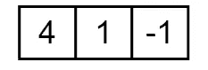

我们取数组的累积和(写在数组下面)。

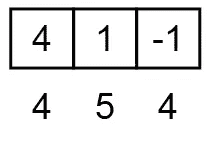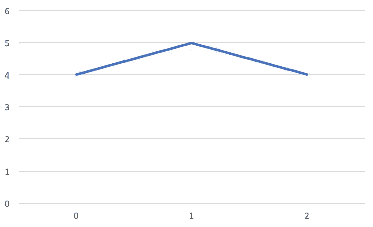

我们正在寻找一个使我们回到之前总和的元素(这里是第二个元素)或者一个使我们回到 0 的元素。

所以让我们来看看另一个例子(下面还是累积和)。

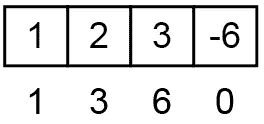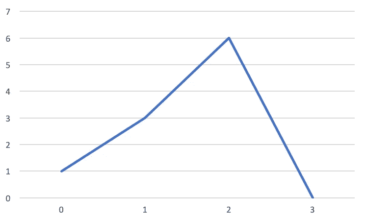

如果在从 0…i(其中 I 是数组的末尾)开始的任何一点，我们返回到我们已经在的点或者下降到零，我们就找到了一个零和数组。

让我们来看一个反例:

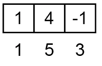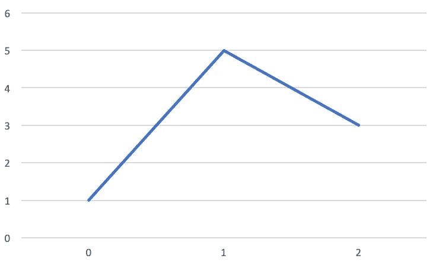

在 Swift 中实施时，如下所示:

# 奇偶子阵列问题

类似的相关问题是，当且仅当子阵列中奇数元素的数量等于子阵列中偶数元素的数量时，阵列的子阵列(连续的)才是奇偶子阵列。我们将称这些奇偶子阵列*为平衡的*，因为它们在子阵列中具有相同数量的奇数和偶数。

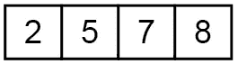

有三个奇偶子阵列:{2，5} {7，8} {2，5，7，8}

## 一个微不足道的奇偶例子

一个平凡的[1，2]数组:

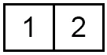

像以前一样，我们将累积差异放在数组下面。

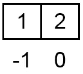

这里我们可以看到，我们创建了一个子数组{1，2}，因为 1 是奇数，2 是偶数，这是最大的子数组(因为它包含了原始数组的所有元素)。

我们可以将数组表示为下面的图 1。

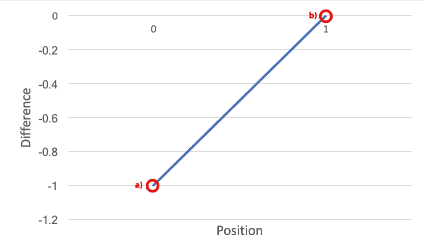

图表 1。数组[1，2]的位置和差的图

让我们看一个使用图 1 的算法:

a) 1 是奇数(在位置 0)，所以差= 0 - 1。因此我们在 0，1 处绘图。

b) 2 是偶数(在位置 1)，所以差= -1 + 1。因此，我们在 1，0 处绘图。

如果我们回到任何位置，我们有一个匹配，提供了一种方法来创建一个平衡的子阵列。

然而，这里有一个问题——我们实际上从未回到图上的任何一点。这样做的原因是，当我们初始化程序时，我们没有任何偶数或奇数(意味着我们最初处于平衡位置，即使子数组中没有数字，差值也为 0)。

我们可以在图 2 中解决这个问题:

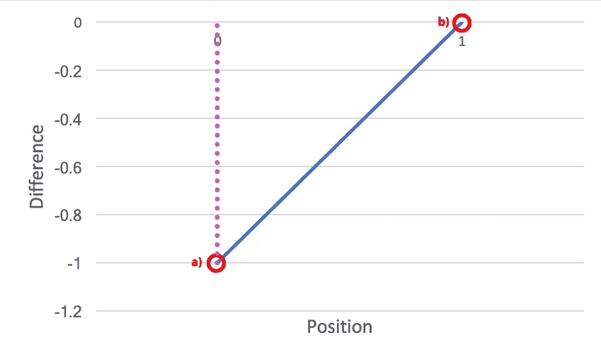

图 2:数组[1，2]的位置和差的固定图

对于最初的图，我们有一个匹配。

## 一个更复杂的例子

使用上面的算法，我们会发现它比仅仅查找单个匹配稍微复杂一些。

让我们考虑阵列{2，5，7，8}，它有三个平衡的子阵列:{2，5} {7，8} {2，5，7，8} *。*

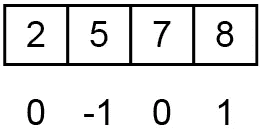

我们再次重复我们的把戏，当我们没有偶数或奇数时，我们说我们访问了 0。

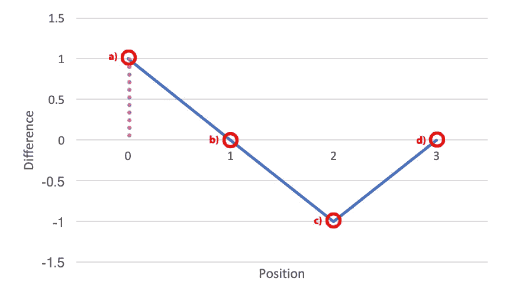

图 3:一个更复杂的例子

我们再一次看算法。

a) 2 是偶数(在位置 0)，所以我们在 0 处绘图，(0 + 1)。

b) 5 是奇数(在位置 1)，所以我们在 1 处绘图，(1-1)。我们已经去过那里了。

c) 7 是奇数(在位置 2)，所以我们在 2 处绘图，(0 -1)。

d) 8 是奇数(在位置 3)，所以我们在 3 处绘图，(-1 + 1)。我们已经去过那里了。

从表面上看，只有 b)和 d)位于我们之前访问过的位置。

我们可以认为第一个匹配 b)是子阵列{2，5}，第二个匹配是{7，8}。我们应该知道第二个匹配{7，8}为我们提供了另一个关于{2，5}的匹配，因为我们的第三个子数组是{2，5，7，8}，它是{2，5}和{7，8}的连接。

# 奇偶子阵列的实现

在代码中，我们跟踪:

*   累积差异(var 差异= 0)
*   我们可以制造的子阵列数量(var ans = 0)
*   我们在字典(hashmap)中访问过的所有差异(var hm : [Int:Int] = [:])

为了产生上图所示的紫色修正，我们说我们访问了初始平衡状态一次:hm[0] = 1

我们遍历输入数组。如果当前元素是偶数，则累积差值递增；如果不是，则递减。

如果我们之前已经看到了这个和，我们就有了一个匹配，我们可以通过我们之前看到的匹配的次数来增加子数组的数量。(如果没有，我们记录我们看过这场比赛。)

然后我们返回子数组的数量。

祝你好运！