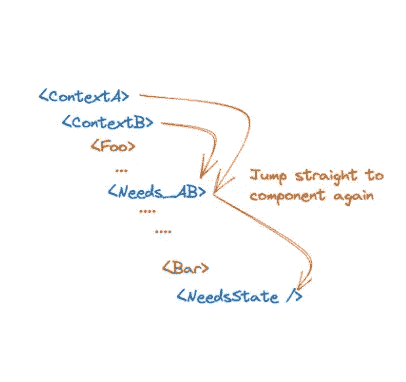
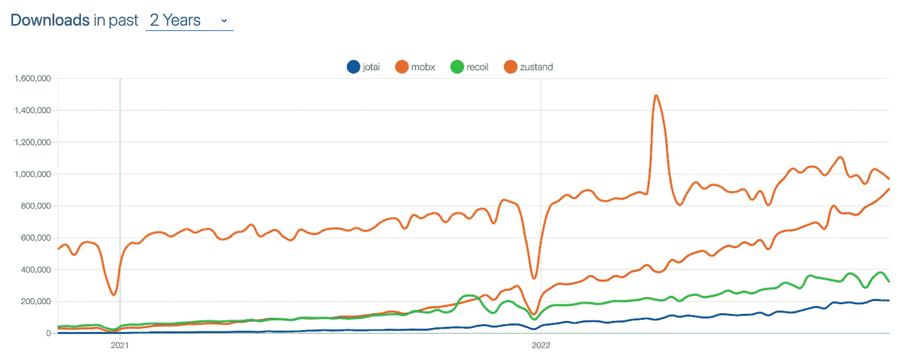

# Zustand 与 Signals—React 状态管理选项比较

> 原文：<https://betterprogramming.pub/zustand-vs-signals-e664bff2ce4a>

## 信号可能是未来，但现在，这就是为什么我更喜欢与 Zustand 合作。


多年来，React 生态系统已经获得了看似无穷无尽的状态管理解决方案。除了曾经显而易见且无处不在的 Redux 之外，React 开发人员现在有了无数的选择。MobX、Jotai、反冲、Valtio、Zustand、Redux Toolkit 和 Rematch 只是几个可供考虑的选项。

这给工程团队留下了困难的(并且经常是有争议的！)决定如何管理应用程序状态的任务。

我们将比较最流行的状态管理库之一 zustand，以及 Preact 团队最近发布的新人 Signals。

# 等等，但是上下文呢？

啊，是的，上下文。React 16.3 中上下文 API 的引入在 React 社区中引起了一些轰动。突然有了一种无需第三方库就能管理应用状态的方法。

它干净、灵活、直观，而且没有增加包的大小，有什么不喜欢的呢？不幸的是，随着上下文 API 的使用，出现了几个现在已经很好理解的问题，需要额外的努力来解决。我们将讨论上下文依赖和消费者重新呈现这两个主要问题。

尽管上下文从来没有打算作为全局状态管理的替代，但它仍然成为一个非常受欢迎的解决方案。我们将简要介绍这两个上下文问题，以突出 Zustand 和 Signals 以其独特的方式解决的问题。

## **上下文依赖问题**

由于 React 中数据总是向下流动的特性，上下文提供者只能访问由。下图说明了这一点，许多人对此应该非常熟悉:

```
export const App = () => {
  return (
    <LayoutProvider>
      <GraphQLProvider>
        <AuthProvider>
          <UserProvider>
            <ReliesOnUserProviderSoCannotBeMovedUpProvider>
              <GlobalSearchProvider>
                <NeedsAccessToAllProvidersAbove>
                  <YetAnotherProvider>
                    <Layout />
                  </YetAnotherProvider>
                </NeedsAccessToAllProvidersAbove>
              </GlobalSearchProvider>
            </ReliesOnUserProviderSoCannotBeMovedUpProvider>
          </UserProvider>
        </AuthProvider>
      </GraphQLProvider>
    </LayoutProvider>
  );
};
```

当您的上下文需要访问树中较低位置的状态时，这就成了一个问题。这个问题的解决方案可能涉及将状态移到更高的共享祖先，或者可能将状态存储在一个*是*全局可访问的位置。

## **上下文消费者重新呈现**

可以说，使用上下文进行全局状态管理的最大缺陷是，每当上下文值发生变化时，给定上下文的所有使用者都将重新呈现。

这通常是不希望的，因为组件可能只涉及状态的一小部分，并且当没有变化时不需要呈现。

为了解决这个问题，你可以创建更多的上下文来负责状态的小片段，或者在 memo 中包装组件，同时只传递需要的道具给孩子。不幸的是，这两种选择都增加了项目的复杂性，并且没有完全解决根本问题。

# 比较 Zustand 和信号

*在下面的沙盒*中跟随一个真实的代码示例

包含 zustand 和 signal 示例的 Codesandbox

# **信号介绍**

Signals 于 2022 年 9 月正式发布，现在是 Preact 核心库的一部分。React 包也可用于常规的 React 项目。

Signals 是对状态管理领域的一个特别有趣的补充，因为 Preact 团队采用了不同于一些更常见的 flux (Redux / Rematch / Zustand)和 atomic patterns(反冲/ Jotai)的方法。

他们的主要目标是创建一个尽可能简单、直观和高效的解决方案。该 API 让人想起 Solid JS 通过`createSignal`提供的状态管理解决方案。灵感也来自以下来源:

> - Vue:那个。价值获取者
> 
> -苗条:总是接受任务，跟踪反应性更新
> 
> - KnockoutJS + MobX:关于反应性系统的基本原理
> 
> - Solid + S.js:用于信号名称
> 
> -一些我在 2018 年职业生涯中开发的专有反应式状态管理系统。它们与 solid 有很多相似之处，尽管 solid 要高级得多。

[来源](https://preactjs.com/blog/introducing-signals/)

## 用他们的话说

> “信号是管理应用程序状态的反应性原语。
> 
> 信号的独特之处在于，状态变化会以最有效的方式自动更新组件和 UI。自动状态绑定和依赖性跟踪允许信号提供出色的人机工程学和生产力，同时消除最常见的状态管理脚枪。
> 
> 信号在任何规模的应用程序中都是有效的，人体工程学加速了小应用程序的开发，性能特征确保任何规模的应用程序在默认情况下都是快速的。"

鉴于 signals API 是如此的简单和直观，人们几乎可以凭直觉知道事情是如何工作的，而无需阅读大量文档或学习新的思维模型。

他们的初衷是让下面显示的最简单直观的状态更新场景成为现实。

```
// Imagine count is a variable that needs to be accessed through the app

const count = 0;

const Counter = () => {
  return (
   <button onClick={() => count++}>
      Value: {count.value}
    </button>
  );
}
```

带信号:

```
const count = signal(0);

const Counter = () => {
  return (
   <button onClick={() => count.value++}>
      Value: {count.value}
    </button>
  );
}
```

信号的几个重要原则:

*   信号在渲染中是参照稳定的(类似于 React 中的参照)
*   组件可以通过访问`. value '属性来订阅值(不需要选择器)
*   如果信号的值没有改变，则使用该信号值的组件和效果不会被更新，即使信号的依存关系已经改变。
*   自动跟踪信号间的相关性(无相关性数组)
*   Signals 能够直接更新 DOM 中相关的更新部分，而无需重新呈现整个组件(在我看来，这是 signals 最吸引人的特性)。

# **祖斯坦德简介**

Zustand(在德语中翻译为 state)是由创建 Jotai(日语中为“state”)和 React Spring 的同一个开发团队创建的。Zustand 自 2018 年发布以来引起了很大的轰动，在过去两年的下载量中轻松超过了反冲。

与 Signals 类似，Zustand 将开发人员的体验放在第一位，并且有一个非常简单的低模板 API。熟悉 redux 的人会觉得 Zustand 非常好用，因为它遵循 Flux 原则，并且有许多设计上的相似之处。

用他们的话说:

> “一个小型、快速和可扩展的 bearbones 状态管理解决方案，使用简化的 flux 原则。有一个基于钩子的舒适的 api，不是样板或固执己见的。”

一些重要的 zustand 原则:

*   遵循与 Redux / Flux 架构相似的设计模式
*   使用钩子作为通过选择器访问数据的主要手段
*   非独立/灵活
*   低样板/简单 API
*   数据保存在一个单独的存储中(尽管可以将它分开)

# **我们正在建造什么**

我们将建立一个简单的待办事项列表，以便根据以下标准比较这些库:

*   开发者体验
*   表演
*   开发者工具

# **开发者体验**

## 使用信号**的设置:**

设置信号非常简单，只需用`signal()`包装一个状态，使其具有反应性:

```
import { signal } from "@preact/signals-react";

export const lastUpdatedSignal = signal<string>("");

export const inputSignal = signal<string>("");

export const todosSignal = signal<{ text: string; completed: boolean }[]>([
  { text: "test", completed: false },
]);
```

## **使用 Zustand 进行设置**

Zustand 遵循类似的模式来重新匹配和还原工具包。您创建了包含初始状态和修改它的操作的存储。传统上，状态和功能位于同一位置，如下图所示，然而，也可以在模块级[定义动作](https://docs.pmnd.rs/zustand/guides/practice-with-no-store-actions)。

```
import { ChangeEvent } from "react";
import create from "zustand";

type Todo = { text: string; completed: boolean };

export type TodoState = {
  todos: Todo[];
  lastUpdated?: string;
  input: string;
  handleInput: (e: ChangeEvent<HTMLInputElement>) => void;
  addTodo: () => void;
  toggleIsCompleted: (index: number) => void;
  removeTodo: (index: number) => void;
};

export const useTodoStore = create<TodoState>((set) => ({
  todos: [{ text: "test", completed: false }],
  input: "",
  addTodo: () => {
    return set((state) => ({
      todos: [...state.todos, { text: state.input, completed: false }],
      input: "",
    }));
  },
  handleInput: (e: ChangeEvent<HTMLInputElement>) => {
    set({ input: e.target.value });
  },
  removeTodo: (index: number) => {
    set((state) => ({
      todos: state.todos.filter((_, idx) => idx !== index),
    }));
  },
  toggleIsCompleted: (index: number) => {
    set((state) => ({
      lastUpdated: new Date().toLocaleString(),
      todos: state.todos.map((todo, idx) => {
        if (idx === index) return { ...todo, completed: !todo.completed };
        return todo;
      }),
    }));
  },
}));
```

## 用信号读/写数据

用信号读写数据非常简单。要读取和订阅信号的值，只需访问值属性，例如`mySignal.value`。对该值的任何后续更新都将重新呈现该组件。

写入信号只需要对 value 属性重新赋值。一个很好的比较心理模型是反应型参考。与 ref 类似，信号在渲染时也是参考稳定的，因此可以安全地传递给记忆元件。

```
import { inputSignal, todosSignal, lastUpdatedSignal } from "./todo.signals";
import { InfoBar } from "./info-bar";
import { TodoList, TodoWrapper } from "../components";

const handleInputChange = (e: React.ChangeEvent<HTMLInputElement>) => {
  inputSignal.value = e.target.value;
};

const handleAddTodo = () => {
  todosSignal.value = [
    ...todosSignal.value,
    { text: inputSignal.value, completed: false },
  ];
  inputSignal.value = "";
};

const handleTodoClick = (index: number) => () => {
  todosSignal.value = todosSignal.value.map((todo, idx) =>
    idx === index ? { ...todo, completed: !todo.completed } : todo
  );
  lastUpdatedSignal.value = new Date().toLocaleString();
};

const handleRemoveTodo = (index: number) => {
  todosSignal.value = todosSignal.value.filter((_, idx) => idx !== index);
};

export const Signals = () => {
  return (
    <TodoWrapper>
      <InfoBar />
      <TodoList
        inputValue={inputSignal.value}
        onAddTodo={handleAddTodo}
        onInputChange={handleInputChange}
        onTodoClick={handleTodoClick}
        onRemoveTodo={handleRemoveTodo}
        todos={todosSignal.value}
      />
    </TodoWrapper>
  );
};
```

在处理更复杂的嵌套数据时，需要注意的是 Preact 团队没有实现信号的深度可观测性。[这意味着总是需要更换整个顶层”。值”属性或嵌套信号](https://github.com/pmndrs/zustand/issues/106)。

## **派生状态**

在我们的待办事项应用程序的`<InfoBar />`部分，我们希望访问我们的信号，以显示最后更新的时间以及已完成待办事项的计数。

因为我们不希望组件在每次修改`todosSignal`时都重新呈现，所以我们可以用导出的“计算”函数包装它。

该函数将仅在返回值不同时触发重新呈现(在我们的例子中，是完成的 todos 的新计数),并且还在计算函数内的信号依赖性改变时重新运行。

```
import { memo } from "react";
import classes from "./InfoBar.module.scss";
import { lastUpdatedSignal, todosSignal } from "../todo.signals";
import { computed } from "@preact/signals-react";

export const InfoBar = memo(() => {
  const totalCompleted = computed(
    () => todosSignal.value.filter((t) => t.completed).length
  );

  return (
    <>
      <div className={classes.infoContainer}>
        <p>Total Completed:</p>
        <p>{totalCompleted.value}</p>
      </div>
      <div className={classes.infoContainer}>
        <p>Last Updated:</p>
        <p>{lastUpdatedSignal.value}</p>
      </div>
    </>
  );
});
```

## 使用 Zustand 读取/写入数据

由于 Redux 中的选择器模式，在 Zustand 中读取和写入数据对许多人来说可能很熟悉，其中一个主要区别是 Zustand 选择器包含状态和动作。

下面，我们从我们的商店中选择所有需要的东西，以连接我们的待办事项列表。默认情况下，Zustand 会对新旧值进行严格的相等检查。

```
// Only re-renders component if input !== previous input
const input = useTodoStore(state => state.input)
```

因为我们返回的是一个带有状态和动作的对象，而且对象在不同的渲染中不是稳定的，所以我们需要将 Zustand 的“shallow”实用函数作为第二个参数传递给 shallowly diff 对象属性。如果以下任何值发生变化，我们的组件将重新呈现。

```
import { TodoList, TodoWrapper } from "../components";
import { useTodoStore } from "./todoStore";
import shallow from "zustand/shallow";
import { InfoBar } from "./info-bar";

export const Zustand = () => {
  const { todos, handleInput, addTodo, toggleIsCompleted, input, removeTodo } =
    useTodoStore((state) => {
      return {
        removeTodo: state.removeTodo,
        input: state.input,
        lastUpdated: state.lastUpdated,
        todos: state.todos,
        handleInput: state.handleInput,
        addTodo: state.addTodo,
        toggleIsCompleted: state.toggleIsCompleted,
      };
    }, shallow);

  const handleTodoClick = (idx: number) => () => toggleIsCompleted(idx);

  return (
    <TodoWrapper>
      <InfoBar />
      <TodoList
        inputValue={input}
        onAddTodo={addTodo}
        onInputChange={handleInput}
        onTodoClick={handleTodoClick}
        todos={todos}
        onRemoveTodo={removeTodo}
      />
    </TodoWrapper>
  );
};
```

将数据写入 Zustand 存储需要使用“set”函数，该函数包括带有先前状态的回调。方便地设置自动合并顶级状态，以避免需要在每次更新时扩散，但是更多的嵌套更新仍然需要合并嵌套值。[动作中还有一个 getter 函数](https://github.com/pmndrs/zustand#read-from-state-in-actions)，可以调用它来检索状态片段，而无需更新数据。

## 派生状态

在访问下面的<infobar>组件中的数据时，我们对数组中的返回值进行了简单的区分。因此，该组件将仅在原始值改变时重新呈现(类似地通过用信号“计算”来完成)。</infobar>

```
import { memo } from "react";
import classes from "./InfoBar.module.scss";
import { useTodoStore } from "../todoStore";
import shallow from "zustand/shallow";

export const InfoBar = memo(() => {
  const [lastUpdated, totalCompleted] = useTodoStore(
    (state) => [
      state.lastUpdated,
      state.todos.filter((todo) => todo.completed).length,
    ],
    shallow
  );

  return (
    <>
      <div className={classes.infoContainer}>
        <p>Total Completed:</p>
        <p>{totalCompleted}</p>
      </div>
      <div className={classes.infoContainer}>
        <p>Last Updated:</p>
        <p>{lastUpdated}</p>
      </div>
    </>
  );
});
```

# 表演

## 信号性能

Zustand 和 Signals 都提供了防止不必要的重新渲染以提高性能的方法，但是 Signals 有几个额外的优化，部分是受其他反应库的启发。

首先，让我们更仔细地看看“计算”函数。任何用“computed”包装的信号只有在它的“computed”被调用时才会懒洋洋地运行。值”属性。如果导出的值很昂贵，并且只在某些情况下需要，例如在一些用户交互之后呈现子组件，那么这可能是有帮助的。

因为计算函数中的依赖关系也是自动跟踪的，所以只有当这些封闭信号中的任何一个被修改时，信号才会重新计算，否则返回以前缓存的值。不需要依赖数组！

因为计算值本身只是信号，所以它们可以在其他计算值中使用。有趣的是，你可以看看幕后的双向链表是如何被用来管理信号依赖性和依赖关系的。

```
 // Cached by default
  // Only recomputes when accessed or when todosSignal.value changes
  const totalCompleted = computed(
    () => todosSignal.value.filter((t) => t.completed).length
  );
```

可以说，signals 最与众不同的性能特性之一是能够将信号值直接传递给 JSX，并在 DOM 中将其呈现为文本，而无需重新呈现包含它的组件。这可以极大地提高性能，因为正在更新的组件的任何子组件都不会重新呈现。

这意味着确保你所有的道具都是参照稳定的道具，并且孩子在组件树中被记忆的位置更低，这样的精神开销就更少。

```
const count = signal(0);

const Unoptimized = () => {
// Re-renders the component when `count` changes:
return <p>{count.value}</p>;
}

const Optimized = () => {
// Text automatically updates without re-rendering the component:
return <p>{count}</p>;
}
```

通过跳过重新渲染整个组件，可以跳过中间子组件的重新渲染，如下图所示。



(来自 Signals documentati)

## 使用 Zustand 的性能

Zustand 提供了几个不错的开箱即用的优化。对于 one，来自选择器的值被自动检查是否严格相等，如果没有变化，则退出渲染。

对于从选择器返回的数组和对象，Zustand 提供了一个方便的 shallow diff 比较函数，可以作为第二个参数传递给 store 钩子。或者，您可以编写自己的比较函数来进行更细粒度的控制。

```
 const { todos, removeTodo } =
    useTodoStore((state) => {
      return {
        removeTodo: state.removeTodo,
        todos: state.todos,
      };
    },
    // Custom compare function 
    (prevState, nextState) => myCompareFunction(prevState, nextState)
   );
```

与使用 Zustand 中的选择器相比，我在比较信号中的派生状态与计算值时注意到一个轻微的缺点，即 Zustand 选择器*总是*在存储更新时运行，并且只在进行 diff 比较后防止重新渲染。

由于信号值的性质更加模块化，计算的函数可以不那么频繁地根据相关性变化运行。这意味着 Zustand 中昂贵的选择器函数可能会被不必要地调用，只是为了以后确定新的和以前的返回值是相同的。当然有可能有较小的 Zustand 商店来防止这一问题，但这可能会带来新的挑战。在现实世界中，这对于大多数人来说可能不是问题。

## **信号**

```
 // Only runs if todosSignal Changes

  const totalCompleted = computed(
    () => todosSignal.value.filter((t) => t.completed).length
  ); 
```

## **祖斯坦德**

```
// Runs every time the store changes
  // Only updates if returned values don't pass strict equality check

  const [lastUpdated, totalCompleted] = useTodoStore(
    (state) => [
      state.lastUpdated,
      state.todos.filter((todo) => todo.completed).length,
    ],
    shallow
  );
```

# 开发者工具

相对于其同行，Zustand 已经建立了相当多的追随者，因此，已经建立了一个丰富的第三方附加库生态系统。本地存储持久化、表单助手插件、MobX API 适配器等等。Zustand 还提供了与 redux devtools 的简单集成，以提供跨应用程序的可观察性。

Signals 是国家管理领域的一个相对较新的公司，不具备同样强大的生态系统，但随着时间的推移，这种情况可能会发生变化。

根据 npm 趋势下载历史，Zustand 的未来看起来很光明，在一个图书馆来来去去的世界里，重要的是要批判性地思考应该把赌注压在哪匹马上。



还需要注意的是，在撰写本文时，signals 在 React 中不支持并发模式，但是[有人提到](https://twitter.com/sebmarkbage/status/1567286781153878021?s=20)将来会增加一个“并发模式安全”。

# 结束语

Signals 无疑是 react state 管理人员名单中一个令人兴奋的新成员，我期待着在未来几年看到它的发展。用于信号的开发工具将是一个非常好的补充，但是这个功能完全有可能在将来被添加。值得注意的是，信号仍然非常新，还没有像 Zustand 一样经过战斗考验。

目前，我认为我个人仍然会在大型生产应用程序中使用 Zustand over Signals，原因有几个。一个是 Flux 和 Redux 模式(这是 Zustand 的灵感来源)在这一点上已经很好理解，很容易掌握。由于 Signal 缺乏对嵌套数据的深度反应，可能需要更多的时间和思考来构建数据。

还需要注意的是，React signals 包使用了[内部 React API](https://github.com/preactjs/signals/blob/d25e8bac09c94ed3bad7f12fe380becd8bf1a7ad/packages/react/src/index.ts#L6)，包括有趣的名称`__SECRET_INTERNALS_DO_NOT_USE_OR_YOU_WILL_BE_FIRED`。这可能会造成一些停顿，因为随着时间的推移，这些内部 API 可能不稳定。也就是说，信号的开发人员工效学和在状态改变时直接换出 DOM 中的文本的能力非常有吸引力。

## **延伸阅读**

*   [并排使用 zustand 和 signals 的 Codesandbox】](https://codesandbox.io/s/github/kevinschaffter/zustand-signals)
*   [引入信号—preactjs.com](https://preactjs.com/blog/introducing-signals/)
*   [信号增强——信号构建的幕后场景](https://preactjs.com/blog/signal-boosting/)
*   [Zustand 文档](https://docs.pmnd.rs/zustand/getting-started/introduction)

## **关于优化健康**

Optimize Health 是远程护理解决方案的市场领导者，帮助全国各地的提供者团体提供超越实践墙的高质量护理。通过领先的平台技术、托管服务和专家支持的强大组合，我们帮助客户和患者在门诊之外建立更深的联系，并更快地获得更好的结果。了解详情，请访问: [www.optimize.health](https://stats.newswire.com/x/html?final=aHR0cDovL3d3dy5vcHRpbWl6ZS5oZWFsdGgv&hit%2Csum=WyIzcnh2Z2QiLCIzcnh2Z2UiLCIzcnh2ZnkiXQ) 。